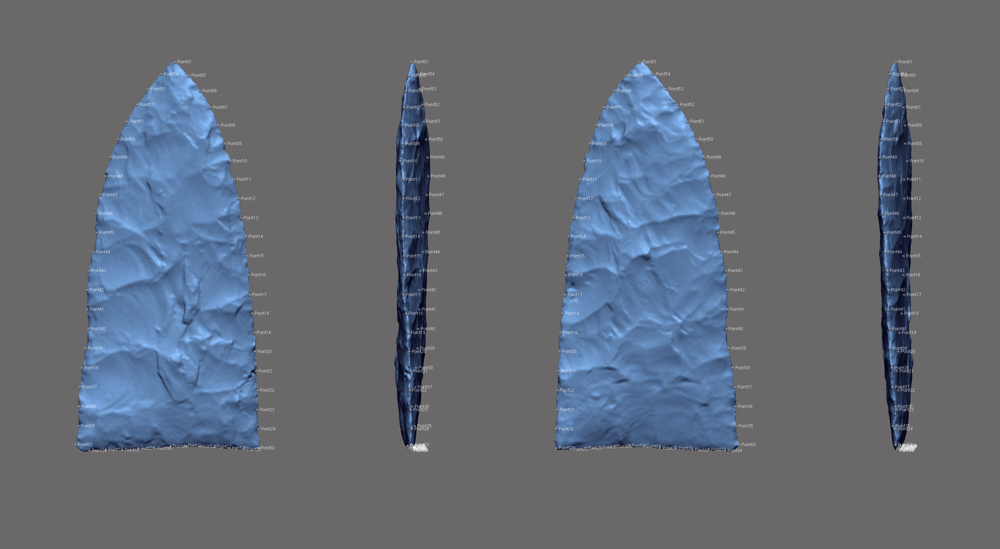

# gahaganmorph2

This investigation aggregates intact or reconstructed Gahagan bifaces from the Caddo and central Texas regions to test the hypothesis that Gahagan biface morphology differs between the two regions. The bifaces were scanned, then analysed using the tools of geometric morphometrics. Results provide a preview of the morphological differences that occur in Gahagan bifaces found at Caddo and central Texas sites. The size discrepancy represents an inversion of theoretical constructs that posit a decrease in tool size thought to articulate with an increase in distance from raw material source, as the Caddo sample is thought to have been produced primarily of Edwards chert from central Texas. One hypothesis (shape difference) posits that the contrasting morphologies represent two discrete communities of practice; one (central Texas hunter-gatherers) where the bifaces were utilised for practical purposes, and the other (Caddo horticulturalists) where Gahagan bifaces were enlisted primarily for burial and ritualistic activities. An alternative hypothesis (shape change) posits that Gahagan bifaces may have served multiple functions in Caddo society that differed in their deployment within and beyond the southern Caddo area.

While true that many biface types may not warrant the time and labour investment associated with 3D data collection and analysis, Gahagan bifaces do. Morphological attributes associated with axial twisting and beveling hold substantive analytical value beyond the current study, and the 3D data will eventually be employed within a variety of useful simulations. Although not expressly discussed above, the iterative refinement of the landmark configuration used in this study---and the one before it---will continue. As a means of expanding upon these efforts, the next iteration will include landmarks that articulate with a series of longitudinal cross-sections.

While not a component of the current analysis, attributes associated with retouch may articulate with beveling. Previously published methods of codifying and analysing retouch are being integrated into this analytical program, and another measure is under active development. Further work is needed to refine the latter approach; however, the measure is introduced here as it may hold value for studies that are currently planned or underway.
