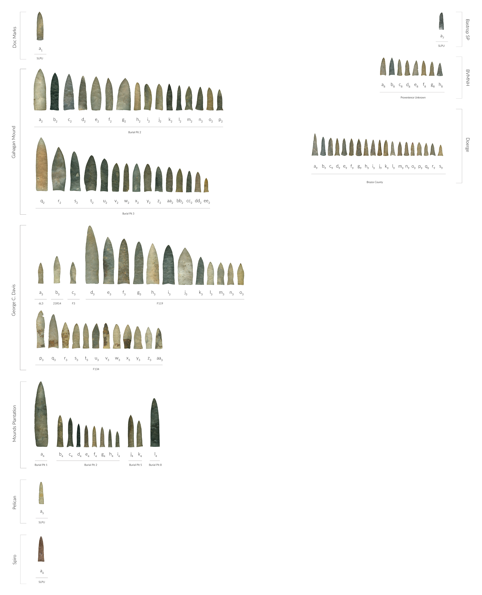
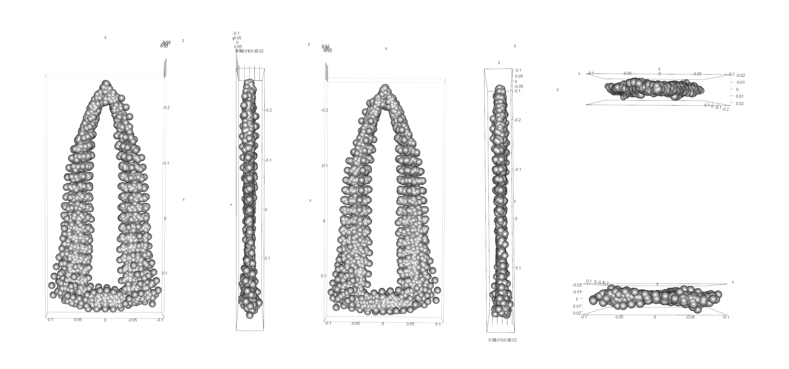
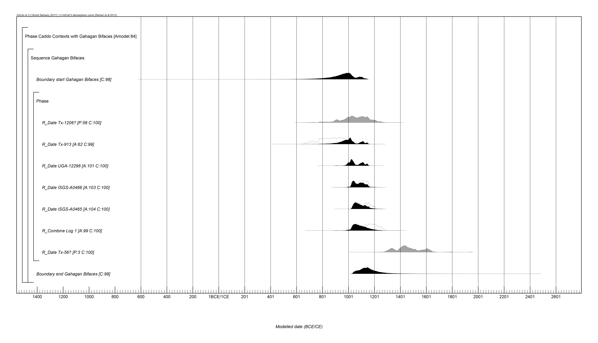
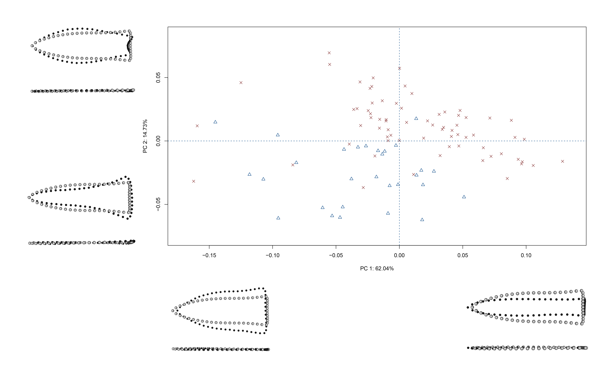
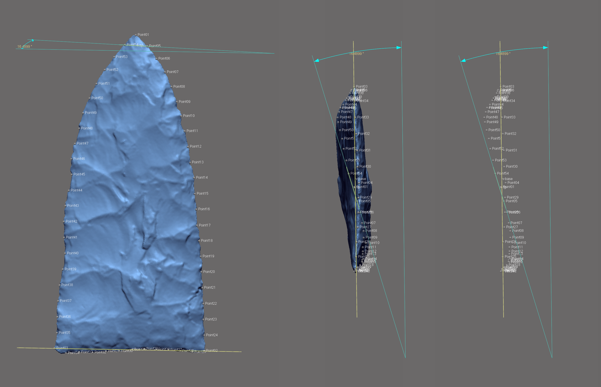

# gahaganmorph2

Jump to:
 * Resources
     * [Previous (2D) geometric morphometric analysis of Gahagan bifaces](https://doi.org/10.1016/j.daach.2018.e00080)
     * [Open access preprint of the previous analysis on SocArXiv](https://osf.io/preprints/socarxiv/u7qfr/)
     * [Image (2D) of Gahagan bifaces used in the analysis](fig02.pdf)
 * Analysis
     * [Temporal dynamics of Gahagan bifaces](analysis/gahagan14c.md)
     * [Modeling geometry for missing data](analysis/modeling-geometry.md)
     * [3D landmarking protocol for Gahagan bifaces](analysis/landmarking-protocol.md)
     * [Geometric morphometric analysis of Gahagan bifaces](analysis/base-analysis.md)

This investigation aggregates intact and reconstructed [Gahagan bifaces](https://scholarworks.sfasu.edu/ita-gahaganbiface/) from the Caddo and central Texas regions to test the hypothesis that Gahagan biface morphology differs between the two regions. The bifaces were scanned, then analysed using the tools of geometric morphometrics. Results provide a preview of the morphological differences that occur in Gahagan bifaces found at Caddo and central Texas sites. The size discrepancy represents an inversion of the theoretical construct that posits a decrease in tool size thought to articulate with an increase in distance from raw material source. One hypothesis (shape difference) posits that the contrasting morphologies represent two discrete communities of practice; one (central Texas hunter-gatherers) where the bifaces were utilised for practical purposes, and the other (Caddo horticulturalists) where Gahagan bifaces were enlisted primarily for burial and ritualistic activities. An alternative hypothesis (shape change) posits that Gahagan bifaces may have served multiple functions in Caddo society that differed in their deployment within and beyond the southern Caddo area.

While true that many biface types may not warrant the time and labour investment associated with 3D data collection and analysis, 3D is necessary for the study of Gahagan bifaces. To ensure uniformity across the scan data, a [batch process](analysis/Rvcgbatch.R) was used that enlisted the [_Rvcg package_](https://github.com/zarquon42b/Rvcg) to perform a uniform remesh as well as the decimation needed for _auto3dgm_.

Morphological attributes associated with axial twisting and beveling hold substantive analytical value beyond the current study, and a [novel landmarking protocol](analysis/landmarking-protocol.md) was developed in _Geomagic Design X_ that includes characteristics associated with axial twisting. Due to the amount of beveling across the sample, other geometric morphometric approaches&mdash;like those aimed at discriminating among flaking patterns using EFA&mdash;do not work for Gahagan bifaces. As a means of expanding upon these efforts, the next iteration of the analysis will build upon the current landmark constellation, and will include landmarks that articulate with a series of latitudinal cross-sections placed between the equidistant semilandmarks on the lateral edges.

Chronometric dates were aggregated, where available, from contexts where Gahagan bifaces have been found. These dates were [recalibrated and modeled](analysis/gahagan14c.md) using the [_oxcAAR package_](https://github.com/ISAAKiel/oxcAAR). Unfortunately, none of these dates come from contexts associated with the central Texas sample. However, there are dated contexts in central Texas where Gahagan bifaces have been found, which will be integrated when those Gahagan bifaces are added to the analysis in a subsequent iteration.

Although not a component of the current analysis, it is thought that attributes associated with retouch may also articulate with beveling. Previously published methods of codifying and analysing retouch are being integrated into this analytical programme, and another measure is under active development. Further work is needed to refine the latter approach; however, the measure is introduced here as it may hold value for studies that are currently planned or underway.

Enlisting the reference geometry used in the development of the current [landmarking protocol](analysis/landmarking-protocol.md), the measure is comprised of an angle that occurs between two linear vectors. To calculate the angle from the aligned mesh, one vector is placed between landmarks 2 and 3 (base), then another between semilandmarks 5 and 54 (immediately below the tip), after which the angle between the two vectors can be calculated. It is not known whether this measure will articulate with attributes associated with retouch. However, should the angle be found to correlate with attributes related to size, spin torque, or other useful measures, it could hold value in future analyses.

### Foundations and Development

The draft manuscript associated with this project can be viewed on [Overleaf](https://www.overleaf.com/read/xkmbhpyfjvvk) (comments and constructive criticisms welcomed), and this repository is digitally curated in the [Open Science Framework](https://osf.io/hm3q7/). The project builds upon a [recent geometric morphometric analysis of Gahagan bifaces](https://doi.org/10.1016/j.daach.2018.e00080) that was published in _Digital Applications in Archaeology and Cultural Heritage_ in 2018. The preprint for that study is available on [_SocArXiv_](https://doi.org/10.31235/osf.io/u7qfr), and the supplementary materials are digitally curated in the [Open Science Framework](https://osf.io/jkxe3/).

### Contributions

We welcome contributions from everyone. Before getting started, we ask that you review our [contributor guidelines](CONTRIBUTING.md), and note that this project is released with a [Contributor Code of Conduct](CONDUCT.md). By participating in this project you agree to abide by its terms.

### Acknowledgments

We extend our gratitude to the Caddo Tribe of Oklahoma, the Williamson Museum at Northwestern State University, the Louisiana State Exhibit Museum, the Texas Archeological Research Laboratory at The University of Texas at Austin, the Brazos Valley Museum of Natural History, the Texas Parks and Wildlife Department, and the Sam Noble Oklahoma Museum of Natural Science for the requisite permissions and access needed to generate the scans of Gahagan bifaces. Thanks to Harry J. Shafer, Jeffrey S. Girard, Hiram F. (Pete) Gregory, Julian A. Sitters, Timothy K. Perttula, and David K. Thulman for their comments on a draft of this manuscript. Thanks also to Dean C. Adams, Michael L. Collyer, Emma Sherratt, Lauren Butaric, and Kersten Bergstrom for their constructive criticisms, comments, and suggestions throughout the development of this research programme, and to the editors and anonymous reviewers for their comments and constructive criticisms, which further improved the manuscript.

Components of this analytical work flow were developed and funded by a Preservation Technology and Training grant (P14AP00138) to RZS from the National Center for Preservation Technology and Training, and funding to scan the Gahagan bifaces at the Williamson Museum at Northwestern State University, Louisiana State Exhibit Museum, and Texas Archeological Research Laboratory at The University of Texas at Austin was provided to RZS by the Heritage Research Center at Stephen F. Austin State University.
