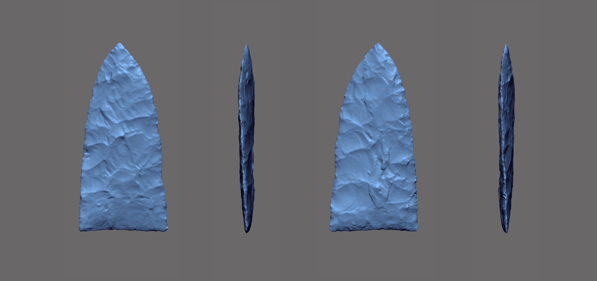
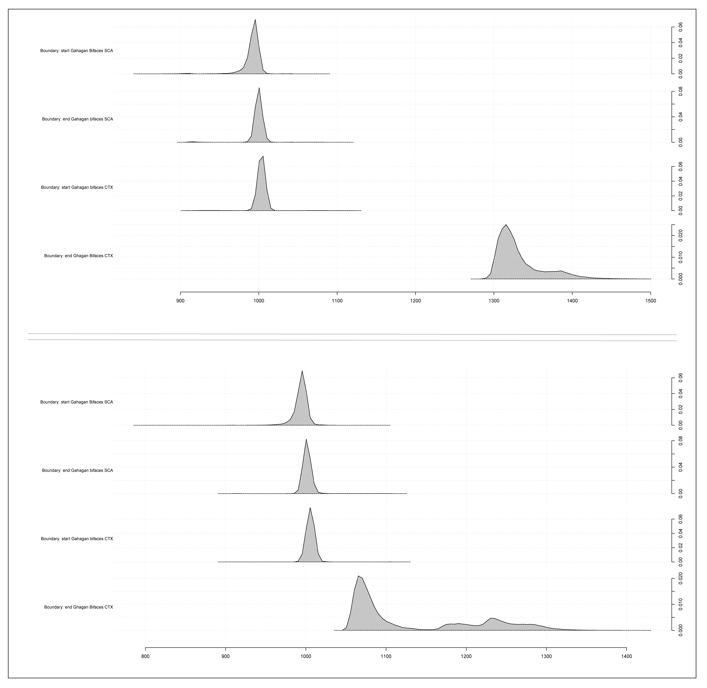

# gahaganmorph2

This investigation aggregates intact or reconstructed Gahagan bifaces from the Caddo and central Texas regions to test the hypothesis that Gahagan biface morphology differs between the two regions. The bifaces were scanned, then analysed using the tools of geometric morphometrics. Results provide a preview of the morphological differences that occur in Gahagan bifaces found at Caddo and central Texas sites. The size discrepancy represents an inversion of theoretical constructs that posit a decrease in tool size thought to articulate with an increase in distance from raw material source, as the Caddo sample is thought to have been produced primarily of Edwards chert from central Texas. One hypothesis (shape difference) posits that the contrasting morphologies represent two discrete communities of practice; one (central Texas hunter-gatherers) where the bifaces were utilised for practical purposes, and the other (Caddo horticulturalists) where Gahagan bifaces were enlisted primarily for burial and ritualistic activities. An alternative hypothesis (shape change) posits that Gahagan bifaces may have served multiple functions in Caddo society that differed in their deployment within and beyond the southern Caddo area.

While true that many biface types may not warrant the time and labour investment associated with 3D data collection and analysis, 3D is necessary for the study of Gahagan bifaces. To ensure uniformity across the scan data, a [batch process](analysis/Rvcgbatch.R) was used that enlisted the [Rvcg package](https://github.com/zarquon42b/Rvcg). Morphological attributes associated with axial twisting and beveling hold substantive analytical value beyond the current study, and a [novel landmarking protocol](analysis/landmarking-protocol.md) was developed in Geomagic Design X that includes those characteristics associated with axial twisting. Due to the amount of beveling across the sample, other geometric morphometric approaches---like those aimed at discriminating among flaking patterns using EFA---do not work for Gahagan bifaces. As a means of expanding upon these efforts, the next iteration of the analysis will build upon the current landmark constellation, and will include landmarks that articulate with a series of longitudinal cross-sections placed between the equidistant semilandmarks on the lateral edges.

Chronometric dates were aggregated, where available, from contexts where Gahagan bifaces have been found. These dates were [recalibrated and modeled](analysis/gahagan14c.md) using the [oxcAAR package](https://github.com/ISAAKiel/oxcAAR). Unfortunately, none of these dates come from contexts associated with the central Texas sample. However, there are dated contexts in central Texas where Gahagan bifaces have been found, which will be integrated when those Gahagan bifaces are added in a subsequent iteration.

Although not a component of the current analysis, attributes associated with retouch may articulate with beveling. Previously published methods of codifying and analysing retouch are being integrated into this analytical program, and another measure is under active development. Further work is needed to refine the latter approach; however, the measure is introduced here as it may hold value for studies that are currently planned or underway.

Enlisting the reference geometry used in the development of the current landmark configuration, the measure is comprised of an angle that occurs between two linear vectors. To calculate the angle from the aligned mesh, one vector is placed between landmarks 2 and 3 (base), then another between semilandmarks 5 and 54 (immediately below the tip), after which the angle between the two vectors can be calculated. It is not known whether this measure will correlate with those associated with retouch. However, should this angle be found to correlate with attributes related to size, spin torque, or other useful measures, it could hold value in future analyses.

### Foundations and Development

The draft manuscript associated with this project can be viewed on [Overleaf](https://www.overleaf.com/read/xkmbhpyfjvvk) (comments and constructive criticisms welcomed), and this repository is digitally curated on the [Open Science Framework](https://osf.io/hm3q7/). This project builds upon a [recent geometric morphometric analysis of Gahagan bifaces](https://doi.org/10.1016/j.daach.2018.e00080) that was published in _Digital Applications in Archaeology and Cultural Heritage_. The preprint for that study is available on [SocArXiv](https://doi.org/10.31235/osf.io/u7qfr), and the supplementary materials are curated on the [Open Science Framework](https://osf.io/jkxe3/).
