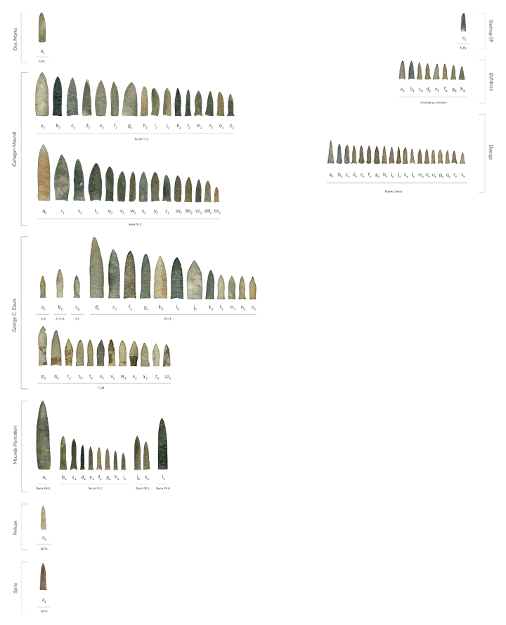

Geometric morphometric analysis of Gahagan bifaces
================
Robert Z. Selden, Jr.
November 19, 2019

### Introduction

This document includes supplemental materials for the article, “Shape
difference or shape change? Inter-regional variation in Gahagan biface
morphology.” The study represents the first formal morphological
analysis to assess inter-regional variability in Gahagan biface shape.
This effort follows a recent 2D analysis of Gahagan biface shapes within
the southern Caddo area (Selden Jr., Dockall, and Shafer 2018), where
Gahgagan bifaces were found to differ in shape across the same geography
as the Smithport Plain and Hickory Engraved bottles (Selden Jr. 2018a,
2018b, 2019a, 2019b). The analysis builds upon previous discussions and
analyses conducted by Shafer (1973, 1974, 2006). A succinct overview of
the analytical procedures used in the analysis is provided in the
manuscript, and the analytical code provided in this document can be
used to reproduce the results exactly.

``` r

```

<!-- -->

``` r
fig.cap="Gahagan bifaces from the southern Caddo area (left) and the central Texas region (right)."
```

### Load geomorph and data

``` r
# load geomorph
devtools::install_github("geomorphR/geomorph", ref = "Stable", build_vignettes = TRUE)
```

    ## Skipping install of 'geomorph' from a github remote, the SHA1 (e423f85f) has not changed since last install.
    ##   Use `force = TRUE` to force installation

``` r
library(geomorph)
```

    ## Loading required package: RRPP

    ## Loading required package: rgl

``` r
# set working directory
setwd(getwd())
source('readmulti.csv.R')

# read .csv files
setwd("./data")
filelist <- list.files(pattern = ".csv")
coords<-readmulti.csv(filelist)
setwd("../")

# read qualitative data
qdata<-read.csv("qdata.csv",header=TRUE, row.names=1)
qdata<-qdata[match(dimnames(coords)[[3]],rownames(qdata)),]
```

### Generalised Procrustes Analysis

``` r
Y.gpa<-gpagen(coords, PrinAxes = TRUE, print.progress = FALSE)
# plot(Y.gpa)
# quantify global integration relative to self-similarity (Bookstein 2015)
globalIntegration(Y.gpa$coords)
```

<!-- -->

    ##     BEval 
    ## -1.351334

``` r
# geomorph data frame
gdf<-geomorph.data.frame(shape=Y.gpa$coords, size=Y.gpa$Csize, region=qdata$region) 
csz<-Y.gpa$Csize # attribute for boxplot
rgn<-qdata$region # attribute for boxplot
# boxplot of central Texas and southern Caddo area Gahagan bifaces by centroid size
boxplot(csz~rgn, 
        main = "Centroid size of Gahagan bifaces by Region",
        names = c("Central Texas", "Southern Caddo Area"),
        xlab = "Region",
        ylab = "Centroid Size",
        col = c("dodgerblue4","indianred4")
        )
```

<!-- -->

``` r
# plot consensus configuration in 2D to illustrate axial twisting
par(mfrow=c(1,3))
plot(Y.gpa$consensus[,c("Y", "X")], pch=20)
plot(Y.gpa$consensus[,c("Z", "X")], pch=20)
plot(Y.gpa$consensus[,c("Z", "Y")], pch=20)
```

<!-- -->

``` r
# 3D GPA plot
knitr::include_graphics('images/gpa3d.png')
```

<!-- -->

``` r
fig.cap="Results of generalized Procrustes analysis."
```

### Principal Components Analysis

``` r
# principal components analysis
PCA<-gm.prcomp(Y.gpa$coords)
summary(PCA)
```

    ## Importance of components: 
    ##                                PC1          PC2          PC3          PC4
    ## Eigenvalues            0.003456919 0.0008015115 0.0003561083 0.0002230682
    ## Proportion of variance 0.624607819 0.1448198327 0.0643428572 0.0403047299
    ## Cumulative Proportion  0.624607819 0.7694276515 0.8337705087 0.8740752386
    ##                                 PC5          PC6          PC7          PC8
    ## Eigenvalues            0.0002015882 9.695004e-05 8.436491e-05 5.604465e-05
    ## Proportion of variance 0.0364236392 1.751726e-02 1.524334e-02 1.012634e-02
    ## Cumulative Proportion  0.9104988778 9.280161e-01 9.432595e-01 9.533858e-01
    ##                                 PC9         PC10         PC11         PC12
    ## Eigenvalues            4.496636e-05 2.705188e-05 2.237267e-05 1.879107e-05
    ## Proportion of variance 8.124675e-03 4.887826e-03 4.042370e-03 3.395234e-03
    ## Cumulative Proportion  9.615105e-01 9.663983e-01 9.704407e-01 9.738359e-01
    ##                                PC13        PC14         PC15         PC16
    ## Eigenvalues            1.540029e-05 1.10222e-05 1.040191e-05 8.987216e-06
    ## Proportion of variance 2.782577e-03 1.99153e-03 1.879453e-03 1.623841e-03
    ## Cumulative Proportion  9.766185e-01 9.78610e-01 9.804895e-01 9.821133e-01
    ##                                PC17         PC18         PC19         PC20
    ## Eigenvalues            8.549231e-06 7.318255e-06 6.361364e-06 5.314827e-06
    ## Proportion of variance 1.544704e-03 1.322287e-03 1.149393e-03 9.603011e-04
    ## Cumulative Proportion  9.836580e-01 9.849803e-01 9.861297e-01 9.870900e-01
    ##                                PC21         PC22         PC23         PC24
    ## Eigenvalues            0.0000048135 4.055466e-06 3.815912e-06 3.582330e-06
    ## Proportion of variance 0.0008697197 7.327553e-04 6.894719e-04 6.472675e-04
    ## Cumulative Proportion  0.9879597279 9.886925e-01 9.893820e-01 9.900292e-01
    ##                                PC25         PC26         PC27         PC28
    ## Eigenvalues            3.502677e-06 3.217001e-06 2.912249e-06 2.824778e-06
    ## Proportion of variance 6.328756e-04 5.812587e-04 5.261950e-04 5.103905e-04
    ## Cumulative Proportion  9.906621e-01 9.912434e-01 9.917696e-01 9.922799e-01
    ##                                PC29         PC30         PC31         PC32
    ## Eigenvalues            2.501451e-06 2.338948e-06 2.179895e-06 2.054475e-06
    ## Proportion of variance 4.519707e-04 4.226092e-04 3.938709e-04 3.712096e-04
    ## Cumulative Proportion  9.927319e-01 9.931545e-01 9.935484e-01 9.939196e-01
    ##                                PC33         PC34         PC35         PC36
    ## Eigenvalues            1.939460e-06 1.886723e-06 1.825971e-06 1.778283e-06
    ## Proportion of variance 3.504282e-04 3.408994e-04 3.299226e-04 3.213063e-04
    ## Cumulative Proportion  9.942700e-01 9.946109e-01 9.949409e-01 9.952622e-01
    ##                                PC37         PC38         PC39         PC40
    ## Eigenvalues            1.590082e-06 1.514771e-06 1.397118e-06 1.310930e-06
    ## Proportion of variance 2.873014e-04 2.736940e-04 2.524360e-04 2.368633e-04
    ## Cumulative Proportion  9.955495e-01 9.958232e-01 9.960756e-01 9.963125e-01
    ##                                PC41         PC42         PC43         PC44
    ## Eigenvalues            1.194399e-06 1.143650e-06 1.084226e-06 9.552894e-07
    ## Proportion of variance 2.158081e-04 2.066386e-04 1.959016e-04 1.726049e-04
    ## Cumulative Proportion  9.965283e-01 9.967349e-01 9.969308e-01 9.971034e-01
    ##                                PC45         PC46         PC47         PC48
    ## Eigenvalues            9.315217e-07 9.195995e-07 8.443341e-07 8.158839e-07
    ## Proportion of variance 1.683105e-04 1.661564e-04 1.525572e-04 1.474167e-04
    ## Cumulative Proportion  9.972717e-01 9.974379e-01 9.975904e-01 9.977378e-01
    ##                                PC49         PC50         PC51         PC52
    ## Eigenvalues            7.740278e-07 7.409568e-07 7.274802e-07 6.601754e-07
    ## Proportion of variance 1.398540e-04 1.338786e-04 1.314436e-04 1.192827e-04
    ## Cumulative Proportion  9.978777e-01 9.980116e-01 9.981430e-01 9.982623e-01
    ##                                PC53         PC54         PC55         PC56
    ## Eigenvalues            6.362967e-07 5.823384e-07 5.451563e-07 5.084281e-07
    ## Proportion of variance 1.149683e-04 1.052189e-04 9.850069e-05 9.186451e-05
    ## Cumulative Proportion  9.983773e-01 9.984825e-01 9.985810e-01 9.986729e-01
    ##                                PC57         PC58         PC59         PC60
    ## Eigenvalues            4.730999e-07 4.693756e-07 4.137549e-07 4.029531e-07
    ## Proportion of variance 8.548130e-05 8.480838e-05 7.475865e-05 7.280693e-05
    ## Cumulative Proportion  9.987583e-01 9.988431e-01 9.989179e-01 9.989907e-01
    ##                                PC61         PC62         PC63         PC64
    ## Eigenvalues            3.896934e-07 3.640047e-07 3.513582e-07 3.214590e-07
    ## Proportion of variance 7.041113e-05 6.576961e-05 6.348460e-05 5.808231e-05
    ## Cumulative Proportion  9.990611e-01 9.991269e-01 9.991904e-01 9.992485e-01
    ##                                PC65         PC66         PC67         PC68
    ## Eigenvalues            3.109272e-07 2.829565e-07 2.726509e-07 2.535682e-07
    ## Proportion of variance 5.617939e-05 5.112555e-05 4.926348e-05 4.581557e-05
    ## Cumulative Proportion  9.993046e-01 9.993558e-01 9.994050e-01 9.994508e-01
    ##                                PC69         PC70         PC71         PC72
    ## Eigenvalues            2.451162e-07 2.208437e-07 2.048010e-07 1.939748e-07
    ## Proportion of variance 4.428842e-05 3.990279e-05 3.700415e-05 3.504803e-05
    ## Cumulative Proportion  9.994951e-01 9.995350e-01 9.995720e-01 9.996071e-01
    ##                                PC73         PC74         PC75         PC76
    ## Eigenvalues            1.799088e-07 1.686135e-07 1.565266e-07 1.511512e-07
    ## Proportion of variance 3.250653e-05 3.046566e-05 2.828176e-05 2.731052e-05
    ## Cumulative Proportion  9.996396e-01 9.996701e-01 9.996983e-01 9.997257e-01
    ##                                PC77         PC78         PC79         PC80
    ## Eigenvalues            1.390248e-07 1.261566e-07 1.193091e-07 1.061959e-07
    ## Proportion of variance 2.511947e-05 2.279441e-05 2.155718e-05 1.918784e-05
    ## Cumulative Proportion  9.997508e-01 9.997736e-01 9.997951e-01 9.998143e-01
    ##                                PC81         PC82         PC83         PC84
    ## Eigenvalues            1.003169e-07 9.211420e-08 8.807852e-08 8.202944e-08
    ## Proportion of variance 1.812560e-05 1.664351e-05 1.591433e-05 1.482136e-05
    ## Cumulative Proportion  9.998324e-01 9.998491e-01 9.998650e-01 9.998798e-01
    ##                                PC85         PC86         PC87         PC88
    ## Eigenvalues            7.747428e-08 7.308202e-08 6.540498e-08 6.143040e-08
    ## Proportion of variance 1.399832e-05 1.320471e-05 1.181760e-05 1.109945e-05
    ## Cumulative Proportion  9.998938e-01 9.999070e-01 9.999188e-01 9.999299e-01
    ##                                PC89         PC90         PC91         PC92
    ## Eigenvalues            5.377298e-08 4.885162e-08 4.717929e-08 4.032719e-08
    ## Proportion of variance 9.715885e-06 8.826677e-06 8.524515e-06 7.286454e-06
    ## Cumulative Proportion  9.999397e-01 9.999485e-01 9.999570e-01 9.999643e-01
    ##                                PC93         PC94         PC95         PC96
    ## Eigenvalues            3.837790e-08 3.371702e-08 2.560840e-08 2.370383e-08
    ## Proportion of variance 6.934250e-06 6.092106e-06 4.627013e-06 4.282890e-06
    ## Cumulative Proportion  9.999712e-01 9.999773e-01 9.999819e-01 9.999862e-01
    ##                                PC97         PC98         PC99        PC100
    ## Eigenvalues            2.025422e-08 1.983573e-08 1.544332e-08 1.290993e-08
    ## Proportion of variance 3.659602e-06 3.583987e-06 2.790352e-06 2.332610e-06
    ## Cumulative Proportion  9.999899e-01 9.999935e-01 9.999963e-01 9.999986e-01
    ##                               PC101
    ## Eigenvalues            7.781498e-09
    ## Proportion of variance 1.405988e-06
    ## Cumulative Proportion  1.000000e+00

``` r
# set plot parameters
colors <- c("dodgerblue4","indianred4") # baseball colors, naturally
colors <- colors[as.numeric(qdata$region)]
shapes <- c(2,4) # open triangle (ctx) and X (sca)
shapes <- shapes[as.numeric(qdata$region)]
# plotPCA
PCAplot<-plot(PCA, col = colors, pch = shapes)
```

<!-- -->

``` r
knitr::include_graphics('images/pca-warp-ref.png')
```

<!-- -->

``` r
fig.cap="Results of PCA with central Texas sample in blue triangles, and southern Caddo area in red X's. Reference shapes include the consensus configuration (gray) and the shape at the extreme of each PC in black. Reference shapes do not articulate with any specimens used in this analysis."
```

### Define models

``` r
# define models
fit.size<-procD.lm(shape ~ size, data = gdf, print.progress = FALSE, iter = 9999)
fit.sizeregion<-procD.lm(size ~ region, data = gdf, print.progress = FALSE, iter = 9999)
fit.shaperegion<-procD.lm(shape ~ region, data = gdf, print.progress = FALSE, iter = 9999)
fit.unique<-procD.lm(shape ~ size * region, data = gdf, print.progress = FALSE, iter = 9999) # unique allometries
fit.common<-procD.lm(shape ~ size + region, data = gdf, print.progress = FALSE, iter = 9999) # common allometries
```

### Allometry

``` r
# allometry: does shape change with size?  
anova(fit.size)
```

    ## 
    ## Analysis of Variance, using Residual Randomization
    ## Permutation procedure: Randomization of null model residuals 
    ## Number of permutations: 10000 
    ## Estimation method: Ordinary Least Squares 
    ## Sums of Squares and Cross-products: Type I 
    ## Effect sizes (Z) based on F distributions
    ## 
    ##            Df      SS       MS     Rsq      F      Z Pr(>F)    
    ## size        1 0.04166 0.041664 0.07453 8.0538 3.0348  6e-04 ***
    ## Residuals 100 0.51732 0.005173 0.92547                         
    ## Total     101 0.55899                                          
    ## ---
    ## Signif. codes:  0 '***' 0.001 '**' 0.01 '*' 0.05 '.' 0.1 ' ' 1
    ## 
    ## Call: procD.lm(f1 = shape ~ size, iter = 9999, data = gdf, print.progress = FALSE)

``` r
anova(fit.common)
```

    ## 
    ## Analysis of Variance, using Residual Randomization
    ## Permutation procedure: Randomization of null model residuals 
    ## Number of permutations: 10000 
    ## Estimation method: Ordinary Least Squares 
    ## Sums of Squares and Cross-products: Type I 
    ## Effect sizes (Z) based on F distributions
    ## 
    ##            Df      SS       MS     Rsq      F      Z Pr(>F)    
    ## size        1 0.04166 0.041664 0.07453 8.6482 3.1246  3e-04 ***
    ## region      1 0.04038 0.040378 0.07223 8.3812 3.0905  1e-03 ** 
    ## Residuals  99 0.47695 0.004818 0.85323                         
    ## Total     101 0.55899                                          
    ## ---
    ## Signif. codes:  0 '***' 0.001 '**' 0.01 '*' 0.05 '.' 0.1 ' ' 1
    ## 
    ## Call: procD.lm(f1 = shape ~ size + region, iter = 9999, data = gdf,  
    ##     print.progress = FALSE)

``` r
anova(fit.unique)
```

    ## 
    ## Analysis of Variance, using Residual Randomization
    ## Permutation procedure: Randomization of null model residuals 
    ## Number of permutations: 10000 
    ## Estimation method: Ordinary Least Squares 
    ## Sums of Squares and Cross-products: Type I 
    ## Effect sizes (Z) based on F distributions
    ## 
    ##              Df      SS       MS     Rsq      F      Z Pr(>F)    
    ## size          1 0.04166 0.041664 0.07453 8.7411 3.1377 0.0003 ***
    ## region        1 0.04038 0.040378 0.07223 8.4711 3.1037 0.0010 ** 
    ## size:region   1 0.00983 0.009831 0.01759 2.0625 1.3297 0.1052    
    ## Residuals    98 0.46712 0.004766 0.83564                         
    ## Total       101 0.55899                                          
    ## ---
    ## Signif. codes:  0 '***' 0.001 '**' 0.01 '*' 0.05 '.' 0.1 ' ' 1
    ## 
    ## Call: procD.lm(f1 = shape ~ size * region, iter = 9999, data = gdf,  
    ##     print.progress = FALSE)

``` r
plot(fit.size, type = "regression", reg.type = "RegScore", predictor = log(gdf$size), pch = shapes, col = colors)
```

<!-- -->

``` r
    # common allometric component (Mitteroecker 2004)
plotAllometry(fit.size, size = gdf$size, logsz = TRUE, method = "CAC", pch = shapes, col = colors)
```

<!-- -->

``` r
    # size-shape PCA (Mitteroecker 2004)
plotAllometry(fit.shaperegion, size = gdf$size, logsz = TRUE, method = "size.shape", pch = shapes, col = colors)
```

<!-- -->

``` r
    # do Gahagan biface forms from different regions express parallel, convergent, or divergent morphological characteristics?
extremes<-plotAllometry(fit.unique, size = gdf$size, logsz = TRUE, method = "PredLine", pch = shapes, col = colors)
```

<!-- -->

``` r
# max/min for each population in the above result accomplished manually using:
# picknplot.shape(extremes)
anova(fit.common, fit.unique, print.progress = FALSE)
```

    ## 
    ## Analysis of Variance, using Residual Randomization
    ## Permutation procedure: Randomization of null model residuals 
    ## Number of permutations: 10000 
    ## Estimation method: Ordinary Least Squares 
    ## Effect sizes (Z) based on F distributions
    ## 
    ##                              ResDf Df     RSS        SS        MS      Rsq
    ## shape ~ size + region (Null)    99  1 0.47695                     0.000000
    ## shape ~ size * region           98  1 0.46712 0.0098311 0.0098311 0.017587
    ## Total                          101    0.55899                             
    ##                                   F      Z      P Pr(>F)
    ## shape ~ size + region (Null)                            
    ## shape ~ size * region        2.0625 1.3297 0.1052       
    ## Total

``` r
knitr::include_graphics('images/gbiface-allom-form.png')
```

<!-- -->

``` r
fig.cap="Measures of Gahagan biface morphology as a function of size for bifaces from both regions, where small and large specimens from each region (black spheres) are contrasted with the consensus configuration (gray spheres)."
```

### Size/Shape \~ Region?

``` r
# ANOVA: does Gahagan biface size differ by region?
anova(fit.sizeregion)
```

    ## 
    ## Analysis of Variance, using Residual Randomization
    ## Permutation procedure: Randomization of null model residuals 
    ## Number of permutations: 10000 
    ## Estimation method: Ordinary Least Squares 
    ## Sums of Squares and Cross-products: Type I 
    ## Effect sizes (Z) based on F distributions
    ## 
    ##            Df      SS     MS     Rsq      F     Z Pr(>F)    
    ## region      1  541497 541497 0.35832 55.841 2.332  1e-04 ***
    ## Residuals 100  969716   9697 0.64168                        
    ## Total     101 1511213                                       
    ## ---
    ## Signif. codes:  0 '***' 0.001 '**' 0.01 '*' 0.05 '.' 0.1 ' ' 1
    ## 
    ## Call: procD.lm(f1 = size ~ region, iter = 9999, data = gdf, print.progress = FALSE)

``` r
# ANOVA: do Gahagan biface shapes differ by region?
anova(fit.shaperegion)
```

    ## 
    ## Analysis of Variance, using Residual Randomization
    ## Permutation procedure: Randomization of null model residuals 
    ## Number of permutations: 10000 
    ## Estimation method: Ordinary Least Squares 
    ## Sums of Squares and Cross-products: Type I 
    ## Effect sizes (Z) based on F distributions
    ## 
    ##            Df      SS       MS     Rsq      F      Z Pr(>F)    
    ## region      1 0.07773 0.077730 0.13905 16.151 3.8971  1e-04 ***
    ## Residuals 100 0.48126 0.004813 0.86095                         
    ## Total     101 0.55899                                          
    ## ---
    ## Signif. codes:  0 '***' 0.001 '**' 0.01 '*' 0.05 '.' 0.1 ' ' 1
    ## 
    ## Call: procD.lm(f1 = shape ~ region, iter = 9999, data = gdf, print.progress = FALSE)

### Morphological disparity

``` r
# morphological disparity: do either of the groups display greater shape variation among individuals relative to the other group?
morphol.disparity(fit.shaperegion, groups = qdata$region, data = gdf, print.progress = FALSE, iter = 9999)
```

    ## 
    ## Call:
    ## morphol.disparity(f1 = fit.shaperegion, groups = qdata$region,  
    ##     iter = 9999, data = gdf, print.progress = FALSE) 
    ## 
    ## 
    ## 
    ## Randomized Residual Permutation Procedure Used
    ## 10000 Permutations
    ## 
    ## Procrustes variances for defined groups
    ##         CTX         SCA 
    ## 0.005043922 0.004582514 
    ## 
    ## 
    ## Pairwise absolute differences between variances
    ##              CTX          SCA
    ## CTX 0.0000000000 0.0004614077
    ## SCA 0.0004614077 0.0000000000
    ## 
    ## 
    ## P-Values
    ##        CTX    SCA
    ## CTX 1.0000 0.7113
    ## SCA 0.7113 1.0000

### Mean shapes

``` r
#subset landmark coordinates to produce mean shapes for groups
new.coords<-coords.subset(A = Y.gpa$coords, group = qdata$region)
names(new.coords)
```

    ## [1] "CTX" "SCA"

``` r
#group shape means
mean<-lapply(new.coords, mshape)
# plot(mean$CTX)
# plot(mean$SCA)
# plotRefToTarget(mean$SCA,mean$CTX, method="vector",mag=2)
knitr::include_graphics('images/mshape-region.png')
```

<!-- -->

``` r
fig.cap="Mean shapes for Gahagan bifaces from the southern Caddo area (left) and central Texas region (center). In the comparison of the two (right), the southern Caddo area is represented by gray spheres, and the central Texas region by linear vectors."
```

### Acknowledgments

We extend our gratitude to the Caddo Tribe of Oklahoma, the Williamson
Museum at Northwestern State University, the Louisiana State Exhibit
Museum, the Texas Archeological Research Laboratory at The University of
Texas at Austin, the Brazos Valley Museum of Natural History, the Texas
Parks and Wildlife Department, and the Sam Noble Oklahoma Museum of
Natural Science for the requisite permissions and access needed to
generate the scans of Gahagan bifaces. Thanks to Harry J. Shafer,
Jeffrey S. Girard, Hiram F. (Pete) Gregory, Julian A. Sitters, Timothy
K. Perttula, and David K. Thulman for their comments on a draft of this
manuscript. Thanks also to Dean C. Adams, Michael L. Collyer, Emma
Sherratt, Lauren Butaric, and Kersten Bergstrom for their constructive
criticisms, comments, and suggestions throughout the development of this
research programme, and to the editors and anonymous reviewers for their
comments and constructive criticisms, which further improved the
manuscript.

Components of this analytical work flow were developed and funded by a
Preservation Technology and Training grant (P14AP00138) to RZS from the
National Center for Preservation Technology and Training, and funding to
scan the Gahagan bifaces at the Williamson Museum at Northwestern State
University, Louisiana State Exhibit Museum, Texas Archeological Research
Laboratory at The University of Texas at Austin, and Sam Noble Oklahoma
Museum of Natural Science was provided to RZS by the Heritage Research
Center at Stephen F. Austin State University.

### References cited

<div id="refs" class="references">

<div id="ref-RN11801">

Selden Jr., Robert Z. 2018a. “A Preliminary Study of Smithport Plain
Bottle Morphology in the Southern Caddo Area.” *Bulletin of the Texas
Archeological Society* 89: 63–89.

</div>

<div id="ref-RN11782">

———. 2018b. “Ceramic Morphological Organisation in the Southern Caddo
Area: Quiddity of Shape for Hickory Engraved Bottles.” *Journal of
Archaeological Science: Reports* 21: 884–96.
<https://doi.org/10.1016/j.jasrep.2018.08.045>.

</div>

<div id="ref-RN11716">

———. 2019a. “Ceramic Morphological Organisation in the Southern Caddo
Area: The Clarence H. Webb Collections.” *Journal of Cultural Heritage*
35: 41–55.
<https://doi.org/https://doi.org/10.1016/j.culher.2018.07.002>.

</div>

<div id="ref-RN20852">

———. 2019b. “Louisiana Limitrophe: An Iterative Morphological Exegesis
of Caddo Bottle and Biface Production.” *SocArXiv*.
<https://doi.org/10.31235/osf.io/rpnd5>.

</div>

<div id="ref-RN11783">

Selden Jr., Robert Z., John E. Dockall, and Harry J. Shafer. 2018.
“Lithic Morphological Organisation: Gahagan Bifaces from the Southern
Caddo Area.” *Digital Applications in Archaeology and Cultural Heritage*
10: e00080. <https://doi.org/10.1016/j.daach.2018.e00080>.

</div>

<div id="ref-RN3684">

Shafer, Harry J. 1973. “Lithic Technology at the George C. Davis Site,
Cherokee County, Texas.” Unpublished Ph.D. Dissertation, The University
of Texas at Austin.

</div>

<div id="ref-RN20701">

———. 1974. “Lithic Reduction Strategies at the George C. Davis Site.”
*Louisiana Archaeology* 1: 66–74.
<https://docs.wixstatic.com/ugd/fefb33_71a3f0c39e5d47a2b55af09847e6d821.pdf>.

</div>

<div id="ref-RN4924">

———. 2006. “People of the Prairie: A Possible Connection to the Davis
Site Caddo.” Texas Department of Transportation; Prewitt & Associates,
Inc.

</div>

</div>
