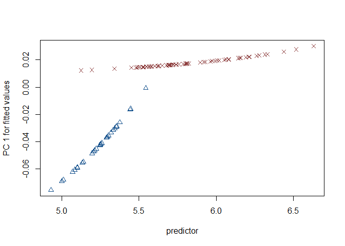

Supplemental materials: Shape difference or shape change? Inter-regional
variation in Gahagan biface morphology
================
Robert Z. Selden, Jr.
November 7, 2019

### Introduction

This document includes supplemental materials for the article, “Shape
difference or shape change? Inter-regional variation in Gahagan biface
morphology.” The study represents the first formal morphological
analysis to assess inter-regional variability in Gahagan biface shape,
follows a recent 2D analysis of Gahagan biface shapes within the
southern Caddo area (Selden Jr., Dockall, and Shafer 2018), where the
Gahgagan bifaces were found to differ in shape across the same geography
as the Smithport Plain and Hickory Engraved bottles (Selden Jr. 2018a,
2018b, 2019a, 2019b), and builds upon the work of Shafer (1973, 1974,
2006).

### Load geomorph and data

``` r
# load geomorph
devtools::install_github("geomorphR/geomorph", ref = "Stable", build_vignettes = TRUE)
```

    ## Skipping install of 'geomorph' from a github remote, the SHA1 (e423f85f) has not changed since last install.
    ##   Use `force = TRUE` to force installation

``` r
library(geomorph)
```

    ## Loading required package: RRPP

    ## Loading required package: rgl

``` r
# set working directory
setwd(getwd())
source('readmulti.csv.r')

# read .csv files
setwd("./data")
filelist <- list.files(pattern = ".csv")
coords<-readmulti.csv(filelist)
setwd("../")

# read qualitative data
qdata<-read.csv("qdata.csv",header=TRUE, row.names=1)
qdata<-qdata[match(dimnames(coords)[[3]],rownames(qdata)),]
```

### GPA and PCA

``` r
Y.gpa<-gpagen(coords, PrinAxes = TRUE)
```

    ## 
      |                                                                       
      |                                                                 |   0%
      |                                                                       
      |=============                                                    |  20%
      |                                                                       
      |==========================                                       |  40%
      |                                                                       
      |=================================================================| 100%

``` r
plot(Y.gpa)
### analyses
gdf<-geomorph.data.frame(shape=Y.gpa$coords, size=Y.gpa$Csize, region=qdata$region)
csz<-Y.gpa$Csize
rgn<-qdata$region
# principal components analysis
PCA<-gm.prcomp(Y.gpa$coords)
summary(PCA)
```

    ## Importance of components: 
    ##                                PC1          PC2          PC3          PC4
    ## Eigenvalues            0.003398784 0.0007629781 0.0003286649 0.0002123239
    ## Proportion of variance 0.631359878 0.1417312124 0.0610529709 0.0394413913
    ## Cumulative Proportion  0.631359878 0.7730910903 0.8341440612 0.8735854525
    ##                                 PC5          PC6          PC7          PC8
    ## Eigenvalues            0.0002086819 0.0000938909 8.774785e-05 4.848984e-05
    ## Proportion of variance 0.0387648672 0.0174412219 1.630009e-02 9.007497e-03
    ## Cumulative Proportion  0.9123503197 0.9297915417 9.460916e-01 9.550991e-01
    ##                                 PC9         PC10         PC11         PC12
    ## Eigenvalues            0.0000450536 2.669465e-05 2.043578e-05 1.819353e-05
    ## Proportion of variance 0.0083691794 4.958812e-03 3.796161e-03 3.379640e-03
    ## Cumulative Proportion  0.9634683046 9.684271e-01 9.722233e-01 9.756029e-01
    ##                                PC13         PC14         PC15         PC16
    ## Eigenvalues            1.547906e-05 1.070798e-05 9.602427e-06 8.674190e-06
    ## Proportion of variance 2.875398e-03 1.989120e-03 1.783752e-03 1.611322e-03
    ## Cumulative Proportion  9.784783e-01 9.804674e-01 9.822512e-01 9.838625e-01
    ##                                PC17         PC18         PC19         PC20
    ## Eigenvalues            7.592756e-06 6.738446e-06 5.197487e-06 4.650290e-06
    ## Proportion of variance 1.410434e-03 1.251737e-03 9.654879e-04 8.638403e-04
    ## Cumulative Proportion  9.852729e-01 9.865247e-01 9.874902e-01 9.883540e-01
    ##                                PC21         PC22         PC23         PC24
    ## Eigenvalues            4.388040e-06 4.081284e-06 3.687442e-06 3.482331e-06
    ## Proportion of variance 8.151246e-04 7.581415e-04 6.849811e-04 6.468796e-04
    ## Cumulative Proportion  9.891691e-01 9.899273e-01 9.906123e-01 9.912591e-01
    ##                                PC25         PC26         PC27         PC28
    ## Eigenvalues            3.236085e-06 3.119214e-06 2.704530e-06 2.512169e-06
    ## Proportion of variance 6.011368e-04 5.794269e-04 5.023950e-04 4.666617e-04
    ## Cumulative Proportion  9.918603e-01 9.924397e-01 9.929421e-01 9.934088e-01
    ##                                PC29         PC30         PC31         PC32
    ## Eigenvalues            2.160811e-06 2.152177e-06 2.018917e-06 1.936618e-06
    ## Proportion of variance 4.013934e-04 3.997896e-04 3.750351e-04 3.597471e-04
    ## Cumulative Proportion  9.938101e-01 9.942099e-01 9.945850e-01 9.949447e-01
    ##                                PC33         PC34         PC35         PC36
    ## Eigenvalues            1.757969e-06 1.635766e-06 1.447140e-06 1.390107e-06
    ## Proportion of variance 3.265612e-04 3.038608e-04 2.688216e-04 2.582270e-04
    ## Cumulative Proportion  9.952713e-01 9.955751e-01 9.958440e-01 9.961022e-01
    ##                                PC37         PC38         PC39         PC40
    ## Eigenvalues            1.338580e-06 1.214425e-06 1.158253e-06 1.079490e-06
    ## Proportion of variance 2.486554e-04 2.255922e-04 2.151577e-04 2.005266e-04
    ## Cumulative Proportion  9.963508e-01 9.965764e-01 9.967916e-01 9.969921e-01
    ##                                PC41         PC42         PC43         PC44
    ## Eigenvalues            9.966386e-07 9.804891e-07 9.103617e-07 8.628236e-07
    ## Proportion of variance 1.851361e-04 1.821362e-04 1.691093e-04 1.602786e-04
    ## Cumulative Proportion  9.971773e-01 9.973594e-01 9.975285e-01 9.976888e-01
    ##                                PC45         PC46         PC47         PC48
    ## Eigenvalues            8.398501e-07 8.099107e-07 7.544835e-07 6.632661e-07
    ## Proportion of variance 1.560110e-04 1.504494e-04 1.401532e-04 1.232087e-04
    ## Cumulative Proportion  9.978448e-01 9.979952e-01 9.981354e-01 9.982586e-01
    ##                                PC49         PC50         PC51         PC52
    ## Eigenvalues            6.318708e-07 6.148103e-07 5.739626e-07 5.124459e-07
    ## Proportion of variance 1.173766e-04 1.142075e-04 1.066196e-04 9.519222e-05
    ## Cumulative Proportion  9.983760e-01 9.984902e-01 9.985968e-01 9.986920e-01
    ##                                PC53         PC54         PC55         PC56
    ## Eigenvalues            4.668315e-07 4.600268e-07 4.258517e-07 4.173821e-07
    ## Proportion of variance 8.671886e-05 8.545481e-05 7.910644e-05 7.753312e-05
    ## Cumulative Proportion  9.987787e-01 9.988642e-01 9.989433e-01 9.990208e-01
    ##                                PC57         PC58         PC59         PC60
    ## Eigenvalues            3.720637e-07 3.567050e-07 3.462125e-07 3.355465e-07
    ## Proportion of variance 6.911474e-05 6.626171e-05 6.431261e-05 6.233129e-05
    ## Cumulative Proportion  9.990899e-01 9.991562e-01 9.992205e-01 9.992828e-01
    ##                                PC61         PC62         PC63         PC64
    ## Eigenvalues            3.068583e-07 2.901155e-07 2.792470e-07 2.578004e-07
    ## Proportion of variance 5.700216e-05 5.389200e-05 5.187307e-05 4.788913e-05
    ## Cumulative Proportion  9.993398e-01 9.993937e-01 9.994456e-01 9.994935e-01
    ##                                PC65         PC66         PC67         PC68
    ## Eigenvalues            2.435894e-07 2.111669e-07 1.957712e-07 1.892048e-07
    ## Proportion of variance 4.524929e-05 3.922648e-05 3.636657e-05 3.514679e-05
    ## Cumulative Proportion  9.995387e-01 9.995780e-01 9.996143e-01 9.996495e-01
    ##                                PC69         PC70         PC71         PC72
    ## Eigenvalues            1.748473e-07 1.688307e-07 1.578316e-07 1.514614e-07
    ## Proportion of variance 3.247973e-05 3.136208e-05 2.931888e-05 2.813555e-05
    ## Cumulative Proportion  9.996820e-01 9.997133e-01 9.997426e-01 9.997708e-01
    ##                                PC73         PC74         PC75         PC76
    ## Eigenvalues            1.465331e-07 1.239339e-07 1.152113e-07 1.078865e-07
    ## Proportion of variance 2.722006e-05 2.302203e-05 2.140170e-05 2.004106e-05
    ## Cumulative Proportion  9.997980e-01 9.998210e-01 9.998424e-01 9.998625e-01
    ##                                PC77         PC78         PC79         PC80
    ## Eigenvalues            9.532909e-08 8.643654e-08 8.402055e-08 7.707989e-08
    ## Proportion of variance 1.770838e-05 1.605650e-05 1.560770e-05 1.431840e-05
    ## Cumulative Proportion  9.998802e-01 9.998962e-01 9.999118e-01 9.999262e-01
    ##                                PC81         PC82         PC83         PC84
    ## Eigenvalues            6.712876e-08 5.475822e-08 5.120966e-08 4.882907e-08
    ## Proportion of variance 1.246987e-05 1.017192e-05 9.512733e-06 9.070514e-06
    ## Cumulative Proportion  9.999386e-01 9.999488e-01 9.999583e-01 9.999674e-01
    ##                                PC85         PC86         PC87         PC88
    ## Eigenvalues            3.971423e-08 3.510954e-08 2.961699e-08 2.685990e-08
    ## Proportion of variance 7.377336e-06 6.521966e-06 5.501668e-06 4.989510e-06
    ## Cumulative Proportion  9.999748e-01 9.999813e-01 9.999868e-01 9.999918e-01
    ##                                PC89         PC90
    ## Eigenvalues            2.397574e-08 2.033596e-08
    ## Proportion of variance 4.453747e-06 3.777618e-06
    ## Cumulative Proportion  9.999962e-01 1.000000e+00

### Plot PCA

``` r
# set plot parameters
colors <- c("dodgerblue4","indianred4") # baseball colors, naturally
colors <- colors[as.numeric(qdata$region)]
shapes <- c(2,4) # open triangle (ctx) and X (sca)
shapes <- shapes[as.numeric(qdata$region)]

# plotPCA
plot(PCA, col = colors, pch = shapes)
```

<!-- -->

### Define models

``` r
# define models
fit.size<-procD.lm(shape ~ size, data = gdf, print.progress = FALSE, iter = 9999)
fit.region<-procD.lm(shape ~ region, data = gdf, print.progress = FALSE, iter = 9999)
fit.unique<-procD.lm(shape ~ size * region, data = gdf, print.progress = FALSE, iter = 9999)
```

### Allometry

``` r
# allometry: does shape change with size?  
anova(fit.size)
```

    ## 
    ## Analysis of Variance, using Residual Randomization
    ## Permutation procedure: Randomization of null model residuals 
    ## Number of permutations: 10000 
    ## Estimation method: Ordinary Least Squares 
    ## Sums of Squares and Cross-products: Type I 
    ## Effect sizes (Z) based on F distributions
    ## 
    ##           Df      SS        MS     Rsq      F      Z Pr(>F)  
    ## size       1 0.02308 0.0230824 0.04764 4.4523 2.2602 0.0128 *
    ## Residuals 89 0.46141 0.0051844 0.95236                       
    ## Total     90 0.48449                                         
    ## ---
    ## Signif. codes:  0 '***' 0.001 '**' 0.01 '*' 0.05 '.' 0.1 ' ' 1
    ## 
    ## Call: procD.lm(f1 = shape ~ size, iter = 9999, data = gdf, print.progress = FALSE)

``` r
plot(fit.size, type = "regression", reg.type = "RegScore", predictor = log(gdf$size), pch = shapes, col = colors)
```

<!-- -->

``` r
    # common allometric component (Mitteroecker et al. 2004)
plotAllometry(fit.size, size = gdf$size, logsz = TRUE, method = "CAC", pch = shapes, col = colors)
```

<!-- -->

``` r
    # size-shape PCA (Mitteroecker et al. 2004)
plotAllometry(fit.region, size = gdf$size, logsz = TRUE, method = "size.shape", pch = shapes, col = colors)
```

<!-- -->

``` r
    # do Gahagan biface forms from the different regions express parallel, convergent, or divergent morphological characteristics?
test<-plotAllometry(fit.unique, size = gdf$size, logsz = TRUE, method = "PredLine", pch = shapes, col = colors)
```

<!-- -->

``` r
    # boxplot of central Texas and southern Caddo area Gahagan bifaces by centroid size
boxplot(csz~rgn, 
        main = "Centroid size of Gahagan bifaces by Region",
        names = c("Central Texas", "Southern Caddo Area"),
        xlab = "Region",
        ylab = "Centroid Size",
        col = c("dodgerblue4","indianred4")
        )
```

<!-- -->

### Shape \~ Region?

``` r
# ANOVA: do Gahagan biface shapes differ by region?
anova(fit.region)
```

    ## 
    ## Analysis of Variance, using Residual Randomization
    ## Permutation procedure: Randomization of null model residuals 
    ## Number of permutations: 10000 
    ## Estimation method: Ordinary Least Squares 
    ## Sums of Squares and Cross-products: Type I 
    ## Effect sizes (Z) based on F distributions
    ## 
    ##           Df      SS       MS    Rsq      F      Z Pr(>F)    
    ## region     1 0.04850 0.048499 0.1001 9.9001 3.3033  1e-04 ***
    ## Residuals 89 0.43600 0.004899 0.8999                         
    ## Total     90 0.48449                                         
    ## ---
    ## Signif. codes:  0 '***' 0.001 '**' 0.01 '*' 0.05 '.' 0.1 ' ' 1
    ## 
    ## Call: procD.lm(f1 = shape ~ region, iter = 9999, data = gdf, print.progress = FALSE)

### Morphological disparity

``` r
# morphological disparity: do either of the groups display greater shape variation among individuals relative to the other group?
morphol.disparity(fit.region, groups = qdata$region, data = gdf, iter = 9999)
```

    ## 
    ## 
    ## Performimg pairwise comparisons of disparity
    ## 
      |                                                                       
      |                                                                 |   0%
      |                                                                       
      |                                                                 |   1%
      |                                                                       
      |=                                                                |   1%
      |                                                                       
      |=                                                                |   2%
      |                                                                       
      |==                                                               |   2%
      |                                                                       
      |==                                                               |   3%
      |                                                                       
      |==                                                               |   4%
      |                                                                       
      |===                                                              |   4%
      |                                                                       
      |===                                                              |   5%
      |                                                                       
      |====                                                             |   5%
      |                                                                       
      |====                                                             |   6%
      |                                                                       
      |====                                                             |   7%
      |                                                                       
      |=====                                                            |   7%
      |                                                                       
      |=====                                                            |   8%
      |                                                                       
      |======                                                           |   8%
      |                                                                       
      |======                                                           |   9%
      |                                                                       
      |======                                                           |  10%
      |                                                                       
      |=======                                                          |  10%
      |                                                                       
      |=======                                                          |  11%
      |                                                                       
      |=======                                                          |  12%
      |                                                                       
      |========                                                         |  12%
      |                                                                       
      |========                                                         |  13%
      |                                                                       
      |=========                                                        |  13%
      |                                                                       
      |=========                                                        |  14%
      |                                                                       
      |=========                                                        |  15%
      |                                                                       
      |==========                                                       |  15%
      |                                                                       
      |==========                                                       |  16%
      |                                                                       
      |===========                                                      |  16%
      |                                                                       
      |===========                                                      |  17%
      |                                                                       
      |===========                                                      |  18%
      |                                                                       
      |============                                                     |  18%
      |                                                                       
      |============                                                     |  19%
      |                                                                       
      |=============                                                    |  19%
      |                                                                       
      |=============                                                    |  20%
      |                                                                       
      |=============                                                    |  21%
      |                                                                       
      |==============                                                   |  21%
      |                                                                       
      |==============                                                   |  22%
      |                                                                       
      |===============                                                  |  22%
      |                                                                       
      |===============                                                  |  23%
      |                                                                       
      |===============                                                  |  24%
      |                                                                       
      |================                                                 |  24%
      |                                                                       
      |================                                                 |  25%
      |                                                                       
      |=================                                                |  25%
      |                                                                       
      |=================                                                |  26%
      |                                                                       
      |=================                                                |  27%
      |                                                                       
      |==================                                               |  27%
      |                                                                       
      |==================                                               |  28%
      |                                                                       
      |===================                                              |  28%
      |                                                                       
      |===================                                              |  29%
      |                                                                       
      |===================                                              |  30%
      |                                                                       
      |====================                                             |  30%
      |                                                                       
      |====================                                             |  31%
      |                                                                       
      |====================                                             |  32%
      |                                                                       
      |=====================                                            |  32%
      |                                                                       
      |=====================                                            |  33%
      |                                                                       
      |======================                                           |  33%
      |                                                                       
      |======================                                           |  34%
      |                                                                       
      |======================                                           |  35%
      |                                                                       
      |=======================                                          |  35%
      |                                                                       
      |=======================                                          |  36%
      |                                                                       
      |========================                                         |  36%
      |                                                                       
      |========================                                         |  37%
      |                                                                       
      |========================                                         |  38%
      |                                                                       
      |=========================                                        |  38%
      |                                                                       
      |=========================                                        |  39%
      |                                                                       
      |==========================                                       |  39%
      |                                                                       
      |==========================                                       |  40%
      |                                                                       
      |==========================                                       |  41%
      |                                                                       
      |===========================                                      |  41%
      |                                                                       
      |===========================                                      |  42%
      |                                                                       
      |============================                                     |  42%
      |                                                                       
      |============================                                     |  43%
      |                                                                       
      |============================                                     |  44%
      |                                                                       
      |=============================                                    |  44%
      |                                                                       
      |=============================                                    |  45%
      |                                                                       
      |==============================                                   |  45%
      |                                                                       
      |==============================                                   |  46%
      |                                                                       
      |==============================                                   |  47%
      |                                                                       
      |===============================                                  |  47%
      |                                                                       
      |===============================                                  |  48%
      |                                                                       
      |================================                                 |  48%
      |                                                                       
      |================================                                 |  49%
      |                                                                       
      |================================                                 |  50%
      |                                                                       
      |=================================                                |  50%
      |                                                                       
      |=================================                                |  51%
      |                                                                       
      |=================================                                |  52%
      |                                                                       
      |==================================                               |  52%
      |                                                                       
      |==================================                               |  53%
      |                                                                       
      |===================================                              |  53%
      |                                                                       
      |===================================                              |  54%
      |                                                                       
      |===================================                              |  55%
      |                                                                       
      |====================================                             |  55%
      |                                                                       
      |====================================                             |  56%
      |                                                                       
      |=====================================                            |  56%
      |                                                                       
      |=====================================                            |  57%
      |                                                                       
      |=====================================                            |  58%
      |                                                                       
      |======================================                           |  58%
      |                                                                       
      |======================================                           |  59%
      |                                                                       
      |=======================================                          |  59%
      |                                                                       
      |=======================================                          |  60%
      |                                                                       
      |=======================================                          |  61%
      |                                                                       
      |========================================                         |  61%
      |                                                                       
      |========================================                         |  62%
      |                                                                       
      |=========================================                        |  62%
      |                                                                       
      |=========================================                        |  63%
      |                                                                       
      |=========================================                        |  64%
      |                                                                       
      |==========================================                       |  64%
      |                                                                       
      |==========================================                       |  65%
      |                                                                       
      |===========================================                      |  65%
      |                                                                       
      |===========================================                      |  66%
      |                                                                       
      |===========================================                      |  67%
      |                                                                       
      |============================================                     |  67%
      |                                                                       
      |============================================                     |  68%
      |                                                                       
      |=============================================                    |  68%
      |                                                                       
      |=============================================                    |  69%
      |                                                                       
      |=============================================                    |  70%
      |                                                                       
      |==============================================                   |  70%
      |                                                                       
      |==============================================                   |  71%
      |                                                                       
      |==============================================                   |  72%
      |                                                                       
      |===============================================                  |  72%
      |                                                                       
      |===============================================                  |  73%
      |                                                                       
      |================================================                 |  73%
      |                                                                       
      |================================================                 |  74%
      |                                                                       
      |================================================                 |  75%
      |                                                                       
      |=================================================                |  75%
      |                                                                       
      |=================================================                |  76%
      |                                                                       
      |==================================================               |  76%
      |                                                                       
      |==================================================               |  77%
      |                                                                       
      |==================================================               |  78%
      |                                                                       
      |===================================================              |  78%
      |                                                                       
      |===================================================              |  79%
      |                                                                       
      |====================================================             |  79%
      |                                                                       
      |====================================================             |  80%
      |                                                                       
      |====================================================             |  81%
      |                                                                       
      |=====================================================            |  81%
      |                                                                       
      |=====================================================            |  82%
      |                                                                       
      |======================================================           |  82%
      |                                                                       
      |======================================================           |  83%
      |                                                                       
      |======================================================           |  84%
      |                                                                       
      |=======================================================          |  84%
      |                                                                       
      |=======================================================          |  85%
      |                                                                       
      |========================================================         |  85%
      |                                                                       
      |========================================================         |  86%
      |                                                                       
      |========================================================         |  87%
      |                                                                       
      |=========================================================        |  87%
      |                                                                       
      |=========================================================        |  88%
      |                                                                       
      |==========================================================       |  88%
      |                                                                       
      |==========================================================       |  89%
      |                                                                       
      |==========================================================       |  90%
      |                                                                       
      |===========================================================      |  90%
      |                                                                       
      |===========================================================      |  91%
      |                                                                       
      |===========================================================      |  92%
      |                                                                       
      |============================================================     |  92%
      |                                                                       
      |============================================================     |  93%
      |                                                                       
      |=============================================================    |  93%
      |                                                                       
      |=============================================================    |  94%
      |                                                                       
      |=============================================================    |  95%
      |                                                                       
      |==============================================================   |  95%
      |                                                                       
      |==============================================================   |  96%
      |                                                                       
      |===============================================================  |  96%
      |                                                                       
      |===============================================================  |  97%
      |                                                                       
      |===============================================================  |  98%
      |                                                                       
      |================================================================ |  98%
      |                                                                       
      |================================================================ |  99%
      |                                                                       
      |=================================================================|  99%
      |                                                                       
      |=================================================================| 100%

    ## 
    ## Call:
    ## morphol.disparity(f1 = fit.region, groups = qdata$region, iter = 9999,  
    ##     data = gdf) 
    ## 
    ## 
    ## 
    ## Randomized Residual Permutation Procedure Used
    ## 10000 Permutations
    ## 
    ## Procrustes variances for defined groups
    ##         CTX         SCA 
    ## 0.005443964 0.004595326 
    ## 
    ## 
    ## Pairwise absolute differences between variances
    ##             CTX         SCA
    ## CTX 0.000000000 0.000848638
    ## SCA 0.000848638 0.000000000
    ## 
    ## 
    ## P-Values
    ##        CTX    SCA
    ## CTX 1.0000 0.5736
    ## SCA 0.5736 1.0000

### Morphological integration

### References cited

<div id="refs" class="references">

<div id="ref-RN11801">

Selden Jr., Robert Z. 2018a. “A Preliminary Study of Smithport Plain
Bottle Morphology in the Southern Caddo Area.” *Bulletin of the Texas
Archeological Society* 89: 63–89.

</div>

<div id="ref-RN11782">

———. 2018b. “Ceramic Morphological Organisation in the Southern Caddo
Area: Quiddity of Shape for Hickory Engraved Bottles.” *Journal of
Archaeological Science: Reports* 21: 884–96.
<https://doi.org/10.1016/j.jasrep.2018.08.045>.

</div>

<div id="ref-RN11716">

———. 2019a. “Ceramic Morphological Organisation in the Southern Caddo
Area: The Clarence H. Webb Collections.” *Journal of Cultural Heritage*
35: 41–55.
<https://doi.org/https://doi.org/10.1016/j.culher.2018.07.002>.

</div>

<div id="ref-RN20852">

———. 2019b. “Louisiana Limitrophe: An Iterative Morphological Exegesis
of Caddo Bottle and Biface Production.” *SocArXiv*.
<https://doi.org/10.31235/osf.io/rpnd5>.

</div>

<div id="ref-RN11783">

Selden Jr., Robert Z., John E. Dockall, and Harry J. Shafer. 2018.
“Lithic Morphological Organisation: Gahagan Bifaces from the Southern
Caddo Area.” *Digital Applications in Archaeology and Cultural Heritage*
10: e00080. <https://doi.org/10.1016/j.daach.2018.e00080>.

</div>

<div id="ref-RN3684">

Shafer, Harry J. 1973. “Lithic Technology at the George C. Davis Site,
Cherokee County, Texas.” Unpublished Ph.D. Dissertation, The University
of Texas at Austin.

</div>

<div id="ref-RN20701">

———. 1974. “Lithic Reduction Strategies at the George C. Davis Site.”
*Louisiana Archaeology* 1: 66–74.
<https://docs.wixstatic.com/ugd/fefb33_71a3f0c39e5d47a2b55af09847e6d821.pdf>.

</div>

<div id="ref-RN4924">

———. 2006. “People of the Prairie: A Possible Connection to the Davis
Site Caddo.” Texas Department of Transportation; Prewitt & Associates,
Inc.

</div>

</div>
