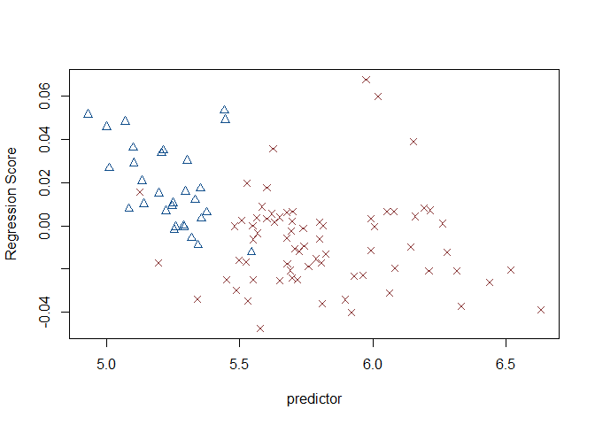

Geometric morphometric analysis of Gahagan bifaces
================
Robert Z. Selden, Jr.
November 10, 2019

### Introduction

This document includes supplemental materials for the article, “Shape
difference or shape change? Inter-regional variation in Gahagan biface
morphology.” The study represents the first formal morphological
analysis to assess inter-regional variability in Gahagan biface shape.
This effort follows a recent 2D analysis of Gahagan biface shapes within
the southern Caddo area (Selden Jr., Dockall, and Shafer 2018), where
Gahgagan bifaces were found to differ in shape across the same geography
as the Smithport Plain and Hickory Engraved bottles (Selden Jr. 2018a,
2018b, 2019a, 2019b). The analysis builds upon previous discussions and
analyses conducted by Shafer (1973, 1974, 2006). A succinct overview of
the analytical procedures used in the analysis is provided in the
manuscript, and the analytical code provided in this document can be
used to reproduce the results exactly.

### Load geomorph and data

``` r
# load geomorph
devtools::install_github("geomorphR/geomorph", ref = "Stable", build_vignettes = TRUE)
```

    ## Skipping install of 'geomorph' from a github remote, the SHA1 (e423f85f) has not changed since last install.
    ##   Use `force = TRUE` to force installation

``` r
library(geomorph)
```

    ## Loading required package: RRPP

    ## Loading required package: rgl

``` r
# set working directory
setwd(getwd())
source('readmulti.csv.r')

# read .csv files
setwd("./data")
filelist <- list.files(pattern = ".csv")
coords<-readmulti.csv(filelist)
setwd("../")

# read qualitative data
qdata<-read.csv("qdata.csv",header=TRUE, row.names=1)
qdata<-qdata[match(dimnames(coords)[[3]],rownames(qdata)),]
```

### Generalised Procrustes Analysis

Landmark data were aligned to a global coordinate system (Kendall 1981,
1984; Slice 2001), achieved through generalised Procrustes
superimposition (Rohlf and Slice 1990) performed in R 3.6.1 (R Core
Development Team, 2019) using the `geomorph` library v.3.1.2 (Adams et
al. 2017; Adams and Otárola-Castillo 2013). Procrustes superimposition
translates, scales, and rotates the coordinate data to allow for
comparisons among objects (Gower 1975; Rohlf and Slice 1990). The
`geomorph` package uses a partial Procrustes superimposition that
projects the aligned specimens into tangent space subsequent to
alignment in preparation for the use of multivariate methods that assume
linear space (Rohlf 1999; Slice 2001).

``` r
Y.gpa<-gpagen(coords, PrinAxes = TRUE)
```

    ## 
      |                                                                       
      |                                                                 |   0%
      |                                                                       
      |=============                                                    |  20%
      |                                                                       
      |==========================                                       |  40%
      |                                                                       
      |=================================================================| 100%

``` r
plot(Y.gpa)
# quantify global integration relative to self-similarity (Bookstein 2015)
globalIntegration(Y.gpa$coords)
```

<!-- -->

    ##     BEval 
    ## -1.351556

``` r
# geomorph data frame
gdf<-geomorph.data.frame(shape=Y.gpa$coords, size=Y.gpa$Csize, region=qdata$region) 
csz<-Y.gpa$Csize # attribute for boxplot
rgn<-qdata$region # attribute for boxplot
# boxplot of central Texas and southern Caddo area Gahagan bifaces by centroid size
boxplot(csz~rgn, 
        main = "Centroid size of Gahagan bifaces by Region",
        names = c("Central Texas", "Southern Caddo Area"),
        xlab = "Region",
        ylab = "Centroid Size",
        col = c("dodgerblue4","indianred4")
        )
```

<!-- -->

``` r
# plot consensus configuration in 2D to illustrate axial twisting
par(mfrow=c(1,3))
plot(Y.gpa$consensus[,c("Y", "X")], pch=20)
plot(Y.gpa$consensus[,c("Z", "X")], pch=20)
plot(Y.gpa$consensus[,c("Z", "Y")], pch=20)
```

<!-- -->

``` r
# 3D GPA plot
knitr::include_graphics('images/gpa3d.png')
```

<!-- -->

``` r
fig.cap="Results of generalized Procrustes analysis."
```

### Principal Components Analysis

Principal components analysis (Jolliffe 2002) was used to visualise
shape variation among the bifaces. The shape changes described by each
principal axis are commonly visualised using thin-plate spline warping
of a reference 3D mesh (Klingenberg 2013; Sherratt et al. 2014).

``` r
# principal components analysis
PCA<-gm.prcomp(Y.gpa$coords)
summary(PCA)
```

    ## Importance of components: 
    ##                                PC1          PC2          PC3          PC4
    ## Eigenvalues            0.003459832 0.0008092546 0.0003588307 0.0002251832
    ## Proportion of variance 0.624048483 0.1459649067 0.0647221354 0.0406162009
    ## Cumulative Proportion  0.624048483 0.7700133893 0.8347355248 0.8753517256
    ##                                 PC5          PC6          PC7          PC8
    ## Eigenvalues            0.0002018964 9.740935e-05 8.436459e-05 0.0000506557
    ## Proportion of variance 0.0364159693 1.756968e-02 1.521681e-02 0.0091367473
    ## Cumulative Proportion  0.9117676950 9.293374e-01 9.445542e-01 0.9536909315
    ##                                 PC9         PC10         PC11         PC12
    ## Eigenvalues            4.350553e-05 0.0000267654 2.258164e-05 1.897898e-05
    ## Proportion of variance 7.847074e-03 0.0048276635 4.073041e-03 3.423231e-03
    ## Cumulative Proportion  9.615380e-01 0.9663656691 9.704387e-01 9.738619e-01
    ##                                PC13         PC14         PC15         PC16
    ## Eigenvalues            1.554446e-05 1.108359e-05 1.043494e-05 8.883027e-06
    ## Proportion of variance 2.803747e-03 1.999142e-03 1.882145e-03 1.602228e-03
    ## Cumulative Proportion  9.766657e-01 9.786648e-01 9.805470e-01 9.821492e-01
    ##                                PC17         PC18         PC19         PC20
    ## Eigenvalues            8.634231e-06 7.369398e-06 6.364904e-06 5.365481e-06
    ## Proportion of variance 1.557353e-03 1.329215e-03 1.148035e-03 9.677696e-04
    ## Cumulative Proportion  9.837066e-01 9.850358e-01 9.861838e-01 9.871516e-01
    ##                                PC21         PC22         PC23         PC24
    ## Eigenvalues            4.673048e-06 4.061830e-06 3.818704e-06 3.616101e-06
    ## Proportion of variance 8.428757e-04 7.326305e-04 6.887780e-04 6.522345e-04
    ## Cumulative Proportion  9.879945e-01 9.887271e-01 9.894159e-01 9.900681e-01
    ##                                PC25         PC26         PC27         PC28
    ## Eigenvalues            3.464402e-06 3.243469e-06 2.938423e-06 0.0000028283
    ## Proportion of variance 6.248727e-04 5.850231e-04 5.300021e-04 0.0005101393
    ## Cumulative Proportion  9.906930e-01 9.912780e-01 9.918080e-01 0.9923181324
    ##                                PC29         PC30         PC31         PC32
    ## Eigenvalues            2.525675e-06 2.318140e-06 2.201648e-06 2.066343e-06
    ## Proportion of variance 4.555548e-04 4.181219e-04 3.971102e-04 3.727054e-04
    ## Cumulative Proportion  9.927737e-01 9.931918e-01 9.935889e-01 9.939616e-01
    ##                                PC33         PC34         PC35         PC36
    ## Eigenvalues            1.939543e-06 1.901621e-06 1.816148e-06 1.746961e-06
    ## Proportion of variance 3.498345e-04 3.429945e-04 3.275779e-04 3.150986e-04
    ## Cumulative Proportion  9.943115e-01 9.946545e-01 9.949820e-01 9.952971e-01
    ##                                PC37         PC38         PC39         PC40
    ## Eigenvalues            1.603176e-06 1.527629e-06 1.410216e-06 1.313134e-06
    ## Proportion of variance 2.891642e-04 2.755379e-04 2.543600e-04 2.368494e-04
    ## Cumulative Proportion  9.955863e-01 9.958618e-01 9.961162e-01 9.963530e-01
    ##                                PC41         PC42         PC43         PC44
    ## Eigenvalues            1.205970e-06 1.145889e-06 1.094980e-06 9.647817e-07
    ## Proportion of variance 2.175204e-04 2.066835e-04 1.975010e-04 1.740173e-04
    ## Cumulative Proportion  9.965706e-01 9.967772e-01 9.969747e-01 9.971488e-01
    ##                                PC45         PC46         PC47         PC48
    ## Eigenvalues            9.388751e-07 9.058322e-07 8.453288e-07 8.229607e-07
    ## Proportion of variance 1.693445e-04 1.633846e-04 1.524716e-04 1.484371e-04
    ## Cumulative Proportion  9.973181e-01 9.974815e-01 9.976340e-01 9.977824e-01
    ##                                PC49         PC50         PC51         PC52
    ## Eigenvalues            7.532977e-07 7.352858e-07 6.969416e-07 6.662683e-07
    ## Proportion of variance 1.358720e-04 1.326232e-04 1.257071e-04 1.201745e-04
    ## Cumulative Proportion  9.979183e-01 9.980509e-01 9.981766e-01 9.982968e-01
    ##                                PC53         PC54         PC55         PC56
    ## Eigenvalues            6.383485e-07 5.855815e-07 5.384309e-07 5.071643e-07
    ## Proportion of variance 1.151386e-04 1.056211e-04 9.711656e-05 9.147701e-05
    ## Cumulative Proportion  9.984119e-01 9.985175e-01 9.986147e-01 9.987061e-01
    ##                                PC57         PC58         PC59         PC60
    ## Eigenvalues            4.774383e-07 4.537078e-07 4.146245e-07 4.066680e-07
    ## Proportion of variance 8.611534e-05 8.183508e-05 7.478565e-05 7.335053e-05
    ## Cumulative Proportion  9.987922e-01 9.988741e-01 9.989489e-01 9.990222e-01
    ##                                PC61         PC62         PC63         PC64
    ## Eigenvalues            3.739974e-07 3.560931e-07 3.442446e-07 3.202318e-07
    ## Proportion of variance 6.745776e-05 6.422837e-05 6.209125e-05 5.776007e-05
    ## Cumulative Proportion  9.990897e-01 9.991539e-01 9.992160e-01 9.992738e-01
    ##                                PC65         PC66         PC67         PC68
    ## Eigenvalues            2.884623e-07 2.817361e-07 2.676726e-07 2.482388e-07
    ## Proportion of variance 5.202983e-05 5.081662e-05 4.827999e-05 4.477472e-05
    ## Cumulative Proportion  9.993258e-01 9.993766e-01 9.994249e-01 9.994697e-01
    ##                                PC69         PC70         PC71         PC72
    ## Eigenvalues            2.307495e-07 2.090655e-07 2.034200e-07 1.934740e-07
    ## Proportion of variance 4.162019e-05 3.770906e-05 3.669078e-05 3.489682e-05
    ## Cumulative Proportion  9.995113e-01 9.995490e-01 9.995857e-01 9.996206e-01
    ##                                PC73         PC74         PC75         PC76
    ## Eigenvalues            1.783069e-07 1.623266e-07 1.545736e-07 1.479293e-07
    ## Proportion of variance 3.216114e-05 2.927878e-05 2.788037e-05 2.668194e-05
    ## Cumulative Proportion  9.996527e-01 9.996820e-01 9.997099e-01 9.997366e-01
    ##                                PC77         PC78         PC79         PC80
    ## Eigenvalues            1.403256e-07 1.268296e-07 1.162573e-07 1.017584e-07
    ## Proportion of variance 2.531047e-05 2.287620e-05 2.096927e-05 1.835412e-05
    ## Cumulative Proportion  9.997619e-01 9.997848e-01 9.998057e-01 9.998241e-01
    ##                                PC81         PC82         PC83         PC84
    ## Eigenvalues            9.465221e-08 9.126899e-08 8.708955e-08 7.896487e-08
    ## Proportion of variance 1.707238e-05 1.646215e-05 1.570831e-05 1.424286e-05
    ## Cumulative Proportion  9.998412e-01 9.998576e-01 9.998733e-01 9.998876e-01
    ##                                PC85         PC86         PC87         PC88
    ## Eigenvalues            7.780539e-08 7.182700e-08 6.205389e-08 6.103627e-08
    ## Proportion of variance 1.403373e-05 1.295541e-05 1.119263e-05 1.100909e-05
    ## Cumulative Proportion  9.999016e-01 9.999146e-01 9.999258e-01 9.999368e-01
    ##                                PC89         PC90         PC91         PC92
    ## Eigenvalues            5.425614e-08 4.765055e-08 4.109383e-08 3.900791e-08
    ## Proportion of variance 9.786157e-06 8.594709e-06 7.412077e-06 7.035840e-06
    ## Cumulative Proportion  9.999465e-01 9.999551e-01 9.999626e-01 9.999696e-01
    ##                                PC93         PC94         PC95         PC96
    ## Eigenvalues            3.513379e-08 2.632100e-08 2.420320e-08 2.302518e-08
    ## Proportion of variance 6.337067e-06 4.747508e-06 4.365521e-06 4.153041e-06
    ## Cumulative Proportion  9.999759e-01 9.999807e-01 9.999850e-01 9.999892e-01
    ##                                PC97         PC98         PC99        PC100
    ## Eigenvalues            2.004967e-08 1.567116e-08 1.309475e-08 1.109083e-08
    ## Proportion of variance 3.616351e-06 2.826600e-06 2.361894e-06 2.000448e-06
    ## Cumulative Proportion  9.999928e-01 9.999956e-01 9.999980e-01 1.000000e+00

``` r
# set plot parameters
colors <- c("dodgerblue4","indianred4") # baseball colors, naturally
colors <- colors[as.numeric(qdata$region)]
shapes <- c(2,4) # open triangle (ctx) and X (sca)
shapes <- shapes[as.numeric(qdata$region)]
# plotPCA
PCAplot<-plot(PCA, col = colors, pch = shapes)
```

<!-- -->

``` r
knitr::include_graphics('images/pca-warp-ref.png')
```

<!-- -->

``` r
fig.cap="Results of PCA with central Texas sample in blue triangles, and southern Caddo area in red X's. Reference shapes include the consensus configuration (gray) and the shape at the extreme of each PC in black. Reference shapes do not articulate with any specimens used in this analysis."
```

### Define models

A residual randomisation permutation procedure (RRPP; n = 10,000
permutations) was used for all Procrustes ANOVAs (Adams and Collyer
2015; Collyer and Adams 2018), which has higher statistical power and a
greater ability to identify patterns in the data should they be present
(Anderson and Ter Braak 2003). To assess whether shape changes with size
(allometry), and differs by group (region), Procrustes ANOVAs (Goodall
1991) were run that enlist effect-sizes (z-scores) computed as standard
deviates of the generated sampling distributions (Collyer, Sekora, and
Adams 2015).

``` r
# define models
fit.size<-procD.lm(shape ~ size, data = gdf, print.progress = FALSE, iter = 9999)
fit.region<-procD.lm(shape ~ region, data = gdf, print.progress = FALSE, iter = 9999)
fit.unique<-procD.lm(shape ~ size * region, data = gdf, print.progress = FALSE, iter = 9999)
```

### Allometry

``` r
# allometry: does shape change with size?  
anova(fit.size)
```

    ## 
    ## Analysis of Variance, using Residual Randomization
    ## Permutation procedure: Randomization of null model residuals 
    ## Number of permutations: 10000 
    ## Estimation method: Ordinary Least Squares 
    ## Sums of Squares and Cross-products: Type I 
    ## Effect sizes (Z) based on F distributions
    ## 
    ##            Df      SS       MS     Rsq     F      Z Pr(>F)    
    ## size        1 0.04176 0.041758 0.07532 8.064 3.0553  6e-04 ***
    ## Residuals  99 0.51266 0.005178 0.92468                        
    ## Total     100 0.55442                                         
    ## ---
    ## Signif. codes:  0 '***' 0.001 '**' 0.01 '*' 0.05 '.' 0.1 ' ' 1
    ## 
    ## Call: procD.lm(f1 = shape ~ size, iter = 9999, data = gdf, print.progress = FALSE)

``` r
plot(fit.size, type = "regression", reg.type = "RegScore", predictor = log(gdf$size), pch = shapes, col = colors)
```

<!-- -->

``` r
    # common allometric component (Mitteroecker 2004)
plotAllometry(fit.size, size = gdf$size, logsz = TRUE, method = "CAC", pch = shapes, col = colors)
```

<!-- -->

``` r
    # size-shape PCA (Mitteroecker 2004)
plotAllometry(fit.region, size = gdf$size, logsz = TRUE, method = "size.shape", pch = shapes, col = colors)
```

<!-- -->

``` r
    # do Gahagan biface forms from different regions express parallel, convergent, or divergent morphological characteristics?
test<-plotAllometry(fit.unique, size = gdf$size, logsz = TRUE, method = "PredLine", pch = shapes, col = colors)
```

<!-- -->

### Shape \~ Region?

``` r
# ANOVA: do Gahagan biface shapes differ by region?
anova(fit.region)
```

    ## 
    ## Analysis of Variance, using Residual Randomization
    ## Permutation procedure: Randomization of null model residuals 
    ## Number of permutations: 10000 
    ## Estimation method: Ordinary Least Squares 
    ## Sums of Squares and Cross-products: Type I 
    ## Effect sizes (Z) based on F distributions
    ## 
    ##            Df      SS       MS     Rsq      F      Z Pr(>F)    
    ## region      1 0.07659 0.076591 0.13815 15.869 3.8881  1e-04 ***
    ## Residuals  99 0.47783 0.004827 0.86185                         
    ## Total     100 0.55442                                          
    ## ---
    ## Signif. codes:  0 '***' 0.001 '**' 0.01 '*' 0.05 '.' 0.1 ' ' 1
    ## 
    ## Call: procD.lm(f1 = shape ~ region, iter = 9999, data = gdf, print.progress = FALSE)

### Morphological disparity

``` r
# morphological disparity: do either of the groups display greater shape variation among individuals relative to the other group?
morphol.disparity(fit.region, groups = qdata$region, data = gdf, iter = 9999)
```

    ## 
    ## 
    ## Performimg pairwise comparisons of disparity
    ## 
      |                                                                       
      |                                                                 |   0%
      |                                                                       
      |                                                                 |   1%
      |                                                                       
      |=                                                                |   1%
      |                                                                       
      |=                                                                |   2%
      |                                                                       
      |==                                                               |   2%
      |                                                                       
      |==                                                               |   3%
      |                                                                       
      |==                                                               |   4%
      |                                                                       
      |===                                                              |   4%
      |                                                                       
      |===                                                              |   5%
      |                                                                       
      |====                                                             |   5%
      |                                                                       
      |====                                                             |   6%
      |                                                                       
      |====                                                             |   7%
      |                                                                       
      |=====                                                            |   7%
      |                                                                       
      |=====                                                            |   8%
      |                                                                       
      |======                                                           |   8%
      |                                                                       
      |======                                                           |   9%
      |                                                                       
      |======                                                           |  10%
      |                                                                       
      |=======                                                          |  10%
      |                                                                       
      |=======                                                          |  11%
      |                                                                       
      |=======                                                          |  12%
      |                                                                       
      |========                                                         |  12%
      |                                                                       
      |========                                                         |  13%
      |                                                                       
      |=========                                                        |  13%
      |                                                                       
      |=========                                                        |  14%
      |                                                                       
      |=========                                                        |  15%
      |                                                                       
      |==========                                                       |  15%
      |                                                                       
      |==========                                                       |  16%
      |                                                                       
      |===========                                                      |  16%
      |                                                                       
      |===========                                                      |  17%
      |                                                                       
      |===========                                                      |  18%
      |                                                                       
      |============                                                     |  18%
      |                                                                       
      |============                                                     |  19%
      |                                                                       
      |=============                                                    |  19%
      |                                                                       
      |=============                                                    |  20%
      |                                                                       
      |=============                                                    |  21%
      |                                                                       
      |==============                                                   |  21%
      |                                                                       
      |==============                                                   |  22%
      |                                                                       
      |===============                                                  |  22%
      |                                                                       
      |===============                                                  |  23%
      |                                                                       
      |===============                                                  |  24%
      |                                                                       
      |================                                                 |  24%
      |                                                                       
      |================                                                 |  25%
      |                                                                       
      |=================                                                |  25%
      |                                                                       
      |=================                                                |  26%
      |                                                                       
      |=================                                                |  27%
      |                                                                       
      |==================                                               |  27%
      |                                                                       
      |==================                                               |  28%
      |                                                                       
      |===================                                              |  28%
      |                                                                       
      |===================                                              |  29%
      |                                                                       
      |===================                                              |  30%
      |                                                                       
      |====================                                             |  30%
      |                                                                       
      |====================                                             |  31%
      |                                                                       
      |====================                                             |  32%
      |                                                                       
      |=====================                                            |  32%
      |                                                                       
      |=====================                                            |  33%
      |                                                                       
      |======================                                           |  33%
      |                                                                       
      |======================                                           |  34%
      |                                                                       
      |======================                                           |  35%
      |                                                                       
      |=======================                                          |  35%
      |                                                                       
      |=======================                                          |  36%
      |                                                                       
      |========================                                         |  36%
      |                                                                       
      |========================                                         |  37%
      |                                                                       
      |========================                                         |  38%
      |                                                                       
      |=========================                                        |  38%
      |                                                                       
      |=========================                                        |  39%
      |                                                                       
      |==========================                                       |  39%
      |                                                                       
      |==========================                                       |  40%
      |                                                                       
      |==========================                                       |  41%
      |                                                                       
      |===========================                                      |  41%
      |                                                                       
      |===========================                                      |  42%
      |                                                                       
      |============================                                     |  42%
      |                                                                       
      |============================                                     |  43%
      |                                                                       
      |============================                                     |  44%
      |                                                                       
      |=============================                                    |  44%
      |                                                                       
      |=============================                                    |  45%
      |                                                                       
      |==============================                                   |  45%
      |                                                                       
      |==============================                                   |  46%
      |                                                                       
      |==============================                                   |  47%
      |                                                                       
      |===============================                                  |  47%
      |                                                                       
      |===============================                                  |  48%
      |                                                                       
      |================================                                 |  48%
      |                                                                       
      |================================                                 |  49%
      |                                                                       
      |================================                                 |  50%
      |                                                                       
      |=================================                                |  50%
      |                                                                       
      |=================================                                |  51%
      |                                                                       
      |=================================                                |  52%
      |                                                                       
      |==================================                               |  52%
      |                                                                       
      |==================================                               |  53%
      |                                                                       
      |===================================                              |  53%
      |                                                                       
      |===================================                              |  54%
      |                                                                       
      |===================================                              |  55%
      |                                                                       
      |====================================                             |  55%
      |                                                                       
      |====================================                             |  56%
      |                                                                       
      |=====================================                            |  56%
      |                                                                       
      |=====================================                            |  57%
      |                                                                       
      |=====================================                            |  58%
      |                                                                       
      |======================================                           |  58%
      |                                                                       
      |======================================                           |  59%
      |                                                                       
      |=======================================                          |  59%
      |                                                                       
      |=======================================                          |  60%
      |                                                                       
      |=======================================                          |  61%
      |                                                                       
      |========================================                         |  61%
      |                                                                       
      |========================================                         |  62%
      |                                                                       
      |=========================================                        |  62%
      |                                                                       
      |=========================================                        |  63%
      |                                                                       
      |=========================================                        |  64%
      |                                                                       
      |==========================================                       |  64%
      |                                                                       
      |==========================================                       |  65%
      |                                                                       
      |===========================================                      |  65%
      |                                                                       
      |===========================================                      |  66%
      |                                                                       
      |===========================================                      |  67%
      |                                                                       
      |============================================                     |  67%
      |                                                                       
      |============================================                     |  68%
      |                                                                       
      |=============================================                    |  68%
      |                                                                       
      |=============================================                    |  69%
      |                                                                       
      |=============================================                    |  70%
      |                                                                       
      |==============================================                   |  70%
      |                                                                       
      |==============================================                   |  71%
      |                                                                       
      |==============================================                   |  72%
      |                                                                       
      |===============================================                  |  72%
      |                                                                       
      |===============================================                  |  73%
      |                                                                       
      |================================================                 |  73%
      |                                                                       
      |================================================                 |  74%
      |                                                                       
      |================================================                 |  75%
      |                                                                       
      |=================================================                |  75%
      |                                                                       
      |=================================================                |  76%
      |                                                                       
      |==================================================               |  76%
      |                                                                       
      |==================================================               |  77%
      |                                                                       
      |==================================================               |  78%
      |                                                                       
      |===================================================              |  78%
      |                                                                       
      |===================================================              |  79%
      |                                                                       
      |====================================================             |  79%
      |                                                                       
      |====================================================             |  80%
      |                                                                       
      |====================================================             |  81%
      |                                                                       
      |=====================================================            |  81%
      |                                                                       
      |=====================================================            |  82%
      |                                                                       
      |======================================================           |  82%
      |                                                                       
      |======================================================           |  83%
      |                                                                       
      |======================================================           |  84%
      |                                                                       
      |=======================================================          |  84%
      |                                                                       
      |=======================================================          |  85%
      |                                                                       
      |========================================================         |  85%
      |                                                                       
      |========================================================         |  86%
      |                                                                       
      |========================================================         |  87%
      |                                                                       
      |=========================================================        |  87%
      |                                                                       
      |=========================================================        |  88%
      |                                                                       
      |==========================================================       |  88%
      |                                                                       
      |==========================================================       |  89%
      |                                                                       
      |==========================================================       |  90%
      |                                                                       
      |===========================================================      |  90%
      |                                                                       
      |===========================================================      |  91%
      |                                                                       
      |===========================================================      |  92%
      |                                                                       
      |============================================================     |  92%
      |                                                                       
      |============================================================     |  93%
      |                                                                       
      |=============================================================    |  93%
      |                                                                       
      |=============================================================    |  94%
      |                                                                       
      |=============================================================    |  95%
      |                                                                       
      |==============================================================   |  95%
      |                                                                       
      |==============================================================   |  96%
      |                                                                       
      |===============================================================  |  96%
      |                                                                       
      |===============================================================  |  97%
      |                                                                       
      |===============================================================  |  98%
      |                                                                       
      |================================================================ |  98%
      |                                                                       
      |================================================================ |  99%
      |                                                                       
      |=================================================================|  99%
      |                                                                       
      |=================================================================| 100%

    ## 
    ## Call:
    ## morphol.disparity(f1 = fit.region, groups = qdata$region, iter = 9999,  
    ##     data = gdf) 
    ## 
    ## 
    ## 
    ## Randomized Residual Permutation Procedure Used
    ## 10000 Permutations
    ## 
    ## Procrustes variances for defined groups
    ##         CTX         SCA 
    ## 0.005044039 0.004598662 
    ## 
    ## 
    ## Pairwise absolute differences between variances
    ##              CTX          SCA
    ## CTX 0.0000000000 0.0004453779
    ## SCA 0.0004453779 0.0000000000
    ## 
    ## 
    ## P-Values
    ##        CTX    SCA
    ## CTX 1.0000 0.7196
    ## SCA 0.7196 1.0000

### References cited

<div id="refs" class="references">

<div id="ref-RN1655">

Adams, Dean C., and Michael L. Collyer. 2015. “Permutation Tests for
Phylogenetic Comparative Analyses of High-Dimensional Shape Data: What
you Shuffle Matters.” *Evolution* 69 (3): 823–9.
<https://doi.org/10.1111/evo.12596>.

</div>

<div id="ref-RN11530">

Adams, Dean C., Michael L. Collyer, Antigoni Kaliontzopoulou, and Emma
Sherratt. 2017. “Package ’geomorph’: Geometric Morphometric Analyses of
2D/3D Landmark Data. R package version 3.0.5.”
<http://geomorphr.github.io/geomorph/>.

</div>

<div id="ref-RN1774">

Adams, Dean C., and Erik Otárola-Castillo. 2013. “geomorph: An R Package
for the Collection and Analysis of Geometric Morphometric Shape Data.”
*Methods in Ecology and Evolution* 4 (4): 393–99.
<https://doi.org/10.1111/2041-210x.12035>.

</div>

<div id="ref-RN1719">

Anderson, M. J., and C. J. F. Ter Braak. 2003. “Permutation Tests for
Multi-Factoral Analysis of Variance.” *Journal of Statistical
Computation and Simulation* 73 (2): 85–113.
<https://doi.org/10.1080=0094965021000015558>.

</div>

<div id="ref-RN11775">

Collyer, Michael L., and Dean C. Adams. 2018. “RRPP: An R Package for
Fitting Linear Models to High-Dimensional Data using Residual
Randomization.” *Methods in Ecology and Evolution* 9 (7): 1772–9.
<https://doi.org/https://doi.org/10.1111/2041-210X.13029>.

</div>

<div id="ref-RN1756">

Collyer, M. L., D. J. Sekora, and D. C. Adams. 2015. “A Method for
Analysis of Phenotypic Change for Phenotypes Described by
High-Dimensional Data.” *Heredity* 115 (4): 357–65.
<https://doi.org/10.1038/hdy.2014.75>.

</div>

<div id="ref-RN1749">

Goodall, Colin. 1991. “Procrustes Methods in the Statistical Analysis of
Shape.” *Journal of the Royal Statistical Society. Series B
(Methodological)* 53 (2): 285–339.

</div>

<div id="ref-RN11564">

Gower, J. C. 1975. “Generalized Procrustes Analysis.” *Psychometrika* 40
(1): 33–51. <https://doi.org/https://doi.org/10.1007/BF02291478>.

</div>

<div id="ref-RN1746">

Jolliffe, Ian T. 2002. *Principal Component Analysis*. New York:
Springer.

</div>

<div id="ref-RN11622">

Kendall, David G. 1981. “The Statistics of Shape.” In *Interpreting
Multivariate Data*, edited by V. Barnett, 75–80. New York: Wiley.

</div>

<div id="ref-RN11623">

———. 1984. “Shape Manifolds, Procrustean Metrics, and Complex Projective
Spaces.” *Bulletin of the London Mathematical Society* 16 (2): 81–121.
<https://doi.org/10.1112/blms/16.2.81>.

</div>

<div id="ref-RN1731">

Klingenberg, Christian Peter. 2013. “Visualizations in Geometric
Morphometrics: How to Read and How to Make Graphs Showing Shape
Changes.” *Hystrix* 24 (1): 15–24.
<https://doi.org/http://dx.doi.org/10.4404/hystrix-24.1-7691>.

</div>

<div id="ref-R">

R Core Development Team, 2019. *R: A Language and Environment for
Statistical Computing*. Vienna, Austria: R Foundation for Statistical
Computing. <http://www.R-project.org/>.

</div>

<div id="ref-RN1646">

Rohlf, F. James. 1999. “Shape Statistics: Procrustes Superimpositions
and Tangent Spaces.” *Journal of Classification* 16 (2): 197–223.
<https://doi.org/10.1007/s003579900054>.

</div>

<div id="ref-RN478">

Rohlf, F. James, and Dennis Slice. 1990. “Extensions of the Procrustes
Method for the Optimal Superimposition of Landmarks.” *Systematic
Zoology* 39 (1): 40–59. <https://doi.org/10.2307/2992207>.

</div>

<div id="ref-RN11801">

Selden Jr., Robert Z. 2018a. “A Preliminary Study of Smithport Plain
Bottle Morphology in the Southern Caddo Area.” *Bulletin of the Texas
Archeological Society* 89: 63–89.

</div>

<div id="ref-RN11782">

———. 2018b. “Ceramic Morphological Organisation in the Southern Caddo
Area: Quiddity of Shape for Hickory Engraved Bottles.” *Journal of
Archaeological Science: Reports* 21: 884–96.
<https://doi.org/10.1016/j.jasrep.2018.08.045>.

</div>

<div id="ref-RN11716">

———. 2019a. “Ceramic Morphological Organisation in the Southern Caddo
Area: The Clarence H. Webb Collections.” *Journal of Cultural Heritage*
35: 41–55.
<https://doi.org/https://doi.org/10.1016/j.culher.2018.07.002>.

</div>

<div id="ref-RN20852">

———. 2019b. “Louisiana Limitrophe: An Iterative Morphological Exegesis
of Caddo Bottle and Biface Production.” *SocArXiv*.
<https://doi.org/10.31235/osf.io/rpnd5>.

</div>

<div id="ref-RN11783">

Selden Jr., Robert Z., John E. Dockall, and Harry J. Shafer. 2018.
“Lithic Morphological Organisation: Gahagan Bifaces from the Southern
Caddo Area.” *Digital Applications in Archaeology and Cultural Heritage*
10: e00080. <https://doi.org/10.1016/j.daach.2018.e00080>.

</div>

<div id="ref-RN3684">

Shafer, Harry J. 1973. “Lithic Technology at the George C. Davis Site,
Cherokee County, Texas.” Unpublished Ph.D. Dissertation, The University
of Texas at Austin.

</div>

<div id="ref-RN20701">

———. 1974. “Lithic Reduction Strategies at the George C. Davis Site.”
*Louisiana Archaeology* 1: 66–74.
<https://docs.wixstatic.com/ugd/fefb33_71a3f0c39e5d47a2b55af09847e6d821.pdf>.

</div>

<div id="ref-RN4924">

———. 2006. “People of the Prairie: A Possible Connection to the Davis
Site Caddo.” Texas Department of Transportation; Prewitt & Associates,
Inc.

</div>

<div id="ref-RN479">

Sherratt, E., D. J. Gower, C. P. Klingenberg, and M. Wilkinson. 2014.
“Evolution of Cranial Shape in Caecilians (Amphibia: Gymnophiona).”
*Evolutionary Biology* 41 (4): 528–45.
<https://doi.org/https://doi.org/10.1007/s11692-014-9287-2>.

</div>

<div id="ref-RN11563">

Slice, Dennis E. 2001. “Landmark Coordinates Aligned by Procrustes
Analysis Do Not Lie in Kendall’s Shape Space.” *Systematic Biology* 50
(1): 141–49. <https://doi.org/10.1080/10635150119110>.

</div>

</div>
