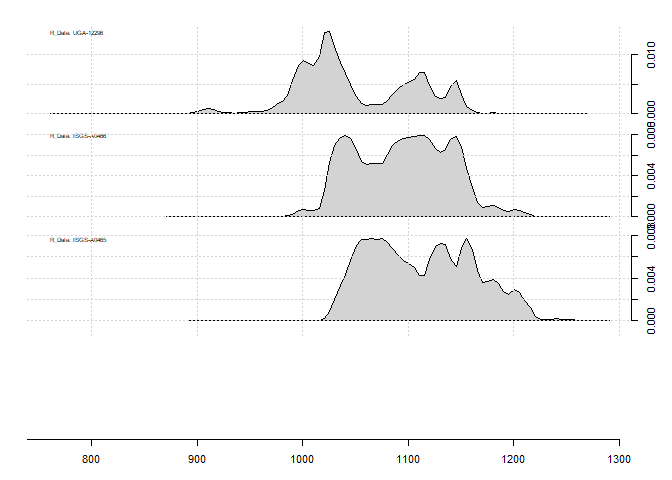
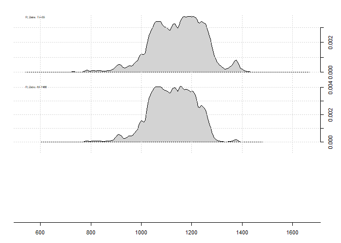
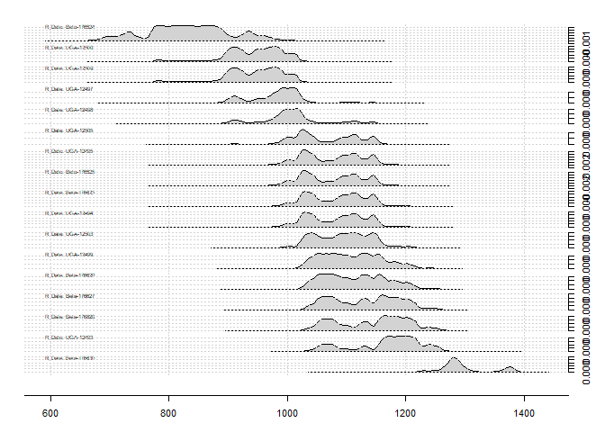
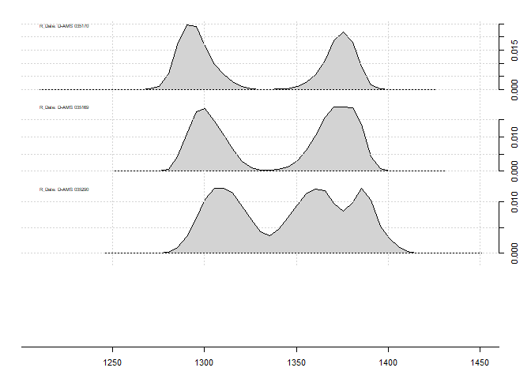
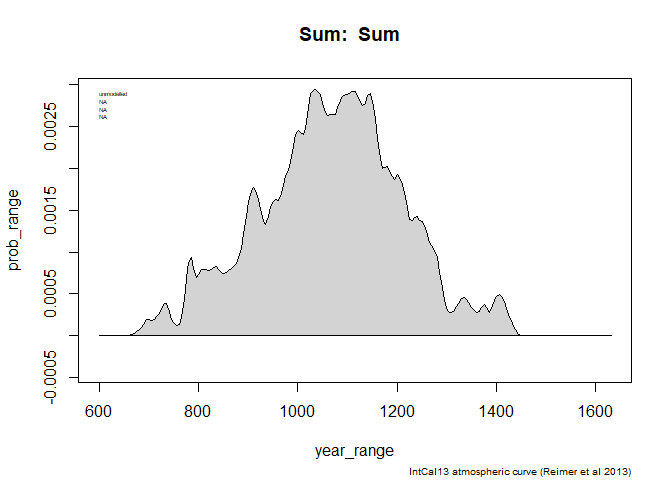
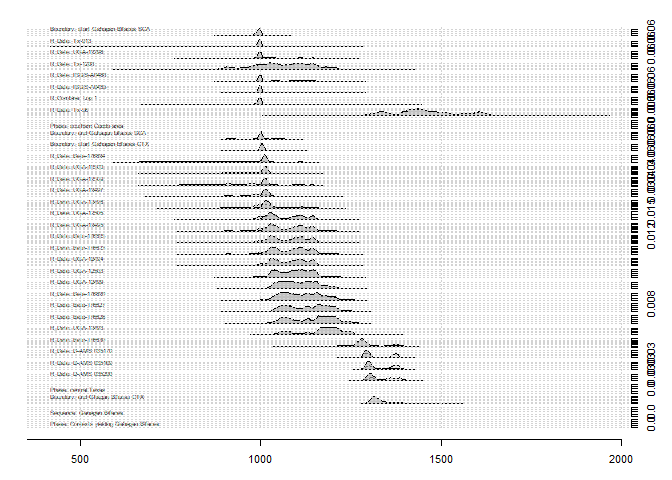
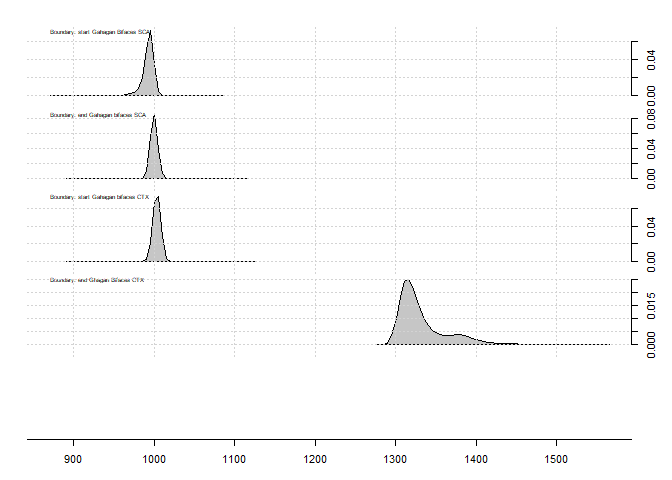
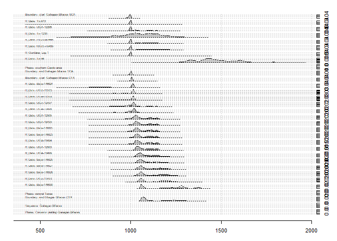
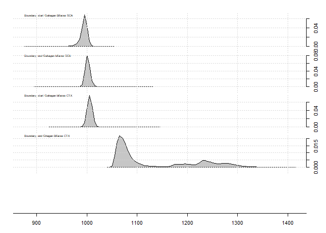

Temporal dynamics of Gahagan bifaces
================
Robert Z. Selden, Jr.
February 10, 2020

## Loading the oxcAAR package

This document includes supplemental materials for paper: “A quantitative
assessment of intraspecific morphological variation in Gahagan bifaces.”
Further information regarding the radiocarbon dates discussed below can
be found in the text of the article, and those references cited below.

``` r
if(!require('devtools')) install.packages('devtools')
```

    ## Loading required package: devtools

    ## Loading required package: usethis

``` r
library(devtools)
install_github('ISAAKiel/oxcAAR')
```

    ## Downloading GitHub repo ISAAKiel/oxcAAR@master

    ## 
    ##          checking for file 'C:\Users\seldenjrz\AppData\Local\Temp\Rtmp82OfSW\remotes32c82bec2428\ISAAKiel-oxcAAR-ab94508/DESCRIPTION' ...  v  checking for file 'C:\Users\seldenjrz\AppData\Local\Temp\Rtmp82OfSW\remotes32c82bec2428\ISAAKiel-oxcAAR-ab94508/DESCRIPTION'
    ##       -  preparing 'oxcAAR':
    ##    checking DESCRIPTION meta-information ...     checking DESCRIPTION meta-information ...   v  checking DESCRIPTION meta-information
    ##       -  excluding invalid files
    ##    Subdirectory 'R' contains invalid file names:
    ##      'not_implemented_yet.txt'
    ##       -  checking for LF line-endings in source and make files and shell scripts
    ##       -  checking for empty or unneeded directories
    ##       -  building 'oxcAAR_1.0.0.tar.gz'
    ##      
    ## 

    ## Installing package into 'C:/Users/seldenjrz/Documents/R/win-library/3.6'
    ## (as 'lib' is unspecified)

``` r
# load oxcAAR and OxCal
library(oxcAAR)
quickSetupOxcal()
```

    ## Oxcal doesn't seem to be installed. Downloading it now:

    ## Oxcal download to C:\Users\seldenjrz\AppData\Local\Temp\Rtmp82OfSW successful!

    ## Oxcal path set!

    ## NULL

## Calibration

### Calibration and plots for dates from Burial Pit 2 at the Gahagan Mound site

Three AMS dates (UGA12296, ISGS A0465, and ISGS A0466) were reported
from Burial Pit 2 at the Gahagan Mound site. More information about
these dates can be found in the text, and those works cited within the
text of the manuscript.

``` r
gahagan<-data.frame(bp=c(1000,950,910),
                    std=c(40,40,35),
                    names=c("UGA-12296","ISGS-A0466","ISGS-A0465")
)
gahagancal<-oxcalCalibrate(gahagan$bp,gahagan$std,gahagan$names)
gahagancal
```

    ## List of 3 calibrated dates:
    ## 
    ## =============================
    ##  R_Date: UGA-12296
    ## =============================
    ## 
    ## 
    ## BP = 1000, std = 40
    ## 
    ## 
    ## unmodelled:                    posterior:
    ## 
    ## one sigma                      
    ## 989 AD - 1046 AD (51.2%)       
    ## 1096 AD - 1120 AD (14.4%)      
    ## 1142 AD - 1147 AD (2.6%)       
    ## 
    ## two sigma                      
    ## 975 AD - 1155 AD (95.4%)       
    ## 
    ## three sigma                    
    ## 894 AD - 930 AD (1.5%)         
    ## 938 AD - 1168 AD (98.2%)       
    ## 
    ## Calibrated with:
    ##    IntCal13 atmospheric curve (Reimer et al 2013) 
    ## 
    ## =============================
    ##  R_Date: ISGS-A0466
    ## =============================
    ## 
    ## 
    ## BP = 950, std = 40
    ## 
    ## 
    ## unmodelled:                    posterior:
    ## 
    ## one sigma                      
    ## 1028 AD - 1052 AD (17.1%)      
    ## 1082 AD - 1152 AD (51.1%)      
    ## 
    ## two sigma                      
    ## 1016 AD - 1184 AD (95.4%)      
    ## 
    ## three sigma                    
    ## 989 AD - 1215 AD (99.7%)       
    ## 
    ## Calibrated with:
    ##    IntCal13 atmospheric curve (Reimer et al 2013) 
    ## 
    ## =============================
    ##  R_Date: ISGS-A0465
    ## =============================
    ## 
    ## 
    ## BP = 910, std = 35
    ## 
    ## 
    ## unmodelled:                    posterior:
    ## 
    ## one sigma                      
    ## 1044 AD - 1103 AD (39.5%)      
    ## 1119 AD - 1164 AD (28.7%)      
    ## 
    ## two sigma                      
    ## 1032 AD - 1206 AD (95.4%)      
    ## 
    ## three sigma                    
    ## 1020 AD - 1225 AD (99.7%)      
    ## 
    ## Calibrated with:
    ##    IntCal13 atmospheric curve (Reimer et al 2013)

``` r
plot(gahagancal)
```

<!-- -->

``` r
calcurve_plot(gahagancal)
```

<!-- -->

### Calibration and plots for the dates from F119 and F134 at the George C. Davis site

Two dates (Tx-913 and Tx-1206) were reported from Features 119 and 134,
respectively. More information about these dates can be found in the
text, and those works cited within the text of the manuscript.

``` r
gcd<-data.frame(bp=c(1150,986),
                std=c(80,90),
                names=c("Tx-913","Tx-1206")
)
gcdcal<-oxcalCalibrate(gcd$bp,gcd$std,gcd$names)
gcdcal
```

    ## List of 2 calibrated dates:
    ## 
    ## =============================
    ##  R_Date: Tx-913
    ## =============================
    ## 
    ## 
    ## BP = 1150, std = 80
    ## 
    ## 
    ## unmodelled:                    posterior:
    ## 
    ## one sigma                      
    ## 777 AD - 794 AD (6%)           
    ## 801 AD - 970 AD (62.2%)        
    ## 
    ## two sigma                      
    ## 689 AD - 753 AD (9.8%)         
    ## 759 AD - 1020 AD (85.6%)       
    ## 
    ## three sigma                    
    ## 652 AD - 1052 AD (98.9%)       
    ## 1081 AD - 1152 AD (0.8%)       
    ## 
    ## Calibrated with:
    ##    IntCal13 atmospheric curve (Reimer et al 2013) 
    ## 
    ## =============================
    ##  R_Date: Tx-1206
    ## =============================
    ## 
    ## 
    ## BP = 986, std = 90
    ## 
    ## 
    ## unmodelled:                    posterior:
    ## 
    ## one sigma                      
    ## 978 AD - 1162 AD (68.2%)       
    ## 
    ## two sigma                      
    ## 879 AD - 1254 AD (95.4%)       
    ## 
    ## three sigma                    
    ## 722 AD - 740 AD (0.1%)         
    ## 767 AD - 1278 AD (99.6%)       
    ## 
    ## Calibrated with:
    ##    IntCal13 atmospheric curve (Reimer et al 2013)

``` r
plot(gcdcal)
```

<!-- -->

``` r
calcurve_plot(gcdcal)
```

<!-- -->

### Calibration and plots for dates from Burial Pit 5 at the Mounds Plantation site

Three dates (Tx-55, Tx-56, and M-1466) were reported from Burial Pit 5
at the Mounds Plantation site. More information about these dates can be
found in the text, and those works cited within the text of the
manuscript.

``` r
moundspl<-data.frame(bp=c(860,900),
                     std=c(120,100),
                     names=c("Tx-55","M-1466")
)
moundsplcal<-oxcalCalibrate(moundspl$bp,moundspl$std,moundspl$names)
moundsplcal
```

    ## List of 2 calibrated dates:
    ## 
    ## =============================
    ##  R_Date: Tx-55
    ## =============================
    ## 
    ## 
    ## BP = 860, std = 120
    ## 
    ## 
    ## unmodelled:                    posterior:
    ## 
    ## one sigma                      
    ## 1044 AD - 1104 AD (19.3%)      
    ## 1118 AD - 1262 AD (48.9%)      
    ## 
    ## two sigma                      
    ## 901 AD - 922 AD (1%)           
    ## 950 AD - 1316 AD (92.3%)       
    ## 1356 AD - 1389 AD (2.1%)       
    ## 
    ## three sigma                    
    ## 776 AD - 1415 AD (99.7%)       
    ## 
    ## Calibrated with:
    ##    IntCal13 atmospheric curve (Reimer et al 2013) 
    ## 
    ## =============================
    ##  R_Date: M-1466
    ## =============================
    ## 
    ## 
    ## BP = 900, std = 100
    ## 
    ## 
    ## unmodelled:                    posterior:
    ## 
    ## one sigma                      
    ## 1036 AD - 1214 AD (68.2%)      
    ## 
    ## two sigma                      
    ## 904 AD - 918 AD (0.7%)         
    ## 967 AD - 1284 AD (94.7%)       
    ## 
    ## three sigma                    
    ## 776 AD - 794 AD (0.1%)         
    ## 800 AD - 1316 AD (99.2%)       
    ## 1355 AD - 1390 AD (0.4%)       
    ## 
    ## Calibrated with:
    ##    IntCal13 atmospheric curve (Reimer et al 2013)

``` r
plot(moundsplcal)
```

<!-- -->

``` r
calcurve_plot(moundsplcal)
```

<!-- -->

### Calibration and plots for dates from AU2 at the J. B. White site

Seventeen dates (Beta-176624, UGA-12500, UGA-12509, UGA-12497,
UGA-12498, UGA-12505, UGA-12495, Beta-176625, Beta-176623, UGA-12494,
UGA-12503, UGA-12499, Beta-176620, Beta-176627, Beta-176628, UGA-12493,
Beta-176630) were reported from AU2 at the J. B. White site. More
information about these dates can be found in the text, and those works
cited within the text of the manuscript.

``` r
jbw<-data.frame(bp=c(1190,1090,1090,1050,1030,990,980,980,970,970,950,920,910,890,880,860,710),
                     std=c(50,40,40,40,40,40,40,40,40,40,40,40,40,40,40,40,40),
                     names=c("Beta-176624","UGA-12500","UGA-12509","UGA-12497","UGA-12498", "UGA-12505","UGA-12495","Beta-176625","Beta-176623","UGA-12494","UGA-12503","UGA-12499","Beta-176620","Beta-176627","Beta-176628","UGA-12493","Beta-176630")
)
jbwcal<-oxcalCalibrate(jbw$bp,jbw$std,jbw$names)
jbwcal
```

    ## List of 17 calibrated dates:
    ## 
    ## =============================
    ##  R_Date: Beta-176624
    ## =============================
    ## 
    ## 
    ## BP = 1190, std = 50
    ## 
    ## 
    ## unmodelled:                    posterior:
    ## 
    ## one sigma                      
    ## 770 AD - 894 AD (66.8%)        
    ## 933 AD - 937 AD (1.4%)         
    ## 
    ## two sigma                      
    ## 691 AD - 750 AD (11.9%)        
    ## 762 AD - 970 AD (83.5%)        
    ## 
    ## three sigma                    
    ## 668 AD - 993 AD (99.7%)        
    ## 
    ## Calibrated with:
    ##    IntCal13 atmospheric curve (Reimer et al 2013) 
    ## 
    ## =============================
    ##  R_Date: UGA-12500
    ## =============================
    ## 
    ## 
    ## BP = 1090, std = 40
    ## 
    ## 
    ## unmodelled:                    posterior:
    ## 
    ## one sigma                      
    ## 896 AD - 928 AD (25.6%)        
    ## 940 AD - 994 AD (42.6%)        
    ## 
    ## two sigma                      
    ## 780 AD - 788 AD (0.6%)         
    ## 876 AD - 1024 AD (94.8%)       
    ## 
    ## three sigma                    
    ## 776 AD - 1030 AD (99.7%)       
    ## 
    ## Calibrated with:
    ##    IntCal13 atmospheric curve (Reimer et al 2013) 
    ## 
    ## =============================
    ##  R_Date: UGA-12509
    ## =============================
    ## 
    ## 
    ## BP = 1090, std = 40
    ## 
    ## 
    ## unmodelled:                    posterior:
    ## 
    ## one sigma                      
    ## 896 AD - 928 AD (25.6%)        
    ## 940 AD - 994 AD (42.6%)        
    ## 
    ## two sigma                      
    ## 780 AD - 788 AD (0.6%)         
    ## 876 AD - 1024 AD (94.8%)       
    ## 
    ## three sigma                    
    ## 776 AD - 1030 AD (99.7%)       
    ## 
    ## Calibrated with:
    ##    IntCal13 atmospheric curve (Reimer et al 2013) 
    ## 
    ## =============================
    ##  R_Date: UGA-12497
    ## =============================
    ## 
    ## 
    ## BP = 1050, std = 40
    ## 
    ## 
    ## unmodelled:                    posterior:
    ## 
    ## one sigma                      
    ## 906 AD - 916 AD (5.4%)         
    ## 968 AD - 1024 AD (62.8%)       
    ## 
    ## two sigma                      
    ## 892 AD - 1036 AD (95.4%)       
    ## 
    ## three sigma                    
    ## 778 AD - 790 AD (0.1%)         
    ## 866 AD - 1155 AD (99.6%)       
    ## 
    ## Calibrated with:
    ##    IntCal13 atmospheric curve (Reimer et al 2013) 
    ## 
    ## =============================
    ##  R_Date: UGA-12498
    ## =============================
    ## 
    ## 
    ## BP = 1030, std = 40
    ## 
    ## 
    ## unmodelled:                    posterior:
    ## 
    ## one sigma                      
    ## 974 AD - 1032 AD (68.2%)       
    ## 
    ## two sigma                      
    ## 896 AD - 928 AD (7.7%)         
    ## 940 AD - 1049 AD (80.1%)       
    ## 1087 AD - 1124 AD (6.1%)       
    ## 1138 AD - 1150 AD (1.6%)       
    ## 
    ## three sigma                    
    ## 888 AD - 1156 AD (99.7%)       
    ## 
    ## Calibrated with:
    ##    IntCal13 atmospheric curve (Reimer et al 2013) 
    ## 
    ## =============================
    ##  R_Date: UGA-12505
    ## =============================
    ## 
    ## 
    ## BP = 990, std = 40
    ## 
    ## 
    ## unmodelled:                    posterior:
    ## 
    ## one sigma                      
    ## 996 AD - 1047 AD (42.3%)       
    ## 1091 AD - 1122 AD (21%)        
    ## 1140 AD - 1148 AD (4.9%)       
    ## 
    ## two sigma                      
    ## 986 AD - 1156 AD (95.4%)       
    ## 
    ## three sigma                    
    ## 898 AD - 924 AD (0.6%)         
    ## 944 AD - 1188 AD (99.1%)       
    ## 
    ## Calibrated with:
    ##    IntCal13 atmospheric curve (Reimer et al 2013) 
    ## 
    ## =============================
    ##  R_Date: UGA-12495
    ## =============================
    ## 
    ## 
    ## BP = 980, std = 40
    ## 
    ## 
    ## unmodelled:                    posterior:
    ## 
    ## one sigma                      
    ## 1016 AD - 1050 AD (29.4%)      
    ## 1084 AD - 1126 AD (29.5%)      
    ## 1136 AD - 1151 AD (9.4%)       
    ## 
    ## two sigma                      
    ## 992 AD - 1156 AD (95.4%)       
    ## 
    ## three sigma                    
    ## 902 AD - 920 AD (0.2%)         
    ## 964 AD - 1210 AD (99.5%)       
    ## 
    ## Calibrated with:
    ##    IntCal13 atmospheric curve (Reimer et al 2013) 
    ## 
    ## =============================
    ##  R_Date: Beta-176625
    ## =============================
    ## 
    ## 
    ## BP = 980, std = 40
    ## 
    ## 
    ## unmodelled:                    posterior:
    ## 
    ## one sigma                      
    ## 1016 AD - 1050 AD (29.4%)      
    ## 1084 AD - 1126 AD (29.5%)      
    ## 1136 AD - 1151 AD (9.4%)       
    ## 
    ## two sigma                      
    ## 992 AD - 1156 AD (95.4%)       
    ## 
    ## three sigma                    
    ## 902 AD - 920 AD (0.2%)         
    ## 964 AD - 1210 AD (99.5%)       
    ## 
    ## Calibrated with:
    ##    IntCal13 atmospheric curve (Reimer et al 2013) 
    ## 
    ## =============================
    ##  R_Date: Beta-176623
    ## =============================
    ## 
    ## 
    ## BP = 970, std = 40
    ## 
    ## 
    ## unmodelled:                    posterior:
    ## 
    ## one sigma                      
    ## 1020 AD - 1050 AD (25.4%)      
    ## 1084 AD - 1126 AD (32.3%)      
    ## 1136 AD - 1151 AD (10.5%)      
    ## 
    ## two sigma                      
    ## 996 AD - 1160 AD (95.4%)       
    ## 
    ## three sigma                    
    ## 972 AD - 1212 AD (99.7%)       
    ## 
    ## Calibrated with:
    ##    IntCal13 atmospheric curve (Reimer et al 2013) 
    ## 
    ## =============================
    ##  R_Date: UGA-12494
    ## =============================
    ## 
    ## 
    ## BP = 970, std = 40
    ## 
    ## 
    ## unmodelled:                    posterior:
    ## 
    ## one sigma                      
    ## 1020 AD - 1050 AD (25.4%)      
    ## 1084 AD - 1126 AD (32.3%)      
    ## 1136 AD - 1151 AD (10.5%)      
    ## 
    ## two sigma                      
    ## 996 AD - 1160 AD (95.4%)       
    ## 
    ## three sigma                    
    ## 972 AD - 1212 AD (99.7%)       
    ## 
    ## Calibrated with:
    ##    IntCal13 atmospheric curve (Reimer et al 2013) 
    ## 
    ## =============================
    ##  R_Date: UGA-12503
    ## =============================
    ## 
    ## 
    ## BP = 950, std = 40
    ## 
    ## 
    ## unmodelled:                    posterior:
    ## 
    ## one sigma                      
    ## 1028 AD - 1052 AD (17.1%)      
    ## 1082 AD - 1152 AD (51.1%)      
    ## 
    ## two sigma                      
    ## 1016 AD - 1184 AD (95.4%)      
    ## 
    ## three sigma                    
    ## 989 AD - 1215 AD (99.7%)       
    ## 
    ## Calibrated with:
    ##    IntCal13 atmospheric curve (Reimer et al 2013) 
    ## 
    ## =============================
    ##  R_Date: UGA-12499
    ## =============================
    ## 
    ## 
    ## BP = 920, std = 40
    ## 
    ## 
    ## unmodelled:                    posterior:
    ## 
    ## one sigma                      
    ## 1043 AD - 1106 AD (41.6%)      
    ## 1118 AD - 1159 AD (26.6%)      
    ## 
    ## two sigma                      
    ## 1026 AD - 1206 AD (95.4%)      
    ## 
    ## three sigma                    
    ## 1014 AD - 1250 AD (99.7%)      
    ## 
    ## Calibrated with:
    ##    IntCal13 atmospheric curve (Reimer et al 2013) 
    ## 
    ## =============================
    ##  R_Date: Beta-176620
    ## =============================
    ## 
    ## 
    ## BP = 910, std = 40
    ## 
    ## 
    ## unmodelled:                    posterior:
    ## 
    ## one sigma                      
    ## 1043 AD - 1106 AD (39.6%)      
    ## 1118 AD - 1165 AD (28.6%)      
    ## 
    ## two sigma                      
    ## 1030 AD - 1210 AD (95.4%)      
    ## 
    ## three sigma                    
    ## 1018 AD - 1250 AD (99.7%)      
    ## 
    ## Calibrated with:
    ##    IntCal13 atmospheric curve (Reimer et al 2013) 
    ## 
    ## =============================
    ##  R_Date: Beta-176627
    ## =============================
    ## 
    ## 
    ## BP = 890, std = 40
    ## 
    ## 
    ## unmodelled:                    posterior:
    ## 
    ## one sigma                      
    ## 1049 AD - 1086 AD (23.4%)      
    ## 1124 AD - 1138 AD (7.2%)       
    ## 1150 AD - 1209 AD (37.5%)      
    ## 
    ## two sigma                      
    ## 1034 AD - 1220 AD (95.4%)      
    ## 
    ## three sigma                    
    ## 1024 AD - 1258 AD (99.7%)      
    ## 
    ## Calibrated with:
    ##    IntCal13 atmospheric curve (Reimer et al 2013) 
    ## 
    ## =============================
    ##  R_Date: Beta-176628
    ## =============================
    ## 
    ## 
    ## BP = 880, std = 40
    ## 
    ## 
    ## unmodelled:                    posterior:
    ## 
    ## one sigma                      
    ## 1050 AD - 1083 AD (18.6%)      
    ## 1127 AD - 1136 AD (4%)         
    ## 1152 AD - 1216 AD (45.6%)      
    ## 
    ## two sigma                      
    ## 1036 AD - 1226 AD (93.3%)      
    ## 1232 AD - 1245 AD (2.1%)       
    ## 
    ## three sigma                    
    ## 1026 AD - 1262 AD (99.7%)      
    ## 
    ## Calibrated with:
    ##    IntCal13 atmospheric curve (Reimer et al 2013) 
    ## 
    ## =============================
    ##  R_Date: UGA-12493
    ## =============================
    ## 
    ## 
    ## BP = 860, std = 40
    ## 
    ## 
    ## unmodelled:                    posterior:
    ## 
    ## one sigma                      
    ## 1058 AD - 1076 AD (7.9%)       
    ## 1154 AD - 1224 AD (59.2%)      
    ## 1238 AD - 1241 AD (1%)         
    ## 
    ## two sigma                      
    ## 1045 AD - 1098 AD (16.8%)      
    ## 1120 AD - 1260 AD (78.6%)      
    ## 
    ## three sigma                    
    ## 1030 AD - 1270 AD (99.7%)      
    ## 
    ## Calibrated with:
    ##    IntCal13 atmospheric curve (Reimer et al 2013) 
    ## 
    ## =============================
    ##  R_Date: Beta-176630
    ## =============================
    ## 
    ## 
    ## BP = 710, std = 40
    ## 
    ## 
    ## unmodelled:                    posterior:
    ## 
    ## one sigma                      
    ## 1262 AD - 1300 AD (60.5%)      
    ## 1370 AD - 1380 AD (7.7%)       
    ## 
    ## two sigma                      
    ## 1224 AD - 1316 AD (77.7%)      
    ## 1356 AD - 1390 AD (17.7%)      
    ## 
    ## three sigma                    
    ## 1211 AD - 1400 AD (99.7%)      
    ## 
    ## Calibrated with:
    ##    IntCal13 atmospheric curve (Reimer et al 2013)

``` r
plot(jbwcal)
```

<!-- -->

``` r
calcurve_plot(jbwcal)
```

<!-- -->

### Calibration and plots for the dates from the Baker site

Three dates (D-AMS 035170, D-AMS 035169, D-AMS 035290) were reported
from the Baker site. More information about these dates can be found in
the text, and those works cited within the text of the manuscript.

``` r
bkr<-data.frame(bp=c(667,648,624),
                std=c(24,22,28),
                names=c("D-AMS 035170","D-AMS 035169","D-AMS 035290")
)
bkrcal<-oxcalCalibrate(bkr$bp,bkr$std,bkr$names)
bkrcal
```

    ## List of 3 calibrated dates:
    ## 
    ## =============================
    ##  R_Date: D-AMS 035170
    ## =============================
    ## 
    ## 
    ## BP = 667, std = 24
    ## 
    ## 
    ## unmodelled:                    posterior:
    ## 
    ## one sigma                      
    ## 1284 AD - 1302 AD (38.2%)      
    ## 1367 AD - 1383 AD (30%)        
    ## 
    ## two sigma                      
    ## 1278 AD - 1316 AD (52.2%)      
    ## 1356 AD - 1390 AD (43.2%)      
    ## 
    ## three sigma                    
    ## 1270 AD - 1328 AD (54.3%)      
    ## 1342 AD - 1396 AD (45.4%)      
    ## 
    ## Calibrated with:
    ##    IntCal13 atmospheric curve (Reimer et al 2013) 
    ## 
    ## =============================
    ##  R_Date: D-AMS 035169
    ## =============================
    ## 
    ## 
    ## BP = 648, std = 22
    ## 
    ## 
    ## unmodelled:                    posterior:
    ## 
    ## one sigma                      
    ## 1291 AD - 1309 AD (27.3%)      
    ## 1362 AD - 1386 AD (40.9%)      
    ## 
    ## two sigma                      
    ## 1284 AD - 1320 AD (41.6%)      
    ## 1350 AD - 1392 AD (53.8%)      
    ## 
    ## three sigma                    
    ## 1278 AD - 1332 AD (43.6%)      
    ## 1337 AD - 1399 AD (56.1%)      
    ## 
    ## Calibrated with:
    ##    IntCal13 atmospheric curve (Reimer et al 2013) 
    ## 
    ## =============================
    ##  R_Date: D-AMS 035290
    ## =============================
    ## 
    ## 
    ## BP = 624, std = 28
    ## 
    ## 
    ## unmodelled:                    posterior:
    ## 
    ## one sigma                      
    ## 1299 AD - 1320 AD (26.6%)      
    ## 1350 AD - 1372 AD (26.4%)      
    ## 1378 AD - 1392 AD (15.2%)      
    ## 
    ## two sigma                      
    ## 1290 AD - 1400 AD (95.4%)      
    ## 
    ## three sigma                    
    ## 1282 AD - 1410 AD (99.7%)      
    ## 
    ## Calibrated with:
    ##    IntCal13 atmospheric curve (Reimer et al 2013)

``` r
plot(bkrcal)
```

<!-- -->

``` r
calcurve_plot(bkrcal)
```

<!-- -->

### Summed probability distributions for contexts yielding Gahagan bifaces

A summed probability distribution is presented for all dates, then each
site. Those dates from the same wood specimen at the Mounds Plantation
site (M-1466 and Tx-55) were not combined for these distributions.
Outliers mentioned in the text of the article are omitted from the
summed probability distributions for contexts yielding Gahagan bifaces.

``` r
# plot spd for all contexts yielding Gahagan bifaces
spdall<-R_Date(c("Beta-176624","Tx-913","UGA-12500","UGA-12509","UGA-12497","UGA-12498","UGA-12296","UGA-12505","UGA-12495","Beta-176625","Beta-176623","UGA-12494","UGA-12503","ISGS-A0466","UGA-12499","Beta-176620","ISGS-A0465","M-1466","Tx-55","Beta-176627","Beta-176628","UGA-12493","Beta-176630","D-AMS 035170","D-AMS 035169","D-AMS 035290"), c(1190,1150,1090,1090,1050,1030,1000,990,980,980,970,970,950,950,920,910,910,900,860,890,880,860,710,667,648,624), c(50,80,40,40,40,40,40,40,40,40,40,40,40,40,40,40,35,100,120,40,40,40,40,24,22,28))
cat(spdall)
```

    ## R_Date("Beta-176624", 1190, 50);
    ## R_Date("Tx-913", 1150, 80);
    ## R_Date("UGA-12500", 1090, 40);
    ## R_Date("UGA-12509", 1090, 40);
    ## R_Date("UGA-12497", 1050, 40);
    ## R_Date("UGA-12498", 1030, 40);
    ## R_Date("UGA-12296", 1000, 40);
    ## R_Date("UGA-12505", 990, 40);
    ## R_Date("UGA-12495", 980, 40);
    ## R_Date("Beta-176625", 980, 40);
    ## R_Date("Beta-176623", 970, 40);
    ## R_Date("UGA-12494", 970, 40);
    ## R_Date("UGA-12503", 950, 40);
    ## R_Date("ISGS-A0466", 950, 40);
    ## R_Date("UGA-12499", 920, 40);
    ## R_Date("Beta-176620", 910, 40);
    ## R_Date("ISGS-A0465", 910, 35);
    ## R_Date("M-1466", 900, 100);
    ## R_Date("Tx-55", 860, 120);
    ## R_Date("Beta-176627", 890, 40);
    ## R_Date("Beta-176628", 880, 40);
    ## R_Date("UGA-12493", 860, 40);
    ## R_Date("Beta-176630", 710, 40);
    ## R_Date("D-AMS 035170", 667, 24);
    ## R_Date("D-AMS 035169", 648, 22);
    ## R_Date("D-AMS 035290", 624, 28);

``` r
sumall<-oxcal_Sum(spdall)

cat(sumall)
```

    ## Sum(" Sum "){
    ##  R_Date("Beta-176624", 1190, 50);
    ## R_Date("Tx-913", 1150, 80);
    ## R_Date("UGA-12500", 1090, 40);
    ## R_Date("UGA-12509", 1090, 40);
    ## R_Date("UGA-12497", 1050, 40);
    ## R_Date("UGA-12498", 1030, 40);
    ## R_Date("UGA-12296", 1000, 40);
    ## R_Date("UGA-12505", 990, 40);
    ## R_Date("UGA-12495", 980, 40);
    ## R_Date("Beta-176625", 980, 40);
    ## R_Date("Beta-176623", 970, 40);
    ## R_Date("UGA-12494", 970, 40);
    ## R_Date("UGA-12503", 950, 40);
    ## R_Date("ISGS-A0466", 950, 40);
    ## R_Date("UGA-12499", 920, 40);
    ## R_Date("Beta-176620", 910, 40);
    ## R_Date("ISGS-A0465", 910, 35);
    ## R_Date("M-1466", 900, 100);
    ## R_Date("Tx-55", 860, 120);
    ## R_Date("Beta-176627", 890, 40);
    ## R_Date("Beta-176628", 880, 40);
    ## R_Date("UGA-12493", 860, 40);
    ## R_Date("Beta-176630", 710, 40);
    ## R_Date("D-AMS 035170", 667, 24);
    ## R_Date("D-AMS 035169", 648, 22);
    ## R_Date("D-AMS 035290", 624, 28); 
    ## };

``` r
library(magrittr)

sumall.cal <- sumall %>% executeOxcalScript() %>% readOxcalOutput() %>% parseOxcalOutput(first = T, only.R_Date = F)

str(sumall.cal)
```

    ## List of 1
    ##  $  Sum :List of 9
    ##   ..$ name                   : chr " Sum "
    ##   ..$ type                   : chr "Sum"
    ##   ..$ bp                     : logi NA
    ##   ..$ std                    : logi NA
    ##   ..$ cal_curve              :List of 5
    ##   .. ..$ name      : chr " IntCal13 atmospheric curve (Reimer et al 2013)"
    ##   .. ..$ resolution: num 5
    ##   .. ..$ bp        : num [1:10001] 46401 46396 46391 46386 46381 ...
    ##   .. ..$ bc        : num [1:10001] -48050 -48045 -48040 -48035 -48030 ...
    ##   .. ..$ sigma     : num [1:10001] 274 274 274 273 273 ...
    ##   ..$ sigma_ranges           :List of 3
    ##   .. ..$ one_sigma  : logi NA
    ##   .. ..$ two_sigma  : logi NA
    ##   .. ..$ three_sigma: logi NA
    ##   ..$ raw_probabilities      :'data.frame':  224 obs. of  2 variables:
    ##   .. ..$ dates        : num [1:224] 530 536 540 546 550 ...
    ##   .. ..$ probabilities: num [1:224] 0.00 0.00 3.97e-09 3.97e-09 7.94e-09 ...
    ##   ..$ posterior_sigma_ranges :List of 3
    ##   .. ..$ one_sigma  : logi NA
    ##   .. ..$ two_sigma  : logi NA
    ##   .. ..$ three_sigma: logi NA
    ##   ..$ posterior_probabilities: logi NA
    ##   ..- attr(*, "class")= chr "oxcAARCalibratedDate"
    ##  - attr(*, "class")= chr [1:2] "list" "oxcAARCalibratedDatesList"

``` r
plot(sumall.cal)
```

<!-- -->

``` r
#simulate spd using the same date range, number of dates, and mean error. timeframe_begin (760) was calculated by subtracting 1190 from 1950, timeframe_end by subtracting 624 from 1950, with n = the same number of dates in the original sample, and stds = the average of the standard deviations within the original sample.
sum_sim<-oxcalSumSim(
  timeframe_begin = 760,
  timeframe_end = 1326,
  n = 26,
  stds = 45,
  date_distribution = "uniform"
)
str(sum_sim)
```

    ## List of 9
    ##  $ name                   : chr " Sum "
    ##  $ type                   : chr "Sum"
    ##  $ bp                     : logi NA
    ##  $ std                    : logi NA
    ##  $ cal_curve              :List of 5
    ##   ..$ name      : chr " IntCal13 atmospheric curve (Reimer et al 2013)"
    ##   ..$ resolution: num 5
    ##   ..$ bp        : num [1:10001] 46401 46396 46391 46386 46381 ...
    ##   ..$ bc        : num [1:10001] -48050 -48045 -48040 -48035 -48030 ...
    ##   ..$ sigma     : num [1:10001] 274 274 274 273 273 ...
    ##  $ sigma_ranges           :List of 3
    ##   ..$ one_sigma  : logi NA
    ##   ..$ two_sigma  : logi NA
    ##   ..$ three_sigma: logi NA
    ##  $ raw_probabilities      :'data.frame': 207 obs. of  2 variables:
    ##   ..$ dates        : num [1:207] 600 606 610 616 620 ...
    ##   ..$ probabilities: num [1:207] 0.00 0.00 2.94e-09 5.87e-09 8.81e-09 ...
    ##  $ posterior_sigma_ranges :List of 3
    ##   ..$ one_sigma  : logi NA
    ##   ..$ two_sigma  : logi NA
    ##   ..$ three_sigma: logi NA
    ##  $ posterior_probabilities: logi NA
    ##  - attr(*, "class")= chr "oxcAARCalibratedDate"

``` r
plot(sum_sim)
```

<!-- -->

### Chronological model for Caddo contexts yielding Gahagan bifaces with Baker site dates

For reasons explained in the text, Tx-1206 and Tx-56 are included in the
model as outliers. The script that appears below achieves the same
results in R and in OxCal. Due to the fact that the Baker site dates do
not articulate directly with the Gahagan biface, they are included in
the first model, and omitted from the second.

``` r
knitr::opts_chunk$set(cache=TRUE)
# chronological model with Baker site dates
gahaganmod <- 'Plot()
 {
  Phase("Contexts yielding Gahagan Bifaces")
  {
   Sequence("Gahagan Bifaces")
   {
    Boundary("start Gahagan Bifaces SCA");
    Phase("southern Caddo area")
    {
     R_Date("Tx-913", 1150, 80);
     R_Date("UGA-12296", 1000, 40);
     R_Date("Tx-1206", 986, 90)
     {
      Outlier();
     };
     R_Date("ISGS-A0466", 950, 40);
     R_Date("ISGS-A0465", 910, 35);
     R_Combine("Log 1")
     {
      R_Date("M-1466", 900, 100);
      R_Date("Tx-55", 860, 120);
     };
     R_Date("Tx-56", 475, 100)
     {
      Outlier();
     };
    };
    Boundary("end Gahagan bifaces SCA");
    Boundary("start Gahagan bifaces CTX");
    Phase("central Texas")
    {
     R_Date("Beta-176624", 1190, 50);
     R_Date("UGA-12500", 1090, 40);
     R_Date("UGA-12509", 1090, 40);
     R_Date("UGA-12497", 1050, 40);
     R_Date("UGA-12498", 1030, 40);
     R_Date("UGA-12505", 990, 40);
     R_Date("UGA-12495", 980, 40);
     R_Date("Beta-176625", 980, 40);
     R_Date("Beta-176623", 970, 40);
     R_Date("UGA-12494", 970, 40);
     R_Date("UGA-12503", 950, 40);
     R_Date("UGA-12499", 920, 40);
     R_Date("Beta-176620", 910, 40);
     R_Date("Beta-176627", 890, 40);
     R_Date("Beta-176628", 880, 40);
     R_Date("UGA-12493", 860, 40);
     R_Date("Beta-176630", 710, 40);
     R_Date("D-AMS 035170", 667, 24);
     R_Date("D-AMS 035169", 648, 22);
     R_Date("D-AMS 035290", 624, 28);
    };
    Boundary("end Ghagan Bifaces CTX");
   };
  };
 };
'
  gahaganmod_results <- executeOxcalScript(gahaganmod) 
  gahaganmod_text <- readOxcalOutput(gahaganmod_results)
  gahaganmod_result_data <- parseOxcalOutput(gahaganmod_text, only.R_Date = F)
  str(gahaganmod_result_data)
```

    ## List of 35
    ##  $ start Gahagan Bifaces SCA        :List of 9
    ##   ..$ name                   : chr "start Gahagan Bifaces SCA"
    ##   ..$ type                   : chr "Boundary"
    ##   ..$ bp                     : logi NA
    ##   ..$ std                    : logi NA
    ##   ..$ cal_curve              :List of 5
    ##   .. ..$ name      : chr " IntCal13 atmospheric curve (Reimer et al 2013)"
    ##   .. ..$ resolution: num 5
    ##   .. ..$ bp        : num [1:10001] 46401 46396 46391 46386 46381 ...
    ##   .. ..$ bc        : num [1:10001] -48050 -48045 -48040 -48035 -48030 ...
    ##   .. ..$ sigma     : num [1:10001] 274 274 274 273 273 ...
    ##   ..$ sigma_ranges           :List of 3
    ##   .. ..$ one_sigma  : logi NA
    ##   .. ..$ two_sigma  : logi NA
    ##   .. ..$ three_sigma: logi NA
    ##   ..$ raw_probabilities      : logi NA
    ##   ..$ posterior_sigma_ranges :List of 3
    ##   .. ..$ one_sigma  :'data.frame':   1 obs. of  3 variables:
    ##   .. .. ..$ start      : num 988
    ##   .. .. ..$ end        : num 1001
    ##   .. .. ..$ probability: num 68.2
    ##   .. ..$ two_sigma  :'data.frame':   1 obs. of  3 variables:
    ##   .. .. ..$ start      : num 972
    ##   .. .. ..$ end        : num 1008
    ##   .. .. ..$ probability: num 95.4
    ##   .. ..$ three_sigma:'data.frame':   2 obs. of  3 variables:
    ##   .. .. ..$ start      : num [1:2] 896 930
    ##   .. .. ..$ end        : num [1:2] 920 1028
    ##   .. .. ..$ probability: num [1:2] 0.7 99
    ##   ..$ posterior_probabilities:'data.frame':  44 obs. of  2 variables:
    ##   .. ..$ dates        : num [1:44] 870 876 880 886 890 ...
    ##   .. ..$ probabilities: num [1:44] 0.00 5.40e-06 1.29e-05 1.59e-05 3.00e-05 ...
    ##   ..- attr(*, "class")= chr "oxcAARCalibratedDate"
    ##  $ Tx-913                           :List of 9
    ##   ..$ name                   : chr "Tx-913"
    ##   ..$ type                   : chr "R_Date"
    ##   ..$ bp                     : int 1150
    ##   ..$ std                    : int 80
    ##   ..$ cal_curve              :List of 5
    ##   .. ..$ name      : chr " IntCal13 atmospheric curve (Reimer et al 2013)"
    ##   .. ..$ resolution: num 5
    ##   .. ..$ bp        : num [1:10001] 46401 46396 46391 46386 46381 ...
    ##   .. ..$ bc        : num [1:10001] -48050 -48045 -48040 -48035 -48030 ...
    ##   .. ..$ sigma     : num [1:10001] 274 274 274 273 273 ...
    ##   ..$ sigma_ranges           :List of 3
    ##   .. ..$ one_sigma  :'data.frame':   2 obs. of  3 variables:
    ##   .. .. ..$ start      : num [1:2] 777 801
    ##   .. .. ..$ end        : num [1:2] 794 970
    ##   .. .. ..$ probability: num [1:2] 6 62.2
    ##   .. ..$ two_sigma  :'data.frame':   2 obs. of  3 variables:
    ##   .. .. ..$ start      : num [1:2] 689 759
    ##   .. .. ..$ end        : num [1:2] 753 1020
    ##   .. .. ..$ probability: num [1:2] 9.8 85.6
    ##   .. ..$ three_sigma:'data.frame':   2 obs. of  3 variables:
    ##   .. .. ..$ start      : num [1:2] 652 1081
    ##   .. .. ..$ end        : num [1:2] 1052 1152
    ##   .. .. ..$ probability: num [1:2] 98.9 0.8
    ##   ..$ raw_probabilities      :'data.frame':  175 obs. of  2 variables:
    ##   .. ..$ dates        : num [1:175] 416 420 426 430 436 ...
    ##   .. ..$ probabilities: num [1:175] 0.00 0.00 0.00 8.26e-09 1.65e-08 ...
    ##   ..$ posterior_sigma_ranges :List of 3
    ##   .. ..$ one_sigma  :'data.frame':   1 obs. of  3 variables:
    ##   .. .. ..$ start      : num 991
    ##   .. .. ..$ end        : num 1004
    ##   .. .. ..$ probability: num 68.2
    ##   .. ..$ two_sigma  :'data.frame':   1 obs. of  3 variables:
    ##   .. .. ..$ start      : num 980
    ##   .. .. ..$ end        : num 1010
    ##   .. .. ..$ probability: num 95.4
    ##   .. ..$ three_sigma:'data.frame':   2 obs. of  3 variables:
    ##   .. .. ..$ start      : num [1:2] 902 944
    ##   .. .. ..$ end        : num [1:2] 926 1034
    ##   .. .. ..$ probability: num [1:2] 0.6 99.1
    ##   ..$ posterior_probabilities:'data.frame':  46 obs. of  2 variables:
    ##   .. ..$ dates        : num [1:46] 876 880 886 890 896 ...
    ##   .. ..$ probabilities: num [1:46] 0.00 4.53e-07 8.31e-07 3.78e-06 7.48e-06 ...
    ##   ..- attr(*, "class")= chr "oxcAARCalibratedDate"
    ##  $ UGA-12296                        :List of 9
    ##   ..$ name                   : chr "UGA-12296"
    ##   ..$ type                   : chr "R_Date"
    ##   ..$ bp                     : int 1000
    ##   ..$ std                    : int 40
    ##   ..$ cal_curve              :List of 5
    ##   .. ..$ name      : chr " IntCal13 atmospheric curve (Reimer et al 2013)"
    ##   .. ..$ resolution: num 5
    ##   .. ..$ bp        : num [1:10001] 46401 46396 46391 46386 46381 ...
    ##   .. ..$ bc        : num [1:10001] -48050 -48045 -48040 -48035 -48030 ...
    ##   .. ..$ sigma     : num [1:10001] 274 274 274 273 273 ...
    ##   ..$ sigma_ranges           :List of 3
    ##   .. ..$ one_sigma  :'data.frame':   3 obs. of  3 variables:
    ##   .. .. ..$ start      : num [1:3] 989 1096 1142
    ##   .. .. ..$ end        : num [1:3] 1046 1120 1147
    ##   .. .. ..$ probability: num [1:3] 51.2 14.4 2.6
    ##   .. ..$ two_sigma  :'data.frame':   1 obs. of  3 variables:
    ##   .. .. ..$ start      : num 975
    ##   .. .. ..$ end        : num 1155
    ##   .. .. ..$ probability: num 95.4
    ##   .. ..$ three_sigma:'data.frame':   2 obs. of  3 variables:
    ##   .. .. ..$ start      : num [1:2] 894 938
    ##   .. .. ..$ end        : num [1:2] 930 1168
    ##   .. .. ..$ probability: num [1:2] 1.5 98.2
    ##   ..$ raw_probabilities      :'data.frame':  103 obs. of  2 variables:
    ##   .. ..$ dates        : num [1:103] 760 766 770 776 780 ...
    ##   .. ..$ probabilities: num [1:103] 0.00 0.00 0.00 6.97e-08 9.62e-07 ...
    ##   ..$ posterior_sigma_ranges :List of 3
    ##   .. ..$ one_sigma  :'data.frame':   1 obs. of  3 variables:
    ##   .. .. ..$ start      : num 992
    ##   .. .. ..$ end        : num 1003
    ##   .. .. ..$ probability: num 68.2
    ##   .. ..$ two_sigma  :'data.frame':   1 obs. of  3 variables:
    ##   .. .. ..$ start      : num 984
    ##   .. .. ..$ end        : num 1009
    ##   .. .. ..$ probability: num 95.4
    ##   .. ..$ three_sigma:'data.frame':   2 obs. of  3 variables:
    ##   .. .. ..$ start      : num [1:2] 902 966
    ##   .. .. ..$ end        : num [1:2] 920 1037
    ##   .. .. ..$ probability: num [1:2] 0.6 99.1
    ##   ..$ posterior_probabilities:'data.frame':  46 obs. of  2 variables:
    ##   .. ..$ dates        : num [1:46] 880 886 890 896 900 ...
    ##   .. ..$ probabilities: num [1:46] 0.00 0.00 0.00 1.29e-06 1.20e-05 ...
    ##   ..- attr(*, "class")= chr "oxcAARCalibratedDate"
    ##  $ Tx-1206                          :List of 9
    ##   ..$ name                   : chr "Tx-1206"
    ##   ..$ type                   : chr "R_Date"
    ##   ..$ bp                     : int 986
    ##   ..$ std                    : int 90
    ##   ..$ cal_curve              :List of 5
    ##   .. ..$ name      : chr " IntCal13 atmospheric curve (Reimer et al 2013)"
    ##   .. ..$ resolution: num 5
    ##   .. ..$ bp        : num [1:10001] 46401 46396 46391 46386 46381 ...
    ##   .. ..$ bc        : num [1:10001] -48050 -48045 -48040 -48035 -48030 ...
    ##   .. ..$ sigma     : num [1:10001] 274 274 274 273 273 ...
    ##   ..$ sigma_ranges           :List of 3
    ##   .. ..$ one_sigma  :'data.frame':   1 obs. of  3 variables:
    ##   .. .. ..$ start      : num 978
    ##   .. .. ..$ end        : num 1162
    ##   .. .. ..$ probability: num 68.2
    ##   .. ..$ two_sigma  :'data.frame':   1 obs. of  3 variables:
    ##   .. .. ..$ start      : num 879
    ##   .. .. ..$ end        : num 1254
    ##   .. .. ..$ probability: num 95.4
    ##   .. ..$ three_sigma:'data.frame':   2 obs. of  3 variables:
    ##   .. .. ..$ start      : num [1:2] 722 767
    ##   .. .. ..$ end        : num [1:2] 740 1278
    ##   .. .. ..$ probability: num [1:2] 0.1 99.6
    ##   ..$ raw_probabilities      :'data.frame':  170 obs. of  2 variables:
    ##   .. ..$ dates        : num [1:170] 586 590 596 600 606 ...
    ##   .. ..$ probabilities: num [1:170] 0.00 4.55e-09 4.55e-09 9.09e-09 1.36e-08 ...
    ##   ..$ posterior_sigma_ranges :List of 3
    ##   .. ..$ one_sigma  :'data.frame':   1 obs. of  3 variables:
    ##   .. .. ..$ start      : num 976
    ##   .. .. ..$ end        : num 1161
    ##   .. .. ..$ probability: num 68.2
    ##   .. ..$ two_sigma  :'data.frame':   2 obs. of  3 variables:
    ##   .. .. ..$ start      : num [1:2] 784 878
    ##   .. .. ..$ end        : num [1:2] 786 1255
    ##   .. .. ..$ probability: num [1:2] 0.1 95.3
    ##   .. ..$ three_sigma:'data.frame':   2 obs. of  3 variables:
    ##   .. .. ..$ start      : num [1:2] 722 766
    ##   .. .. ..$ end        : num [1:2] 742 1278
    ##   .. .. ..$ probability: num [1:2] 0.2 99.5
    ##   ..$ posterior_probabilities:'data.frame':  148 obs. of  2 variables:
    ##   .. ..$ dates        : num [1:148] 660 666 670 676 680 ...
    ##   .. ..$ probabilities: num [1:148] 0.00 1.67e-06 4.58e-06 8.75e-06 1.50e-05 ...
    ##   ..- attr(*, "class")= chr "oxcAARCalibratedDate"
    ##  $ ISGS-A0466                       :List of 9
    ##   ..$ name                   : chr "ISGS-A0466"
    ##   ..$ type                   : chr "R_Date"
    ##   ..$ bp                     : int 950
    ##   ..$ std                    : int 40
    ##   ..$ cal_curve              :List of 5
    ##   .. ..$ name      : chr " IntCal13 atmospheric curve (Reimer et al 2013)"
    ##   .. ..$ resolution: num 5
    ##   .. ..$ bp        : num [1:10001] 46401 46396 46391 46386 46381 ...
    ##   .. ..$ bc        : num [1:10001] -48050 -48045 -48040 -48035 -48030 ...
    ##   .. ..$ sigma     : num [1:10001] 274 274 274 273 273 ...
    ##   ..$ sigma_ranges           :List of 3
    ##   .. ..$ one_sigma  :'data.frame':   2 obs. of  3 variables:
    ##   .. .. ..$ start      : num [1:2] 1028 1082
    ##   .. .. ..$ end        : num [1:2] 1052 1152
    ##   .. .. ..$ probability: num [1:2] 17.1 51.1
    ##   .. ..$ two_sigma  :'data.frame':   1 obs. of  3 variables:
    ##   .. .. ..$ start      : num 1016
    ##   .. .. ..$ end        : num 1184
    ##   .. .. ..$ probability: num 95.4
    ##   .. ..$ three_sigma:'data.frame':   1 obs. of  3 variables:
    ##   .. .. ..$ start      : num 989
    ##   .. .. ..$ end        : num 1215
    ##   .. .. ..$ probability: num 99.7
    ##   ..$ raw_probabilities      :'data.frame':  85 obs. of  2 variables:
    ##   .. ..$ dates        : num [1:85] 870 876 880 886 890 ...
    ##   .. ..$ probabilities: num [1:85] 0.00 0.00 7.97e-09 1.59e-08 1.19e-07 ...
    ##   ..$ posterior_sigma_ranges :List of 3
    ##   .. ..$ one_sigma  :'data.frame':   1 obs. of  3 variables:
    ##   .. .. ..$ start      : num 992
    ##   .. .. ..$ end        : num 1003
    ##   .. .. ..$ probability: num 68.2
    ##   .. ..$ two_sigma  :'data.frame':   1 obs. of  3 variables:
    ##   .. .. ..$ start      : num 986
    ##   .. .. ..$ end        : num 1009
    ##   .. .. ..$ probability: num 95.4
    ##   .. ..$ three_sigma:'data.frame':   2 obs. of  3 variables:
    ##   .. .. ..$ start      : num [1:2] 902 970
    ##   .. .. ..$ end        : num [1:2] 920 1040
    ##   .. .. ..$ probability: num [1:2] 0.6 99.1
    ##   ..$ posterior_probabilities:'data.frame':  46 obs. of  2 variables:
    ##   .. ..$ dates        : num [1:46] 880 886 890 896 900 ...
    ##   .. ..$ probabilities: num [1:46] 0.00 0.00 0.00 8.24e-07 9.98e-06 ...
    ##   ..- attr(*, "class")= chr "oxcAARCalibratedDate"
    ##  $ ISGS-A0465                       :List of 9
    ##   ..$ name                   : chr "ISGS-A0465"
    ##   ..$ type                   : chr "R_Date"
    ##   ..$ bp                     : int 910
    ##   ..$ std                    : int 35
    ##   ..$ cal_curve              :List of 5
    ##   .. ..$ name      : chr " IntCal13 atmospheric curve (Reimer et al 2013)"
    ##   .. ..$ resolution: num 5
    ##   .. ..$ bp        : num [1:10001] 46401 46396 46391 46386 46381 ...
    ##   .. ..$ bc        : num [1:10001] -48050 -48045 -48040 -48035 -48030 ...
    ##   .. ..$ sigma     : num [1:10001] 274 274 274 273 273 ...
    ##   ..$ sigma_ranges           :List of 3
    ##   .. ..$ one_sigma  :'data.frame':   2 obs. of  3 variables:
    ##   .. .. ..$ start      : num [1:2] 1044 1119
    ##   .. .. ..$ end        : num [1:2] 1103 1164
    ##   .. .. ..$ probability: num [1:2] 39.5 28.7
    ##   .. ..$ two_sigma  :'data.frame':   1 obs. of  3 variables:
    ##   .. .. ..$ start      : num 1032
    ##   .. .. ..$ end        : num 1206
    ##   .. .. ..$ probability: num 95.4
    ##   .. ..$ three_sigma:'data.frame':   1 obs. of  3 variables:
    ##   .. .. ..$ start      : num 1020
    ##   .. .. ..$ end        : num 1225
    ##   .. .. ..$ probability: num 99.7
    ##   ..$ raw_probabilities      :'data.frame':  81 obs. of  2 variables:
    ##   .. ..$ dates        : num [1:81] 890 896 900 906 910 ...
    ##   .. ..$ probabilities: num [1:81] 0.00 0.00 0.00 7.71e-09 1.54e-08 ...
    ##   ..$ posterior_sigma_ranges :List of 3
    ##   .. ..$ one_sigma  :'data.frame':   1 obs. of  3 variables:
    ##   .. .. ..$ start      : num 992
    ##   .. .. ..$ end        : num 1002
    ##   .. .. ..$ probability: num 68.2
    ##   .. ..$ two_sigma  :'data.frame':   1 obs. of  3 variables:
    ##   .. .. ..$ start      : num 986
    ##   .. .. ..$ end        : num 1008
    ##   .. .. ..$ probability: num 95.4
    ##   .. ..$ three_sigma:'data.frame':   2 obs. of  3 variables:
    ##   .. .. ..$ start      : num [1:2] 903 974
    ##   .. .. ..$ end        : num [1:2] 918 1019
    ##   .. .. ..$ probability: num [1:2] 0.6 99.1
    ##   ..$ posterior_probabilities:'data.frame':  43 obs. of  2 variables:
    ##   .. ..$ dates        : num [1:43] 890 896 900 906 910 ...
    ##   .. ..$ probabilities: num [1:43] 0 0 0 0.000153 0.000545 ...
    ##   ..- attr(*, "class")= chr "oxcAARCalibratedDate"
    ##  $ Log 1                            :List of 9
    ##   ..$ name                   : chr "Log 1"
    ##   ..$ type                   : chr "R_Combine"
    ##   ..$ bp                     : int 884
    ##   ..$ std                    : int 77
    ##   ..$ cal_curve              :List of 5
    ##   .. ..$ name      : chr " IntCal13 atmospheric curve (Reimer et al 2013)"
    ##   .. ..$ resolution: num 5
    ##   .. ..$ bp        : num [1:10001] 46401 46396 46391 46386 46381 ...
    ##   .. ..$ bc        : num [1:10001] -48050 -48045 -48040 -48035 -48030 ...
    ##   .. ..$ sigma     : num [1:10001] 274 274 274 273 273 ...
    ##   ..$ sigma_ranges           :List of 3
    ##   .. ..$ one_sigma  :'data.frame':   2 obs. of  3 variables:
    ##   .. .. ..$ start      : num [1:2] 1044 1119
    ##   .. .. ..$ end        : num [1:2] 1102 1219
    ##   .. .. ..$ probability: num [1:2] 24.6 43.6
    ##   .. ..$ two_sigma  :'data.frame':   1 obs. of  3 variables:
    ##   .. .. ..$ start      : num 1020
    ##   .. .. ..$ end        : num 1268
    ##   .. .. ..$ probability: num 95.4
    ##   .. ..$ three_sigma:'data.frame':   2 obs. of  3 variables:
    ##   .. .. ..$ start      : num [1:2] 899 946
    ##   .. .. ..$ end        : num [1:2] 924 1297
    ##   .. .. ..$ probability: num [1:2] 0.2 99.5
    ##   ..$ raw_probabilities      :'data.frame':  157 obs. of  2 variables:
    ##   .. ..$ dates        : num [1:157] 666 670 676 680 686 ...
    ##   .. ..$ probabilities: num [1:157] 0.00 0.00 4.92e-09 4.92e-09 9.83e-09 ...
    ##   ..$ posterior_sigma_ranges :List of 3
    ##   .. ..$ one_sigma  :'data.frame':   1 obs. of  3 variables:
    ##   .. .. ..$ start      : num 992
    ##   .. .. ..$ end        : num 1003
    ##   .. .. ..$ probability: num 68.2
    ##   .. ..$ two_sigma  :'data.frame':   1 obs. of  3 variables:
    ##   .. .. ..$ start      : num 984
    ##   .. .. ..$ end        : num 1010
    ##   .. .. ..$ probability: num 95.4
    ##   .. ..$ three_sigma:'data.frame':   2 obs. of  3 variables:
    ##   .. .. ..$ start      : num [1:2] 902 961
    ##   .. .. ..$ end        : num [1:2] 922 1044
    ##   .. .. ..$ probability: num [1:2] 0.6 99.1
    ##   ..$ posterior_probabilities:'data.frame':  47 obs. of  2 variables:
    ##   .. ..$ dates        : num [1:47] 880 886 890 896 900 ...
    ##   .. ..$ probabilities: num [1:47] 0.00 0.00 4.00e-07 5.03e-06 1.58e-05 ...
    ##   ..- attr(*, "class")= chr "oxcAARCalibratedDate"
    ##  $ Tx-56                            :List of 9
    ##   ..$ name                   : chr "Tx-56"
    ##   ..$ type                   : chr "R_Date"
    ##   ..$ bp                     : int 475
    ##   ..$ std                    : int 100
    ##   ..$ cal_curve              :List of 5
    ##   .. ..$ name      : chr " IntCal13 atmospheric curve (Reimer et al 2013)"
    ##   .. ..$ resolution: num 5
    ##   .. ..$ bp        : num [1:10001] 46401 46396 46391 46386 46381 ...
    ##   .. ..$ bc        : num [1:10001] -48050 -48045 -48040 -48035 -48030 ...
    ##   .. ..$ sigma     : num [1:10001] 274 274 274 273 273 ...
    ##   ..$ sigma_ranges           :List of 3
    ##   .. ..$ one_sigma  :'data.frame':   3 obs. of  3 variables:
    ##   .. .. ..$ start      : num [1:3] 1316 1390 1596
    ##   .. .. ..$ end        : num [1:3] 1355 1517 1618
    ##   .. .. ..$ probability: num [1:3] 11.5 50.4 6.3
    ##   .. ..$ two_sigma  :'data.frame':   1 obs. of  3 variables:
    ##   .. .. ..$ start      : num 1297
    ##   .. .. ..$ end        : num 1638
    ##   .. .. ..$ probability: num 95.4
    ##   .. ..$ three_sigma:'data.frame':   3 obs. of  3 variables:
    ##   .. .. ..$ start      : num [1:3] 1246 1762 1937
    ##   .. .. ..$ end        : num [1:3] 1682 1804 NA
    ##   .. .. ..$ probability: num [1:3] 99.2 0.4 0.1
    ##   ..$ raw_probabilities      :'data.frame':  190 obs. of  2 variables:
    ##   .. ..$ dates        : num [1:190] 1006 1010 1016 1020 1026 ...
    ##   .. ..$ probabilities: num [1:190] 0.00 0.00 0.00 1.14e-08 2.86e-08 ...
    ##   ..$ posterior_sigma_ranges :List of 3
    ##   .. ..$ one_sigma  :'data.frame':   3 obs. of  3 variables:
    ##   .. .. ..$ start      : num [1:3] 1315 1389 1596
    ##   .. .. ..$ end        : num [1:3] 1354 1519 1620
    ##   .. .. ..$ probability: num [1:3] 11.7 50.2 6.3
    ##   .. ..$ two_sigma  :'data.frame':   1 obs. of  3 variables:
    ##   .. .. ..$ start      : num 1297
    ##   .. .. ..$ end        : num 1637
    ##   .. .. ..$ probability: num 95.4
    ##   .. ..$ three_sigma:'data.frame':   3 obs. of  3 variables:
    ##   .. .. ..$ start      : num [1:3] 1246 1747 1938
    ##   .. .. ..$ end        : num [1:3] 1683 1805 1953
    ##   .. .. ..$ probability: num [1:3] 99.1 0.5 0.1
    ##   ..$ posterior_probabilities:'data.frame':  165 obs. of  2 variables:
    ##   .. ..$ dates        : num [1:165] 1146 1150 1156 1160 1166 ...
    ##   .. ..$ probabilities: num [1:165] 0.00 0.00 1.25e-06 2.08e-06 2.50e-06 ...
    ##   ..- attr(*, "class")= chr "oxcAARCalibratedDate"
    ##  $ southern Caddo area              :List of 9
    ##   ..$ name                   : chr "southern Caddo area"
    ##   ..$ type                   : chr "Phase"
    ##   ..$ bp                     : logi NA
    ##   ..$ std                    : logi NA
    ##   ..$ cal_curve              :List of 5
    ##   .. ..$ name      : chr " IntCal13 atmospheric curve (Reimer et al 2013)"
    ##   .. ..$ resolution: num 5
    ##   .. ..$ bp        : num [1:10001] 46401 46396 46391 46386 46381 ...
    ##   .. ..$ bc        : num [1:10001] -48050 -48045 -48040 -48035 -48030 ...
    ##   .. ..$ sigma     : num [1:10001] 274 274 274 273 273 ...
    ##   ..$ sigma_ranges           :List of 3
    ##   .. ..$ one_sigma  : logi NA
    ##   .. ..$ two_sigma  : logi NA
    ##   .. ..$ three_sigma: logi NA
    ##   ..$ raw_probabilities      : logi NA
    ##   ..$ posterior_sigma_ranges :List of 3
    ##   .. ..$ one_sigma  : logi NA
    ##   .. ..$ two_sigma  : logi NA
    ##   .. ..$ three_sigma: logi NA
    ##   ..$ posterior_probabilities: logi NA
    ##   ..- attr(*, "class")= chr "oxcAARCalibratedDate"
    ##  $ end Gahagan bifaces SCA          :List of 9
    ##   ..$ name                   : chr "end Gahagan bifaces SCA"
    ##   ..$ type                   : chr "Boundary"
    ##   ..$ bp                     : logi NA
    ##   ..$ std                    : logi NA
    ##   ..$ cal_curve              :List of 5
    ##   .. ..$ name      : chr " IntCal13 atmospheric curve (Reimer et al 2013)"
    ##   .. ..$ resolution: num 5
    ##   .. ..$ bp        : num [1:10001] 46401 46396 46391 46386 46381 ...
    ##   .. ..$ bc        : num [1:10001] -48050 -48045 -48040 -48035 -48030 ...
    ##   .. ..$ sigma     : num [1:10001] 274 274 274 273 273 ...
    ##   ..$ sigma_ranges           :List of 3
    ##   .. ..$ one_sigma  : logi NA
    ##   .. ..$ two_sigma  : logi NA
    ##   .. ..$ three_sigma: logi NA
    ##   ..$ raw_probabilities      : logi NA
    ##   ..$ posterior_sigma_ranges :List of 3
    ##   .. ..$ one_sigma  :'data.frame':   1 obs. of  3 variables:
    ##   .. .. ..$ start      : num 994
    ##   .. .. ..$ end        : num 1005
    ##   .. .. ..$ probability: num 68.2
    ##   .. ..$ two_sigma  :'data.frame':   1 obs. of  3 variables:
    ##   .. .. ..$ start      : num 989
    ##   .. .. ..$ end        : num 1010
    ##   .. .. ..$ probability: num 95.4
    ##   .. ..$ three_sigma:'data.frame':   3 obs. of  3 variables:
    ##   .. .. ..$ start      : num [1:3] 906 977 1046
    ##   .. .. ..$ end        : num [1:3] 930 1022 1066
    ##   .. .. ..$ probability: num [1:3] 0.5 99 0.2
    ##   ..$ posterior_probabilities:'data.frame':  46 obs. of  2 variables:
    ##   .. ..$ dates        : num [1:46] 890 896 900 906 910 ...
    ##   .. ..$ probabilities: num [1:46] 0.00 0.00 0.00 3.75e-05 2.40e-04 ...
    ##   ..- attr(*, "class")= chr "oxcAARCalibratedDate"
    ##  $ start Gahagan bifaces CTX        :List of 9
    ##   ..$ name                   : chr "start Gahagan bifaces CTX"
    ##   ..$ type                   : chr "Boundary"
    ##   ..$ bp                     : logi NA
    ##   ..$ std                    : logi NA
    ##   ..$ cal_curve              :List of 5
    ##   .. ..$ name      : chr " IntCal13 atmospheric curve (Reimer et al 2013)"
    ##   .. ..$ resolution: num 5
    ##   .. ..$ bp        : num [1:10001] 46401 46396 46391 46386 46381 ...
    ##   .. ..$ bc        : num [1:10001] -48050 -48045 -48040 -48035 -48030 ...
    ##   .. ..$ sigma     : num [1:10001] 274 274 274 273 273 ...
    ##   ..$ sigma_ranges           :List of 3
    ##   .. ..$ one_sigma  : logi NA
    ##   .. ..$ two_sigma  : logi NA
    ##   .. ..$ three_sigma: logi NA
    ##   ..$ raw_probabilities      : logi NA
    ##   ..$ posterior_sigma_ranges :List of 3
    ##   .. ..$ one_sigma  :'data.frame':   1 obs. of  3 variables:
    ##   .. .. ..$ start      : num 998
    ##   .. .. ..$ end        : num 1009
    ##   .. .. ..$ probability: num 68.2
    ##   .. ..$ two_sigma  :'data.frame':   1 obs. of  3 variables:
    ##   .. .. ..$ start      : num 992
    ##   .. .. ..$ end        : num 1014
    ##   .. .. ..$ probability: num 95.4
    ##   .. ..$ three_sigma:'data.frame':   3 obs. of  3 variables:
    ##   .. .. ..$ start      : num [1:3] 916 980 1066
    ##   .. .. ..$ end        : num [1:3] 964 1024 1094
    ##   .. .. ..$ probability: num [1:3] 0.5 99 0.2
    ##   ..$ posterior_probabilities:'data.frame':  48 obs. of  2 variables:
    ##   .. ..$ dates        : num [1:48] 890 896 900 906 910 ...
    ##   .. ..$ probabilities: num [1:48] 0.00 0.00 0.00 4.44e-07 2.21e-05 ...
    ##   ..- attr(*, "class")= chr "oxcAARCalibratedDate"
    ##  $ Beta-176624                      :List of 9
    ##   ..$ name                   : chr "Beta-176624"
    ##   ..$ type                   : chr "R_Date"
    ##   ..$ bp                     : int 1190
    ##   ..$ std                    : int 50
    ##   ..$ cal_curve              :List of 5
    ##   .. ..$ name      : chr " IntCal13 atmospheric curve (Reimer et al 2013)"
    ##   .. ..$ resolution: num 5
    ##   .. ..$ bp        : num [1:10001] 46401 46396 46391 46386 46381 ...
    ##   .. ..$ bc        : num [1:10001] -48050 -48045 -48040 -48035 -48030 ...
    ##   .. ..$ sigma     : num [1:10001] 274 274 274 273 273 ...
    ##   ..$ sigma_ranges           :List of 3
    ##   .. ..$ one_sigma  :'data.frame':   2 obs. of  3 variables:
    ##   .. .. ..$ start      : num [1:2] 770 933
    ##   .. .. ..$ end        : num [1:2] 894 937
    ##   .. .. ..$ probability: num [1:2] 66.8 1.4
    ##   .. ..$ two_sigma  :'data.frame':   2 obs. of  3 variables:
    ##   .. .. ..$ start      : num [1:2] 691 762
    ##   .. .. ..$ end        : num [1:2] 750 970
    ##   .. .. ..$ probability: num [1:2] 11.9 83.5
    ##   .. ..$ three_sigma:'data.frame':   1 obs. of  3 variables:
    ##   .. .. ..$ start      : num 668
    ##   .. .. ..$ end        : num 993
    ##   .. .. ..$ probability: num 99.7
    ##   ..$ raw_probabilities      :'data.frame':  116 obs. of  2 variables:
    ##   .. ..$ dates        : num [1:116] 590 596 600 606 610 ...
    ##   .. ..$ probabilities: num [1:116] 0.00 0.00 5.56e-09 1.11e-08 2.78e-08 ...
    ##   ..$ posterior_sigma_ranges :List of 3
    ##   .. ..$ one_sigma  :'data.frame':   1 obs. of  3 variables:
    ##   .. .. ..$ start      : num 1005
    ##   .. .. ..$ end        : num 1018
    ##   .. .. ..$ probability: num 68.2
    ##   .. ..$ two_sigma  :'data.frame':   1 obs. of  3 variables:
    ##   .. .. ..$ start      : num 996
    ##   .. .. ..$ end        : num 1024
    ##   .. .. ..$ probability: num 95.4
    ##   .. ..$ three_sigma:'data.frame':   3 obs. of  3 variables:
    ##   .. .. ..$ start      : num [1:3] 932 981 1094
    ##   .. .. ..$ end        : num [1:3] 975 1040 1120
    ##   .. .. ..$ probability: num [1:3] 0.4 99 0.3
    ##   ..$ posterior_probabilities:'data.frame':  53 obs. of  2 variables:
    ##   .. ..$ dates        : num [1:53] 906 910 916 920 926 ...
    ##   .. ..$ probabilities: num [1:53] 0.00 0.00 0.00 4.18e-06 1.75e-05 ...
    ##   ..- attr(*, "class")= chr "oxcAARCalibratedDate"
    ##  $ UGA-12500                        :List of 9
    ##   ..$ name                   : chr "UGA-12500"
    ##   ..$ type                   : chr "R_Date"
    ##   ..$ bp                     : int 1090
    ##   ..$ std                    : int 40
    ##   ..$ cal_curve              :List of 5
    ##   .. ..$ name      : chr " IntCal13 atmospheric curve (Reimer et al 2013)"
    ##   .. ..$ resolution: num 5
    ##   .. ..$ bp        : num [1:10001] 46401 46396 46391 46386 46381 ...
    ##   .. ..$ bc        : num [1:10001] -48050 -48045 -48040 -48035 -48030 ...
    ##   .. ..$ sigma     : num [1:10001] 274 274 274 273 273 ...
    ##   ..$ sigma_ranges           :List of 3
    ##   .. ..$ one_sigma  :'data.frame':   2 obs. of  3 variables:
    ##   .. .. ..$ start      : num [1:2] 896 940
    ##   .. .. ..$ end        : num [1:2] 928 994
    ##   .. .. ..$ probability: num [1:2] 25.6 42.6
    ##   .. ..$ two_sigma  :'data.frame':   2 obs. of  3 variables:
    ##   .. .. ..$ start      : num [1:2] 780 876
    ##   .. .. ..$ end        : num [1:2] 788 1024
    ##   .. .. ..$ probability: num [1:2] 0.6 94.8
    ##   .. ..$ three_sigma:'data.frame':   1 obs. of  3 variables:
    ##   .. .. ..$ start      : num 776
    ##   .. .. ..$ end        : num 1030
    ##   .. .. ..$ probability: num 99.7
    ##   ..$ raw_probabilities      :'data.frame':  104 obs. of  2 variables:
    ##   .. ..$ dates        : num [1:104] 660 666 670 676 680 ...
    ##   .. ..$ probabilities: num [1:104] 0.00 0.00 0.00 9.69e-09 3.87e-08 ...
    ##   ..$ posterior_sigma_ranges :List of 3
    ##   .. ..$ one_sigma  :'data.frame':   1 obs. of  3 variables:
    ##   .. .. ..$ start      : num 1004
    ##   .. .. ..$ end        : num 1020
    ##   .. .. ..$ probability: num 68.2
    ##   .. ..$ two_sigma  :'data.frame':   1 obs. of  3 variables:
    ##   .. .. ..$ start      : num 996
    ##   .. .. ..$ end        : num 1030
    ##   .. .. ..$ probability: num 95.4
    ##   .. ..$ three_sigma:'data.frame':   3 obs. of  3 variables:
    ##   .. .. ..$ start      : num [1:3] 956 1086 1136
    ##   .. .. ..$ end        : num [1:3] 1050 1126 1152
    ##   .. .. ..$ probability: num [1:3] 98.5 1 0.2
    ##   ..$ posterior_probabilities:'data.frame':  56 obs. of  2 variables:
    ##   .. ..$ dates        : num [1:56] 900 906 910 916 920 ...
    ##   .. ..$ probabilities: num [1:56] 0.00 0.00 0.00 2.06e-06 1.65e-06 ...
    ##   ..- attr(*, "class")= chr "oxcAARCalibratedDate"
    ##  $ UGA-12509                        :List of 9
    ##   ..$ name                   : chr "UGA-12509"
    ##   ..$ type                   : chr "R_Date"
    ##   ..$ bp                     : int 1090
    ##   ..$ std                    : int 40
    ##   ..$ cal_curve              :List of 5
    ##   .. ..$ name      : chr " IntCal13 atmospheric curve (Reimer et al 2013)"
    ##   .. ..$ resolution: num 5
    ##   .. ..$ bp        : num [1:10001] 46401 46396 46391 46386 46381 ...
    ##   .. ..$ bc        : num [1:10001] -48050 -48045 -48040 -48035 -48030 ...
    ##   .. ..$ sigma     : num [1:10001] 274 274 274 273 273 ...
    ##   ..$ sigma_ranges           :List of 3
    ##   .. ..$ one_sigma  :'data.frame':   2 obs. of  3 variables:
    ##   .. .. ..$ start      : num [1:2] 896 940
    ##   .. .. ..$ end        : num [1:2] 928 994
    ##   .. .. ..$ probability: num [1:2] 25.6 42.6
    ##   .. ..$ two_sigma  :'data.frame':   2 obs. of  3 variables:
    ##   .. .. ..$ start      : num [1:2] 780 876
    ##   .. .. ..$ end        : num [1:2] 788 1024
    ##   .. .. ..$ probability: num [1:2] 0.6 94.8
    ##   .. ..$ three_sigma:'data.frame':   1 obs. of  3 variables:
    ##   .. .. ..$ start      : num 776
    ##   .. .. ..$ end        : num 1030
    ##   .. .. ..$ probability: num 99.7
    ##   ..$ raw_probabilities      :'data.frame':  104 obs. of  2 variables:
    ##   .. ..$ dates        : num [1:104] 660 666 670 676 680 ...
    ##   .. ..$ probabilities: num [1:104] 0.00 0.00 0.00 9.69e-09 3.87e-08 ...
    ##   ..$ posterior_sigma_ranges :List of 3
    ##   .. ..$ one_sigma  :'data.frame':   1 obs. of  3 variables:
    ##   .. .. ..$ start      : num 1004
    ##   .. .. ..$ end        : num 1019
    ##   .. .. ..$ probability: num 68.2
    ##   .. ..$ two_sigma  :'data.frame':   1 obs. of  3 variables:
    ##   .. .. ..$ start      : num 996
    ##   .. .. ..$ end        : num 1030
    ##   .. .. ..$ probability: num 95.4
    ##   .. ..$ three_sigma:'data.frame':   3 obs. of  3 variables:
    ##   .. .. ..$ start      : num [1:3] 958 1086 1136
    ##   .. .. ..$ end        : num [1:3] 1050 1126 1150
    ##   .. .. ..$ probability: num [1:3] 98.5 1 0.2
    ##   ..$ posterior_probabilities:'data.frame':  57 obs. of  2 variables:
    ##   .. ..$ dates        : num [1:57] 896 900 906 910 916 ...
    ##   .. ..$ probabilities: num [1:57] 0.00 0.00 0.00 1.25e-06 9.19e-06 ...
    ##   ..- attr(*, "class")= chr "oxcAARCalibratedDate"
    ##  $ UGA-12497                        :List of 9
    ##   ..$ name                   : chr "UGA-12497"
    ##   ..$ type                   : chr "R_Date"
    ##   ..$ bp                     : int 1050
    ##   ..$ std                    : int 40
    ##   ..$ cal_curve              :List of 5
    ##   .. ..$ name      : chr " IntCal13 atmospheric curve (Reimer et al 2013)"
    ##   .. ..$ resolution: num 5
    ##   .. ..$ bp        : num [1:10001] 46401 46396 46391 46386 46381 ...
    ##   .. ..$ bc        : num [1:10001] -48050 -48045 -48040 -48035 -48030 ...
    ##   .. ..$ sigma     : num [1:10001] 274 274 274 273 273 ...
    ##   ..$ sigma_ranges           :List of 3
    ##   .. ..$ one_sigma  :'data.frame':   2 obs. of  3 variables:
    ##   .. .. ..$ start      : num [1:2] 906 968
    ##   .. .. ..$ end        : num [1:2] 916 1024
    ##   .. .. ..$ probability: num [1:2] 5.4 62.8
    ##   .. ..$ two_sigma  :'data.frame':   1 obs. of  3 variables:
    ##   .. .. ..$ start      : num 892
    ##   .. .. ..$ end        : num 1036
    ##   .. .. ..$ probability: num 95.4
    ##   .. ..$ three_sigma:'data.frame':   2 obs. of  3 variables:
    ##   .. .. ..$ start      : num [1:2] 778 866
    ##   .. .. ..$ end        : num [1:2] 790 1155
    ##   .. .. ..$ probability: num [1:2] 0.1 99.6
    ##   ..$ raw_probabilities      :'data.frame':  111 obs. of  2 variables:
    ##   .. ..$ dates        : num [1:111] 680 686 690 696 700 ...
    ##   .. ..$ probabilities: num [1:111] 0.00 0.00 0.00 1.37e-08 1.37e-08 ...
    ##   ..$ posterior_sigma_ranges :List of 3
    ##   .. ..$ one_sigma  :'data.frame':   1 obs. of  3 variables:
    ##   .. .. ..$ start      : num 1003
    ##   .. .. ..$ end        : num 1024
    ##   .. .. ..$ probability: num 68.2
    ##   .. ..$ two_sigma  :'data.frame':   3 obs. of  3 variables:
    ##   .. .. ..$ start      : num [1:3] 994 1095 1144
    ##   .. .. ..$ end        : num [1:3] 1046 1120 1146
    ##   .. .. ..$ probability: num [1:3] 90.4 4.6 0.4
    ##   .. ..$ three_sigma:'data.frame':   1 obs. of  3 variables:
    ##   .. .. ..$ start      : num 987
    ##   .. .. ..$ end        : num 1156
    ##   .. .. ..$ probability: num 99.7
    ##   ..$ posterior_probabilities:'data.frame':  58 obs. of  2 variables:
    ##   .. ..$ dates        : num [1:58] 906 910 916 920 926 ...
    ##   .. ..$ probabilities: num [1:58] 0.00 0.00 0.00 3.74e-06 8.41e-07 ...
    ##   ..- attr(*, "class")= chr "oxcAARCalibratedDate"
    ##  $ UGA-12498                        :List of 9
    ##   ..$ name                   : chr "UGA-12498"
    ##   ..$ type                   : chr "R_Date"
    ##   ..$ bp                     : int 1030
    ##   ..$ std                    : int 40
    ##   ..$ cal_curve              :List of 5
    ##   .. ..$ name      : chr " IntCal13 atmospheric curve (Reimer et al 2013)"
    ##   .. ..$ resolution: num 5
    ##   .. ..$ bp        : num [1:10001] 46401 46396 46391 46386 46381 ...
    ##   .. ..$ bc        : num [1:10001] -48050 -48045 -48040 -48035 -48030 ...
    ##   .. ..$ sigma     : num [1:10001] 274 274 274 273 273 ...
    ##   ..$ sigma_ranges           :List of 3
    ##   .. ..$ one_sigma  :'data.frame':   1 obs. of  3 variables:
    ##   .. .. ..$ start      : num 974
    ##   .. .. ..$ end        : num 1032
    ##   .. .. ..$ probability: num 68.2
    ##   .. ..$ two_sigma  :'data.frame':   4 obs. of  3 variables:
    ##   .. .. ..$ start      : num [1:4] 896 940 1087 1138
    ##   .. .. ..$ end        : num [1:4] 928 1049 1124 1150
    ##   .. .. ..$ probability: num [1:4] 7.7 80.1 6.1 1.6
    ##   .. ..$ three_sigma:'data.frame':   1 obs. of  3 variables:
    ##   .. .. ..$ start      : num 888
    ##   .. .. ..$ end        : num 1156
    ##   .. .. ..$ probability: num 99.7
    ##   ..$ raw_probabilities      :'data.frame':  106 obs. of  2 variables:
    ##   .. ..$ dates        : num [1:106] 710 716 720 726 730 ...
    ##   .. ..$ probabilities: num [1:106] 0.00 0.00 0.00 1.56e-08 4.67e-08 ...
    ##   ..$ posterior_sigma_ranges :List of 3
    ##   .. ..$ one_sigma  :'data.frame':   1 obs. of  3 variables:
    ##   .. .. ..$ start      : num 1000
    ##   .. .. ..$ end        : num 1036
    ##   .. .. ..$ probability: num 68.2
    ##   .. ..$ two_sigma  :'data.frame':   3 obs. of  3 variables:
    ##   .. .. ..$ start      : num [1:3] 996 1084 1136
    ##   .. .. ..$ end        : num [1:3] 1051 1126 1152
    ##   .. .. ..$ probability: num [1:3] 79.1 12.9 3.4
    ##   .. ..$ three_sigma:'data.frame':   1 obs. of  3 variables:
    ##   .. .. ..$ start      : num 990
    ##   .. .. ..$ end        : num 1159
    ##   .. .. ..$ probability: num 99.7
    ##   ..$ posterior_probabilities:'data.frame':  65 obs. of  2 variables:
    ##   .. ..$ dates        : num [1:65] 900 906 910 916 920 ...
    ##   .. ..$ probabilities: num [1:65] 0.00 0.00 0.00 1.67e-06 1.67e-06 ...
    ##   ..- attr(*, "class")= chr "oxcAARCalibratedDate"
    ##  $ UGA-12505                        :List of 9
    ##   ..$ name                   : chr "UGA-12505"
    ##   ..$ type                   : chr "R_Date"
    ##   ..$ bp                     : int 990
    ##   ..$ std                    : int 40
    ##   ..$ cal_curve              :List of 5
    ##   .. ..$ name      : chr " IntCal13 atmospheric curve (Reimer et al 2013)"
    ##   .. ..$ resolution: num 5
    ##   .. ..$ bp        : num [1:10001] 46401 46396 46391 46386 46381 ...
    ##   .. ..$ bc        : num [1:10001] -48050 -48045 -48040 -48035 -48030 ...
    ##   .. ..$ sigma     : num [1:10001] 274 274 274 273 273 ...
    ##   ..$ sigma_ranges           :List of 3
    ##   .. ..$ one_sigma  :'data.frame':   3 obs. of  3 variables:
    ##   .. .. ..$ start      : num [1:3] 996 1091 1140
    ##   .. .. ..$ end        : num [1:3] 1047 1122 1148
    ##   .. .. ..$ probability: num [1:3] 42.3 21 4.9
    ##   .. ..$ two_sigma  :'data.frame':   1 obs. of  3 variables:
    ##   .. .. ..$ start      : num 986
    ##   .. .. ..$ end        : num 1156
    ##   .. .. ..$ probability: num 95.4
    ##   .. ..$ three_sigma:'data.frame':   2 obs. of  3 variables:
    ##   .. .. ..$ start      : num [1:2] 898 944
    ##   .. .. ..$ end        : num [1:2] 924 1188
    ##   .. .. ..$ probability: num [1:2] 0.6 99.1
    ##   ..$ raw_probabilities      :'data.frame':  104 obs. of  2 variables:
    ##   .. ..$ dates        : num [1:104] 760 766 770 776 780 ...
    ##   .. ..$ probabilities: num [1:104] 0.0 0.0 0.0 2.6e-08 3.0e-07 ...
    ##   ..$ posterior_sigma_ranges :List of 3
    ##   .. ..$ one_sigma  :'data.frame':   3 obs. of  3 variables:
    ##   .. .. ..$ start      : num [1:3] 1010 1090 1140
    ##   .. .. ..$ end        : num [1:3] 1047 1122 1148
    ##   .. .. ..$ probability: num [1:3] 38.3 24.6 5.3
    ##   .. ..$ two_sigma  :'data.frame':   1 obs. of  3 variables:
    ##   .. .. ..$ start      : num 1002
    ##   .. .. ..$ end        : num 1155
    ##   .. .. ..$ probability: num 95.4
    ##   .. ..$ three_sigma:'data.frame':   1 obs. of  3 variables:
    ##   .. .. ..$ start      : num 992
    ##   .. .. ..$ end        : num 1184
    ##   .. .. ..$ probability: num 99.7
    ##   ..$ posterior_probabilities:'data.frame':  64 obs. of  2 variables:
    ##   .. ..$ dates        : num [1:64] 930 936 940 946 950 ...
    ##   .. ..$ probabilities: num [1:64] 0.00 0.00 0.00 4.20e-07 8.39e-07 ...
    ##   ..- attr(*, "class")= chr "oxcAARCalibratedDate"
    ##  $ UGA-12495                        :List of 9
    ##   ..$ name                   : chr "UGA-12495"
    ##   ..$ type                   : chr "R_Date"
    ##   ..$ bp                     : int 980
    ##   ..$ std                    : int 40
    ##   ..$ cal_curve              :List of 5
    ##   .. ..$ name      : chr " IntCal13 atmospheric curve (Reimer et al 2013)"
    ##   .. ..$ resolution: num 5
    ##   .. ..$ bp        : num [1:10001] 46401 46396 46391 46386 46381 ...
    ##   .. ..$ bc        : num [1:10001] -48050 -48045 -48040 -48035 -48030 ...
    ##   .. ..$ sigma     : num [1:10001] 274 274 274 273 273 ...
    ##   ..$ sigma_ranges           :List of 3
    ##   .. ..$ one_sigma  :'data.frame':   3 obs. of  3 variables:
    ##   .. .. ..$ start      : num [1:3] 1016 1084 1136
    ##   .. .. ..$ end        : num [1:3] 1050 1126 1151
    ##   .. .. ..$ probability: num [1:3] 29.4 29.5 9.4
    ##   .. ..$ two_sigma  :'data.frame':   1 obs. of  3 variables:
    ##   .. .. ..$ start      : num 992
    ##   .. .. ..$ end        : num 1156
    ##   .. .. ..$ probability: num 95.4
    ##   .. ..$ three_sigma:'data.frame':   2 obs. of  3 variables:
    ##   .. .. ..$ start      : num [1:2] 902 964
    ##   .. .. ..$ end        : num [1:2] 920 1210
    ##   .. .. ..$ probability: num [1:2] 0.2 99.5
    ##   ..$ raw_probabilities      :'data.frame':  103 obs. of  2 variables:
    ##   .. ..$ dates        : num [1:103] 766 770 776 780 786 ...
    ##   .. ..$ probabilities: num [1:103] 0.00 0.00 0.00 8.99e-08 1.46e-07 ...
    ##   ..$ posterior_sigma_ranges :List of 3
    ##   .. ..$ one_sigma  :'data.frame':   3 obs. of  3 variables:
    ##   .. .. ..$ start      : num [1:3] 1016 1086 1137
    ##   .. .. ..$ end        : num [1:3] 1050 1125 1150
    ##   .. .. ..$ probability: num [1:3] 30.3 29.1 8.8
    ##   .. ..$ two_sigma  :'data.frame':   1 obs. of  3 variables:
    ##   .. .. ..$ start      : num 1006
    ##   .. .. ..$ end        : num 1156
    ##   .. .. ..$ probability: num 95.4
    ##   .. ..$ three_sigma:'data.frame':   1 obs. of  3 variables:
    ##   .. .. ..$ start      : num 994
    ##   .. .. ..$ end        : num 1190
    ##   .. .. ..$ probability: num 99.7
    ##   ..$ posterior_probabilities:'data.frame':  62 obs. of  2 variables:
    ##   .. ..$ dates        : num [1:62] 950 956 960 966 970 ...
    ##   .. ..$ probabilities: num [1:62] 0.00 0.00 0.00 8.36e-07 1.25e-06 ...
    ##   ..- attr(*, "class")= chr "oxcAARCalibratedDate"
    ##  $ Beta-176625                      :List of 9
    ##   ..$ name                   : chr "Beta-176625"
    ##   ..$ type                   : chr "R_Date"
    ##   ..$ bp                     : int 980
    ##   ..$ std                    : int 40
    ##   ..$ cal_curve              :List of 5
    ##   .. ..$ name      : chr " IntCal13 atmospheric curve (Reimer et al 2013)"
    ##   .. ..$ resolution: num 5
    ##   .. ..$ bp        : num [1:10001] 46401 46396 46391 46386 46381 ...
    ##   .. ..$ bc        : num [1:10001] -48050 -48045 -48040 -48035 -48030 ...
    ##   .. ..$ sigma     : num [1:10001] 274 274 274 273 273 ...
    ##   ..$ sigma_ranges           :List of 3
    ##   .. ..$ one_sigma  :'data.frame':   3 obs. of  3 variables:
    ##   .. .. ..$ start      : num [1:3] 1016 1084 1136
    ##   .. .. ..$ end        : num [1:3] 1050 1126 1151
    ##   .. .. ..$ probability: num [1:3] 29.4 29.5 9.4
    ##   .. ..$ two_sigma  :'data.frame':   1 obs. of  3 variables:
    ##   .. .. ..$ start      : num 992
    ##   .. .. ..$ end        : num 1156
    ##   .. .. ..$ probability: num 95.4
    ##   .. ..$ three_sigma:'data.frame':   2 obs. of  3 variables:
    ##   .. .. ..$ start      : num [1:2] 902 964
    ##   .. .. ..$ end        : num [1:2] 920 1210
    ##   .. .. ..$ probability: num [1:2] 0.2 99.5
    ##   ..$ raw_probabilities      :'data.frame':  103 obs. of  2 variables:
    ##   .. ..$ dates        : num [1:103] 766 770 776 780 786 ...
    ##   .. ..$ probabilities: num [1:103] 0.00 0.00 0.00 8.99e-08 1.46e-07 ...
    ##   ..$ posterior_sigma_ranges :List of 3
    ##   .. ..$ one_sigma  :'data.frame':   3 obs. of  3 variables:
    ##   .. .. ..$ start      : num [1:3] 1016 1085 1136
    ##   .. .. ..$ end        : num [1:3] 1050 1125 1150
    ##   .. .. ..$ probability: num [1:3] 30 29.2 9
    ##   .. ..$ two_sigma  :'data.frame':   1 obs. of  3 variables:
    ##   .. .. ..$ start      : num 1007
    ##   .. .. ..$ end        : num 1156
    ##   .. .. ..$ probability: num 95.4
    ##   .. ..$ three_sigma:'data.frame':   1 obs. of  3 variables:
    ##   .. .. ..$ start      : num 995
    ##   .. .. ..$ end        : num 1189
    ##   .. .. ..$ probability: num 99.7
    ##   ..$ posterior_probabilities:'data.frame':  68 obs. of  2 variables:
    ##   .. ..$ dates        : num [1:68] 930 936 940 946 950 ...
    ##   .. ..$ probabilities: num [1:68] 0.00 0.00 0.00 4.14e-07 0.00 ...
    ##   ..- attr(*, "class")= chr "oxcAARCalibratedDate"
    ##  $ Beta-176623                      :List of 9
    ##   ..$ name                   : chr "Beta-176623"
    ##   ..$ type                   : chr "R_Date"
    ##   ..$ bp                     : int 970
    ##   ..$ std                    : int 40
    ##   ..$ cal_curve              :List of 5
    ##   .. ..$ name      : chr " IntCal13 atmospheric curve (Reimer et al 2013)"
    ##   .. ..$ resolution: num 5
    ##   .. ..$ bp        : num [1:10001] 46401 46396 46391 46386 46381 ...
    ##   .. ..$ bc        : num [1:10001] -48050 -48045 -48040 -48035 -48030 ...
    ##   .. ..$ sigma     : num [1:10001] 274 274 274 273 273 ...
    ##   ..$ sigma_ranges           :List of 3
    ##   .. ..$ one_sigma  :'data.frame':   3 obs. of  3 variables:
    ##   .. .. ..$ start      : num [1:3] 1020 1084 1136
    ##   .. .. ..$ end        : num [1:3] 1050 1126 1151
    ##   .. .. ..$ probability: num [1:3] 25.4 32.3 10.5
    ##   .. ..$ two_sigma  :'data.frame':   1 obs. of  3 variables:
    ##   .. .. ..$ start      : num 996
    ##   .. .. ..$ end        : num 1160
    ##   .. .. ..$ probability: num 95.4
    ##   .. ..$ three_sigma:'data.frame':   1 obs. of  3 variables:
    ##   .. .. ..$ start      : num 972
    ##   .. .. ..$ end        : num 1212
    ##   .. .. ..$ probability: num 99.7
    ##   ..$ raw_probabilities      :'data.frame':  104 obs. of  2 variables:
    ##   .. ..$ dates        : num [1:104] 766 770 776 780 786 ...
    ##   .. ..$ probabilities: num [1:104] 0.00 0.00 0.00 1.97e-08 3.94e-08 ...
    ##   ..$ posterior_sigma_ranges :List of 3
    ##   .. ..$ one_sigma  :'data.frame':   3 obs. of  3 variables:
    ##   .. .. ..$ start      : num [1:3] 1020 1084 1136
    ##   .. .. ..$ end        : num [1:3] 1050 1126 1150
    ##   .. .. ..$ probability: num [1:3] 25.5 32.4 10.3
    ##   .. ..$ two_sigma  :'data.frame':   1 obs. of  3 variables:
    ##   .. .. ..$ start      : num 1012
    ##   .. .. ..$ end        : num 1158
    ##   .. .. ..$ probability: num 95.4
    ##   .. ..$ three_sigma:'data.frame':   1 obs. of  3 variables:
    ##   .. .. ..$ start      : num 996
    ##   .. .. ..$ end        : num 1206
    ##   .. .. ..$ probability: num 99.7
    ##   ..$ posterior_probabilities:'data.frame':  66 obs. of  2 variables:
    ##   .. ..$ dates        : num [1:66] 946 950 956 960 966 ...
    ##   .. ..$ probabilities: num [1:66] 0.00 0.00 0.00 4.16e-07 4.16e-07 ...
    ##   ..- attr(*, "class")= chr "oxcAARCalibratedDate"
    ##  $ UGA-12494                        :List of 9
    ##   ..$ name                   : chr "UGA-12494"
    ##   ..$ type                   : chr "R_Date"
    ##   ..$ bp                     : int 970
    ##   ..$ std                    : int 40
    ##   ..$ cal_curve              :List of 5
    ##   .. ..$ name      : chr " IntCal13 atmospheric curve (Reimer et al 2013)"
    ##   .. ..$ resolution: num 5
    ##   .. ..$ bp        : num [1:10001] 46401 46396 46391 46386 46381 ...
    ##   .. ..$ bc        : num [1:10001] -48050 -48045 -48040 -48035 -48030 ...
    ##   .. ..$ sigma     : num [1:10001] 274 274 274 273 273 ...
    ##   ..$ sigma_ranges           :List of 3
    ##   .. ..$ one_sigma  :'data.frame':   3 obs. of  3 variables:
    ##   .. .. ..$ start      : num [1:3] 1020 1084 1136
    ##   .. .. ..$ end        : num [1:3] 1050 1126 1151
    ##   .. .. ..$ probability: num [1:3] 25.4 32.3 10.5
    ##   .. ..$ two_sigma  :'data.frame':   1 obs. of  3 variables:
    ##   .. .. ..$ start      : num 996
    ##   .. .. ..$ end        : num 1160
    ##   .. .. ..$ probability: num 95.4
    ##   .. ..$ three_sigma:'data.frame':   1 obs. of  3 variables:
    ##   .. .. ..$ start      : num 972
    ##   .. .. ..$ end        : num 1212
    ##   .. .. ..$ probability: num 99.7
    ##   ..$ raw_probabilities      :'data.frame':  104 obs. of  2 variables:
    ##   .. ..$ dates        : num [1:104] 766 770 776 780 786 ...
    ##   .. ..$ probabilities: num [1:104] 0.00 0.00 0.00 1.97e-08 3.94e-08 ...
    ##   ..$ posterior_sigma_ranges :List of 3
    ##   .. ..$ one_sigma  :'data.frame':   3 obs. of  3 variables:
    ##   .. .. ..$ start      : num [1:3] 1020 1084 1136
    ##   .. .. ..$ end        : num [1:3] 1050 1126 1150
    ##   .. .. ..$ probability: num [1:3] 25.3 32.5 10.4
    ##   .. ..$ two_sigma  :'data.frame':   1 obs. of  3 variables:
    ##   .. .. ..$ start      : num 1012
    ##   .. .. ..$ end        : num 1159
    ##   .. .. ..$ probability: num 95.4
    ##   .. ..$ three_sigma:'data.frame':   1 obs. of  3 variables:
    ##   .. .. ..$ start      : num 996
    ##   .. .. ..$ end        : num 1206
    ##   .. .. ..$ probability: num 99.7
    ##   ..$ posterior_probabilities:'data.frame':  63 obs. of  2 variables:
    ##   .. ..$ dates        : num [1:63] 956 960 966 970 976 ...
    ##   .. ..$ probabilities: num [1:63] 0.00 0.00 0.00 4.15e-07 1.25e-06 ...
    ##   ..- attr(*, "class")= chr "oxcAARCalibratedDate"
    ##  $ UGA-12503                        :List of 9
    ##   ..$ name                   : chr "UGA-12503"
    ##   ..$ type                   : chr "R_Date"
    ##   ..$ bp                     : int 950
    ##   ..$ std                    : int 40
    ##   ..$ cal_curve              :List of 5
    ##   .. ..$ name      : chr " IntCal13 atmospheric curve (Reimer et al 2013)"
    ##   .. ..$ resolution: num 5
    ##   .. ..$ bp        : num [1:10001] 46401 46396 46391 46386 46381 ...
    ##   .. ..$ bc        : num [1:10001] -48050 -48045 -48040 -48035 -48030 ...
    ##   .. ..$ sigma     : num [1:10001] 274 274 274 273 273 ...
    ##   ..$ sigma_ranges           :List of 3
    ##   .. ..$ one_sigma  :'data.frame':   2 obs. of  3 variables:
    ##   .. .. ..$ start      : num [1:2] 1028 1082
    ##   .. .. ..$ end        : num [1:2] 1052 1152
    ##   .. .. ..$ probability: num [1:2] 17.1 51.1
    ##   .. ..$ two_sigma  :'data.frame':   1 obs. of  3 variables:
    ##   .. .. ..$ start      : num 1016
    ##   .. .. ..$ end        : num 1184
    ##   .. .. ..$ probability: num 95.4
    ##   .. ..$ three_sigma:'data.frame':   1 obs. of  3 variables:
    ##   .. .. ..$ start      : num 989
    ##   .. .. ..$ end        : num 1215
    ##   .. .. ..$ probability: num 99.7
    ##   ..$ raw_probabilities      :'data.frame':  85 obs. of  2 variables:
    ##   .. ..$ dates        : num [1:85] 870 876 880 886 890 ...
    ##   .. ..$ probabilities: num [1:85] 0.00 0.00 7.97e-09 1.59e-08 1.19e-07 ...
    ##   ..$ posterior_sigma_ranges :List of 3
    ##   .. ..$ one_sigma  :'data.frame':   2 obs. of  3 variables:
    ##   .. .. ..$ start      : num [1:2] 1030 1082
    ##   .. .. ..$ end        : num [1:2] 1050 1152
    ##   .. .. ..$ probability: num [1:2] 15.9 52.3
    ##   .. ..$ two_sigma  :'data.frame':   1 obs. of  3 variables:
    ##   .. .. ..$ start      : num 1016
    ##   .. .. ..$ end        : num 1170
    ##   .. .. ..$ probability: num 95.4
    ##   .. ..$ three_sigma:'data.frame':   1 obs. of  3 variables:
    ##   .. .. ..$ start      : num 1002
    ##   .. .. ..$ end        : num 1214
    ##   .. .. ..$ probability: num 99.7
    ##   ..$ posterior_probabilities:'data.frame':  61 obs. of  2 variables:
    ##   .. ..$ dates        : num [1:61] 966 970 976 980 986 ...
    ##   .. ..$ probabilities: num [1:61] 0.00 0.00 0.00 1.67e-06 8.37e-07 ...
    ##   ..- attr(*, "class")= chr "oxcAARCalibratedDate"
    ##  $ UGA-12499                        :List of 9
    ##   ..$ name                   : chr "UGA-12499"
    ##   ..$ type                   : chr "R_Date"
    ##   ..$ bp                     : int 920
    ##   ..$ std                    : int 40
    ##   ..$ cal_curve              :List of 5
    ##   .. ..$ name      : chr " IntCal13 atmospheric curve (Reimer et al 2013)"
    ##   .. ..$ resolution: num 5
    ##   .. ..$ bp        : num [1:10001] 46401 46396 46391 46386 46381 ...
    ##   .. ..$ bc        : num [1:10001] -48050 -48045 -48040 -48035 -48030 ...
    ##   .. ..$ sigma     : num [1:10001] 274 274 274 273 273 ...
    ##   ..$ sigma_ranges           :List of 3
    ##   .. ..$ one_sigma  :'data.frame':   2 obs. of  3 variables:
    ##   .. .. ..$ start      : num [1:2] 1043 1118
    ##   .. .. ..$ end        : num [1:2] 1106 1159
    ##   .. .. ..$ probability: num [1:2] 41.6 26.6
    ##   .. ..$ two_sigma  :'data.frame':   1 obs. of  3 variables:
    ##   .. .. ..$ start      : num 1026
    ##   .. .. ..$ end        : num 1206
    ##   .. .. ..$ probability: num 95.4
    ##   .. ..$ three_sigma:'data.frame':   1 obs. of  3 variables:
    ##   .. .. ..$ start      : num 1014
    ##   .. .. ..$ end        : num 1250
    ##   .. .. ..$ probability: num 99.7
    ##   ..$ raw_probabilities      :'data.frame':  84 obs. of  2 variables:
    ##   .. ..$ dates        : num [1:84] 880 886 890 896 900 ...
    ##   .. ..$ probabilities: num [1:84] 0.00 0.00 0.00 2.09e-08 1.26e-07 ...
    ##   ..$ posterior_sigma_ranges :List of 3
    ##   .. ..$ one_sigma  :'data.frame':   2 obs. of  3 variables:
    ##   .. .. ..$ start      : num [1:2] 1042 1117
    ##   .. .. ..$ end        : num [1:2] 1106 1159
    ##   .. .. ..$ probability: num [1:2] 41.1 27.1
    ##   .. ..$ two_sigma  :'data.frame':   1 obs. of  3 variables:
    ##   .. .. ..$ start      : num 1026
    ##   .. .. ..$ end        : num 1206
    ##   .. .. ..$ probability: num 95.4
    ##   .. ..$ three_sigma:'data.frame':   1 obs. of  3 variables:
    ##   .. .. ..$ start      : num 1014
    ##   .. .. ..$ end        : num 1246
    ##   .. .. ..$ probability: num 99.7
    ##   ..$ posterior_probabilities:'data.frame':  62 obs. of  2 variables:
    ##   .. ..$ dates        : num [1:62] 976 980 986 990 996 ...
    ##   .. ..$ probabilities: num [1:62] 0.00 0.00 0.00 8.30e-07 6.25e-06 ...
    ##   ..- attr(*, "class")= chr "oxcAARCalibratedDate"
    ##  $ Beta-176620                      :List of 9
    ##   ..$ name                   : chr "Beta-176620"
    ##   ..$ type                   : chr "R_Date"
    ##   ..$ bp                     : int 910
    ##   ..$ std                    : int 40
    ##   ..$ cal_curve              :List of 5
    ##   .. ..$ name      : chr " IntCal13 atmospheric curve (Reimer et al 2013)"
    ##   .. ..$ resolution: num 5
    ##   .. ..$ bp        : num [1:10001] 46401 46396 46391 46386 46381 ...
    ##   .. ..$ bc        : num [1:10001] -48050 -48045 -48040 -48035 -48030 ...
    ##   .. ..$ sigma     : num [1:10001] 274 274 274 273 273 ...
    ##   ..$ sigma_ranges           :List of 3
    ##   .. ..$ one_sigma  :'data.frame':   2 obs. of  3 variables:
    ##   .. .. ..$ start      : num [1:2] 1043 1118
    ##   .. .. ..$ end        : num [1:2] 1106 1165
    ##   .. .. ..$ probability: num [1:2] 39.6 28.6
    ##   .. ..$ two_sigma  :'data.frame':   1 obs. of  3 variables:
    ##   .. .. ..$ start      : num 1030
    ##   .. .. ..$ end        : num 1210
    ##   .. .. ..$ probability: num 95.4
    ##   .. ..$ three_sigma:'data.frame':   1 obs. of  3 variables:
    ##   .. .. ..$ start      : num 1018
    ##   .. .. ..$ end        : num 1250
    ##   .. .. ..$ probability: num 99.7
    ##   ..$ raw_probabilities      :'data.frame':  83 obs. of  2 variables:
    ##   .. ..$ dates        : num [1:83] 886 890 896 900 906 ...
    ##   .. ..$ probabilities: num [1:83] 0.00 0.00 7.09e-09 4.26e-08 1.42e-07 ...
    ##   ..$ posterior_sigma_ranges :List of 3
    ##   .. ..$ one_sigma  :'data.frame':   2 obs. of  3 variables:
    ##   .. .. ..$ start      : num [1:2] 1043 1118
    ##   .. .. ..$ end        : num [1:2] 1106 1165
    ##   .. .. ..$ probability: num [1:2] 39.4 28.8
    ##   .. ..$ two_sigma  :'data.frame':   1 obs. of  3 variables:
    ##   .. .. ..$ start      : num 1030
    ##   .. .. ..$ end        : num 1210
    ##   .. .. ..$ probability: num 95.4
    ##   .. ..$ three_sigma:'data.frame':   1 obs. of  3 variables:
    ##   .. .. ..$ start      : num 1018
    ##   .. .. ..$ end        : num 1249
    ##   .. .. ..$ probability: num 99.7
    ##   ..$ posterior_probabilities:'data.frame':  62 obs. of  2 variables:
    ##   .. ..$ dates        : num [1:62] 980 986 990 996 1000 ...
    ##   .. ..$ probabilities: num [1:62] 0.00 0.00 0.00 3.33e-06 1.25e-05 ...
    ##   ..- attr(*, "class")= chr "oxcAARCalibratedDate"
    ##  $ Beta-176627                      :List of 9
    ##   ..$ name                   : chr "Beta-176627"
    ##   ..$ type                   : chr "R_Date"
    ##   ..$ bp                     : int 890
    ##   ..$ std                    : int 40
    ##   ..$ cal_curve              :List of 5
    ##   .. ..$ name      : chr " IntCal13 atmospheric curve (Reimer et al 2013)"
    ##   .. ..$ resolution: num 5
    ##   .. ..$ bp        : num [1:10001] 46401 46396 46391 46386 46381 ...
    ##   .. ..$ bc        : num [1:10001] -48050 -48045 -48040 -48035 -48030 ...
    ##   .. ..$ sigma     : num [1:10001] 274 274 274 273 273 ...
    ##   ..$ sigma_ranges           :List of 3
    ##   .. ..$ one_sigma  :'data.frame':   3 obs. of  3 variables:
    ##   .. .. ..$ start      : num [1:3] 1049 1124 1150
    ##   .. .. ..$ end        : num [1:3] 1086 1138 1209
    ##   .. .. ..$ probability: num [1:3] 23.4 7.2 37.5
    ##   .. ..$ two_sigma  :'data.frame':   1 obs. of  3 variables:
    ##   .. .. ..$ start      : num 1034
    ##   .. .. ..$ end        : num 1220
    ##   .. .. ..$ probability: num 95.4
    ##   .. ..$ three_sigma:'data.frame':   1 obs. of  3 variables:
    ##   .. .. ..$ start      : num 1024
    ##   .. .. ..$ end        : num 1258
    ##   .. .. ..$ probability: num 99.7
    ##   ..$ raw_probabilities      :'data.frame':  84 obs. of  2 variables:
    ##   .. ..$ dates        : num [1:84] 890 896 900 906 910 ...
    ##   .. ..$ probabilities: num [1:84] 0.00 0.00 7.67e-09 1.53e-08 2.30e-08 ...
    ##   ..$ posterior_sigma_ranges :List of 3
    ##   .. ..$ one_sigma  :'data.frame':   3 obs. of  3 variables:
    ##   .. .. ..$ start      : num [1:3] 1050 1125 1150
    ##   .. .. ..$ end        : num [1:3] 1086 1137 1208
    ##   .. .. ..$ probability: num [1:3] 23.3 6.8 38.1
    ##   .. ..$ two_sigma  :'data.frame':   1 obs. of  3 variables:
    ##   .. .. ..$ start      : num 1036
    ##   .. .. ..$ end        : num 1220
    ##   .. .. ..$ probability: num 95.4
    ##   .. ..$ three_sigma:'data.frame':   1 obs. of  3 variables:
    ##   .. .. ..$ start      : num 1024
    ##   .. .. ..$ end        : num 1257
    ##   .. .. ..$ probability: num 99.7
    ##   ..$ posterior_probabilities:'data.frame':  63 obs. of  2 variables:
    ##   .. ..$ dates        : num [1:63] 976 980 986 990 996 ...
    ##   .. ..$ probabilities: num [1:63] 0.00 0.00 0.00 4.13e-07 4.13e-07 ...
    ##   ..- attr(*, "class")= chr "oxcAARCalibratedDate"
    ##  $ Beta-176628                      :List of 9
    ##   ..$ name                   : chr "Beta-176628"
    ##   ..$ type                   : chr "R_Date"
    ##   ..$ bp                     : int 880
    ##   ..$ std                    : int 40
    ##   ..$ cal_curve              :List of 5
    ##   .. ..$ name      : chr " IntCal13 atmospheric curve (Reimer et al 2013)"
    ##   .. ..$ resolution: num 5
    ##   .. ..$ bp        : num [1:10001] 46401 46396 46391 46386 46381 ...
    ##   .. ..$ bc        : num [1:10001] -48050 -48045 -48040 -48035 -48030 ...
    ##   .. ..$ sigma     : num [1:10001] 274 274 274 273 273 ...
    ##   ..$ sigma_ranges           :List of 3
    ##   .. ..$ one_sigma  :'data.frame':   3 obs. of  3 variables:
    ##   .. .. ..$ start      : num [1:3] 1050 1127 1152
    ##   .. .. ..$ end        : num [1:3] 1083 1136 1216
    ##   .. .. ..$ probability: num [1:3] 18.6 4 45.6
    ##   .. ..$ two_sigma  :'data.frame':   2 obs. of  3 variables:
    ##   .. .. ..$ start      : num [1:2] 1036 1232
    ##   .. .. ..$ end        : num [1:2] 1226 1245
    ##   .. .. ..$ probability: num [1:2] 93.3 2.1
    ##   .. ..$ three_sigma:'data.frame':   1 obs. of  3 variables:
    ##   .. .. ..$ start      : num 1026
    ##   .. .. ..$ end        : num 1262
    ##   .. .. ..$ probability: num 99.7
    ##   ..$ raw_probabilities      :'data.frame':  83 obs. of  2 variables:
    ##   .. ..$ dates        : num [1:83] 896 900 906 910 916 ...
    ##   .. ..$ probabilities: num [1:83] 0.00 0.00 8.14e-09 8.14e-09 8.14e-09 ...
    ##   ..$ posterior_sigma_ranges :List of 3
    ##   .. ..$ one_sigma  :'data.frame':   3 obs. of  3 variables:
    ##   .. .. ..$ start      : num [1:3] 1050 1127 1151
    ##   .. .. ..$ end        : num [1:3] 1084 1136 1216
    ##   .. .. ..$ probability: num [1:3] 18.6 4 45.7
    ##   .. ..$ two_sigma  :'data.frame':   2 obs. of  3 variables:
    ##   .. .. ..$ start      : num [1:2] 1037 1235
    ##   .. .. ..$ end        : num [1:2] 1226 1243
    ##   .. .. ..$ probability: num [1:2] 94.1 1.3
    ##   .. ..$ three_sigma:'data.frame':   1 obs. of  3 variables:
    ##   .. .. ..$ start      : num 1026
    ##   .. .. ..$ end        : num 1262
    ##   .. .. ..$ probability: num 99.7
    ##   ..$ posterior_probabilities:'data.frame':  60 obs. of  2 variables:
    ##   .. ..$ dates        : num [1:60] 996 1000 1006 1010 1016 ...
    ##   .. ..$ probabilities: num [1:60] 0.00 8.35e-07 1.67e-06 3.75e-06 6.66e-06 ...
    ##   ..- attr(*, "class")= chr "oxcAARCalibratedDate"
    ##  $ UGA-12493                        :List of 9
    ##   ..$ name                   : chr "UGA-12493"
    ##   ..$ type                   : chr "R_Date"
    ##   ..$ bp                     : int 860
    ##   ..$ std                    : int 40
    ##   ..$ cal_curve              :List of 5
    ##   .. ..$ name      : chr " IntCal13 atmospheric curve (Reimer et al 2013)"
    ##   .. ..$ resolution: num 5
    ##   .. ..$ bp        : num [1:10001] 46401 46396 46391 46386 46381 ...
    ##   .. ..$ bc        : num [1:10001] -48050 -48045 -48040 -48035 -48030 ...
    ##   .. ..$ sigma     : num [1:10001] 274 274 274 273 273 ...
    ##   ..$ sigma_ranges           :List of 3
    ##   .. ..$ one_sigma  :'data.frame':   3 obs. of  3 variables:
    ##   .. .. ..$ start      : num [1:3] 1058 1154 1238
    ##   .. .. ..$ end        : num [1:3] 1076 1224 1241
    ##   .. .. ..$ probability: num [1:3] 7.9 59.2 1
    ##   .. ..$ two_sigma  :'data.frame':   2 obs. of  3 variables:
    ##   .. .. ..$ start      : num [1:2] 1045 1120
    ##   .. .. ..$ end        : num [1:2] 1098 1260
    ##   .. .. ..$ probability: num [1:2] 16.8 78.6
    ##   .. ..$ three_sigma:'data.frame':   1 obs. of  3 variables:
    ##   .. .. ..$ start      : num 1030
    ##   .. .. ..$ end        : num 1270
    ##   .. .. ..$ probability: num 99.7
    ##   ..$ raw_probabilities      :'data.frame':  86 obs. of  2 variables:
    ##   .. ..$ dates        : num [1:86] 970 976 980 986 990 ...
    ##   .. ..$ probabilities: num [1:86] 0.00 0.00 9.25e-09 1.85e-08 1.48e-07 ...
    ##   ..$ posterior_sigma_ranges :List of 3
    ##   .. ..$ one_sigma  :'data.frame':   3 obs. of  3 variables:
    ##   .. .. ..$ start      : num [1:3] 1058 1154 1238
    ##   .. .. ..$ end        : num [1:3] 1076 1225 1242
    ##   .. .. ..$ probability: num [1:3] 7.8 58.8 1.6
    ##   .. ..$ two_sigma  :'data.frame':   2 obs. of  3 variables:
    ##   .. .. ..$ start      : num [1:2] 1044 1119
    ##   .. .. ..$ end        : num [1:2] 1099 1260
    ##   .. .. ..$ probability: num [1:2] 17 78.4
    ##   .. ..$ three_sigma:'data.frame':   1 obs. of  3 variables:
    ##   .. .. ..$ start      : num 1031
    ##   .. .. ..$ end        : num 1270
    ##   .. .. ..$ probability: num 99.7
    ##   ..$ posterior_probabilities:'data.frame':  58 obs. of  2 variables:
    ##   .. ..$ dates        : num [1:58] 1010 1016 1020 1026 1030 ...
    ##   .. ..$ probabilities: num [1:58] 0.00 8.32e-07 1.12e-05 1.03e-04 2.69e-04 ...
    ##   ..- attr(*, "class")= chr "oxcAARCalibratedDate"
    ##  $ Beta-176630                      :List of 9
    ##   ..$ name                   : chr "Beta-176630"
    ##   ..$ type                   : chr "R_Date"
    ##   ..$ bp                     : int 710
    ##   ..$ std                    : int 40
    ##   ..$ cal_curve              :List of 5
    ##   .. ..$ name      : chr " IntCal13 atmospheric curve (Reimer et al 2013)"
    ##   .. ..$ resolution: num 5
    ##   .. ..$ bp        : num [1:10001] 46401 46396 46391 46386 46381 ...
    ##   .. ..$ bc        : num [1:10001] -48050 -48045 -48040 -48035 -48030 ...
    ##   .. ..$ sigma     : num [1:10001] 274 274 274 273 273 ...
    ##   ..$ sigma_ranges           :List of 3
    ##   .. ..$ one_sigma  :'data.frame':   2 obs. of  3 variables:
    ##   .. .. ..$ start      : num [1:2] 1262 1370
    ##   .. .. ..$ end        : num [1:2] 1300 1380
    ##   .. .. ..$ probability: num [1:2] 60.5 7.7
    ##   .. ..$ two_sigma  :'data.frame':   2 obs. of  3 variables:
    ##   .. .. ..$ start      : num [1:2] 1224 1356
    ##   .. .. ..$ end        : num [1:2] 1316 1390
    ##   .. .. ..$ probability: num [1:2] 77.7 17.7
    ##   .. ..$ three_sigma:'data.frame':   1 obs. of  3 variables:
    ##   .. .. ..$ start      : num 1211
    ##   .. .. ..$ end        : num 1400
    ##   .. .. ..$ probability: num 99.7
    ##   ..$ raw_probabilities      :'data.frame':  82 obs. of  2 variables:
    ##   .. ..$ dates        : num [1:82] 1036 1040 1046 1050 1056 ...
    ##   .. ..$ probabilities: num [1:82] 0.00 0.00 0.00 4.98e-08 1.49e-07 ...
    ##   ..$ posterior_sigma_ranges :List of 3
    ##   .. ..$ one_sigma  :'data.frame':   1 obs. of  3 variables:
    ##   .. .. ..$ start      : num 1266
    ##   .. .. ..$ end        : num 1296
    ##   .. .. ..$ probability: num 68.2
    ##   .. ..$ two_sigma  :'data.frame':   1 obs. of  3 variables:
    ##   .. .. ..$ start      : num 1222
    ##   .. .. ..$ end        : num 1314
    ##   .. .. ..$ probability: num 95.4
    ##   .. ..$ three_sigma:'data.frame':   2 obs. of  3 variables:
    ##   .. .. ..$ start      : num [1:2] 1206 1342
    ##   .. .. ..$ end        : num [1:2] 1330 1390
    ##   .. .. ..$ probability: num [1:2] 97.2 2.5
    ##   ..$ posterior_probabilities:'data.frame':  72 obs. of  2 variables:
    ##   .. ..$ dates        : num [1:72] 1050 1056 1060 1066 1070 ...
    ##   .. ..$ probabilities: num [1:72] 0.00 0.00 0.00 8.19e-07 0.00 ...
    ##   ..- attr(*, "class")= chr "oxcAARCalibratedDate"
    ##  $ D-AMS 035170                     :List of 9
    ##   ..$ name                   : chr "D-AMS 035170"
    ##   ..$ type                   : chr "R_Date"
    ##   ..$ bp                     : int 667
    ##   ..$ std                    : int 24
    ##   ..$ cal_curve              :List of 5
    ##   .. ..$ name      : chr " IntCal13 atmospheric curve (Reimer et al 2013)"
    ##   .. ..$ resolution: num 5
    ##   .. ..$ bp        : num [1:10001] 46401 46396 46391 46386 46381 ...
    ##   .. ..$ bc        : num [1:10001] -48050 -48045 -48040 -48035 -48030 ...
    ##   .. ..$ sigma     : num [1:10001] 274 274 274 273 273 ...
    ##   ..$ sigma_ranges           :List of 3
    ##   .. ..$ one_sigma  :'data.frame':   2 obs. of  3 variables:
    ##   .. .. ..$ start      : num [1:2] 1284 1367
    ##   .. .. ..$ end        : num [1:2] 1302 1383
    ##   .. .. ..$ probability: num [1:2] 38.2 30
    ##   .. ..$ two_sigma  :'data.frame':   2 obs. of  3 variables:
    ##   .. .. ..$ start      : num [1:2] 1278 1356
    ##   .. .. ..$ end        : num [1:2] 1316 1390
    ##   .. .. ..$ probability: num [1:2] 52.2 43.2
    ##   .. ..$ three_sigma:'data.frame':   2 obs. of  3 variables:
    ##   .. .. ..$ start      : num [1:2] 1270 1342
    ##   .. .. ..$ end        : num [1:2] 1328 1396
    ##   .. .. ..$ probability: num [1:2] 54.3 45.4
    ##   ..$ raw_probabilities      :'data.frame':  44 obs. of  2 variables:
    ##   .. ..$ dates        : num [1:44] 1210 1216 1220 1226 1230 ...
    ##   .. ..$ probabilities: num [1:44] 0.00 0.00 0.00 2.46e-08 7.38e-08 ...
    ##   ..$ posterior_sigma_ranges :List of 3
    ##   .. ..$ one_sigma  :'data.frame':   1 obs. of  3 variables:
    ##   .. .. ..$ start      : num 1284
    ##   .. .. ..$ end        : num 1302
    ##   .. .. ..$ probability: num 68.2
    ##   .. ..$ two_sigma  :'data.frame':   2 obs. of  3 variables:
    ##   .. .. ..$ start      : num [1:2] 1274 1366
    ##   .. .. ..$ end        : num [1:2] 1318 1378
    ##   .. .. ..$ probability: num [1:2] 92.7 2.7
    ##   .. ..$ three_sigma:'data.frame':   2 obs. of  3 variables:
    ##   .. .. ..$ start      : num [1:2] 1268 1348
    ##   .. .. ..$ end        : num [1:2] 1327 1390
    ##   .. .. ..$ probability: num [1:2] 94 5.7
    ##   ..$ posterior_probabilities:'data.frame':  35 obs. of  2 variables:
    ##   .. ..$ dates        : num [1:35] 1246 1250 1256 1260 1266 ...
    ##   .. ..$ probabilities: num [1:35] 0.00 0.00 3.97e-07 5.82e-06 7.87e-05 ...
    ##   ..- attr(*, "class")= chr "oxcAARCalibratedDate"
    ##  $ D-AMS 035169                     :List of 9
    ##   ..$ name                   : chr "D-AMS 035169"
    ##   ..$ type                   : chr "R_Date"
    ##   ..$ bp                     : int 648
    ##   ..$ std                    : int 22
    ##   ..$ cal_curve              :List of 5
    ##   .. ..$ name      : chr " IntCal13 atmospheric curve (Reimer et al 2013)"
    ##   .. ..$ resolution: num 5
    ##   .. ..$ bp        : num [1:10001] 46401 46396 46391 46386 46381 ...
    ##   .. ..$ bc        : num [1:10001] -48050 -48045 -48040 -48035 -48030 ...
    ##   .. ..$ sigma     : num [1:10001] 274 274 274 273 273 ...
    ##   ..$ sigma_ranges           :List of 3
    ##   .. ..$ one_sigma  :'data.frame':   2 obs. of  3 variables:
    ##   .. .. ..$ start      : num [1:2] 1291 1362
    ##   .. .. ..$ end        : num [1:2] 1309 1386
    ##   .. .. ..$ probability: num [1:2] 27.3 40.9
    ##   .. ..$ two_sigma  :'data.frame':   2 obs. of  3 variables:
    ##   .. .. ..$ start      : num [1:2] 1284 1350
    ##   .. .. ..$ end        : num [1:2] 1320 1392
    ##   .. .. ..$ probability: num [1:2] 41.6 53.8
    ##   .. ..$ three_sigma:'data.frame':   2 obs. of  3 variables:
    ##   .. .. ..$ start      : num [1:2] 1278 1337
    ##   .. .. ..$ end        : num [1:2] 1332 1399
    ##   .. .. ..$ probability: num [1:2] 43.6 56.1
    ##   ..$ raw_probabilities      :'data.frame':  37 obs. of  2 variables:
    ##   .. ..$ dates        : num [1:37] 1250 1256 1260 1266 1270 ...
    ##   .. ..$ probabilities: num [1:37] 0.00 0.00 1.88e-08 3.20e-07 4.27e-06 ...
    ##   ..$ posterior_sigma_ranges :List of 3
    ##   .. ..$ one_sigma  :'data.frame':   1 obs. of  3 variables:
    ##   .. .. ..$ start      : num 1288
    ##   .. .. ..$ end        : num 1310
    ##   .. .. ..$ probability: num 68.2
    ##   .. ..$ two_sigma  :'data.frame':   2 obs. of  3 variables:
    ##   .. .. ..$ start      : num [1:2] 1280 1359
    ##   .. .. ..$ end        : num [1:2] 1324 1379
    ##   .. .. ..$ probability: num [1:2] 90.5 4.9
    ##   .. ..$ three_sigma:'data.frame':   2 obs. of  3 variables:
    ##   .. .. ..$ start      : num [1:2] 1276 1341
    ##   .. .. ..$ end        : num [1:2] 1332 1392
    ##   .. .. ..$ probability: num [1:2] 91.8 7.9
    ##   ..$ posterior_probabilities:'data.frame':  33 obs. of  2 variables:
    ##   .. ..$ dates        : num [1:33] 1256 1260 1266 1270 1276 ...
    ##   .. ..$ probabilities: num [1:33] 0.00 0.00 4.13e-07 1.33e-05 1.69e-04 ...
    ##   ..- attr(*, "class")= chr "oxcAARCalibratedDate"
    ##  $ D-AMS 035290                     :List of 9
    ##   ..$ name                   : chr "D-AMS 035290"
    ##   ..$ type                   : chr "R_Date"
    ##   ..$ bp                     : int 624
    ##   ..$ std                    : int 28
    ##   ..$ cal_curve              :List of 5
    ##   .. ..$ name      : chr " IntCal13 atmospheric curve (Reimer et al 2013)"
    ##   .. ..$ resolution: num 5
    ##   .. ..$ bp        : num [1:10001] 46401 46396 46391 46386 46381 ...
    ##   .. ..$ bc        : num [1:10001] -48050 -48045 -48040 -48035 -48030 ...
    ##   .. ..$ sigma     : num [1:10001] 274 274 274 273 273 ...
    ##   ..$ sigma_ranges           :List of 3
    ##   .. ..$ one_sigma  :'data.frame':   3 obs. of  3 variables:
    ##   .. .. ..$ start      : num [1:3] 1299 1350 1378
    ##   .. .. ..$ end        : num [1:3] 1320 1372 1392
    ##   .. .. ..$ probability: num [1:3] 26.6 26.4 15.2
    ##   .. ..$ two_sigma  :'data.frame':   1 obs. of  3 variables:
    ##   .. .. ..$ start      : num 1290
    ##   .. .. ..$ end        : num 1400
    ##   .. .. ..$ probability: num 95.4
    ##   .. ..$ three_sigma:'data.frame':   1 obs. of  3 variables:
    ##   .. .. ..$ start      : num 1282
    ##   .. .. ..$ end        : num 1410
    ##   .. .. ..$ probability: num 99.7
    ##   ..$ raw_probabilities      :'data.frame':  42 obs. of  2 variables:
    ##   .. ..$ dates        : num [1:42] 1246 1250 1256 1260 1266 ...
    ##   .. ..$ probabilities: num [1:42] 0.00 0.00 0.00 1.27e-08 2.91e-07 ...
    ##   ..$ posterior_sigma_ranges :List of 3
    ##   .. ..$ one_sigma  :'data.frame':   1 obs. of  3 variables:
    ##   .. .. ..$ start      : num 1291
    ##   .. .. ..$ end        : num 1318
    ##   .. .. ..$ probability: num 68.2
    ##   .. ..$ two_sigma  :'data.frame':   1 obs. of  3 variables:
    ##   .. .. ..$ start      : num 1282
    ##   .. .. ..$ end        : num 1368
    ##   .. .. ..$ probability: num 95.4
    ##   .. ..$ three_sigma:'data.frame':   1 obs. of  3 variables:
    ##   .. .. ..$ start      : num 1278
    ##   .. .. ..$ end        : num 1393
    ##   .. .. ..$ probability: num 99.7
    ##   ..$ posterior_probabilities:'data.frame':  35 obs. of  2 variables:
    ##   .. ..$ dates        : num [1:35] 1256 1260 1266 1270 1276 ...
    ##   .. ..$ probabilities: num [1:35] 0.00 0.00 1.27e-06 1.33e-05 9.00e-05 ...
    ##   ..- attr(*, "class")= chr "oxcAARCalibratedDate"
    ##  $ central Texas                    :List of 9
    ##   ..$ name                   : chr "central Texas"
    ##   ..$ type                   : chr "Phase"
    ##   ..$ bp                     : logi NA
    ##   ..$ std                    : logi NA
    ##   ..$ cal_curve              :List of 5
    ##   .. ..$ name      : chr " IntCal13 atmospheric curve (Reimer et al 2013)"
    ##   .. ..$ resolution: num 5
    ##   .. ..$ bp        : num [1:10001] 46401 46396 46391 46386 46381 ...
    ##   .. ..$ bc        : num [1:10001] -48050 -48045 -48040 -48035 -48030 ...
    ##   .. ..$ sigma     : num [1:10001] 274 274 274 273 273 ...
    ##   ..$ sigma_ranges           :List of 3
    ##   .. ..$ one_sigma  : logi NA
    ##   .. ..$ two_sigma  : logi NA
    ##   .. ..$ three_sigma: logi NA
    ##   ..$ raw_probabilities      : logi NA
    ##   ..$ posterior_sigma_ranges :List of 3
    ##   .. ..$ one_sigma  : logi NA
    ##   .. ..$ two_sigma  : logi NA
    ##   .. ..$ three_sigma: logi NA
    ##   ..$ posterior_probabilities: logi NA
    ##   ..- attr(*, "class")= chr "oxcAARCalibratedDate"
    ##  $ end Ghagan Bifaces CTX           :List of 9
    ##   ..$ name                   : chr "end Ghagan Bifaces CTX"
    ##   ..$ type                   : chr "Boundary"
    ##   ..$ bp                     : logi NA
    ##   ..$ std                    : logi NA
    ##   ..$ cal_curve              :List of 5
    ##   .. ..$ name      : chr " IntCal13 atmospheric curve (Reimer et al 2013)"
    ##   .. ..$ resolution: num 5
    ##   .. ..$ bp        : num [1:10001] 46401 46396 46391 46386 46381 ...
    ##   .. ..$ bc        : num [1:10001] -48050 -48045 -48040 -48035 -48030 ...
    ##   .. ..$ sigma     : num [1:10001] 274 274 274 273 273 ...
    ##   ..$ sigma_ranges           :List of 3
    ##   .. ..$ one_sigma  : logi NA
    ##   .. ..$ two_sigma  : logi NA
    ##   .. ..$ three_sigma: logi NA
    ##   ..$ raw_probabilities      : logi NA
    ##   ..$ posterior_sigma_ranges :List of 3
    ##   .. ..$ one_sigma  :'data.frame':   1 obs. of  3 variables:
    ##   .. .. ..$ start      : num 1300
    ##   .. .. ..$ end        : num 1338
    ##   .. .. ..$ probability: num 68.2
    ##   .. ..$ two_sigma  :'data.frame':   1 obs. of  3 variables:
    ##   .. .. ..$ start      : num 1294
    ##   .. .. ..$ end        : num 1398
    ##   .. .. ..$ probability: num 95.4
    ##   .. ..$ three_sigma:'data.frame':   1 obs. of  3 variables:
    ##   .. .. ..$ start      : num 1287
    ##   .. .. ..$ end        : num 1453
    ##   .. .. ..$ probability: num 99.7
    ##   ..$ posterior_probabilities:'data.frame':  59 obs. of  2 variables:
    ##   .. ..$ dates        : num [1:59] 1276 1280 1286 1290 1296 ...
    ##   .. ..$ probabilities: num [1:59] 0.00 0.00 8.75e-06 3.86e-04 3.27e-03 ...
    ##   ..- attr(*, "class")= chr "oxcAARCalibratedDate"
    ##  $ Gahagan Bifaces                  :List of 9
    ##   ..$ name                   : chr "Gahagan Bifaces"
    ##   ..$ type                   : chr "Sequence"
    ##   ..$ bp                     : logi NA
    ##   ..$ std                    : logi NA
    ##   ..$ cal_curve              :List of 5
    ##   .. ..$ name      : chr " IntCal13 atmospheric curve (Reimer et al 2013)"
    ##   .. ..$ resolution: num 5
    ##   .. ..$ bp        : num [1:10001] 46401 46396 46391 46386 46381 ...
    ##   .. ..$ bc        : num [1:10001] -48050 -48045 -48040 -48035 -48030 ...
    ##   .. ..$ sigma     : num [1:10001] 274 274 274 273 273 ...
    ##   ..$ sigma_ranges           :List of 3
    ##   .. ..$ one_sigma  : logi NA
    ##   .. ..$ two_sigma  : logi NA
    ##   .. ..$ three_sigma: logi NA
    ##   ..$ raw_probabilities      : logi NA
    ##   ..$ posterior_sigma_ranges :List of 3
    ##   .. ..$ one_sigma  : logi NA
    ##   .. ..$ two_sigma  : logi NA
    ##   .. ..$ three_sigma: logi NA
    ##   ..$ posterior_probabilities: logi NA
    ##   ..- attr(*, "class")= chr "oxcAARCalibratedDate"
    ##  $ Contexts yielding Gahagan Bifaces:List of 9
    ##   ..$ name                   : chr "Contexts yielding Gahagan Bifaces"
    ##   ..$ type                   : chr "Phase"
    ##   ..$ bp                     : logi NA
    ##   ..$ std                    : logi NA
    ##   ..$ cal_curve              :List of 5
    ##   .. ..$ name      : chr " IntCal13 atmospheric curve (Reimer et al 2013)"
    ##   .. ..$ resolution: num 5
    ##   .. ..$ bp        : num [1:10001] 46401 46396 46391 46386 46381 ...
    ##   .. ..$ bc        : num [1:10001] -48050 -48045 -48040 -48035 -48030 ...
    ##   .. ..$ sigma     : num [1:10001] 274 274 274 273 273 ...
    ##   ..$ sigma_ranges           :List of 3
    ##   .. ..$ one_sigma  : logi NA
    ##   .. ..$ two_sigma  : logi NA
    ##   .. ..$ three_sigma: logi NA
    ##   ..$ raw_probabilities      : logi NA
    ##   ..$ posterior_sigma_ranges :List of 3
    ##   .. ..$ one_sigma  : logi NA
    ##   .. ..$ two_sigma  : logi NA
    ##   .. ..$ three_sigma: logi NA
    ##   ..$ posterior_probabilities: logi NA
    ##   ..- attr(*, "class")= chr "oxcAARCalibratedDate"
    ##  - attr(*, "class")= chr [1:2] "list" "oxcAARCalibratedDatesList"

``` r
  print(gahaganmod_result_data)
```

    ## List of 35 calibrated dates:
    ## 
    ## =============================
    ##  Boundary: start Gahagan Bifaces SCA
    ## =============================
    ## 
    ## 
    ##                                posterior:
    ## 
    ##                                one sigma
    ##                                988 AD - 1001 AD (68.2%)
    ## 
    ##                                two sigma
    ##                                972 AD - 1008 AD (95.4%)
    ## 
    ##                                three sigma
    ##                                896 AD - 920 AD (0.7%)
    ##                                930 AD - 1028 AD (99%)
    ## 
    ## Calibrated with:
    ##    IntCal13 atmospheric curve (Reimer et al 2013) 
    ## 
    ## =============================
    ##  R_Date: Tx-913
    ## =============================
    ## 
    ## 
    ## BP = 1150, std = 80
    ## 
    ## 
    ## unmodelled:                    posterior:
    ## 
    ## one sigma                      one sigma
    ## 777 AD - 794 AD (6%)           991 AD - 1004 AD (68.2%)
    ## 801 AD - 970 AD (62.2%)        
    ## 
    ## two sigma                      two sigma
    ## 689 AD - 753 AD (9.8%)         980 AD - 1010 AD (95.4%)
    ## 759 AD - 1020 AD (85.6%)       
    ## 
    ## three sigma                    three sigma
    ## 652 AD - 1052 AD (98.9%)       902 AD - 926 AD (0.6%)
    ## 1081 AD - 1152 AD (0.8%)       944 AD - 1034 AD (99.1%)
    ## 
    ## Calibrated with:
    ##    IntCal13 atmospheric curve (Reimer et al 2013) 
    ## 
    ## =============================
    ##  R_Date: UGA-12296
    ## =============================
    ## 
    ## 
    ## BP = 1000, std = 40
    ## 
    ## 
    ## unmodelled:                    posterior:
    ## 
    ## one sigma                      one sigma
    ## 989 AD - 1046 AD (51.2%)       992 AD - 1003 AD (68.2%)
    ## 1096 AD - 1120 AD (14.4%)      
    ## 1142 AD - 1147 AD (2.6%)       
    ## 
    ## two sigma                      two sigma
    ## 975 AD - 1155 AD (95.4%)       984 AD - 1009 AD (95.4%)
    ## 
    ## three sigma                    three sigma
    ## 894 AD - 930 AD (1.5%)         902 AD - 920 AD (0.6%)
    ## 938 AD - 1168 AD (98.2%)       966 AD - 1037 AD (99.1%)
    ## 
    ## Calibrated with:
    ##    IntCal13 atmospheric curve (Reimer et al 2013) 
    ## 
    ## =============================
    ##  R_Date: Tx-1206
    ## =============================
    ## 
    ## 
    ## BP = 986, std = 90
    ## 
    ## 
    ## unmodelled:                    posterior:
    ## 
    ## one sigma                      one sigma
    ## 978 AD - 1162 AD (68.2%)       976 AD - 1161 AD (68.2%)
    ## 
    ## two sigma                      two sigma
    ## 879 AD - 1254 AD (95.4%)       784 AD - 786 AD (0.1%)
    ##                                878 AD - 1255 AD (95.3%)
    ## 
    ## three sigma                    three sigma
    ## 722 AD - 740 AD (0.1%)         722 AD - 742 AD (0.2%)
    ## 767 AD - 1278 AD (99.6%)       766 AD - 1278 AD (99.5%)
    ## 
    ## Calibrated with:
    ##    IntCal13 atmospheric curve (Reimer et al 2013) 
    ## 
    ## =============================
    ##  R_Date: ISGS-A0466
    ## =============================
    ## 
    ## 
    ## BP = 950, std = 40
    ## 
    ## 
    ## unmodelled:                    posterior:
    ## 
    ## one sigma                      one sigma
    ## 1028 AD - 1052 AD (17.1%)      992 AD - 1003 AD (68.2%)
    ## 1082 AD - 1152 AD (51.1%)      
    ## 
    ## two sigma                      two sigma
    ## 1016 AD - 1184 AD (95.4%)      986 AD - 1009 AD (95.4%)
    ## 
    ## three sigma                    three sigma
    ## 989 AD - 1215 AD (99.7%)       902 AD - 920 AD (0.6%)
    ##                                970 AD - 1040 AD (99.1%)
    ## 
    ## Calibrated with:
    ##    IntCal13 atmospheric curve (Reimer et al 2013) 
    ## 
    ## =============================
    ##  R_Date: ISGS-A0465
    ## =============================
    ## 
    ## 
    ## BP = 910, std = 35
    ## 
    ## 
    ## unmodelled:                    posterior:
    ## 
    ## one sigma                      one sigma
    ## 1044 AD - 1103 AD (39.5%)      992 AD - 1002 AD (68.2%)
    ## 1119 AD - 1164 AD (28.7%)      
    ## 
    ## two sigma                      two sigma
    ## 1032 AD - 1206 AD (95.4%)      986 AD - 1008 AD (95.4%)
    ## 
    ## three sigma                    three sigma
    ## 1020 AD - 1225 AD (99.7%)      903 AD - 918 AD (0.6%)
    ##                                974 AD - 1019 AD (99.1%)
    ## 
    ## Calibrated with:
    ##    IntCal13 atmospheric curve (Reimer et al 2013) 
    ## 
    ## =============================
    ##  R_Combine: Log 1
    ## =============================
    ## 
    ## 
    ## BP = 884, std = 77
    ## 
    ## 
    ## unmodelled:                    posterior:
    ## 
    ## one sigma                      one sigma
    ## 1044 AD - 1102 AD (24.6%)      992 AD - 1003 AD (68.2%)
    ## 1119 AD - 1219 AD (43.6%)      
    ## 
    ## two sigma                      two sigma
    ## 1020 AD - 1268 AD (95.4%)      984 AD - 1010 AD (95.4%)
    ## 
    ## three sigma                    three sigma
    ## 899 AD - 924 AD (0.2%)         902 AD - 922 AD (0.6%)
    ## 946 AD - 1297 AD (99.5%)       961 AD - 1044 AD (99.1%)
    ## 
    ## Calibrated with:
    ##    IntCal13 atmospheric curve (Reimer et al 2013) 
    ## 
    ## =============================
    ##  R_Date: Tx-56
    ## =============================
    ## 
    ## 
    ## BP = 475, std = 100
    ## 
    ## 
    ## unmodelled:                    posterior:
    ## 
    ## one sigma                      one sigma
    ## 1316 AD - 1355 AD (11.5%)      1315 AD - 1354 AD (11.7%)
    ## 1390 AD - 1517 AD (50.4%)      1389 AD - 1519 AD (50.2%)
    ## 1596 AD - 1618 AD (6.3%)       1596 AD - 1620 AD (6.3%)
    ## 
    ## two sigma                      two sigma
    ## 1297 AD - 1638 AD (95.4%)      1297 AD - 1637 AD (95.4%)
    ## 
    ## three sigma                    three sigma
    ## 1246 AD - 1682 AD (99.2%)      1246 AD - 1683 AD (99.1%)
    ## 1762 AD - 1804 AD (0.4%)       1747 AD - 1805 AD (0.5%)
    ## 1937 AD - NA (0.1%)            1938 AD - 1953 AD (0.1%)
    ## 
    ## Calibrated with:
    ##    IntCal13 atmospheric curve (Reimer et al 2013) 
    ## 
    ## =============================
    ##  Phase: southern Caddo area
    ## =============================
    ## 
    ## 
    ## Calibrated with:
    ##    IntCal13 atmospheric curve (Reimer et al 2013) 
    ## 
    ## =============================
    ##  Boundary: end Gahagan bifaces SCA
    ## =============================
    ## 
    ## 
    ##                                posterior:
    ## 
    ##                                one sigma
    ##                                994 AD - 1005 AD (68.2%)
    ## 
    ##                                two sigma
    ##                                989 AD - 1010 AD (95.4%)
    ## 
    ##                                three sigma
    ##                                906 AD - 930 AD (0.5%)
    ##                                977 AD - 1022 AD (99%)
    ##                                1046 AD - 1066 AD (0.2%)
    ## 
    ## Calibrated with:
    ##    IntCal13 atmospheric curve (Reimer et al 2013) 
    ## 
    ## =============================
    ##  Boundary: start Gahagan bifaces CTX
    ## =============================
    ## 
    ## 
    ##                                posterior:
    ## 
    ##                                one sigma
    ##                                998 AD - 1009 AD (68.2%)
    ## 
    ##                                two sigma
    ##                                992 AD - 1014 AD (95.4%)
    ## 
    ##                                three sigma
    ##                                916 AD - 964 AD (0.5%)
    ##                                980 AD - 1024 AD (99%)
    ##                                1066 AD - 1094 AD (0.2%)
    ## 
    ## Calibrated with:
    ##    IntCal13 atmospheric curve (Reimer et al 2013) 
    ## 
    ## =============================
    ##  R_Date: Beta-176624
    ## =============================
    ## 
    ## 
    ## BP = 1190, std = 50
    ## 
    ## 
    ## unmodelled:                    posterior:
    ## 
    ## one sigma                      one sigma
    ## 770 AD - 894 AD (66.8%)        1005 AD - 1018 AD (68.2%)
    ## 933 AD - 937 AD (1.4%)         
    ## 
    ## two sigma                      two sigma
    ## 691 AD - 750 AD (11.9%)        996 AD - 1024 AD (95.4%)
    ## 762 AD - 970 AD (83.5%)        
    ## 
    ## three sigma                    three sigma
    ## 668 AD - 993 AD (99.7%)        932 AD - 975 AD (0.4%)
    ##                                981 AD - 1040 AD (99%)
    ##                                1094 AD - 1120 AD (0.3%)
    ## 
    ## Calibrated with:
    ##    IntCal13 atmospheric curve (Reimer et al 2013) 
    ## 
    ## =============================
    ##  R_Date: UGA-12500
    ## =============================
    ## 
    ## 
    ## BP = 1090, std = 40
    ## 
    ## 
    ## unmodelled:                    posterior:
    ## 
    ## one sigma                      one sigma
    ## 896 AD - 928 AD (25.6%)        1004 AD - 1020 AD (68.2%)
    ## 940 AD - 994 AD (42.6%)        
    ## 
    ## two sigma                      two sigma
    ## 780 AD - 788 AD (0.6%)         996 AD - 1030 AD (95.4%)
    ## 876 AD - 1024 AD (94.8%)       
    ## 
    ## three sigma                    three sigma
    ## 776 AD - 1030 AD (99.7%)       956 AD - 1050 AD (98.5%)
    ##                                1086 AD - 1126 AD (1%)
    ##                                1136 AD - 1152 AD (0.2%)
    ## 
    ## Calibrated with:
    ##    IntCal13 atmospheric curve (Reimer et al 2013) 
    ## 
    ## =============================
    ##  R_Date: UGA-12509
    ## =============================
    ## 
    ## 
    ## BP = 1090, std = 40
    ## 
    ## 
    ## unmodelled:                    posterior:
    ## 
    ## one sigma                      one sigma
    ## 896 AD - 928 AD (25.6%)        1004 AD - 1019 AD (68.2%)
    ## 940 AD - 994 AD (42.6%)        
    ## 
    ## two sigma                      two sigma
    ## 780 AD - 788 AD (0.6%)         996 AD - 1030 AD (95.4%)
    ## 876 AD - 1024 AD (94.8%)       
    ## 
    ## three sigma                    three sigma
    ## 776 AD - 1030 AD (99.7%)       958 AD - 1050 AD (98.5%)
    ##                                1086 AD - 1126 AD (1%)
    ##                                1136 AD - 1150 AD (0.2%)
    ## 
    ## Calibrated with:
    ##    IntCal13 atmospheric curve (Reimer et al 2013) 
    ## 
    ## =============================
    ##  R_Date: UGA-12497
    ## =============================
    ## 
    ## 
    ## BP = 1050, std = 40
    ## 
    ## 
    ## unmodelled:                    posterior:
    ## 
    ## one sigma                      one sigma
    ## 906 AD - 916 AD (5.4%)         1003 AD - 1024 AD (68.2%)
    ## 968 AD - 1024 AD (62.8%)       
    ## 
    ## two sigma                      two sigma
    ## 892 AD - 1036 AD (95.4%)       994 AD - 1046 AD (90.4%)
    ##                                1095 AD - 1120 AD (4.6%)
    ##                                1144 AD - 1146 AD (0.4%)
    ## 
    ## three sigma                    three sigma
    ## 778 AD - 790 AD (0.1%)         987 AD - 1156 AD (99.7%)
    ## 866 AD - 1155 AD (99.6%)       
    ## 
    ## Calibrated with:
    ##    IntCal13 atmospheric curve (Reimer et al 2013) 
    ## 
    ## =============================
    ##  R_Date: UGA-12498
    ## =============================
    ## 
    ## 
    ## BP = 1030, std = 40
    ## 
    ## 
    ## unmodelled:                    posterior:
    ## 
    ## one sigma                      one sigma
    ## 974 AD - 1032 AD (68.2%)       1000 AD - 1036 AD (68.2%)
    ## 
    ## two sigma                      two sigma
    ## 896 AD - 928 AD (7.7%)         996 AD - 1051 AD (79.1%)
    ## 940 AD - 1049 AD (80.1%)       1084 AD - 1126 AD (12.9%)
    ## 1087 AD - 1124 AD (6.1%)       1136 AD - 1152 AD (3.4%)
    ## 1138 AD - 1150 AD (1.6%)       
    ## 
    ## three sigma                    three sigma
    ## 888 AD - 1156 AD (99.7%)       990 AD - 1159 AD (99.7%)
    ## 
    ## Calibrated with:
    ##    IntCal13 atmospheric curve (Reimer et al 2013) 
    ## 
    ## =============================
    ##  R_Date: UGA-12505
    ## =============================
    ## 
    ## 
    ## BP = 990, std = 40
    ## 
    ## 
    ## unmodelled:                    posterior:
    ## 
    ## one sigma                      one sigma
    ## 996 AD - 1047 AD (42.3%)       1010 AD - 1047 AD (38.3%)
    ## 1091 AD - 1122 AD (21%)        1090 AD - 1122 AD (24.6%)
    ## 1140 AD - 1148 AD (4.9%)       1140 AD - 1148 AD (5.3%)
    ## 
    ## two sigma                      two sigma
    ## 986 AD - 1156 AD (95.4%)       1002 AD - 1155 AD (95.4%)
    ## 
    ## three sigma                    three sigma
    ## 898 AD - 924 AD (0.6%)         992 AD - 1184 AD (99.7%)
    ## 944 AD - 1188 AD (99.1%)       
    ## 
    ## Calibrated with:
    ##    IntCal13 atmospheric curve (Reimer et al 2013) 
    ## 
    ## =============================
    ##  R_Date: UGA-12495
    ## =============================
    ## 
    ## 
    ## BP = 980, std = 40
    ## 
    ## 
    ## unmodelled:                    posterior:
    ## 
    ## one sigma                      one sigma
    ## 1016 AD - 1050 AD (29.4%)      1016 AD - 1050 AD (30.3%)
    ## 1084 AD - 1126 AD (29.5%)      1086 AD - 1125 AD (29.1%)
    ## 1136 AD - 1151 AD (9.4%)       1137 AD - 1150 AD (8.8%)
    ## 
    ## two sigma                      two sigma
    ## 992 AD - 1156 AD (95.4%)       1006 AD - 1156 AD (95.4%)
    ## 
    ## three sigma                    three sigma
    ## 902 AD - 920 AD (0.2%)         994 AD - 1190 AD (99.7%)
    ## 964 AD - 1210 AD (99.5%)       
    ## 
    ## Calibrated with:
    ##    IntCal13 atmospheric curve (Reimer et al 2013) 
    ## 
    ## =============================
    ##  R_Date: Beta-176625
    ## =============================
    ## 
    ## 
    ## BP = 980, std = 40
    ## 
    ## 
    ## unmodelled:                    posterior:
    ## 
    ## one sigma                      one sigma
    ## 1016 AD - 1050 AD (29.4%)      1016 AD - 1050 AD (30%)
    ## 1084 AD - 1126 AD (29.5%)      1085 AD - 1125 AD (29.2%)
    ## 1136 AD - 1151 AD (9.4%)       1136 AD - 1150 AD (9%)
    ## 
    ## two sigma                      two sigma
    ## 992 AD - 1156 AD (95.4%)       1007 AD - 1156 AD (95.4%)
    ## 
    ## three sigma                    three sigma
    ## 902 AD - 920 AD (0.2%)         995 AD - 1189 AD (99.7%)
    ## 964 AD - 1210 AD (99.5%)       
    ## 
    ## Calibrated with:
    ##    IntCal13 atmospheric curve (Reimer et al 2013) 
    ## 
    ## =============================
    ##  R_Date: Beta-176623
    ## =============================
    ## 
    ## 
    ## BP = 970, std = 40
    ## 
    ## 
    ## unmodelled:                    posterior:
    ## 
    ## one sigma                      one sigma
    ## 1020 AD - 1050 AD (25.4%)      1020 AD - 1050 AD (25.5%)
    ## 1084 AD - 1126 AD (32.3%)      1084 AD - 1126 AD (32.4%)
    ## 1136 AD - 1151 AD (10.5%)      1136 AD - 1150 AD (10.3%)
    ## 
    ## two sigma                      two sigma
    ## 996 AD - 1160 AD (95.4%)       1012 AD - 1158 AD (95.4%)
    ## 
    ## three sigma                    three sigma
    ## 972 AD - 1212 AD (99.7%)       996 AD - 1206 AD (99.7%)
    ## 
    ## Calibrated with:
    ##    IntCal13 atmospheric curve (Reimer et al 2013) 
    ## 
    ## =============================
    ##  R_Date: UGA-12494
    ## =============================
    ## 
    ## 
    ## BP = 970, std = 40
    ## 
    ## 
    ## unmodelled:                    posterior:
    ## 
    ## one sigma                      one sigma
    ## 1020 AD - 1050 AD (25.4%)      1020 AD - 1050 AD (25.3%)
    ## 1084 AD - 1126 AD (32.3%)      1084 AD - 1126 AD (32.5%)
    ## 1136 AD - 1151 AD (10.5%)      1136 AD - 1150 AD (10.4%)
    ## 
    ## two sigma                      two sigma
    ## 996 AD - 1160 AD (95.4%)       1012 AD - 1159 AD (95.4%)
    ## 
    ## three sigma                    three sigma
    ## 972 AD - 1212 AD (99.7%)       996 AD - 1206 AD (99.7%)
    ## 
    ## Calibrated with:
    ##    IntCal13 atmospheric curve (Reimer et al 2013) 
    ## 
    ## =============================
    ##  R_Date: UGA-12503
    ## =============================
    ## 
    ## 
    ## BP = 950, std = 40
    ## 
    ## 
    ## unmodelled:                    posterior:
    ## 
    ## one sigma                      one sigma
    ## 1028 AD - 1052 AD (17.1%)      1030 AD - 1050 AD (15.9%)
    ## 1082 AD - 1152 AD (51.1%)      1082 AD - 1152 AD (52.3%)
    ## 
    ## two sigma                      two sigma
    ## 1016 AD - 1184 AD (95.4%)      1016 AD - 1170 AD (95.4%)
    ## 
    ## three sigma                    three sigma
    ## 989 AD - 1215 AD (99.7%)       1002 AD - 1214 AD (99.7%)
    ## 
    ## Calibrated with:
    ##    IntCal13 atmospheric curve (Reimer et al 2013) 
    ## 
    ## =============================
    ##  R_Date: UGA-12499
    ## =============================
    ## 
    ## 
    ## BP = 920, std = 40
    ## 
    ## 
    ## unmodelled:                    posterior:
    ## 
    ## one sigma                      one sigma
    ## 1043 AD - 1106 AD (41.6%)      1042 AD - 1106 AD (41.1%)
    ## 1118 AD - 1159 AD (26.6%)      1117 AD - 1159 AD (27.1%)
    ## 
    ## two sigma                      two sigma
    ## 1026 AD - 1206 AD (95.4%)      1026 AD - 1206 AD (95.4%)
    ## 
    ## three sigma                    three sigma
    ## 1014 AD - 1250 AD (99.7%)      1014 AD - 1246 AD (99.7%)
    ## 
    ## Calibrated with:
    ##    IntCal13 atmospheric curve (Reimer et al 2013) 
    ## 
    ## =============================
    ##  R_Date: Beta-176620
    ## =============================
    ## 
    ## 
    ## BP = 910, std = 40
    ## 
    ## 
    ## unmodelled:                    posterior:
    ## 
    ## one sigma                      one sigma
    ## 1043 AD - 1106 AD (39.6%)      1043 AD - 1106 AD (39.4%)
    ## 1118 AD - 1165 AD (28.6%)      1118 AD - 1165 AD (28.8%)
    ## 
    ## two sigma                      two sigma
    ## 1030 AD - 1210 AD (95.4%)      1030 AD - 1210 AD (95.4%)
    ## 
    ## three sigma                    three sigma
    ## 1018 AD - 1250 AD (99.7%)      1018 AD - 1249 AD (99.7%)
    ## 
    ## Calibrated with:
    ##    IntCal13 atmospheric curve (Reimer et al 2013) 
    ## 
    ## =============================
    ##  R_Date: Beta-176627
    ## =============================
    ## 
    ## 
    ## BP = 890, std = 40
    ## 
    ## 
    ## unmodelled:                    posterior:
    ## 
    ## one sigma                      one sigma
    ## 1049 AD - 1086 AD (23.4%)      1050 AD - 1086 AD (23.3%)
    ## 1124 AD - 1138 AD (7.2%)       1125 AD - 1137 AD (6.8%)
    ## 1150 AD - 1209 AD (37.5%)      1150 AD - 1208 AD (38.1%)
    ## 
    ## two sigma                      two sigma
    ## 1034 AD - 1220 AD (95.4%)      1036 AD - 1220 AD (95.4%)
    ## 
    ## three sigma                    three sigma
    ## 1024 AD - 1258 AD (99.7%)      1024 AD - 1257 AD (99.7%)
    ## 
    ## Calibrated with:
    ##    IntCal13 atmospheric curve (Reimer et al 2013) 
    ## 
    ## =============================
    ##  R_Date: Beta-176628
    ## =============================
    ## 
    ## 
    ## BP = 880, std = 40
    ## 
    ## 
    ## unmodelled:                    posterior:
    ## 
    ## one sigma                      one sigma
    ## 1050 AD - 1083 AD (18.6%)      1050 AD - 1084 AD (18.6%)
    ## 1127 AD - 1136 AD (4%)         1127 AD - 1136 AD (4%)
    ## 1152 AD - 1216 AD (45.6%)      1151 AD - 1216 AD (45.7%)
    ## 
    ## two sigma                      two sigma
    ## 1036 AD - 1226 AD (93.3%)      1037 AD - 1226 AD (94.1%)
    ## 1232 AD - 1245 AD (2.1%)       1235 AD - 1243 AD (1.3%)
    ## 
    ## three sigma                    three sigma
    ## 1026 AD - 1262 AD (99.7%)      1026 AD - 1262 AD (99.7%)
    ## 
    ## Calibrated with:
    ##    IntCal13 atmospheric curve (Reimer et al 2013) 
    ## 
    ## =============================
    ##  R_Date: UGA-12493
    ## =============================
    ## 
    ## 
    ## BP = 860, std = 40
    ## 
    ## 
    ## unmodelled:                    posterior:
    ## 
    ## one sigma                      one sigma
    ## 1058 AD - 1076 AD (7.9%)       1058 AD - 1076 AD (7.8%)
    ## 1154 AD - 1224 AD (59.2%)      1154 AD - 1225 AD (58.8%)
    ## 1238 AD - 1241 AD (1%)         1238 AD - 1242 AD (1.6%)
    ## 
    ## two sigma                      two sigma
    ## 1045 AD - 1098 AD (16.8%)      1044 AD - 1099 AD (17%)
    ## 1120 AD - 1260 AD (78.6%)      1119 AD - 1260 AD (78.4%)
    ## 
    ## three sigma                    three sigma
    ## 1030 AD - 1270 AD (99.7%)      1031 AD - 1270 AD (99.7%)
    ## 
    ## Calibrated with:
    ##    IntCal13 atmospheric curve (Reimer et al 2013) 
    ## 
    ## =============================
    ##  R_Date: Beta-176630
    ## =============================
    ## 
    ## 
    ## BP = 710, std = 40
    ## 
    ## 
    ## unmodelled:                    posterior:
    ## 
    ## one sigma                      one sigma
    ## 1262 AD - 1300 AD (60.5%)      1266 AD - 1296 AD (68.2%)
    ## 1370 AD - 1380 AD (7.7%)       
    ## 
    ## two sigma                      two sigma
    ## 1224 AD - 1316 AD (77.7%)      1222 AD - 1314 AD (95.4%)
    ## 1356 AD - 1390 AD (17.7%)      
    ## 
    ## three sigma                    three sigma
    ## 1211 AD - 1400 AD (99.7%)      1206 AD - 1330 AD (97.2%)
    ##                                1342 AD - 1390 AD (2.5%)
    ## 
    ## Calibrated with:
    ##    IntCal13 atmospheric curve (Reimer et al 2013) 
    ## 
    ## =============================
    ##  R_Date: D-AMS 035170
    ## =============================
    ## 
    ## 
    ## BP = 667, std = 24
    ## 
    ## 
    ## unmodelled:                    posterior:
    ## 
    ## one sigma                      one sigma
    ## 1284 AD - 1302 AD (38.2%)      1284 AD - 1302 AD (68.2%)
    ## 1367 AD - 1383 AD (30%)        
    ## 
    ## two sigma                      two sigma
    ## 1278 AD - 1316 AD (52.2%)      1274 AD - 1318 AD (92.7%)
    ## 1356 AD - 1390 AD (43.2%)      1366 AD - 1378 AD (2.7%)
    ## 
    ## three sigma                    three sigma
    ## 1270 AD - 1328 AD (54.3%)      1268 AD - 1327 AD (94%)
    ## 1342 AD - 1396 AD (45.4%)      1348 AD - 1390 AD (5.7%)
    ## 
    ## Calibrated with:
    ##    IntCal13 atmospheric curve (Reimer et al 2013) 
    ## 
    ## =============================
    ##  R_Date: D-AMS 035169
    ## =============================
    ## 
    ## 
    ## BP = 648, std = 22
    ## 
    ## 
    ## unmodelled:                    posterior:
    ## 
    ## one sigma                      one sigma
    ## 1291 AD - 1309 AD (27.3%)      1288 AD - 1310 AD (68.2%)
    ## 1362 AD - 1386 AD (40.9%)      
    ## 
    ## two sigma                      two sigma
    ## 1284 AD - 1320 AD (41.6%)      1280 AD - 1324 AD (90.5%)
    ## 1350 AD - 1392 AD (53.8%)      1359 AD - 1379 AD (4.9%)
    ## 
    ## three sigma                    three sigma
    ## 1278 AD - 1332 AD (43.6%)      1276 AD - 1332 AD (91.8%)
    ## 1337 AD - 1399 AD (56.1%)      1341 AD - 1392 AD (7.9%)
    ## 
    ## Calibrated with:
    ##    IntCal13 atmospheric curve (Reimer et al 2013) 
    ## 
    ## =============================
    ##  R_Date: D-AMS 035290
    ## =============================
    ## 
    ## 
    ## BP = 624, std = 28
    ## 
    ## 
    ## unmodelled:                    posterior:
    ## 
    ## one sigma                      one sigma
    ## 1299 AD - 1320 AD (26.6%)      1291 AD - 1318 AD (68.2%)
    ## 1350 AD - 1372 AD (26.4%)      
    ## 1378 AD - 1392 AD (15.2%)      
    ## 
    ## two sigma                      two sigma
    ## 1290 AD - 1400 AD (95.4%)      1282 AD - 1368 AD (95.4%)
    ## 
    ## three sigma                    three sigma
    ## 1282 AD - 1410 AD (99.7%)      1278 AD - 1393 AD (99.7%)
    ## 
    ## Calibrated with:
    ##    IntCal13 atmospheric curve (Reimer et al 2013) 
    ## 
    ## =============================
    ##  Phase: central Texas
    ## =============================
    ## 
    ## 
    ## Calibrated with:
    ##    IntCal13 atmospheric curve (Reimer et al 2013) 
    ## 
    ## =============================
    ##  Boundary: end Ghagan Bifaces CTX
    ## =============================
    ## 
    ## 
    ##                                posterior:
    ## 
    ##                                one sigma
    ##                                1300 AD - 1338 AD (68.2%)
    ## 
    ##                                two sigma
    ##                                1294 AD - 1398 AD (95.4%)
    ## 
    ##                                three sigma
    ##                                1287 AD - 1453 AD (99.7%)
    ## 
    ## Calibrated with:
    ##    IntCal13 atmospheric curve (Reimer et al 2013) 
    ## 
    ## =============================
    ##  Sequence: Gahagan Bifaces
    ## =============================
    ## 
    ## 
    ## Calibrated with:
    ##    IntCal13 atmospheric curve (Reimer et al 2013) 
    ## 
    ## =============================
    ##  Phase: Contexts yielding Gahagan Bifaces
    ## =============================
    ## 
    ## 
    ## Calibrated with:
    ##    IntCal13 atmospheric curve (Reimer et al 2013)

``` r
  plot(gahaganmod_result_data)
```

<!-- -->

``` r
# plot start/end boundaries for contexts yielding gahagan bifaces in sca and ctx with Baker site dates
  gahaganmod_result_data %>%
    sapply(function(x) x$type %in% c("Boundary")) %>%
    gahaganmod_result_data[.] %>%
    oxcAAR:::plot.oxcAARCalibratedDatesList()
```

<!-- -->

This second iteration of the chronological model does not include the
dates from the Baker site.

``` r
# chronological model without Baker site dates
gahaganmod2 <- 'Plot()
 {
  Phase("Contexts yielding Gahagan Bifaces")
  {
   Sequence("Gahagan Bifaces")
   {
    Boundary("start Gahagan Bifaces SCA");
    Phase("southern Caddo area")
    {
     R_Date("Tx-913", 1150, 80);
     R_Date("UGA-12296", 1000, 40);
     R_Date("Tx-1206", 986, 90)
     {
      Outlier();
     };
     R_Date("ISGS-A0466", 950, 40);
     R_Date("ISGS-A0465", 910, 35);
     R_Combine("Log 1")
     {
      R_Date("M-1466", 900, 100);
      R_Date("Tx-55", 860, 120);
     };
     R_Date("Tx-56", 475, 100)
     {
      Outlier();
     };
    };
    Boundary("end Gahagan bifaces SCA");
    Boundary("start Gahagan bifaces CTX");
    Phase("central Texas")
    {
     R_Date("Beta-176624", 1190, 50);
     R_Date("UGA-12500", 1090, 40);
     R_Date("UGA-12509", 1090, 40);
     R_Date("UGA-12497", 1050, 40);
     R_Date("UGA-12498", 1030, 40);
     R_Date("UGA-12505", 990, 40);
     R_Date("UGA-12495", 980, 40);
     R_Date("Beta-176625", 980, 40);
     R_Date("Beta-176623", 970, 40);
     R_Date("UGA-12494", 970, 40);
     R_Date("UGA-12503", 950, 40);
     R_Date("UGA-12499", 920, 40);
     R_Date("Beta-176620", 910, 40);
     R_Date("Beta-176627", 890, 40);
     R_Date("Beta-176628", 880, 40);
     R_Date("UGA-12493", 860, 40);
     R_Date("Beta-176630", 710, 40);
    };
    Boundary("end Ghagan Bifaces CTX");
   };
  };
 };
'
  gahaganmod2_results <- executeOxcalScript(gahaganmod2) 
  gahaganmod2_text <- readOxcalOutput(gahaganmod2_results)
  gahaganmod2_result_data <- parseOxcalOutput(gahaganmod2_text, only.R_Date = F)
  str(gahaganmod2_result_data)
```

    ## List of 32
    ##  $ start Gahagan Bifaces SCA        :List of 9
    ##   ..$ name                   : chr "start Gahagan Bifaces SCA"
    ##   ..$ type                   : chr "Boundary"
    ##   ..$ bp                     : logi NA
    ##   ..$ std                    : logi NA
    ##   ..$ cal_curve              :List of 5
    ##   .. ..$ name      : chr " IntCal13 atmospheric curve (Reimer et al 2013)"
    ##   .. ..$ resolution: num 5
    ##   .. ..$ bp        : num [1:10001] 46401 46396 46391 46386 46381 ...
    ##   .. ..$ bc        : num [1:10001] -48050 -48045 -48040 -48035 -48030 ...
    ##   .. ..$ sigma     : num [1:10001] 274 274 274 273 273 ...
    ##   ..$ sigma_ranges           :List of 3
    ##   .. ..$ one_sigma  : logi NA
    ##   .. ..$ two_sigma  : logi NA
    ##   .. ..$ three_sigma: logi NA
    ##   ..$ raw_probabilities      : logi NA
    ##   ..$ posterior_sigma_ranges :List of 3
    ##   .. ..$ one_sigma  :'data.frame':   1 obs. of  3 variables:
    ##   .. .. ..$ start      : num 988
    ##   .. .. ..$ end        : num 1002
    ##   .. .. ..$ probability: num 68.2
    ##   .. ..$ two_sigma  :'data.frame':   1 obs. of  3 variables:
    ##   .. .. ..$ start      : num 971
    ##   .. .. ..$ end        : num 1010
    ##   .. .. ..$ probability: num 95.4
    ##   .. ..$ three_sigma:'data.frame':   1 obs. of  3 variables:
    ##   .. .. ..$ start      : num 933
    ##   .. .. ..$ end        : num 1030
    ##   .. .. ..$ probability: num 99.7
    ##   ..$ posterior_probabilities:'data.frame':  37 obs. of  2 variables:
    ##   .. ..$ dates        : num [1:37] 876 880 886 890 896 ...
    ##   .. ..$ probabilities: num [1:37] 0.00 6.32e-06 1.13e-05 1.42e-05 2.51e-05 ...
    ##   ..- attr(*, "class")= chr "oxcAARCalibratedDate"
    ##  $ Tx-913                           :List of 9
    ##   ..$ name                   : chr "Tx-913"
    ##   ..$ type                   : chr "R_Date"
    ##   ..$ bp                     : int 1150
    ##   ..$ std                    : int 80
    ##   ..$ cal_curve              :List of 5
    ##   .. ..$ name      : chr " IntCal13 atmospheric curve (Reimer et al 2013)"
    ##   .. ..$ resolution: num 5
    ##   .. ..$ bp        : num [1:10001] 46401 46396 46391 46386 46381 ...
    ##   .. ..$ bc        : num [1:10001] -48050 -48045 -48040 -48035 -48030 ...
    ##   .. ..$ sigma     : num [1:10001] 274 274 274 273 273 ...
    ##   ..$ sigma_ranges           :List of 3
    ##   .. ..$ one_sigma  :'data.frame':   2 obs. of  3 variables:
    ##   .. .. ..$ start      : num [1:2] 777 801
    ##   .. .. ..$ end        : num [1:2] 794 970
    ##   .. .. ..$ probability: num [1:2] 6 62.2
    ##   .. ..$ two_sigma  :'data.frame':   2 obs. of  3 variables:
    ##   .. .. ..$ start      : num [1:2] 689 759
    ##   .. .. ..$ end        : num [1:2] 753 1020
    ##   .. .. ..$ probability: num [1:2] 9.8 85.6
    ##   .. ..$ three_sigma:'data.frame':   2 obs. of  3 variables:
    ##   .. .. ..$ start      : num [1:2] 652 1081
    ##   .. .. ..$ end        : num [1:2] 1052 1152
    ##   .. .. ..$ probability: num [1:2] 98.9 0.8
    ##   ..$ raw_probabilities      :'data.frame':  175 obs. of  2 variables:
    ##   .. ..$ dates        : num [1:175] 416 420 426 430 436 ...
    ##   .. ..$ probabilities: num [1:175] 0.00 0.00 0.00 8.26e-09 1.65e-08 ...
    ##   ..$ posterior_sigma_ranges :List of 3
    ##   .. ..$ one_sigma  :'data.frame':   1 obs. of  3 variables:
    ##   .. .. ..$ start      : num 991
    ##   .. .. ..$ end        : num 1006
    ##   .. .. ..$ probability: num 68.2
    ##   .. ..$ two_sigma  :'data.frame':   1 obs. of  3 variables:
    ##   .. .. ..$ start      : num 982
    ##   .. .. ..$ end        : num 1012
    ##   .. .. ..$ probability: num 95.4
    ##   .. ..$ three_sigma:'data.frame':   1 obs. of  3 variables:
    ##   .. .. ..$ start      : num 950
    ##   .. .. ..$ end        : num 1034
    ##   .. .. ..$ probability: num 99.7
    ##   ..$ posterior_probabilities:'data.frame':  44 obs. of  2 variables:
    ##   .. ..$ dates        : num [1:44] 880 886 890 896 900 ...
    ##   .. ..$ probabilities: num [1:44] 0.00 7.48e-07 3.40e-07 2.45e-06 4.15e-06 ...
    ##   ..- attr(*, "class")= chr "oxcAARCalibratedDate"
    ##  $ UGA-12296                        :List of 9
    ##   ..$ name                   : chr "UGA-12296"
    ##   ..$ type                   : chr "R_Date"
    ##   ..$ bp                     : int 1000
    ##   ..$ std                    : int 40
    ##   ..$ cal_curve              :List of 5
    ##   .. ..$ name      : chr " IntCal13 atmospheric curve (Reimer et al 2013)"
    ##   .. ..$ resolution: num 5
    ##   .. ..$ bp        : num [1:10001] 46401 46396 46391 46386 46381 ...
    ##   .. ..$ bc        : num [1:10001] -48050 -48045 -48040 -48035 -48030 ...
    ##   .. ..$ sigma     : num [1:10001] 274 274 274 273 273 ...
    ##   ..$ sigma_ranges           :List of 3
    ##   .. ..$ one_sigma  :'data.frame':   3 obs. of  3 variables:
    ##   .. .. ..$ start      : num [1:3] 989 1096 1142
    ##   .. .. ..$ end        : num [1:3] 1046 1120 1147
    ##   .. .. ..$ probability: num [1:3] 51.2 14.4 2.6
    ##   .. ..$ two_sigma  :'data.frame':   1 obs. of  3 variables:
    ##   .. .. ..$ start      : num 975
    ##   .. .. ..$ end        : num 1155
    ##   .. .. ..$ probability: num 95.4
    ##   .. ..$ three_sigma:'data.frame':   2 obs. of  3 variables:
    ##   .. .. ..$ start      : num [1:2] 894 938
    ##   .. .. ..$ end        : num [1:2] 930 1168
    ##   .. .. ..$ probability: num [1:2] 1.5 98.2
    ##   ..$ raw_probabilities      :'data.frame':  103 obs. of  2 variables:
    ##   .. ..$ dates        : num [1:103] 760 766 770 776 780 ...
    ##   .. ..$ probabilities: num [1:103] 0.00 0.00 0.00 6.97e-08 9.62e-07 ...
    ##   ..$ posterior_sigma_ranges :List of 3
    ##   .. ..$ one_sigma  :'data.frame':   1 obs. of  3 variables:
    ##   .. .. ..$ start      : num 992
    ##   .. .. ..$ end        : num 1004
    ##   .. .. ..$ probability: num 68.2
    ##   .. ..$ two_sigma  :'data.frame':   1 obs. of  3 variables:
    ##   .. .. ..$ start      : num 986
    ##   .. .. ..$ end        : num 1011
    ##   .. .. ..$ probability: num 95.4
    ##   .. ..$ three_sigma:'data.frame':   1 obs. of  3 variables:
    ##   .. .. ..$ start      : num 970
    ##   .. .. ..$ end        : num 1033
    ##   .. .. ..$ probability: num 99.7
    ##   ..$ posterior_probabilities:'data.frame':  43 obs. of  2 variables:
    ##   .. ..$ dates        : num [1:43] 886 890 896 900 906 ...
    ##   .. ..$ probabilities: num [1:43] 0.00 0.00 1.45e-07 1.66e-06 1.66e-06 ...
    ##   ..- attr(*, "class")= chr "oxcAARCalibratedDate"
    ##  $ Tx-1206                          :List of 9
    ##   ..$ name                   : chr "Tx-1206"
    ##   ..$ type                   : chr "R_Date"
    ##   ..$ bp                     : int 986
    ##   ..$ std                    : int 90
    ##   ..$ cal_curve              :List of 5
    ##   .. ..$ name      : chr " IntCal13 atmospheric curve (Reimer et al 2013)"
    ##   .. ..$ resolution: num 5
    ##   .. ..$ bp        : num [1:10001] 46401 46396 46391 46386 46381 ...
    ##   .. ..$ bc        : num [1:10001] -48050 -48045 -48040 -48035 -48030 ...
    ##   .. ..$ sigma     : num [1:10001] 274 274 274 273 273 ...
    ##   ..$ sigma_ranges           :List of 3
    ##   .. ..$ one_sigma  :'data.frame':   1 obs. of  3 variables:
    ##   .. .. ..$ start      : num 978
    ##   .. .. ..$ end        : num 1162
    ##   .. .. ..$ probability: num 68.2
    ##   .. ..$ two_sigma  :'data.frame':   1 obs. of  3 variables:
    ##   .. .. ..$ start      : num 879
    ##   .. .. ..$ end        : num 1254
    ##   .. .. ..$ probability: num 95.4
    ##   .. ..$ three_sigma:'data.frame':   2 obs. of  3 variables:
    ##   .. .. ..$ start      : num [1:2] 722 767
    ##   .. .. ..$ end        : num [1:2] 740 1278
    ##   .. .. ..$ probability: num [1:2] 0.1 99.6
    ##   ..$ raw_probabilities      :'data.frame':  170 obs. of  2 variables:
    ##   .. ..$ dates        : num [1:170] 586 590 596 600 606 ...
    ##   .. ..$ probabilities: num [1:170] 0.00 4.55e-09 4.55e-09 9.09e-09 1.36e-08 ...
    ##   ..$ posterior_sigma_ranges :List of 3
    ##   .. ..$ one_sigma  :'data.frame':   1 obs. of  3 variables:
    ##   .. .. ..$ start      : num 978
    ##   .. .. ..$ end        : num 1162
    ##   .. .. ..$ probability: num 68.2
    ##   .. ..$ two_sigma  :'data.frame':   1 obs. of  3 variables:
    ##   .. .. ..$ start      : num 878
    ##   .. .. ..$ end        : num 1256
    ##   .. .. ..$ probability: num 95.4
    ##   .. ..$ three_sigma:'data.frame':   2 obs. of  3 variables:
    ##   .. .. ..$ start      : num [1:2] 720 766
    ##   .. .. ..$ end        : num [1:2] 740 1280
    ##   .. .. ..$ probability: num [1:2] 0.2 99.5
    ##   ..$ posterior_probabilities:'data.frame':  151 obs. of  2 variables:
    ##   .. ..$ dates        : num [1:151] 650 656 660 666 670 ...
    ##   .. ..$ probabilities: num [1:151] 0.00 1.54e-07 1.85e-06 4.47e-06 8.95e-06 ...
    ##   ..- attr(*, "class")= chr "oxcAARCalibratedDate"
    ##  $ ISGS-A0466                       :List of 9
    ##   ..$ name                   : chr "ISGS-A0466"
    ##   ..$ type                   : chr "R_Date"
    ##   ..$ bp                     : int 950
    ##   ..$ std                    : int 40
    ##   ..$ cal_curve              :List of 5
    ##   .. ..$ name      : chr " IntCal13 atmospheric curve (Reimer et al 2013)"
    ##   .. ..$ resolution: num 5
    ##   .. ..$ bp        : num [1:10001] 46401 46396 46391 46386 46381 ...
    ##   .. ..$ bc        : num [1:10001] -48050 -48045 -48040 -48035 -48030 ...
    ##   .. ..$ sigma     : num [1:10001] 274 274 274 273 273 ...
    ##   ..$ sigma_ranges           :List of 3
    ##   .. ..$ one_sigma  :'data.frame':   2 obs. of  3 variables:
    ##   .. .. ..$ start      : num [1:2] 1028 1082
    ##   .. .. ..$ end        : num [1:2] 1052 1152
    ##   .. .. ..$ probability: num [1:2] 17.1 51.1
    ##   .. ..$ two_sigma  :'data.frame':   1 obs. of  3 variables:
    ##   .. .. ..$ start      : num 1016
    ##   .. .. ..$ end        : num 1184
    ##   .. .. ..$ probability: num 95.4
    ##   .. ..$ three_sigma:'data.frame':   1 obs. of  3 variables:
    ##   .. .. ..$ start      : num 989
    ##   .. .. ..$ end        : num 1215
    ##   .. .. ..$ probability: num 99.7
    ##   ..$ raw_probabilities      :'data.frame':  85 obs. of  2 variables:
    ##   .. ..$ dates        : num [1:85] 870 876 880 886 890 ...
    ##   .. ..$ probabilities: num [1:85] 0.00 0.00 7.97e-09 1.59e-08 1.19e-07 ...
    ##   ..$ posterior_sigma_ranges :List of 3
    ##   .. ..$ one_sigma  :'data.frame':   1 obs. of  3 variables:
    ##   .. .. ..$ start      : num 992
    ##   .. .. ..$ end        : num 1004
    ##   .. .. ..$ probability: num 68.2
    ##   .. ..$ two_sigma  :'data.frame':   1 obs. of  3 variables:
    ##   .. .. ..$ start      : num 986
    ##   .. .. ..$ end        : num 1011
    ##   .. .. ..$ probability: num 95.4
    ##   .. ..$ three_sigma:'data.frame':   1 obs. of  3 variables:
    ##   .. .. ..$ start      : num 973
    ##   .. .. ..$ end        : num 1039
    ##   .. .. ..$ probability: num 99.7
    ##   ..$ posterior_probabilities:'data.frame':  43 obs. of  2 variables:
    ##   .. ..$ dates        : num [1:43] 890 896 900 906 910 ...
    ##   .. ..$ probabilities: num [1:43] 0.00 1.51e-07 3.02e-07 9.05e-07 4.45e-06 ...
    ##   ..- attr(*, "class")= chr "oxcAARCalibratedDate"
    ##  $ ISGS-A0465                       :List of 9
    ##   ..$ name                   : chr "ISGS-A0465"
    ##   ..$ type                   : chr "R_Date"
    ##   ..$ bp                     : int 910
    ##   ..$ std                    : int 35
    ##   ..$ cal_curve              :List of 5
    ##   .. ..$ name      : chr " IntCal13 atmospheric curve (Reimer et al 2013)"
    ##   .. ..$ resolution: num 5
    ##   .. ..$ bp        : num [1:10001] 46401 46396 46391 46386 46381 ...
    ##   .. ..$ bc        : num [1:10001] -48050 -48045 -48040 -48035 -48030 ...
    ##   .. ..$ sigma     : num [1:10001] 274 274 274 273 273 ...
    ##   ..$ sigma_ranges           :List of 3
    ##   .. ..$ one_sigma  :'data.frame':   2 obs. of  3 variables:
    ##   .. .. ..$ start      : num [1:2] 1044 1119
    ##   .. .. ..$ end        : num [1:2] 1103 1164
    ##   .. .. ..$ probability: num [1:2] 39.5 28.7
    ##   .. ..$ two_sigma  :'data.frame':   1 obs. of  3 variables:
    ##   .. .. ..$ start      : num 1032
    ##   .. .. ..$ end        : num 1206
    ##   .. .. ..$ probability: num 95.4
    ##   .. ..$ three_sigma:'data.frame':   1 obs. of  3 variables:
    ##   .. .. ..$ start      : num 1020
    ##   .. .. ..$ end        : num 1225
    ##   .. .. ..$ probability: num 99.7
    ##   ..$ raw_probabilities      :'data.frame':  81 obs. of  2 variables:
    ##   .. ..$ dates        : num [1:81] 890 896 900 906 910 ...
    ##   .. ..$ probabilities: num [1:81] 0.00 0.00 0.00 7.71e-09 1.54e-08 ...
    ##   ..$ posterior_sigma_ranges :List of 3
    ##   .. ..$ one_sigma  :'data.frame':   1 obs. of  3 variables:
    ##   .. .. ..$ start      : num 993
    ##   .. .. ..$ end        : num 1004
    ##   .. .. ..$ probability: num 68.2
    ##   .. ..$ two_sigma  :'data.frame':   1 obs. of  3 variables:
    ##   .. .. ..$ start      : num 987
    ##   .. .. ..$ end        : num 1010
    ##   .. .. ..$ probability: num 95.4
    ##   .. ..$ three_sigma:'data.frame':   1 obs. of  3 variables:
    ##   .. .. ..$ start      : num 976
    ##   .. .. ..$ end        : num 1050
    ##   .. .. ..$ probability: num 99.7
    ##   ..$ posterior_probabilities:'data.frame':  44 obs. of  2 variables:
    ##   .. ..$ dates        : num [1:44] 890 896 900 906 910 ...
    ##   .. ..$ probabilities: num [1:44] 0.00 0.00 0.00 1.35e-06 5.72e-06 ...
    ##   ..- attr(*, "class")= chr "oxcAARCalibratedDate"
    ##  $ Log 1                            :List of 9
    ##   ..$ name                   : chr "Log 1"
    ##   ..$ type                   : chr "R_Combine"
    ##   ..$ bp                     : int 884
    ##   ..$ std                    : int 77
    ##   ..$ cal_curve              :List of 5
    ##   .. ..$ name      : chr " IntCal13 atmospheric curve (Reimer et al 2013)"
    ##   .. ..$ resolution: num 5
    ##   .. ..$ bp        : num [1:10001] 46401 46396 46391 46386 46381 ...
    ##   .. ..$ bc        : num [1:10001] -48050 -48045 -48040 -48035 -48030 ...
    ##   .. ..$ sigma     : num [1:10001] 274 274 274 273 273 ...
    ##   ..$ sigma_ranges           :List of 3
    ##   .. ..$ one_sigma  :'data.frame':   2 obs. of  3 variables:
    ##   .. .. ..$ start      : num [1:2] 1044 1119
    ##   .. .. ..$ end        : num [1:2] 1102 1219
    ##   .. .. ..$ probability: num [1:2] 24.6 43.6
    ##   .. ..$ two_sigma  :'data.frame':   1 obs. of  3 variables:
    ##   .. .. ..$ start      : num 1020
    ##   .. .. ..$ end        : num 1268
    ##   .. .. ..$ probability: num 95.4
    ##   .. ..$ three_sigma:'data.frame':   2 obs. of  3 variables:
    ##   .. .. ..$ start      : num [1:2] 899 946
    ##   .. .. ..$ end        : num [1:2] 924 1297
    ##   .. .. ..$ probability: num [1:2] 0.2 99.5
    ##   ..$ raw_probabilities      :'data.frame':  157 obs. of  2 variables:
    ##   .. ..$ dates        : num [1:157] 666 670 676 680 686 ...
    ##   .. ..$ probabilities: num [1:157] 0.00 0.00 4.92e-09 4.92e-09 9.83e-09 ...
    ##   ..$ posterior_sigma_ranges :List of 3
    ##   .. ..$ one_sigma  :'data.frame':   1 obs. of  3 variables:
    ##   .. .. ..$ start      : num 992
    ##   .. .. ..$ end        : num 1004
    ##   .. .. ..$ probability: num 68.2
    ##   .. ..$ two_sigma  :'data.frame':   1 obs. of  3 variables:
    ##   .. .. ..$ start      : num 986
    ##   .. .. ..$ end        : num 1011
    ##   .. .. ..$ probability: num 95.4
    ##   .. ..$ three_sigma:'data.frame':   1 obs. of  3 variables:
    ##   .. .. ..$ start      : num 966
    ##   .. .. ..$ end        : num 1050
    ##   .. .. ..$ probability: num 99.7
    ##   ..$ posterior_probabilities:'data.frame':  44 obs. of  2 variables:
    ##   .. ..$ dates        : num [1:44] 886 890 896 900 906 ...
    ##   .. ..$ probabilities: num [1:44] 0.00 0.00 7.94e-07 1.37e-06 3.10e-06 ...
    ##   ..- attr(*, "class")= chr "oxcAARCalibratedDate"
    ##  $ Tx-56                            :List of 9
    ##   ..$ name                   : chr "Tx-56"
    ##   ..$ type                   : chr "R_Date"
    ##   ..$ bp                     : int 475
    ##   ..$ std                    : int 100
    ##   ..$ cal_curve              :List of 5
    ##   .. ..$ name      : chr " IntCal13 atmospheric curve (Reimer et al 2013)"
    ##   .. ..$ resolution: num 5
    ##   .. ..$ bp        : num [1:10001] 46401 46396 46391 46386 46381 ...
    ##   .. ..$ bc        : num [1:10001] -48050 -48045 -48040 -48035 -48030 ...
    ##   .. ..$ sigma     : num [1:10001] 274 274 274 273 273 ...
    ##   ..$ sigma_ranges           :List of 3
    ##   .. ..$ one_sigma  :'data.frame':   3 obs. of  3 variables:
    ##   .. .. ..$ start      : num [1:3] 1316 1390 1596
    ##   .. .. ..$ end        : num [1:3] 1355 1517 1618
    ##   .. .. ..$ probability: num [1:3] 11.5 50.4 6.3
    ##   .. ..$ two_sigma  :'data.frame':   1 obs. of  3 variables:
    ##   .. .. ..$ start      : num 1297
    ##   .. .. ..$ end        : num 1638
    ##   .. .. ..$ probability: num 95.4
    ##   .. ..$ three_sigma:'data.frame':   3 obs. of  3 variables:
    ##   .. .. ..$ start      : num [1:3] 1246 1762 1937
    ##   .. .. ..$ end        : num [1:3] 1682 1804 NA
    ##   .. .. ..$ probability: num [1:3] 99.2 0.4 0.1
    ##   ..$ raw_probabilities      :'data.frame':  190 obs. of  2 variables:
    ##   .. ..$ dates        : num [1:190] 1006 1010 1016 1020 1026 ...
    ##   .. ..$ probabilities: num [1:190] 0.00 0.00 0.00 1.14e-08 2.86e-08 ...
    ##   ..$ posterior_sigma_ranges :List of 3
    ##   .. ..$ one_sigma  :'data.frame':   3 obs. of  3 variables:
    ##   .. .. ..$ start      : num [1:3] 1316 1390 1596
    ##   .. .. ..$ end        : num [1:3] 1355 1518 1619
    ##   .. .. ..$ probability: num [1:3] 11.6 50.3 6.3
    ##   .. ..$ two_sigma  :'data.frame':   1 obs. of  3 variables:
    ##   .. .. ..$ start      : num 1298
    ##   .. .. ..$ end        : num 1638
    ##   .. .. ..$ probability: num 95.4
    ##   .. ..$ three_sigma:'data.frame':   3 obs. of  3 variables:
    ##   .. .. ..$ start      : num [1:3] 1244 1762 1937
    ##   .. .. ..$ end        : num [1:3] 1681 1805 1954
    ##   .. .. ..$ probability: num [1:3] 99.2 0.4 0.1
    ##   ..$ posterior_probabilities:'data.frame':  169 obs. of  2 variables:
    ##   .. ..$ dates        : num [1:169] 1126 1130 1136 1140 1146 ...
    ##   .. ..$ probabilities: num [1:169] 0.00 1.55e-07 4.65e-07 6.20e-07 1.55e-07 ...
    ##   ..- attr(*, "class")= chr "oxcAARCalibratedDate"
    ##  $ southern Caddo area              :List of 9
    ##   ..$ name                   : chr "southern Caddo area"
    ##   ..$ type                   : chr "Phase"
    ##   ..$ bp                     : logi NA
    ##   ..$ std                    : logi NA
    ##   ..$ cal_curve              :List of 5
    ##   .. ..$ name      : chr " IntCal13 atmospheric curve (Reimer et al 2013)"
    ##   .. ..$ resolution: num 5
    ##   .. ..$ bp        : num [1:10001] 46401 46396 46391 46386 46381 ...
    ##   .. ..$ bc        : num [1:10001] -48050 -48045 -48040 -48035 -48030 ...
    ##   .. ..$ sigma     : num [1:10001] 274 274 274 273 273 ...
    ##   ..$ sigma_ranges           :List of 3
    ##   .. ..$ one_sigma  : logi NA
    ##   .. ..$ two_sigma  : logi NA
    ##   .. ..$ three_sigma: logi NA
    ##   ..$ raw_probabilities      : logi NA
    ##   ..$ posterior_sigma_ranges :List of 3
    ##   .. ..$ one_sigma  : logi NA
    ##   .. ..$ two_sigma  : logi NA
    ##   .. ..$ three_sigma: logi NA
    ##   ..$ posterior_probabilities: logi NA
    ##   ..- attr(*, "class")= chr "oxcAARCalibratedDate"
    ##  $ end Gahagan bifaces SCA          :List of 9
    ##   ..$ name                   : chr "end Gahagan bifaces SCA"
    ##   ..$ type                   : chr "Boundary"
    ##   ..$ bp                     : logi NA
    ##   ..$ std                    : logi NA
    ##   ..$ cal_curve              :List of 5
    ##   .. ..$ name      : chr " IntCal13 atmospheric curve (Reimer et al 2013)"
    ##   .. ..$ resolution: num 5
    ##   .. ..$ bp        : num [1:10001] 46401 46396 46391 46386 46381 ...
    ##   .. ..$ bc        : num [1:10001] -48050 -48045 -48040 -48035 -48030 ...
    ##   .. ..$ sigma     : num [1:10001] 274 274 274 273 273 ...
    ##   ..$ sigma_ranges           :List of 3
    ##   .. ..$ one_sigma  : logi NA
    ##   .. ..$ two_sigma  : logi NA
    ##   .. ..$ three_sigma: logi NA
    ##   ..$ raw_probabilities      : logi NA
    ##   ..$ posterior_sigma_ranges :List of 3
    ##   .. ..$ one_sigma  :'data.frame':   1 obs. of  3 variables:
    ##   .. .. ..$ start      : num 996
    ##   .. .. ..$ end        : num 1007
    ##   .. .. ..$ probability: num 68.2
    ##   .. ..$ two_sigma  :'data.frame':   1 obs. of  3 variables:
    ##   .. .. ..$ start      : num 990
    ##   .. .. ..$ end        : num 1014
    ##   .. .. ..$ probability: num 95.4
    ##   .. ..$ three_sigma:'data.frame':   2 obs. of  3 variables:
    ##   .. .. ..$ start      : num [1:2] 980 1048
    ##   .. .. ..$ end        : num [1:2] 1031 1068
    ##   .. .. ..$ probability: num [1:2] 99.5 0.2
    ##   ..$ posterior_probabilities:'data.frame':  48 obs. of  2 variables:
    ##   .. ..$ dates        : num [1:48] 896 900 906 910 916 ...
    ##   .. ..$ probabilities: num [1:48] 0.00 0.00 0.00 1.54e-06 0.00 ...
    ##   ..- attr(*, "class")= chr "oxcAARCalibratedDate"
    ##  $ start Gahagan bifaces CTX        :List of 9
    ##   ..$ name                   : chr "start Gahagan bifaces CTX"
    ##   ..$ type                   : chr "Boundary"
    ##   ..$ bp                     : logi NA
    ##   ..$ std                    : logi NA
    ##   ..$ cal_curve              :List of 5
    ##   .. ..$ name      : chr " IntCal13 atmospheric curve (Reimer et al 2013)"
    ##   .. ..$ resolution: num 5
    ##   .. ..$ bp        : num [1:10001] 46401 46396 46391 46386 46381 ...
    ##   .. ..$ bc        : num [1:10001] -48050 -48045 -48040 -48035 -48030 ...
    ##   .. ..$ sigma     : num [1:10001] 274 274 274 273 273 ...
    ##   ..$ sigma_ranges           :List of 3
    ##   .. ..$ one_sigma  : logi NA
    ##   .. ..$ two_sigma  : logi NA
    ##   .. ..$ three_sigma: logi NA
    ##   ..$ raw_probabilities      : logi NA
    ##   ..$ posterior_sigma_ranges :List of 3
    ##   .. ..$ one_sigma  :'data.frame':   1 obs. of  3 variables:
    ##   .. .. ..$ start      : num 1000
    ##   .. .. ..$ end        : num 1012
    ##   .. .. ..$ probability: num 68.2
    ##   .. ..$ two_sigma  :'data.frame':   1 obs. of  3 variables:
    ##   .. .. ..$ start      : num 995
    ##   .. .. ..$ end        : num 1016
    ##   .. .. ..$ probability: num 95.4
    ##   .. ..$ three_sigma:'data.frame':   2 obs. of  3 variables:
    ##   .. .. ..$ start      : num [1:2] 986 1080
    ##   .. .. ..$ end        : num [1:2] 1032 1102
    ##   .. .. ..$ probability: num [1:2] 99.5 0.2
    ##   ..$ posterior_probabilities:'data.frame':  45 obs. of  2 variables:
    ##   .. ..$ dates        : num [1:45] 926 930 936 940 946 ...
    ##   .. ..$ probabilities: num [1:45] 0.00 0.00 0.00 1.52e-07 6.06e-07 ...
    ##   ..- attr(*, "class")= chr "oxcAARCalibratedDate"
    ##  $ Beta-176624                      :List of 9
    ##   ..$ name                   : chr "Beta-176624"
    ##   ..$ type                   : chr "R_Date"
    ##   ..$ bp                     : int 1190
    ##   ..$ std                    : int 50
    ##   ..$ cal_curve              :List of 5
    ##   .. ..$ name      : chr " IntCal13 atmospheric curve (Reimer et al 2013)"
    ##   .. ..$ resolution: num 5
    ##   .. ..$ bp        : num [1:10001] 46401 46396 46391 46386 46381 ...
    ##   .. ..$ bc        : num [1:10001] -48050 -48045 -48040 -48035 -48030 ...
    ##   .. ..$ sigma     : num [1:10001] 274 274 274 273 273 ...
    ##   ..$ sigma_ranges           :List of 3
    ##   .. ..$ one_sigma  :'data.frame':   2 obs. of  3 variables:
    ##   .. .. ..$ start      : num [1:2] 770 933
    ##   .. .. ..$ end        : num [1:2] 894 937
    ##   .. .. ..$ probability: num [1:2] 66.8 1.4
    ##   .. ..$ two_sigma  :'data.frame':   2 obs. of  3 variables:
    ##   .. .. ..$ start      : num [1:2] 691 762
    ##   .. .. ..$ end        : num [1:2] 750 970
    ##   .. .. ..$ probability: num [1:2] 11.9 83.5
    ##   .. ..$ three_sigma:'data.frame':   1 obs. of  3 variables:
    ##   .. .. ..$ start      : num 668
    ##   .. .. ..$ end        : num 993
    ##   .. .. ..$ probability: num 99.7
    ##   ..$ raw_probabilities      :'data.frame':  116 obs. of  2 variables:
    ##   .. ..$ dates        : num [1:116] 590 596 600 606 610 ...
    ##   .. ..$ probabilities: num [1:116] 0.00 0.00 5.56e-09 1.11e-08 2.78e-08 ...
    ##   ..$ posterior_sigma_ranges :List of 3
    ##   .. ..$ one_sigma  :'data.frame':   1 obs. of  3 variables:
    ##   .. .. ..$ start      : num 1006
    ##   .. .. ..$ end        : num 1019
    ##   .. .. ..$ probability: num 68.2
    ##   .. ..$ two_sigma  :'data.frame':   1 obs. of  3 variables:
    ##   .. .. ..$ start      : num 999
    ##   .. .. ..$ end        : num 1025
    ##   .. .. ..$ probability: num 95.4
    ##   .. ..$ three_sigma:'data.frame':   2 obs. of  3 variables:
    ##   .. .. ..$ start      : num [1:2] 989 1102
    ##   .. .. ..$ end        : num [1:2] 1044 1120
    ##   .. .. ..$ probability: num [1:2] 99.5 0.2
    ##   ..$ posterior_probabilities:'data.frame':  48 obs. of  2 variables:
    ##   .. ..$ dates        : num [1:48] 930 936 940 946 950 ...
    ##   .. ..$ probabilities: num [1:48] 0.00 0.00 0.00 1.41e-07 0.00 ...
    ##   ..- attr(*, "class")= chr "oxcAARCalibratedDate"
    ##  $ UGA-12500                        :List of 9
    ##   ..$ name                   : chr "UGA-12500"
    ##   ..$ type                   : chr "R_Date"
    ##   ..$ bp                     : int 1090
    ##   ..$ std                    : int 40
    ##   ..$ cal_curve              :List of 5
    ##   .. ..$ name      : chr " IntCal13 atmospheric curve (Reimer et al 2013)"
    ##   .. ..$ resolution: num 5
    ##   .. ..$ bp        : num [1:10001] 46401 46396 46391 46386 46381 ...
    ##   .. ..$ bc        : num [1:10001] -48050 -48045 -48040 -48035 -48030 ...
    ##   .. ..$ sigma     : num [1:10001] 274 274 274 273 273 ...
    ##   ..$ sigma_ranges           :List of 3
    ##   .. ..$ one_sigma  :'data.frame':   2 obs. of  3 variables:
    ##   .. .. ..$ start      : num [1:2] 896 940
    ##   .. .. ..$ end        : num [1:2] 928 994
    ##   .. .. ..$ probability: num [1:2] 25.6 42.6
    ##   .. ..$ two_sigma  :'data.frame':   2 obs. of  3 variables:
    ##   .. .. ..$ start      : num [1:2] 780 876
    ##   .. .. ..$ end        : num [1:2] 788 1024
    ##   .. .. ..$ probability: num [1:2] 0.6 94.8
    ##   .. ..$ three_sigma:'data.frame':   1 obs. of  3 variables:
    ##   .. .. ..$ start      : num 776
    ##   .. .. ..$ end        : num 1030
    ##   .. .. ..$ probability: num 99.7
    ##   ..$ raw_probabilities      :'data.frame':  104 obs. of  2 variables:
    ##   .. ..$ dates        : num [1:104] 660 666 670 676 680 ...
    ##   .. ..$ probabilities: num [1:104] 0.00 0.00 0.00 9.69e-09 3.87e-08 ...
    ##   ..$ posterior_sigma_ranges :List of 3
    ##   .. ..$ one_sigma  :'data.frame':   1 obs. of  3 variables:
    ##   .. .. ..$ start      : num 1006
    ##   .. .. ..$ end        : num 1020
    ##   .. .. ..$ probability: num 68.2
    ##   .. ..$ two_sigma  :'data.frame':   1 obs. of  3 variables:
    ##   .. .. ..$ start      : num 998
    ##   .. .. ..$ end        : num 1029
    ##   .. .. ..$ probability: num 95.4
    ##   .. ..$ three_sigma:'data.frame':   2 obs. of  3 variables:
    ##   .. .. ..$ start      : num [1:2] 990 1092
    ##   .. .. ..$ end        : num [1:2] 1050 1123
    ##   .. .. ..$ probability: num [1:2] 99.1 0.6
    ##   ..$ posterior_probabilities:'data.frame':  46 obs. of  2 variables:
    ##   .. ..$ dates        : num [1:46] 950 956 960 966 970 ...
    ##   .. ..$ probabilities: num [1:46] 0.00 0.00 0.00 1.24e-07 1.24e-07 ...
    ##   ..- attr(*, "class")= chr "oxcAARCalibratedDate"
    ##  $ UGA-12509                        :List of 9
    ##   ..$ name                   : chr "UGA-12509"
    ##   ..$ type                   : chr "R_Date"
    ##   ..$ bp                     : int 1090
    ##   ..$ std                    : int 40
    ##   ..$ cal_curve              :List of 5
    ##   .. ..$ name      : chr " IntCal13 atmospheric curve (Reimer et al 2013)"
    ##   .. ..$ resolution: num 5
    ##   .. ..$ bp        : num [1:10001] 46401 46396 46391 46386 46381 ...
    ##   .. ..$ bc        : num [1:10001] -48050 -48045 -48040 -48035 -48030 ...
    ##   .. ..$ sigma     : num [1:10001] 274 274 274 273 273 ...
    ##   ..$ sigma_ranges           :List of 3
    ##   .. ..$ one_sigma  :'data.frame':   2 obs. of  3 variables:
    ##   .. .. ..$ start      : num [1:2] 896 940
    ##   .. .. ..$ end        : num [1:2] 928 994
    ##   .. .. ..$ probability: num [1:2] 25.6 42.6
    ##   .. ..$ two_sigma  :'data.frame':   2 obs. of  3 variables:
    ##   .. .. ..$ start      : num [1:2] 780 876
    ##   .. .. ..$ end        : num [1:2] 788 1024
    ##   .. .. ..$ probability: num [1:2] 0.6 94.8
    ##   .. ..$ three_sigma:'data.frame':   1 obs. of  3 variables:
    ##   .. .. ..$ start      : num 776
    ##   .. .. ..$ end        : num 1030
    ##   .. .. ..$ probability: num 99.7
    ##   ..$ raw_probabilities      :'data.frame':  104 obs. of  2 variables:
    ##   .. ..$ dates        : num [1:104] 660 666 670 676 680 ...
    ##   .. ..$ probabilities: num [1:104] 0.00 0.00 0.00 9.69e-09 3.87e-08 ...
    ##   ..$ posterior_sigma_ranges :List of 3
    ##   .. ..$ one_sigma  :'data.frame':   1 obs. of  3 variables:
    ##   .. .. ..$ start      : num 1006
    ##   .. .. ..$ end        : num 1020
    ##   .. .. ..$ probability: num 68.2
    ##   .. ..$ two_sigma  :'data.frame':   1 obs. of  3 variables:
    ##   .. .. ..$ start      : num 998
    ##   .. .. ..$ end        : num 1029
    ##   .. .. ..$ probability: num 95.4
    ##   .. ..$ three_sigma:'data.frame':   2 obs. of  3 variables:
    ##   .. .. ..$ start      : num [1:2] 990 1094
    ##   .. .. ..$ end        : num [1:2] 1050 1122
    ##   .. .. ..$ probability: num [1:2] 99.1 0.6
    ##   ..$ posterior_probabilities:'data.frame':  49 obs. of  2 variables:
    ##   .. ..$ dates        : num [1:49] 930 936 940 946 950 ...
    ##   .. ..$ probabilities: num [1:49] 0.00 0.00 0.00 1.26e-07 0.00 ...
    ##   ..- attr(*, "class")= chr "oxcAARCalibratedDate"
    ##  $ UGA-12497                        :List of 9
    ##   ..$ name                   : chr "UGA-12497"
    ##   ..$ type                   : chr "R_Date"
    ##   ..$ bp                     : int 1050
    ##   ..$ std                    : int 40
    ##   ..$ cal_curve              :List of 5
    ##   .. ..$ name      : chr " IntCal13 atmospheric curve (Reimer et al 2013)"
    ##   .. ..$ resolution: num 5
    ##   .. ..$ bp        : num [1:10001] 46401 46396 46391 46386 46381 ...
    ##   .. ..$ bc        : num [1:10001] -48050 -48045 -48040 -48035 -48030 ...
    ##   .. ..$ sigma     : num [1:10001] 274 274 274 273 273 ...
    ##   ..$ sigma_ranges           :List of 3
    ##   .. ..$ one_sigma  :'data.frame':   2 obs. of  3 variables:
    ##   .. .. ..$ start      : num [1:2] 906 968
    ##   .. .. ..$ end        : num [1:2] 916 1024
    ##   .. .. ..$ probability: num [1:2] 5.4 62.8
    ##   .. ..$ two_sigma  :'data.frame':   1 obs. of  3 variables:
    ##   .. .. ..$ start      : num 892
    ##   .. .. ..$ end        : num 1036
    ##   .. .. ..$ probability: num 95.4
    ##   .. ..$ three_sigma:'data.frame':   2 obs. of  3 variables:
    ##   .. .. ..$ start      : num [1:2] 778 866
    ##   .. .. ..$ end        : num [1:2] 790 1155
    ##   .. .. ..$ probability: num [1:2] 0.1 99.6
    ##   ..$ raw_probabilities      :'data.frame':  111 obs. of  2 variables:
    ##   .. ..$ dates        : num [1:111] 680 686 690 696 700 ...
    ##   .. ..$ probabilities: num [1:111] 0.00 0.00 0.00 1.37e-08 1.37e-08 ...
    ##   ..$ posterior_sigma_ranges :List of 3
    ##   .. ..$ one_sigma  :'data.frame':   1 obs. of  3 variables:
    ##   .. .. ..$ start      : num 1006
    ##   .. .. ..$ end        : num 1026
    ##   .. .. ..$ probability: num 68.2
    ##   .. ..$ two_sigma  :'data.frame':   2 obs. of  3 variables:
    ##   .. .. ..$ start      : num [1:2] 996 1110
    ##   .. .. ..$ end        : num [1:2] 1048 1115
    ##   .. .. ..$ probability: num [1:2] 94.9 0.5
    ##   .. ..$ three_sigma:'data.frame':   2 obs. of  3 variables:
    ##   .. .. ..$ start      : num [1:2] 991 1078
    ##   .. .. ..$ end        : num [1:2] 1064 1152
    ##   .. .. ..$ probability: num [1:2] 96.1 3.6
    ##   ..$ posterior_probabilities:'data.frame':  46 obs. of  2 variables:
    ##   .. ..$ dates        : num [1:46] 960 966 970 976 980 ...
    ##   .. ..$ probabilities: num [1:46] 0.00 0.00 0.00 4.48e-07 1.24e-06 ...
    ##   ..- attr(*, "class")= chr "oxcAARCalibratedDate"
    ##  $ UGA-12498                        :List of 9
    ##   ..$ name                   : chr "UGA-12498"
    ##   ..$ type                   : chr "R_Date"
    ##   ..$ bp                     : int 1030
    ##   ..$ std                    : int 40
    ##   ..$ cal_curve              :List of 5
    ##   .. ..$ name      : chr " IntCal13 atmospheric curve (Reimer et al 2013)"
    ##   .. ..$ resolution: num 5
    ##   .. ..$ bp        : num [1:10001] 46401 46396 46391 46386 46381 ...
    ##   .. ..$ bc        : num [1:10001] -48050 -48045 -48040 -48035 -48030 ...
    ##   .. ..$ sigma     : num [1:10001] 274 274 274 273 273 ...
    ##   ..$ sigma_ranges           :List of 3
    ##   .. ..$ one_sigma  :'data.frame':   1 obs. of  3 variables:
    ##   .. .. ..$ start      : num 974
    ##   .. .. ..$ end        : num 1032
    ##   .. .. ..$ probability: num 68.2
    ##   .. ..$ two_sigma  :'data.frame':   4 obs. of  3 variables:
    ##   .. .. ..$ start      : num [1:4] 896 940 1087 1138
    ##   .. .. ..$ end        : num [1:4] 928 1049 1124 1150
    ##   .. .. ..$ probability: num [1:4] 7.7 80.1 6.1 1.6
    ##   .. ..$ three_sigma:'data.frame':   1 obs. of  3 variables:
    ##   .. .. ..$ start      : num 888
    ##   .. .. ..$ end        : num 1156
    ##   .. .. ..$ probability: num 99.7
    ##   ..$ raw_probabilities      :'data.frame':  106 obs. of  2 variables:
    ##   .. ..$ dates        : num [1:106] 710 716 720 726 730 ...
    ##   .. ..$ probabilities: num [1:106] 0.00 0.00 0.00 1.56e-08 4.67e-08 ...
    ##   ..$ posterior_sigma_ranges :List of 3
    ##   .. ..$ one_sigma  :'data.frame':   1 obs. of  3 variables:
    ##   .. .. ..$ start      : num 1006
    ##   .. .. ..$ end        : num 1030
    ##   .. .. ..$ probability: num 68.2
    ##   .. ..$ two_sigma  :'data.frame':   3 obs. of  3 variables:
    ##   .. .. ..$ start      : num [1:3] 996 1090 1144
    ##   .. .. ..$ end        : num [1:3] 1054 1120 1146
    ##   .. .. ..$ probability: num [1:3] 90.7 4.4 0.3
    ##   .. ..$ three_sigma:'data.frame':   1 obs. of  3 variables:
    ##   .. .. ..$ start      : num 994
    ##   .. .. ..$ end        : num 1152
    ##   .. .. ..$ probability: num 99.7
    ##   ..$ posterior_probabilities:'data.frame':  53 obs. of  2 variables:
    ##   .. ..$ dates        : num [1:53] 956 960 966 970 976 ...
    ##   .. ..$ probabilities: num [1:53] 0.0 0.0 0.0 1.5e-07 1.5e-07 ...
    ##   ..- attr(*, "class")= chr "oxcAARCalibratedDate"
    ##  $ UGA-12505                        :List of 9
    ##   ..$ name                   : chr "UGA-12505"
    ##   ..$ type                   : chr "R_Date"
    ##   ..$ bp                     : int 990
    ##   ..$ std                    : int 40
    ##   ..$ cal_curve              :List of 5
    ##   .. ..$ name      : chr " IntCal13 atmospheric curve (Reimer et al 2013)"
    ##   .. ..$ resolution: num 5
    ##   .. ..$ bp        : num [1:10001] 46401 46396 46391 46386 46381 ...
    ##   .. ..$ bc        : num [1:10001] -48050 -48045 -48040 -48035 -48030 ...
    ##   .. ..$ sigma     : num [1:10001] 274 274 274 273 273 ...
    ##   ..$ sigma_ranges           :List of 3
    ##   .. ..$ one_sigma  :'data.frame':   3 obs. of  3 variables:
    ##   .. .. ..$ start      : num [1:3] 996 1091 1140
    ##   .. .. ..$ end        : num [1:3] 1047 1122 1148
    ##   .. .. ..$ probability: num [1:3] 42.3 21 4.9
    ##   .. ..$ two_sigma  :'data.frame':   1 obs. of  3 variables:
    ##   .. .. ..$ start      : num 986
    ##   .. .. ..$ end        : num 1156
    ##   .. .. ..$ probability: num 95.4
    ##   .. ..$ three_sigma:'data.frame':   2 obs. of  3 variables:
    ##   .. .. ..$ start      : num [1:2] 898 944
    ##   .. .. ..$ end        : num [1:2] 924 1188
    ##   .. .. ..$ probability: num [1:2] 0.6 99.1
    ##   ..$ raw_probabilities      :'data.frame':  104 obs. of  2 variables:
    ##   .. ..$ dates        : num [1:104] 760 766 770 776 780 ...
    ##   .. ..$ probabilities: num [1:104] 0.0 0.0 0.0 2.6e-08 3.0e-07 ...
    ##   ..$ posterior_sigma_ranges :List of 3
    ##   .. ..$ one_sigma  :'data.frame':   1 obs. of  3 variables:
    ##   .. .. ..$ start      : num 1006
    ##   .. .. ..$ end        : num 1054
    ##   .. .. ..$ probability: num 68.2
    ##   .. ..$ two_sigma  :'data.frame':   2 obs. of  3 variables:
    ##   .. .. ..$ start      : num [1:2] 1001 1136
    ##   .. .. ..$ end        : num [1:2] 1125 1150
    ##   .. .. ..$ probability: num [1:2] 92.3 3.1
    ##   .. ..$ three_sigma:'data.frame':   1 obs. of  3 variables:
    ##   .. .. ..$ start      : num 996
    ##   .. .. ..$ end        : num 1163
    ##   .. .. ..$ probability: num 99.7
    ##   ..$ posterior_probabilities:'data.frame':  54 obs. of  2 variables:
    ##   .. ..$ dates        : num [1:54] 970 976 980 986 990 ...
    ##   .. ..$ probabilities: num [1:54] 0.00 0.00 1.43e-07 6.19e-07 9.58e-06 ...
    ##   ..- attr(*, "class")= chr "oxcAARCalibratedDate"
    ##  $ UGA-12495                        :List of 9
    ##   ..$ name                   : chr "UGA-12495"
    ##   ..$ type                   : chr "R_Date"
    ##   ..$ bp                     : int 980
    ##   ..$ std                    : int 40
    ##   ..$ cal_curve              :List of 5
    ##   .. ..$ name      : chr " IntCal13 atmospheric curve (Reimer et al 2013)"
    ##   .. ..$ resolution: num 5
    ##   .. ..$ bp        : num [1:10001] 46401 46396 46391 46386 46381 ...
    ##   .. ..$ bc        : num [1:10001] -48050 -48045 -48040 -48035 -48030 ...
    ##   .. ..$ sigma     : num [1:10001] 274 274 274 273 273 ...
    ##   ..$ sigma_ranges           :List of 3
    ##   .. ..$ one_sigma  :'data.frame':   3 obs. of  3 variables:
    ##   .. .. ..$ start      : num [1:3] 1016 1084 1136
    ##   .. .. ..$ end        : num [1:3] 1050 1126 1151
    ##   .. .. ..$ probability: num [1:3] 29.4 29.5 9.4
    ##   .. ..$ two_sigma  :'data.frame':   1 obs. of  3 variables:
    ##   .. .. ..$ start      : num 992
    ##   .. .. ..$ end        : num 1156
    ##   .. .. ..$ probability: num 95.4
    ##   .. ..$ three_sigma:'data.frame':   2 obs. of  3 variables:
    ##   .. .. ..$ start      : num [1:2] 902 964
    ##   .. .. ..$ end        : num [1:2] 920 1210
    ##   .. .. ..$ probability: num [1:2] 0.2 99.5
    ##   ..$ raw_probabilities      :'data.frame':  103 obs. of  2 variables:
    ##   .. ..$ dates        : num [1:103] 766 770 776 780 786 ...
    ##   .. ..$ probabilities: num [1:103] 0.00 0.00 0.00 8.99e-08 1.46e-07 ...
    ##   ..$ posterior_sigma_ranges :List of 3
    ##   .. ..$ one_sigma  :'data.frame':   1 obs. of  3 variables:
    ##   .. .. ..$ start      : num 1010
    ##   .. .. ..$ end        : num 1060
    ##   .. .. ..$ probability: num 68.2
    ##   .. ..$ two_sigma  :'data.frame':   2 obs. of  3 variables:
    ##   .. .. ..$ start      : num [1:2] 1003 1136
    ##   .. .. ..$ end        : num [1:2] 1126 1150
    ##   .. .. ..$ probability: num [1:2] 92 3.4
    ##   .. ..$ three_sigma:'data.frame':   1 obs. of  3 variables:
    ##   .. .. ..$ start      : num 996
    ##   .. .. ..$ end        : num 1170
    ##   .. .. ..$ probability: num 99.7
    ##   ..$ posterior_probabilities:'data.frame':  51 obs. of  2 variables:
    ##   .. ..$ dates        : num [1:51] 980 986 990 996 1000 ...
    ##   .. ..$ probabilities: num [1:51] 0.00 0.00 4.93e-06 1.15e-04 8.94e-04 ...
    ##   ..- attr(*, "class")= chr "oxcAARCalibratedDate"
    ##  $ Beta-176625                      :List of 9
    ##   ..$ name                   : chr "Beta-176625"
    ##   ..$ type                   : chr "R_Date"
    ##   ..$ bp                     : int 980
    ##   ..$ std                    : int 40
    ##   ..$ cal_curve              :List of 5
    ##   .. ..$ name      : chr " IntCal13 atmospheric curve (Reimer et al 2013)"
    ##   .. ..$ resolution: num 5
    ##   .. ..$ bp        : num [1:10001] 46401 46396 46391 46386 46381 ...
    ##   .. ..$ bc        : num [1:10001] -48050 -48045 -48040 -48035 -48030 ...
    ##   .. ..$ sigma     : num [1:10001] 274 274 274 273 273 ...
    ##   ..$ sigma_ranges           :List of 3
    ##   .. ..$ one_sigma  :'data.frame':   3 obs. of  3 variables:
    ##   .. .. ..$ start      : num [1:3] 1016 1084 1136
    ##   .. .. ..$ end        : num [1:3] 1050 1126 1151
    ##   .. .. ..$ probability: num [1:3] 29.4 29.5 9.4
    ##   .. ..$ two_sigma  :'data.frame':   1 obs. of  3 variables:
    ##   .. .. ..$ start      : num 992
    ##   .. .. ..$ end        : num 1156
    ##   .. .. ..$ probability: num 95.4
    ##   .. ..$ three_sigma:'data.frame':   2 obs. of  3 variables:
    ##   .. .. ..$ start      : num [1:2] 902 964
    ##   .. .. ..$ end        : num [1:2] 920 1210
    ##   .. .. ..$ probability: num [1:2] 0.2 99.5
    ##   ..$ raw_probabilities      :'data.frame':  103 obs. of  2 variables:
    ##   .. ..$ dates        : num [1:103] 766 770 776 780 786 ...
    ##   .. ..$ probabilities: num [1:103] 0.00 0.00 0.00 8.99e-08 1.46e-07 ...
    ##   ..$ posterior_sigma_ranges :List of 3
    ##   .. ..$ one_sigma  :'data.frame':   1 obs. of  3 variables:
    ##   .. .. ..$ start      : num 1010
    ##   .. .. ..$ end        : num 1061
    ##   .. .. ..$ probability: num 68.2
    ##   .. ..$ two_sigma  :'data.frame':   2 obs. of  3 variables:
    ##   .. .. ..$ start      : num [1:2] 1003 1136
    ##   .. .. ..$ end        : num [1:2] 1126 1150
    ##   .. .. ..$ probability: num [1:2] 91.9 3.5
    ##   .. ..$ three_sigma:'data.frame':   1 obs. of  3 variables:
    ##   .. .. ..$ start      : num 995
    ##   .. .. ..$ end        : num 1170
    ##   .. .. ..$ probability: num 99.7
    ##   ..$ posterior_probabilities:'data.frame':  65 obs. of  2 variables:
    ##   .. ..$ dates        : num [1:65] 950 956 960 966 970 ...
    ##   .. ..$ probabilities: num [1:65] 0.0 0.0 0.0 1.5e-07 0.0 ...
    ##   ..- attr(*, "class")= chr "oxcAARCalibratedDate"
    ##  $ Beta-176623                      :List of 9
    ##   ..$ name                   : chr "Beta-176623"
    ##   ..$ type                   : chr "R_Date"
    ##   ..$ bp                     : int 970
    ##   ..$ std                    : int 40
    ##   ..$ cal_curve              :List of 5
    ##   .. ..$ name      : chr " IntCal13 atmospheric curve (Reimer et al 2013)"
    ##   .. ..$ resolution: num 5
    ##   .. ..$ bp        : num [1:10001] 46401 46396 46391 46386 46381 ...
    ##   .. ..$ bc        : num [1:10001] -48050 -48045 -48040 -48035 -48030 ...
    ##   .. ..$ sigma     : num [1:10001] 274 274 274 273 273 ...
    ##   ..$ sigma_ranges           :List of 3
    ##   .. ..$ one_sigma  :'data.frame':   3 obs. of  3 variables:
    ##   .. .. ..$ start      : num [1:3] 1020 1084 1136
    ##   .. .. ..$ end        : num [1:3] 1050 1126 1151
    ##   .. .. ..$ probability: num [1:3] 25.4 32.3 10.5
    ##   .. ..$ two_sigma  :'data.frame':   1 obs. of  3 variables:
    ##   .. .. ..$ start      : num 996
    ##   .. .. ..$ end        : num 1160
    ##   .. .. ..$ probability: num 95.4
    ##   .. ..$ three_sigma:'data.frame':   1 obs. of  3 variables:
    ##   .. .. ..$ start      : num 972
    ##   .. .. ..$ end        : num 1212
    ##   .. .. ..$ probability: num 99.7
    ##   ..$ raw_probabilities      :'data.frame':  104 obs. of  2 variables:
    ##   .. ..$ dates        : num [1:104] 766 770 776 780 786 ...
    ##   .. ..$ probabilities: num [1:104] 0.00 0.00 0.00 1.97e-08 3.94e-08 ...
    ##   ..$ posterior_sigma_ranges :List of 3
    ##   .. ..$ one_sigma  :'data.frame':   1 obs. of  3 variables:
    ##   .. .. ..$ start      : num 1014
    ##   .. .. ..$ end        : num 1069
    ##   .. .. ..$ probability: num 68.2
    ##   .. ..$ two_sigma  :'data.frame':   2 obs. of  3 variables:
    ##   .. .. ..$ start      : num [1:2] 1006 1136
    ##   .. .. ..$ end        : num [1:2] 1128 1150
    ##   .. .. ..$ probability: num [1:2] 91.6 3.8
    ##   .. ..$ three_sigma:'data.frame':   1 obs. of  3 variables:
    ##   .. .. ..$ start      : num 996
    ##   .. .. ..$ end        : num 1182
    ##   .. .. ..$ probability: num 99.7
    ##   ..$ posterior_probabilities:'data.frame':  55 obs. of  2 variables:
    ##   .. ..$ dates        : num [1:55] 976 980 986 990 996 ...
    ##   .. ..$ probabilities: num [1:55] 0.00 0.00 1.59e-07 2.93e-06 6.62e-05 ...
    ##   ..- attr(*, "class")= chr "oxcAARCalibratedDate"
    ##  $ UGA-12494                        :List of 9
    ##   ..$ name                   : chr "UGA-12494"
    ##   ..$ type                   : chr "R_Date"
    ##   ..$ bp                     : int 970
    ##   ..$ std                    : int 40
    ##   ..$ cal_curve              :List of 5
    ##   .. ..$ name      : chr " IntCal13 atmospheric curve (Reimer et al 2013)"
    ##   .. ..$ resolution: num 5
    ##   .. ..$ bp        : num [1:10001] 46401 46396 46391 46386 46381 ...
    ##   .. ..$ bc        : num [1:10001] -48050 -48045 -48040 -48035 -48030 ...
    ##   .. ..$ sigma     : num [1:10001] 274 274 274 273 273 ...
    ##   ..$ sigma_ranges           :List of 3
    ##   .. ..$ one_sigma  :'data.frame':   3 obs. of  3 variables:
    ##   .. .. ..$ start      : num [1:3] 1020 1084 1136
    ##   .. .. ..$ end        : num [1:3] 1050 1126 1151
    ##   .. .. ..$ probability: num [1:3] 25.4 32.3 10.5
    ##   .. ..$ two_sigma  :'data.frame':   1 obs. of  3 variables:
    ##   .. .. ..$ start      : num 996
    ##   .. .. ..$ end        : num 1160
    ##   .. .. ..$ probability: num 95.4
    ##   .. ..$ three_sigma:'data.frame':   1 obs. of  3 variables:
    ##   .. .. ..$ start      : num 972
    ##   .. .. ..$ end        : num 1212
    ##   .. .. ..$ probability: num 99.7
    ##   ..$ raw_probabilities      :'data.frame':  104 obs. of  2 variables:
    ##   .. ..$ dates        : num [1:104] 766 770 776 780 786 ...
    ##   .. ..$ probabilities: num [1:104] 0.00 0.00 0.00 1.97e-08 3.94e-08 ...
    ##   ..$ posterior_sigma_ranges :List of 3
    ##   .. ..$ one_sigma  :'data.frame':   1 obs. of  3 variables:
    ##   .. .. ..$ start      : num 1014
    ##   .. .. ..$ end        : num 1069
    ##   .. .. ..$ probability: num 68.2
    ##   .. ..$ two_sigma  :'data.frame':   2 obs. of  3 variables:
    ##   .. .. ..$ start      : num [1:2] 1006 1136
    ##   .. .. ..$ end        : num [1:2] 1128 1151
    ##   .. .. ..$ probability: num [1:2] 91.5 3.9
    ##   .. ..$ three_sigma:'data.frame':   1 obs. of  3 variables:
    ##   .. .. ..$ start      : num 996
    ##   .. .. ..$ end        : num 1182
    ##   .. .. ..$ probability: num 99.7
    ##   ..$ posterior_probabilities:'data.frame':  54 obs. of  2 variables:
    ##   .. ..$ dates        : num [1:54] 980 986 990 996 1000 ...
    ##   .. ..$ probabilities: num [1:54] 0.00 0.00 3.55e-06 6.59e-05 5.34e-04 ...
    ##   ..- attr(*, "class")= chr "oxcAARCalibratedDate"
    ##  $ UGA-12503                        :List of 9
    ##   ..$ name                   : chr "UGA-12503"
    ##   ..$ type                   : chr "R_Date"
    ##   ..$ bp                     : int 950
    ##   ..$ std                    : int 40
    ##   ..$ cal_curve              :List of 5
    ##   .. ..$ name      : chr " IntCal13 atmospheric curve (Reimer et al 2013)"
    ##   .. ..$ resolution: num 5
    ##   .. ..$ bp        : num [1:10001] 46401 46396 46391 46386 46381 ...
    ##   .. ..$ bc        : num [1:10001] -48050 -48045 -48040 -48035 -48030 ...
    ##   .. ..$ sigma     : num [1:10001] 274 274 274 273 273 ...
    ##   ..$ sigma_ranges           :List of 3
    ##   .. ..$ one_sigma  :'data.frame':   2 obs. of  3 variables:
    ##   .. .. ..$ start      : num [1:2] 1028 1082
    ##   .. .. ..$ end        : num [1:2] 1052 1152
    ##   .. .. ..$ probability: num [1:2] 17.1 51.1
    ##   .. ..$ two_sigma  :'data.frame':   1 obs. of  3 variables:
    ##   .. .. ..$ start      : num 1016
    ##   .. .. ..$ end        : num 1184
    ##   .. .. ..$ probability: num 95.4
    ##   .. ..$ three_sigma:'data.frame':   1 obs. of  3 variables:
    ##   .. .. ..$ start      : num 989
    ##   .. .. ..$ end        : num 1215
    ##   .. .. ..$ probability: num 99.7
    ##   ..$ raw_probabilities      :'data.frame':  85 obs. of  2 variables:
    ##   .. ..$ dates        : num [1:85] 870 876 880 886 890 ...
    ##   .. ..$ probabilities: num [1:85] 0.00 0.00 7.97e-09 1.59e-08 1.19e-07 ...
    ##   ..$ posterior_sigma_ranges :List of 3
    ##   .. ..$ one_sigma  :'data.frame':   1 obs. of  3 variables:
    ##   .. .. ..$ start      : num 1020
    ##   .. .. ..$ end        : num 1074
    ##   .. .. ..$ probability: num 68.2
    ##   .. ..$ two_sigma  :'data.frame':   1 obs. of  3 variables:
    ##   .. .. ..$ start      : num 1016
    ##   .. .. ..$ end        : num 1152
    ##   .. .. ..$ probability: num 95.4
    ##   .. ..$ three_sigma:'data.frame':   1 obs. of  3 variables:
    ##   .. .. ..$ start      : num 1000
    ##   .. .. ..$ end        : num 1204
    ##   .. .. ..$ probability: num 99.7
    ##   ..$ posterior_probabilities:'data.frame':  56 obs. of  2 variables:
    ##   .. ..$ dates        : num [1:56] 980 986 990 996 1000 ...
    ##   .. ..$ probabilities: num [1:56] 0.00 0.00 1.55e-06 2.45e-05 1.90e-04 ...
    ##   ..- attr(*, "class")= chr "oxcAARCalibratedDate"
    ##  $ UGA-12499                        :List of 9
    ##   ..$ name                   : chr "UGA-12499"
    ##   ..$ type                   : chr "R_Date"
    ##   ..$ bp                     : int 920
    ##   ..$ std                    : int 40
    ##   ..$ cal_curve              :List of 5
    ##   .. ..$ name      : chr " IntCal13 atmospheric curve (Reimer et al 2013)"
    ##   .. ..$ resolution: num 5
    ##   .. ..$ bp        : num [1:10001] 46401 46396 46391 46386 46381 ...
    ##   .. ..$ bc        : num [1:10001] -48050 -48045 -48040 -48035 -48030 ...
    ##   .. ..$ sigma     : num [1:10001] 274 274 274 273 273 ...
    ##   ..$ sigma_ranges           :List of 3
    ##   .. ..$ one_sigma  :'data.frame':   2 obs. of  3 variables:
    ##   .. .. ..$ start      : num [1:2] 1043 1118
    ##   .. .. ..$ end        : num [1:2] 1106 1159
    ##   .. .. ..$ probability: num [1:2] 41.6 26.6
    ##   .. ..$ two_sigma  :'data.frame':   1 obs. of  3 variables:
    ##   .. .. ..$ start      : num 1026
    ##   .. .. ..$ end        : num 1206
    ##   .. .. ..$ probability: num 95.4
    ##   .. ..$ three_sigma:'data.frame':   1 obs. of  3 variables:
    ##   .. .. ..$ start      : num 1014
    ##   .. .. ..$ end        : num 1250
    ##   .. .. ..$ probability: num 99.7
    ##   ..$ raw_probabilities      :'data.frame':  84 obs. of  2 variables:
    ##   .. ..$ dates        : num [1:84] 880 886 890 896 900 ...
    ##   .. ..$ probabilities: num [1:84] 0.00 0.00 0.00 2.09e-08 1.26e-07 ...
    ##   ..$ posterior_sigma_ranges :List of 3
    ##   .. ..$ one_sigma  :'data.frame':   1 obs. of  3 variables:
    ##   .. .. ..$ start      : num 1026
    ##   .. .. ..$ end        : num 1080
    ##   .. .. ..$ probability: num 68.2
    ##   .. ..$ two_sigma  :'data.frame':   1 obs. of  3 variables:
    ##   .. .. ..$ start      : num 1019
    ##   .. .. ..$ end        : num 1166
    ##   .. .. ..$ probability: num 95.4
    ##   .. ..$ three_sigma:'data.frame':   1 obs. of  3 variables:
    ##   .. .. ..$ start      : num 1012
    ##   .. .. ..$ end        : num 1216
    ##   .. .. ..$ probability: num 99.7
    ##   ..$ posterior_probabilities:'data.frame':  58 obs. of  2 variables:
    ##   .. ..$ dates        : num [1:58] 986 990 996 1000 1006 ...
    ##   .. ..$ probabilities: num [1:58] 0.00 1.52e-07 4.01e-06 2.92e-05 1.05e-04 ...
    ##   ..- attr(*, "class")= chr "oxcAARCalibratedDate"
    ##  $ Beta-176620                      :List of 9
    ##   ..$ name                   : chr "Beta-176620"
    ##   ..$ type                   : chr "R_Date"
    ##   ..$ bp                     : int 910
    ##   ..$ std                    : int 40
    ##   ..$ cal_curve              :List of 5
    ##   .. ..$ name      : chr " IntCal13 atmospheric curve (Reimer et al 2013)"
    ##   .. ..$ resolution: num 5
    ##   .. ..$ bp        : num [1:10001] 46401 46396 46391 46386 46381 ...
    ##   .. ..$ bc        : num [1:10001] -48050 -48045 -48040 -48035 -48030 ...
    ##   .. ..$ sigma     : num [1:10001] 274 274 274 273 273 ...
    ##   ..$ sigma_ranges           :List of 3
    ##   .. ..$ one_sigma  :'data.frame':   2 obs. of  3 variables:
    ##   .. .. ..$ start      : num [1:2] 1043 1118
    ##   .. .. ..$ end        : num [1:2] 1106 1165
    ##   .. .. ..$ probability: num [1:2] 39.6 28.6
    ##   .. ..$ two_sigma  :'data.frame':   1 obs. of  3 variables:
    ##   .. .. ..$ start      : num 1030
    ##   .. .. ..$ end        : num 1210
    ##   .. .. ..$ probability: num 95.4
    ##   .. ..$ three_sigma:'data.frame':   1 obs. of  3 variables:
    ##   .. .. ..$ start      : num 1018
    ##   .. .. ..$ end        : num 1250
    ##   .. .. ..$ probability: num 99.7
    ##   ..$ raw_probabilities      :'data.frame':  83 obs. of  2 variables:
    ##   .. ..$ dates        : num [1:83] 886 890 896 900 906 ...
    ##   .. ..$ probabilities: num [1:83] 0.00 0.00 7.09e-09 4.26e-08 1.42e-07 ...
    ##   ..$ posterior_sigma_ranges :List of 3
    ##   .. ..$ one_sigma  :'data.frame':   1 obs. of  3 variables:
    ##   .. .. ..$ start      : num 1028
    ##   .. .. ..$ end        : num 1080
    ##   .. .. ..$ probability: num 68.2
    ##   .. ..$ two_sigma  :'data.frame':   1 obs. of  3 variables:
    ##   .. .. ..$ start      : num 1021
    ##   .. .. ..$ end        : num 1180
    ##   .. .. ..$ probability: num 95.4
    ##   .. ..$ three_sigma:'data.frame':   1 obs. of  3 variables:
    ##   .. .. ..$ start      : num 1013
    ##   .. .. ..$ end        : num 1221
    ##   .. .. ..$ probability: num 99.7
    ##   ..$ posterior_probabilities:'data.frame':  61 obs. of  2 variables:
    ##   .. ..$ dates        : num [1:61] 980 986 990 996 1000 ...
    ##   .. ..$ probabilities: num [1:61] 0.00 0.00 0.00 1.70e-06 1.67e-05 ...
    ##   ..- attr(*, "class")= chr "oxcAARCalibratedDate"
    ##  $ Beta-176627                      :List of 9
    ##   ..$ name                   : chr "Beta-176627"
    ##   ..$ type                   : chr "R_Date"
    ##   ..$ bp                     : int 890
    ##   ..$ std                    : int 40
    ##   ..$ cal_curve              :List of 5
    ##   .. ..$ name      : chr " IntCal13 atmospheric curve (Reimer et al 2013)"
    ##   .. ..$ resolution: num 5
    ##   .. ..$ bp        : num [1:10001] 46401 46396 46391 46386 46381 ...
    ##   .. ..$ bc        : num [1:10001] -48050 -48045 -48040 -48035 -48030 ...
    ##   .. ..$ sigma     : num [1:10001] 274 274 274 273 273 ...
    ##   ..$ sigma_ranges           :List of 3
    ##   .. ..$ one_sigma  :'data.frame':   3 obs. of  3 variables:
    ##   .. .. ..$ start      : num [1:3] 1049 1124 1150
    ##   .. .. ..$ end        : num [1:3] 1086 1138 1209
    ##   .. .. ..$ probability: num [1:3] 23.4 7.2 37.5
    ##   .. ..$ two_sigma  :'data.frame':   1 obs. of  3 variables:
    ##   .. .. ..$ start      : num 1034
    ##   .. .. ..$ end        : num 1220
    ##   .. .. ..$ probability: num 95.4
    ##   .. ..$ three_sigma:'data.frame':   1 obs. of  3 variables:
    ##   .. .. ..$ start      : num 1024
    ##   .. .. ..$ end        : num 1258
    ##   .. .. ..$ probability: num 99.7
    ##   ..$ raw_probabilities      :'data.frame':  84 obs. of  2 variables:
    ##   .. ..$ dates        : num [1:84] 890 896 900 906 910 ...
    ##   .. ..$ probabilities: num [1:84] 0.00 0.00 7.67e-09 1.53e-08 2.30e-08 ...
    ##   ..$ posterior_sigma_ranges :List of 3
    ##   .. ..$ one_sigma  :'data.frame':   1 obs. of  3 variables:
    ##   .. .. ..$ start      : num 1030
    ##   .. .. ..$ end        : num 1084
    ##   .. .. ..$ probability: num 68.2
    ##   .. ..$ two_sigma  :'data.frame':   2 obs. of  3 variables:
    ##   .. .. ..$ start      : num [1:2] 1024 1119
    ##   .. .. ..$ end        : num [1:2] 1106 1206
    ##   .. .. ..$ probability: num [1:2] 77.8 17.6
    ##   .. ..$ three_sigma:'data.frame':   1 obs. of  3 variables:
    ##   .. .. ..$ start      : num 1017
    ##   .. .. ..$ end        : num 1241
    ##   .. .. ..$ probability: num 99.7
    ##   ..$ posterior_probabilities:'data.frame':  60 obs. of  2 variables:
    ##   .. ..$ dates        : num [1:60] 990 996 1000 1006 1010 ...
    ##   .. ..$ probabilities: num [1:60] 0.00 1.60e-07 4.93e-06 1.47e-05 2.55e-05 ...
    ##   ..- attr(*, "class")= chr "oxcAARCalibratedDate"
    ##  $ Beta-176628                      :List of 9
    ##   ..$ name                   : chr "Beta-176628"
    ##   ..$ type                   : chr "R_Date"
    ##   ..$ bp                     : int 880
    ##   ..$ std                    : int 40
    ##   ..$ cal_curve              :List of 5
    ##   .. ..$ name      : chr " IntCal13 atmospheric curve (Reimer et al 2013)"
    ##   .. ..$ resolution: num 5
    ##   .. ..$ bp        : num [1:10001] 46401 46396 46391 46386 46381 ...
    ##   .. ..$ bc        : num [1:10001] -48050 -48045 -48040 -48035 -48030 ...
    ##   .. ..$ sigma     : num [1:10001] 274 274 274 273 273 ...
    ##   ..$ sigma_ranges           :List of 3
    ##   .. ..$ one_sigma  :'data.frame':   3 obs. of  3 variables:
    ##   .. .. ..$ start      : num [1:3] 1050 1127 1152
    ##   .. .. ..$ end        : num [1:3] 1083 1136 1216
    ##   .. .. ..$ probability: num [1:3] 18.6 4 45.6
    ##   .. ..$ two_sigma  :'data.frame':   2 obs. of  3 variables:
    ##   .. .. ..$ start      : num [1:2] 1036 1232
    ##   .. .. ..$ end        : num [1:2] 1226 1245
    ##   .. .. ..$ probability: num [1:2] 93.3 2.1
    ##   .. ..$ three_sigma:'data.frame':   1 obs. of  3 variables:
    ##   .. .. ..$ start      : num 1026
    ##   .. .. ..$ end        : num 1262
    ##   .. .. ..$ probability: num 99.7
    ##   ..$ raw_probabilities      :'data.frame':  83 obs. of  2 variables:
    ##   .. ..$ dates        : num [1:83] 896 900 906 910 916 ...
    ##   .. ..$ probabilities: num [1:83] 0.00 0.00 8.14e-09 8.14e-09 8.14e-09 ...
    ##   ..$ posterior_sigma_ranges :List of 3
    ##   .. ..$ one_sigma  :'data.frame':   1 obs. of  3 variables:
    ##   .. .. ..$ start      : num 1030
    ##   .. .. ..$ end        : num 1086
    ##   .. .. ..$ probability: num 68.2
    ##   .. ..$ two_sigma  :'data.frame':   3 obs. of  3 variables:
    ##   .. .. ..$ start      : num [1:3] 1026 1120 1148
    ##   .. .. ..$ end        : num [1:3] 1104 1141 1216
    ##   .. .. ..$ probability: num [1:3] 75.7 3.6 16.2
    ##   .. ..$ three_sigma:'data.frame':   1 obs. of  3 variables:
    ##   .. .. ..$ start      : num 1020
    ##   .. .. ..$ end        : num 1245
    ##   .. .. ..$ probability: num 99.7
    ##   ..$ posterior_probabilities:'data.frame':  58 obs. of  2 variables:
    ##   .. ..$ dates        : num [1:58] 996 1000 1006 1010 1016 ...
    ##   .. ..$ probabilities: num [1:58] 0.00 1.40e-06 8.33e-06 1.57e-05 4.31e-05 ...
    ##   ..- attr(*, "class")= chr "oxcAARCalibratedDate"
    ##  $ UGA-12493                        :List of 9
    ##   ..$ name                   : chr "UGA-12493"
    ##   ..$ type                   : chr "R_Date"
    ##   ..$ bp                     : int 860
    ##   ..$ std                    : int 40
    ##   ..$ cal_curve              :List of 5
    ##   .. ..$ name      : chr " IntCal13 atmospheric curve (Reimer et al 2013)"
    ##   .. ..$ resolution: num 5
    ##   .. ..$ bp        : num [1:10001] 46401 46396 46391 46386 46381 ...
    ##   .. ..$ bc        : num [1:10001] -48050 -48045 -48040 -48035 -48030 ...
    ##   .. ..$ sigma     : num [1:10001] 274 274 274 273 273 ...
    ##   ..$ sigma_ranges           :List of 3
    ##   .. ..$ one_sigma  :'data.frame':   3 obs. of  3 variables:
    ##   .. .. ..$ start      : num [1:3] 1058 1154 1238
    ##   .. .. ..$ end        : num [1:3] 1076 1224 1241
    ##   .. .. ..$ probability: num [1:3] 7.9 59.2 1
    ##   .. ..$ two_sigma  :'data.frame':   2 obs. of  3 variables:
    ##   .. .. ..$ start      : num [1:2] 1045 1120
    ##   .. .. ..$ end        : num [1:2] 1098 1260
    ##   .. .. ..$ probability: num [1:2] 16.8 78.6
    ##   .. ..$ three_sigma:'data.frame':   1 obs. of  3 variables:
    ##   .. .. ..$ start      : num 1030
    ##   .. .. ..$ end        : num 1270
    ##   .. .. ..$ probability: num 99.7
    ##   ..$ raw_probabilities      :'data.frame':  86 obs. of  2 variables:
    ##   .. ..$ dates        : num [1:86] 970 976 980 986 990 ...
    ##   .. ..$ probabilities: num [1:86] 0.00 0.00 9.25e-09 1.85e-08 1.48e-07 ...
    ##   ..$ posterior_sigma_ranges :List of 3
    ##   .. ..$ one_sigma  :'data.frame':   2 obs. of  3 variables:
    ##   .. .. ..$ start      : num [1:2] 1034 1167
    ##   .. .. ..$ end        : num [1:2] 1083 1172
    ##   .. .. ..$ probability: num [1:2] 66.1 2.1
    ##   .. ..$ two_sigma  :'data.frame':   3 obs. of  3 variables:
    ##   .. .. ..$ start      : num [1:3] 1026 1121 1148
    ##   .. .. ..$ end        : num [1:3] 1102 1140 1228
    ##   .. .. ..$ probability: num [1:3] 71.6 2.3 21.6
    ##   .. ..$ three_sigma:'data.frame':   1 obs. of  3 variables:
    ##   .. .. ..$ start      : num 1022
    ##   .. .. ..$ end        : num 1255
    ##   .. .. ..$ probability: num 99.7
    ##   ..$ posterior_probabilities:'data.frame':  59 obs. of  2 variables:
    ##   .. ..$ dates        : num [1:59] 1000 1006 1010 1016 1020 ...
    ##   .. ..$ probabilities: num [1:59] 0.00 2.00e-06 3.09e-06 1.10e-05 1.10e-04 ...
    ##   ..- attr(*, "class")= chr "oxcAARCalibratedDate"
    ##  $ Beta-176630                      :List of 9
    ##   ..$ name                   : chr "Beta-176630"
    ##   ..$ type                   : chr "R_Date"
    ##   ..$ bp                     : int 710
    ##   ..$ std                    : int 40
    ##   ..$ cal_curve              :List of 5
    ##   .. ..$ name      : chr " IntCal13 atmospheric curve (Reimer et al 2013)"
    ##   .. ..$ resolution: num 5
    ##   .. ..$ bp        : num [1:10001] 46401 46396 46391 46386 46381 ...
    ##   .. ..$ bc        : num [1:10001] -48050 -48045 -48040 -48035 -48030 ...
    ##   .. ..$ sigma     : num [1:10001] 274 274 274 273 273 ...
    ##   ..$ sigma_ranges           :List of 3
    ##   .. ..$ one_sigma  :'data.frame':   2 obs. of  3 variables:
    ##   .. .. ..$ start      : num [1:2] 1262 1370
    ##   .. .. ..$ end        : num [1:2] 1300 1380
    ##   .. .. ..$ probability: num [1:2] 60.5 7.7
    ##   .. ..$ two_sigma  :'data.frame':   2 obs. of  3 variables:
    ##   .. .. ..$ start      : num [1:2] 1224 1356
    ##   .. .. ..$ end        : num [1:2] 1316 1390
    ##   .. .. ..$ probability: num [1:2] 77.7 17.7
    ##   .. ..$ three_sigma:'data.frame':   1 obs. of  3 variables:
    ##   .. .. ..$ start      : num 1211
    ##   .. .. ..$ end        : num 1400
    ##   .. .. ..$ probability: num 99.7
    ##   ..$ raw_probabilities      :'data.frame':  82 obs. of  2 variables:
    ##   .. ..$ dates        : num [1:82] 1036 1040 1046 1050 1056 ...
    ##   .. ..$ probabilities: num [1:82] 0.00 0.00 0.00 4.98e-08 1.49e-07 ...
    ##   ..$ posterior_sigma_ranges :List of 3
    ##   .. ..$ one_sigma  :'data.frame':   2 obs. of  3 variables:
    ##   .. .. ..$ start      : num [1:2] 1048 1221
    ##   .. .. ..$ end        : num [1:2] 1079 1234
    ##   .. .. ..$ probability: num [1:2] 60.5 7.7
    ##   .. ..$ two_sigma  :'data.frame':   3 obs. of  3 variables:
    ##   .. .. ..$ start      : num [1:3] 1048 1163 1212
    ##   .. .. ..$ end        : num [1:3] 1084 1199 1285
    ##   .. .. ..$ probability: num [1:3] 64.1 8.8 22.5
    ##   .. ..$ three_sigma:'data.frame':   2 obs. of  3 variables:
    ##   .. .. ..$ start      : num [1:2] 1048 1156
    ##   .. .. ..$ end        : num [1:2] 1088 1301
    ##   .. .. ..$ probability: num [1:2] 64.8 34.9
    ##   ..$ posterior_probabilities:'data.frame':  61 obs. of  2 variables:
    ##   .. ..$ dates        : num [1:61] 1036 1040 1046 1050 1056 ...
    ##   .. ..$ probabilities: num [1:61] 0 0 0 0.0132 0.0319 ...
    ##   ..- attr(*, "class")= chr "oxcAARCalibratedDate"
    ##  $ central Texas                    :List of 9
    ##   ..$ name                   : chr "central Texas"
    ##   ..$ type                   : chr "Phase"
    ##   ..$ bp                     : logi NA
    ##   ..$ std                    : logi NA
    ##   ..$ cal_curve              :List of 5
    ##   .. ..$ name      : chr " IntCal13 atmospheric curve (Reimer et al 2013)"
    ##   .. ..$ resolution: num 5
    ##   .. ..$ bp        : num [1:10001] 46401 46396 46391 46386 46381 ...
    ##   .. ..$ bc        : num [1:10001] -48050 -48045 -48040 -48035 -48030 ...
    ##   .. ..$ sigma     : num [1:10001] 274 274 274 273 273 ...
    ##   ..$ sigma_ranges           :List of 3
    ##   .. ..$ one_sigma  : logi NA
    ##   .. ..$ two_sigma  : logi NA
    ##   .. ..$ three_sigma: logi NA
    ##   ..$ raw_probabilities      : logi NA
    ##   ..$ posterior_sigma_ranges :List of 3
    ##   .. ..$ one_sigma  : logi NA
    ##   .. ..$ two_sigma  : logi NA
    ##   .. ..$ three_sigma: logi NA
    ##   ..$ posterior_probabilities: logi NA
    ##   ..- attr(*, "class")= chr "oxcAARCalibratedDate"
    ##  $ end Ghagan Bifaces CTX           :List of 9
    ##   ..$ name                   : chr "end Ghagan Bifaces CTX"
    ##   ..$ type                   : chr "Boundary"
    ##   ..$ bp                     : logi NA
    ##   ..$ std                    : logi NA
    ##   ..$ cal_curve              :List of 5
    ##   .. ..$ name      : chr " IntCal13 atmospheric curve (Reimer et al 2013)"
    ##   .. ..$ resolution: num 5
    ##   .. ..$ bp        : num [1:10001] 46401 46396 46391 46386 46381 ...
    ##   .. ..$ bc        : num [1:10001] -48050 -48045 -48040 -48035 -48030 ...
    ##   .. ..$ sigma     : num [1:10001] 274 274 274 273 273 ...
    ##   ..$ sigma_ranges           :List of 3
    ##   .. ..$ one_sigma  : logi NA
    ##   .. ..$ two_sigma  : logi NA
    ##   .. ..$ three_sigma: logi NA
    ##   ..$ raw_probabilities      : logi NA
    ##   ..$ posterior_sigma_ranges :List of 3
    ##   .. ..$ one_sigma  :'data.frame':   2 obs. of  3 variables:
    ##   .. .. ..$ start      : num [1:2] 1052 1224
    ##   .. .. ..$ end        : num [1:2] 1100 1251
    ##   .. .. ..$ probability: num [1:2] 57.8 10.4
    ##   .. ..$ two_sigma  :'data.frame':   2 obs. of  3 variables:
    ##   .. .. ..$ start      : num [1:2] 1050 1168
    ##   .. .. ..$ end        : num [1:2] 1116 1302
    ##   .. .. ..$ probability: num [1:2] 62.6 32.8
    ##   .. ..$ three_sigma:'data.frame':   1 obs. of  3 variables:
    ##   .. .. ..$ start      : num 1048
    ##   .. .. ..$ end        : num 1336
    ##   .. .. ..$ probability: num 99.7
    ##   ..$ posterior_probabilities:'data.frame':  76 obs. of  2 variables:
    ##   .. ..$ dates        : num [1:76] 1040 1046 1050 1056 1060 ...
    ##   .. ..$ probabilities: num [1:76] 0 0 0.00113 0.00807 0.0175 ...
    ##   ..- attr(*, "class")= chr "oxcAARCalibratedDate"
    ##  $ Gahagan Bifaces                  :List of 9
    ##   ..$ name                   : chr "Gahagan Bifaces"
    ##   ..$ type                   : chr "Sequence"
    ##   ..$ bp                     : logi NA
    ##   ..$ std                    : logi NA
    ##   ..$ cal_curve              :List of 5
    ##   .. ..$ name      : chr " IntCal13 atmospheric curve (Reimer et al 2013)"
    ##   .. ..$ resolution: num 5
    ##   .. ..$ bp        : num [1:10001] 46401 46396 46391 46386 46381 ...
    ##   .. ..$ bc        : num [1:10001] -48050 -48045 -48040 -48035 -48030 ...
    ##   .. ..$ sigma     : num [1:10001] 274 274 274 273 273 ...
    ##   ..$ sigma_ranges           :List of 3
    ##   .. ..$ one_sigma  : logi NA
    ##   .. ..$ two_sigma  : logi NA
    ##   .. ..$ three_sigma: logi NA
    ##   ..$ raw_probabilities      : logi NA
    ##   ..$ posterior_sigma_ranges :List of 3
    ##   .. ..$ one_sigma  : logi NA
    ##   .. ..$ two_sigma  : logi NA
    ##   .. ..$ three_sigma: logi NA
    ##   ..$ posterior_probabilities: logi NA
    ##   ..- attr(*, "class")= chr "oxcAARCalibratedDate"
    ##  $ Contexts yielding Gahagan Bifaces:List of 9
    ##   ..$ name                   : chr "Contexts yielding Gahagan Bifaces"
    ##   ..$ type                   : chr "Phase"
    ##   ..$ bp                     : logi NA
    ##   ..$ std                    : logi NA
    ##   ..$ cal_curve              :List of 5
    ##   .. ..$ name      : chr " IntCal13 atmospheric curve (Reimer et al 2013)"
    ##   .. ..$ resolution: num 5
    ##   .. ..$ bp        : num [1:10001] 46401 46396 46391 46386 46381 ...
    ##   .. ..$ bc        : num [1:10001] -48050 -48045 -48040 -48035 -48030 ...
    ##   .. ..$ sigma     : num [1:10001] 274 274 274 273 273 ...
    ##   ..$ sigma_ranges           :List of 3
    ##   .. ..$ one_sigma  : logi NA
    ##   .. ..$ two_sigma  : logi NA
    ##   .. ..$ three_sigma: logi NA
    ##   ..$ raw_probabilities      : logi NA
    ##   ..$ posterior_sigma_ranges :List of 3
    ##   .. ..$ one_sigma  : logi NA
    ##   .. ..$ two_sigma  : logi NA
    ##   .. ..$ three_sigma: logi NA
    ##   ..$ posterior_probabilities: logi NA
    ##   ..- attr(*, "class")= chr "oxcAARCalibratedDate"
    ##  - attr(*, "class")= chr [1:2] "list" "oxcAARCalibratedDatesList"

``` r
  print(gahaganmod2_result_data)
```

    ## List of 32 calibrated dates:
    ## 
    ## =============================
    ##  Boundary: start Gahagan Bifaces SCA
    ## =============================
    ## 
    ## 
    ##                                posterior:
    ## 
    ##                                one sigma
    ##                                988 AD - 1002 AD (68.2%)
    ## 
    ##                                two sigma
    ##                                971 AD - 1010 AD (95.4%)
    ## 
    ##                                three sigma
    ##                                933 AD - 1030 AD (99.7%)
    ## 
    ## Calibrated with:
    ##    IntCal13 atmospheric curve (Reimer et al 2013) 
    ## 
    ## =============================
    ##  R_Date: Tx-913
    ## =============================
    ## 
    ## 
    ## BP = 1150, std = 80
    ## 
    ## 
    ## unmodelled:                    posterior:
    ## 
    ## one sigma                      one sigma
    ## 777 AD - 794 AD (6%)           991 AD - 1006 AD (68.2%)
    ## 801 AD - 970 AD (62.2%)        
    ## 
    ## two sigma                      two sigma
    ## 689 AD - 753 AD (9.8%)         982 AD - 1012 AD (95.4%)
    ## 759 AD - 1020 AD (85.6%)       
    ## 
    ## three sigma                    three sigma
    ## 652 AD - 1052 AD (98.9%)       950 AD - 1034 AD (99.7%)
    ## 1081 AD - 1152 AD (0.8%)       
    ## 
    ## Calibrated with:
    ##    IntCal13 atmospheric curve (Reimer et al 2013) 
    ## 
    ## =============================
    ##  R_Date: UGA-12296
    ## =============================
    ## 
    ## 
    ## BP = 1000, std = 40
    ## 
    ## 
    ## unmodelled:                    posterior:
    ## 
    ## one sigma                      one sigma
    ## 989 AD - 1046 AD (51.2%)       992 AD - 1004 AD (68.2%)
    ## 1096 AD - 1120 AD (14.4%)      
    ## 1142 AD - 1147 AD (2.6%)       
    ## 
    ## two sigma                      two sigma
    ## 975 AD - 1155 AD (95.4%)       986 AD - 1011 AD (95.4%)
    ## 
    ## three sigma                    three sigma
    ## 894 AD - 930 AD (1.5%)         970 AD - 1033 AD (99.7%)
    ## 938 AD - 1168 AD (98.2%)       
    ## 
    ## Calibrated with:
    ##    IntCal13 atmospheric curve (Reimer et al 2013) 
    ## 
    ## =============================
    ##  R_Date: Tx-1206
    ## =============================
    ## 
    ## 
    ## BP = 986, std = 90
    ## 
    ## 
    ## unmodelled:                    posterior:
    ## 
    ## one sigma                      one sigma
    ## 978 AD - 1162 AD (68.2%)       978 AD - 1162 AD (68.2%)
    ## 
    ## two sigma                      two sigma
    ## 879 AD - 1254 AD (95.4%)       878 AD - 1256 AD (95.4%)
    ## 
    ## three sigma                    three sigma
    ## 722 AD - 740 AD (0.1%)         720 AD - 740 AD (0.2%)
    ## 767 AD - 1278 AD (99.6%)       766 AD - 1280 AD (99.5%)
    ## 
    ## Calibrated with:
    ##    IntCal13 atmospheric curve (Reimer et al 2013) 
    ## 
    ## =============================
    ##  R_Date: ISGS-A0466
    ## =============================
    ## 
    ## 
    ## BP = 950, std = 40
    ## 
    ## 
    ## unmodelled:                    posterior:
    ## 
    ## one sigma                      one sigma
    ## 1028 AD - 1052 AD (17.1%)      992 AD - 1004 AD (68.2%)
    ## 1082 AD - 1152 AD (51.1%)      
    ## 
    ## two sigma                      two sigma
    ## 1016 AD - 1184 AD (95.4%)      986 AD - 1011 AD (95.4%)
    ## 
    ## three sigma                    three sigma
    ## 989 AD - 1215 AD (99.7%)       973 AD - 1039 AD (99.7%)
    ## 
    ## Calibrated with:
    ##    IntCal13 atmospheric curve (Reimer et al 2013) 
    ## 
    ## =============================
    ##  R_Date: ISGS-A0465
    ## =============================
    ## 
    ## 
    ## BP = 910, std = 35
    ## 
    ## 
    ## unmodelled:                    posterior:
    ## 
    ## one sigma                      one sigma
    ## 1044 AD - 1103 AD (39.5%)      993 AD - 1004 AD (68.2%)
    ## 1119 AD - 1164 AD (28.7%)      
    ## 
    ## two sigma                      two sigma
    ## 1032 AD - 1206 AD (95.4%)      987 AD - 1010 AD (95.4%)
    ## 
    ## three sigma                    three sigma
    ## 1020 AD - 1225 AD (99.7%)      976 AD - 1050 AD (99.7%)
    ## 
    ## Calibrated with:
    ##    IntCal13 atmospheric curve (Reimer et al 2013) 
    ## 
    ## =============================
    ##  R_Combine: Log 1
    ## =============================
    ## 
    ## 
    ## BP = 884, std = 77
    ## 
    ## 
    ## unmodelled:                    posterior:
    ## 
    ## one sigma                      one sigma
    ## 1044 AD - 1102 AD (24.6%)      992 AD - 1004 AD (68.2%)
    ## 1119 AD - 1219 AD (43.6%)      
    ## 
    ## two sigma                      two sigma
    ## 1020 AD - 1268 AD (95.4%)      986 AD - 1011 AD (95.4%)
    ## 
    ## three sigma                    three sigma
    ## 899 AD - 924 AD (0.2%)         966 AD - 1050 AD (99.7%)
    ## 946 AD - 1297 AD (99.5%)       
    ## 
    ## Calibrated with:
    ##    IntCal13 atmospheric curve (Reimer et al 2013) 
    ## 
    ## =============================
    ##  R_Date: Tx-56
    ## =============================
    ## 
    ## 
    ## BP = 475, std = 100
    ## 
    ## 
    ## unmodelled:                    posterior:
    ## 
    ## one sigma                      one sigma
    ## 1316 AD - 1355 AD (11.5%)      1316 AD - 1355 AD (11.6%)
    ## 1390 AD - 1517 AD (50.4%)      1390 AD - 1518 AD (50.3%)
    ## 1596 AD - 1618 AD (6.3%)       1596 AD - 1619 AD (6.3%)
    ## 
    ## two sigma                      two sigma
    ## 1297 AD - 1638 AD (95.4%)      1298 AD - 1638 AD (95.4%)
    ## 
    ## three sigma                    three sigma
    ## 1246 AD - 1682 AD (99.2%)      1244 AD - 1681 AD (99.2%)
    ## 1762 AD - 1804 AD (0.4%)       1762 AD - 1805 AD (0.4%)
    ## 1937 AD - NA (0.1%)            1937 AD - 1954 AD (0.1%)
    ## 
    ## Calibrated with:
    ##    IntCal13 atmospheric curve (Reimer et al 2013) 
    ## 
    ## =============================
    ##  Phase: southern Caddo area
    ## =============================
    ## 
    ## 
    ## Calibrated with:
    ##    IntCal13 atmospheric curve (Reimer et al 2013) 
    ## 
    ## =============================
    ##  Boundary: end Gahagan bifaces SCA
    ## =============================
    ## 
    ## 
    ##                                posterior:
    ## 
    ##                                one sigma
    ##                                996 AD - 1007 AD (68.2%)
    ## 
    ##                                two sigma
    ##                                990 AD - 1014 AD (95.4%)
    ## 
    ##                                three sigma
    ##                                980 AD - 1031 AD (99.5%)
    ##                                1048 AD - 1068 AD (0.2%)
    ## 
    ## Calibrated with:
    ##    IntCal13 atmospheric curve (Reimer et al 2013) 
    ## 
    ## =============================
    ##  Boundary: start Gahagan bifaces CTX
    ## =============================
    ## 
    ## 
    ##                                posterior:
    ## 
    ##                                one sigma
    ##                                1000 AD - 1012 AD (68.2%)
    ## 
    ##                                two sigma
    ##                                995 AD - 1016 AD (95.4%)
    ## 
    ##                                three sigma
    ##                                986 AD - 1032 AD (99.5%)
    ##                                1080 AD - 1102 AD (0.2%)
    ## 
    ## Calibrated with:
    ##    IntCal13 atmospheric curve (Reimer et al 2013) 
    ## 
    ## =============================
    ##  R_Date: Beta-176624
    ## =============================
    ## 
    ## 
    ## BP = 1190, std = 50
    ## 
    ## 
    ## unmodelled:                    posterior:
    ## 
    ## one sigma                      one sigma
    ## 770 AD - 894 AD (66.8%)        1006 AD - 1019 AD (68.2%)
    ## 933 AD - 937 AD (1.4%)         
    ## 
    ## two sigma                      two sigma
    ## 691 AD - 750 AD (11.9%)        999 AD - 1025 AD (95.4%)
    ## 762 AD - 970 AD (83.5%)        
    ## 
    ## three sigma                    three sigma
    ## 668 AD - 993 AD (99.7%)        989 AD - 1044 AD (99.5%)
    ##                                1102 AD - 1120 AD (0.2%)
    ## 
    ## Calibrated with:
    ##    IntCal13 atmospheric curve (Reimer et al 2013) 
    ## 
    ## =============================
    ##  R_Date: UGA-12500
    ## =============================
    ## 
    ## 
    ## BP = 1090, std = 40
    ## 
    ## 
    ## unmodelled:                    posterior:
    ## 
    ## one sigma                      one sigma
    ## 896 AD - 928 AD (25.6%)        1006 AD - 1020 AD (68.2%)
    ## 940 AD - 994 AD (42.6%)        
    ## 
    ## two sigma                      two sigma
    ## 780 AD - 788 AD (0.6%)         998 AD - 1029 AD (95.4%)
    ## 876 AD - 1024 AD (94.8%)       
    ## 
    ## three sigma                    three sigma
    ## 776 AD - 1030 AD (99.7%)       990 AD - 1050 AD (99.1%)
    ##                                1092 AD - 1123 AD (0.6%)
    ## 
    ## Calibrated with:
    ##    IntCal13 atmospheric curve (Reimer et al 2013) 
    ## 
    ## =============================
    ##  R_Date: UGA-12509
    ## =============================
    ## 
    ## 
    ## BP = 1090, std = 40
    ## 
    ## 
    ## unmodelled:                    posterior:
    ## 
    ## one sigma                      one sigma
    ## 896 AD - 928 AD (25.6%)        1006 AD - 1020 AD (68.2%)
    ## 940 AD - 994 AD (42.6%)        
    ## 
    ## two sigma                      two sigma
    ## 780 AD - 788 AD (0.6%)         998 AD - 1029 AD (95.4%)
    ## 876 AD - 1024 AD (94.8%)       
    ## 
    ## three sigma                    three sigma
    ## 776 AD - 1030 AD (99.7%)       990 AD - 1050 AD (99.1%)
    ##                                1094 AD - 1122 AD (0.6%)
    ## 
    ## Calibrated with:
    ##    IntCal13 atmospheric curve (Reimer et al 2013) 
    ## 
    ## =============================
    ##  R_Date: UGA-12497
    ## =============================
    ## 
    ## 
    ## BP = 1050, std = 40
    ## 
    ## 
    ## unmodelled:                    posterior:
    ## 
    ## one sigma                      one sigma
    ## 906 AD - 916 AD (5.4%)         1006 AD - 1026 AD (68.2%)
    ## 968 AD - 1024 AD (62.8%)       
    ## 
    ## two sigma                      two sigma
    ## 892 AD - 1036 AD (95.4%)       996 AD - 1048 AD (94.9%)
    ##                                1110 AD - 1115 AD (0.5%)
    ## 
    ## three sigma                    three sigma
    ## 778 AD - 790 AD (0.1%)         991 AD - 1064 AD (96.1%)
    ## 866 AD - 1155 AD (99.6%)       1078 AD - 1152 AD (3.6%)
    ## 
    ## Calibrated with:
    ##    IntCal13 atmospheric curve (Reimer et al 2013) 
    ## 
    ## =============================
    ##  R_Date: UGA-12498
    ## =============================
    ## 
    ## 
    ## BP = 1030, std = 40
    ## 
    ## 
    ## unmodelled:                    posterior:
    ## 
    ## one sigma                      one sigma
    ## 974 AD - 1032 AD (68.2%)       1006 AD - 1030 AD (68.2%)
    ## 
    ## two sigma                      two sigma
    ## 896 AD - 928 AD (7.7%)         996 AD - 1054 AD (90.7%)
    ## 940 AD - 1049 AD (80.1%)       1090 AD - 1120 AD (4.4%)
    ## 1087 AD - 1124 AD (6.1%)       1144 AD - 1146 AD (0.3%)
    ## 1138 AD - 1150 AD (1.6%)       
    ## 
    ## three sigma                    three sigma
    ## 888 AD - 1156 AD (99.7%)       994 AD - 1152 AD (99.7%)
    ## 
    ## Calibrated with:
    ##    IntCal13 atmospheric curve (Reimer et al 2013) 
    ## 
    ## =============================
    ##  R_Date: UGA-12505
    ## =============================
    ## 
    ## 
    ## BP = 990, std = 40
    ## 
    ## 
    ## unmodelled:                    posterior:
    ## 
    ## one sigma                      one sigma
    ## 996 AD - 1047 AD (42.3%)       1006 AD - 1054 AD (68.2%)
    ## 1091 AD - 1122 AD (21%)        
    ## 1140 AD - 1148 AD (4.9%)       
    ## 
    ## two sigma                      two sigma
    ## 986 AD - 1156 AD (95.4%)       1001 AD - 1125 AD (92.3%)
    ##                                1136 AD - 1150 AD (3.1%)
    ## 
    ## three sigma                    three sigma
    ## 898 AD - 924 AD (0.6%)         996 AD - 1163 AD (99.7%)
    ## 944 AD - 1188 AD (99.1%)       
    ## 
    ## Calibrated with:
    ##    IntCal13 atmospheric curve (Reimer et al 2013) 
    ## 
    ## =============================
    ##  R_Date: UGA-12495
    ## =============================
    ## 
    ## 
    ## BP = 980, std = 40
    ## 
    ## 
    ## unmodelled:                    posterior:
    ## 
    ## one sigma                      one sigma
    ## 1016 AD - 1050 AD (29.4%)      1010 AD - 1060 AD (68.2%)
    ## 1084 AD - 1126 AD (29.5%)      
    ## 1136 AD - 1151 AD (9.4%)       
    ## 
    ## two sigma                      two sigma
    ## 992 AD - 1156 AD (95.4%)       1003 AD - 1126 AD (92%)
    ##                                1136 AD - 1150 AD (3.4%)
    ## 
    ## three sigma                    three sigma
    ## 902 AD - 920 AD (0.2%)         996 AD - 1170 AD (99.7%)
    ## 964 AD - 1210 AD (99.5%)       
    ## 
    ## Calibrated with:
    ##    IntCal13 atmospheric curve (Reimer et al 2013) 
    ## 
    ## =============================
    ##  R_Date: Beta-176625
    ## =============================
    ## 
    ## 
    ## BP = 980, std = 40
    ## 
    ## 
    ## unmodelled:                    posterior:
    ## 
    ## one sigma                      one sigma
    ## 1016 AD - 1050 AD (29.4%)      1010 AD - 1061 AD (68.2%)
    ## 1084 AD - 1126 AD (29.5%)      
    ## 1136 AD - 1151 AD (9.4%)       
    ## 
    ## two sigma                      two sigma
    ## 992 AD - 1156 AD (95.4%)       1003 AD - 1126 AD (91.9%)
    ##                                1136 AD - 1150 AD (3.5%)
    ## 
    ## three sigma                    three sigma
    ## 902 AD - 920 AD (0.2%)         995 AD - 1170 AD (99.7%)
    ## 964 AD - 1210 AD (99.5%)       
    ## 
    ## Calibrated with:
    ##    IntCal13 atmospheric curve (Reimer et al 2013) 
    ## 
    ## =============================
    ##  R_Date: Beta-176623
    ## =============================
    ## 
    ## 
    ## BP = 970, std = 40
    ## 
    ## 
    ## unmodelled:                    posterior:
    ## 
    ## one sigma                      one sigma
    ## 1020 AD - 1050 AD (25.4%)      1014 AD - 1069 AD (68.2%)
    ## 1084 AD - 1126 AD (32.3%)      
    ## 1136 AD - 1151 AD (10.5%)      
    ## 
    ## two sigma                      two sigma
    ## 996 AD - 1160 AD (95.4%)       1006 AD - 1128 AD (91.6%)
    ##                                1136 AD - 1150 AD (3.8%)
    ## 
    ## three sigma                    three sigma
    ## 972 AD - 1212 AD (99.7%)       996 AD - 1182 AD (99.7%)
    ## 
    ## Calibrated with:
    ##    IntCal13 atmospheric curve (Reimer et al 2013) 
    ## 
    ## =============================
    ##  R_Date: UGA-12494
    ## =============================
    ## 
    ## 
    ## BP = 970, std = 40
    ## 
    ## 
    ## unmodelled:                    posterior:
    ## 
    ## one sigma                      one sigma
    ## 1020 AD - 1050 AD (25.4%)      1014 AD - 1069 AD (68.2%)
    ## 1084 AD - 1126 AD (32.3%)      
    ## 1136 AD - 1151 AD (10.5%)      
    ## 
    ## two sigma                      two sigma
    ## 996 AD - 1160 AD (95.4%)       1006 AD - 1128 AD (91.5%)
    ##                                1136 AD - 1151 AD (3.9%)
    ## 
    ## three sigma                    three sigma
    ## 972 AD - 1212 AD (99.7%)       996 AD - 1182 AD (99.7%)
    ## 
    ## Calibrated with:
    ##    IntCal13 atmospheric curve (Reimer et al 2013) 
    ## 
    ## =============================
    ##  R_Date: UGA-12503
    ## =============================
    ## 
    ## 
    ## BP = 950, std = 40
    ## 
    ## 
    ## unmodelled:                    posterior:
    ## 
    ## one sigma                      one sigma
    ## 1028 AD - 1052 AD (17.1%)      1020 AD - 1074 AD (68.2%)
    ## 1082 AD - 1152 AD (51.1%)      
    ## 
    ## two sigma                      two sigma
    ## 1016 AD - 1184 AD (95.4%)      1016 AD - 1152 AD (95.4%)
    ## 
    ## three sigma                    three sigma
    ## 989 AD - 1215 AD (99.7%)       1000 AD - 1204 AD (99.7%)
    ## 
    ## Calibrated with:
    ##    IntCal13 atmospheric curve (Reimer et al 2013) 
    ## 
    ## =============================
    ##  R_Date: UGA-12499
    ## =============================
    ## 
    ## 
    ## BP = 920, std = 40
    ## 
    ## 
    ## unmodelled:                    posterior:
    ## 
    ## one sigma                      one sigma
    ## 1043 AD - 1106 AD (41.6%)      1026 AD - 1080 AD (68.2%)
    ## 1118 AD - 1159 AD (26.6%)      
    ## 
    ## two sigma                      two sigma
    ## 1026 AD - 1206 AD (95.4%)      1019 AD - 1166 AD (95.4%)
    ## 
    ## three sigma                    three sigma
    ## 1014 AD - 1250 AD (99.7%)      1012 AD - 1216 AD (99.7%)
    ## 
    ## Calibrated with:
    ##    IntCal13 atmospheric curve (Reimer et al 2013) 
    ## 
    ## =============================
    ##  R_Date: Beta-176620
    ## =============================
    ## 
    ## 
    ## BP = 910, std = 40
    ## 
    ## 
    ## unmodelled:                    posterior:
    ## 
    ## one sigma                      one sigma
    ## 1043 AD - 1106 AD (39.6%)      1028 AD - 1080 AD (68.2%)
    ## 1118 AD - 1165 AD (28.6%)      
    ## 
    ## two sigma                      two sigma
    ## 1030 AD - 1210 AD (95.4%)      1021 AD - 1180 AD (95.4%)
    ## 
    ## three sigma                    three sigma
    ## 1018 AD - 1250 AD (99.7%)      1013 AD - 1221 AD (99.7%)
    ## 
    ## Calibrated with:
    ##    IntCal13 atmospheric curve (Reimer et al 2013) 
    ## 
    ## =============================
    ##  R_Date: Beta-176627
    ## =============================
    ## 
    ## 
    ## BP = 890, std = 40
    ## 
    ## 
    ## unmodelled:                    posterior:
    ## 
    ## one sigma                      one sigma
    ## 1049 AD - 1086 AD (23.4%)      1030 AD - 1084 AD (68.2%)
    ## 1124 AD - 1138 AD (7.2%)       
    ## 1150 AD - 1209 AD (37.5%)      
    ## 
    ## two sigma                      two sigma
    ## 1034 AD - 1220 AD (95.4%)      1024 AD - 1106 AD (77.8%)
    ##                                1119 AD - 1206 AD (17.6%)
    ## 
    ## three sigma                    three sigma
    ## 1024 AD - 1258 AD (99.7%)      1017 AD - 1241 AD (99.7%)
    ## 
    ## Calibrated with:
    ##    IntCal13 atmospheric curve (Reimer et al 2013) 
    ## 
    ## =============================
    ##  R_Date: Beta-176628
    ## =============================
    ## 
    ## 
    ## BP = 880, std = 40
    ## 
    ## 
    ## unmodelled:                    posterior:
    ## 
    ## one sigma                      one sigma
    ## 1050 AD - 1083 AD (18.6%)      1030 AD - 1086 AD (68.2%)
    ## 1127 AD - 1136 AD (4%)         
    ## 1152 AD - 1216 AD (45.6%)      
    ## 
    ## two sigma                      two sigma
    ## 1036 AD - 1226 AD (93.3%)      1026 AD - 1104 AD (75.7%)
    ## 1232 AD - 1245 AD (2.1%)       1120 AD - 1141 AD (3.6%)
    ##                                1148 AD - 1216 AD (16.2%)
    ## 
    ## three sigma                    three sigma
    ## 1026 AD - 1262 AD (99.7%)      1020 AD - 1245 AD (99.7%)
    ## 
    ## Calibrated with:
    ##    IntCal13 atmospheric curve (Reimer et al 2013) 
    ## 
    ## =============================
    ##  R_Date: UGA-12493
    ## =============================
    ## 
    ## 
    ## BP = 860, std = 40
    ## 
    ## 
    ## unmodelled:                    posterior:
    ## 
    ## one sigma                      one sigma
    ## 1058 AD - 1076 AD (7.9%)       1034 AD - 1083 AD (66.1%)
    ## 1154 AD - 1224 AD (59.2%)      1167 AD - 1172 AD (2.1%)
    ## 1238 AD - 1241 AD (1%)         
    ## 
    ## two sigma                      two sigma
    ## 1045 AD - 1098 AD (16.8%)      1026 AD - 1102 AD (71.6%)
    ## 1120 AD - 1260 AD (78.6%)      1121 AD - 1140 AD (2.3%)
    ##                                1148 AD - 1228 AD (21.6%)
    ## 
    ## three sigma                    three sigma
    ## 1030 AD - 1270 AD (99.7%)      1022 AD - 1255 AD (99.7%)
    ## 
    ## Calibrated with:
    ##    IntCal13 atmospheric curve (Reimer et al 2013) 
    ## 
    ## =============================
    ##  R_Date: Beta-176630
    ## =============================
    ## 
    ## 
    ## BP = 710, std = 40
    ## 
    ## 
    ## unmodelled:                    posterior:
    ## 
    ## one sigma                      one sigma
    ## 1262 AD - 1300 AD (60.5%)      1048 AD - 1079 AD (60.5%)
    ## 1370 AD - 1380 AD (7.7%)       1221 AD - 1234 AD (7.7%)
    ## 
    ## two sigma                      two sigma
    ## 1224 AD - 1316 AD (77.7%)      1048 AD - 1084 AD (64.1%)
    ## 1356 AD - 1390 AD (17.7%)      1163 AD - 1199 AD (8.8%)
    ##                                1212 AD - 1285 AD (22.5%)
    ## 
    ## three sigma                    three sigma
    ## 1211 AD - 1400 AD (99.7%)      1048 AD - 1088 AD (64.8%)
    ##                                1156 AD - 1301 AD (34.9%)
    ## 
    ## Calibrated with:
    ##    IntCal13 atmospheric curve (Reimer et al 2013) 
    ## 
    ## =============================
    ##  Phase: central Texas
    ## =============================
    ## 
    ## 
    ## Calibrated with:
    ##    IntCal13 atmospheric curve (Reimer et al 2013) 
    ## 
    ## =============================
    ##  Boundary: end Ghagan Bifaces CTX
    ## =============================
    ## 
    ## 
    ##                                posterior:
    ## 
    ##                                one sigma
    ##                                1052 AD - 1100 AD (57.8%)
    ##                                1224 AD - 1251 AD (10.4%)
    ## 
    ##                                two sigma
    ##                                1050 AD - 1116 AD (62.6%)
    ##                                1168 AD - 1302 AD (32.8%)
    ## 
    ##                                three sigma
    ##                                1048 AD - 1336 AD (99.7%)
    ## 
    ## Calibrated with:
    ##    IntCal13 atmospheric curve (Reimer et al 2013) 
    ## 
    ## =============================
    ##  Sequence: Gahagan Bifaces
    ## =============================
    ## 
    ## 
    ## Calibrated with:
    ##    IntCal13 atmospheric curve (Reimer et al 2013) 
    ## 
    ## =============================
    ##  Phase: Contexts yielding Gahagan Bifaces
    ## =============================
    ## 
    ## 
    ## Calibrated with:
    ##    IntCal13 atmospheric curve (Reimer et al 2013)

``` r
  plot(gahaganmod2_result_data)
```

<!-- -->

``` r
# plot start/end boundaries for contexts yielding gahagan bifaces in sca and ctx without Baker site dates
  gahaganmod2_result_data %>%
    sapply(function(x) x$type %in% c("Boundary")) %>%
    gahaganmod2_result_data[.] %>%
    oxcAAR:::plot.oxcAARCalibratedDatesList()
```

<!-- -->

``` r
# end of script
```

### Acknowledgments

Thanks to Martin Hinz for fielding questions related to the oxcAAR
package, and to Derek Hamilton for his guidance with the chronological
models.
