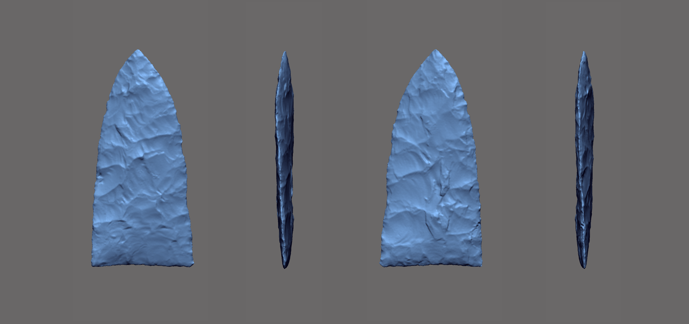
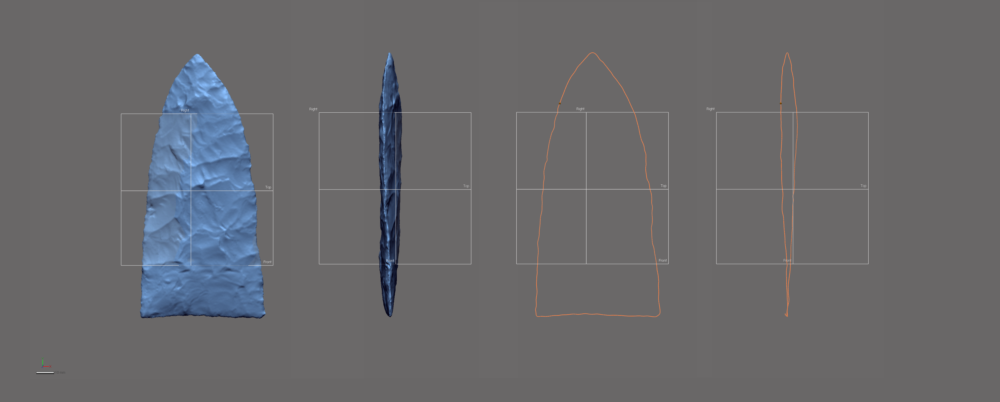
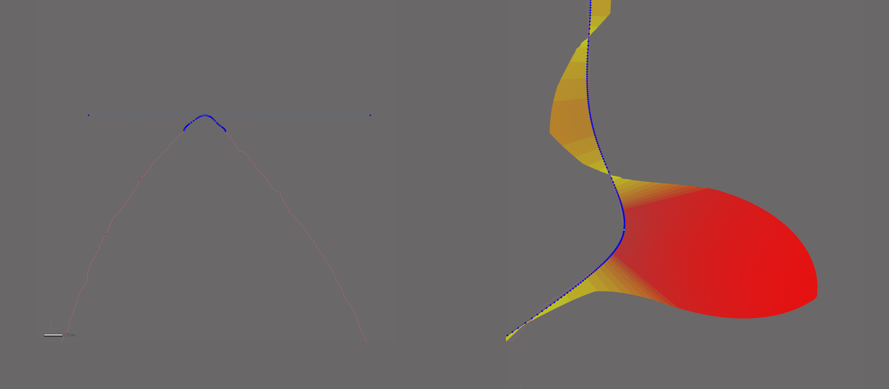

```{r setup, include=FALSE}
knitr::opts_chunk$set(echo = TRUE)
```

While the landmarking protocol developed for this project bears some visual similarities with the configuration used in the previous study [@RN11783], as well as other two-dimensional geometric morphometric analyses [@RN1754;@RN1736;@RN11731], it differs in some fundamental ways. The first and most obvious difference is that this is a three-dimensional study. The second is the method of landmark placement, where Geomagic Design X is used to generate a spline that is constrained by a suite of reference points, planes, and vectors. The reference geometry is used to populate the landmarks in a replicable manner using a variety of mathematically-defined criteria. The goal was to increase the precision of the study by including the z-dimension to capture the axial twisting introduced through beveling.



### Generating the spline

Unlike the previous study, where the outline of each Gahagan biface was projected onto a plane, this effort enlists a spline that is extracted from the surface geometry of the 3D mesh. The spline follows the contours of the highest curvature around the entirety of the lateral and basal edge. The remainder of the landmarking protocol is based upon this spline, which was subsequently split in four mathematically-defined locations.



### Splitting the spline

The spline is split in four mathematically-defined locations. The characteristic points and tangents developed for this protocol were inspired by the work of Birkhoff [@RN11786]. The first is the horizontal tangent at the tip of each Gahagan biface. The horizontal tangent is calculated by drawing a horizontal line above the tip of the biface that uses the tangent as a common contraint, and the horizontal plane as the independent constraint. To split the spline at the location of the horizontal tangent, a reference point was inserted at the location of the tangent, followed by a reference plane using the pick point and normal axis function, where the reference point was used as the pick point, and the Right plane as the normal axis. The spline was then cut at the location where the reference plane intersected the spline.



### References cited
