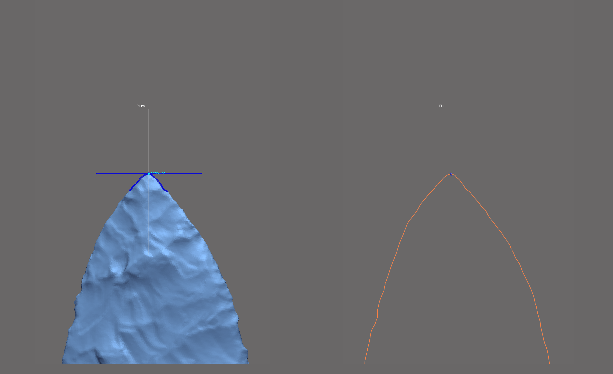
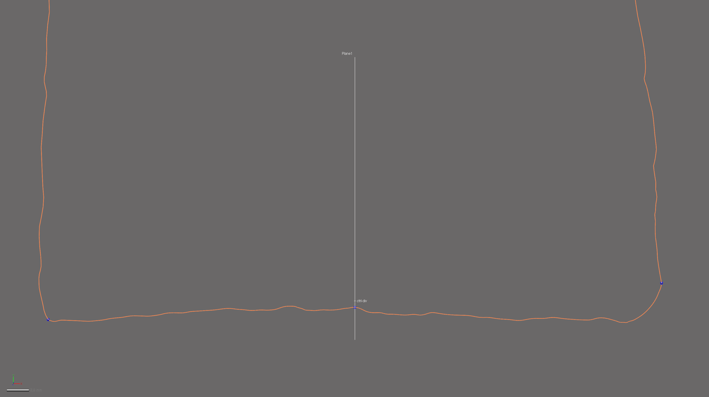
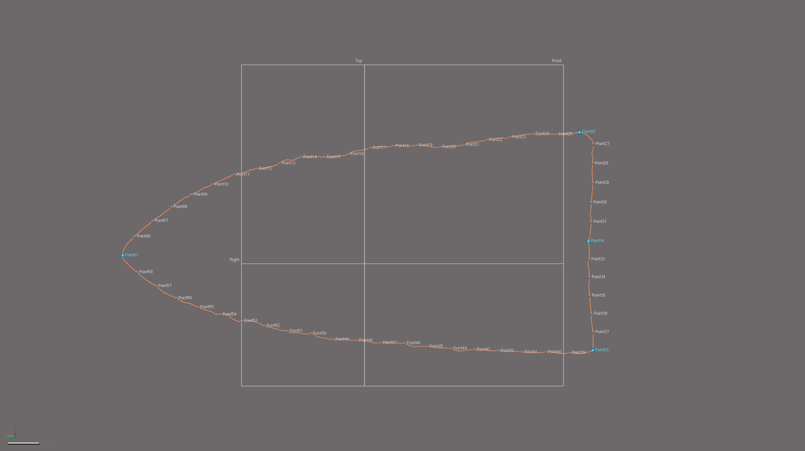
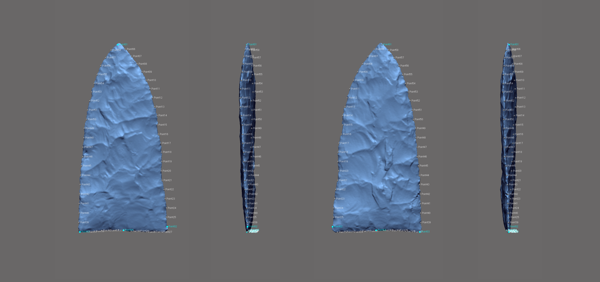

```{r setup, include=FALSE}
knitr::opts_chunk$set(echo = TRUE)
```

The landmarking protocol developed for this project bears some visual similarities with the configuration used in the previous study [@RN11783], as well as other two-dimensional geometric morphometric analyses [@RN1754;@RN1736;@RN11731]; however, it differs in some fundamental ways. The first and most obvious difference is that this is a three-dimensional study. The second is the method of landmark placement, where Geomagic Design X (Build Version 2019.0.2 [Build Number: 78]) was used to generate a spline, and to populate the landmarks in a replicable manner using a variety of mathematically-defined criteria. The goal here was to increase the precision of the study by including the z-dimension to capture those morphological characteristics associated with axial twisting introduced through the practice of bifacial beveling.

```{r figbev}
knitr::include_graphics('images/figbev.png')
fig.cap="Gahagan biface 545 from the Gahagan Mound site, illustrating axial twisting. \\label{figbev}"
```

### Generating the spline

Unlike the previous study, where the outline of each Gahagan biface was projected onto a 2D plane, this effort enlists a spline extracted from the surface geometry of the mesh itself. The spline follows the highest curvature contours around the periphery of the lateral and basal edges. The remainder of the landmarking protocol is based upon the spline, which was split at four mathematically-defined locations.

```{r figspline}
knitr::include_graphics('images/extractspline.png')
fig.cap="Spline extracted along the highest contours of the projectile. \\label{figspline}"
```

### Splitting the spline

The characteristic points and tangents developed for this protocol were inspired by the work of Birkhoff [-@RN11786]. The first is the horizontal tangent located at the tip of each Gahagan biface. The horizontal tangent is calculated by drawing a horizontal line above the tip of the biface using the tangent as a common contraint, and the horizontal plane as the independent constraint (below image, left).

To split the 3D spline at the location of the horizontal tangent, a reference point was inserted at the location of the tangent in the 2D sketch (light blue point labeled h-tangent in below image, left), followed by a reference plane using the pick point and normal function where the reference point (h-tangent) was used as the pick point, and the Right plane as the normal (below image, left). The 3D spline was then cut at the location where the reference plane intersected with the spline (below image, right).

```{r figlm1}

fig.cap="Identify horizontal tangent, insert reference point and reference plane (left). Use reference plane to cut spline at the location of the horizontal tangent (right). \\label{figlm1}"
```

The point of highest curvature on either side of the basal edge was calculated using the curvature function (below image). This function allows the user to identify the point of highest curvature for a section of the spline. The two points of highest curvature used in this study were located between the basal and lateral edges on either side of each biface. The alignment and orientation of the biface was dictated by the _auto3dgm_ output (see Figure 7a in the manuscript), where LM2 was always placed on the right side of the basal edge, and LM3 on the left.

```{r figcurve}
knitr::include_graphics('images/splinesplit1.png')
fig.cap="Identify points of hightest curvature (light blue) at left/right intersection of lateral and basal edges. \\label{figsplinesplitlr}"
```

One additional landmark (LM4) was placed at the centre of the base. The location of this landmark was identified by calculating the linear distance between LM2 and LM3, and placing a reference point (ctrl-div in image below) at that location. A reference plane was added using the ctrl-div as the pick point, and the Right plane as the normal. The spline was split at the intersection of the reference plane and the basal spline.

```{r figlm4}

fig.cap="Calculate linear distance between LM2 and LM3, insert reference plane coplanar to Right plane equidistant between LM2 and LM3, and use the reference plane to cut the spline.  \\label{figlm4}"
```

### Landmark placement

Landmarks 1-4 were placed at each spline split (blue points, below). Equidistant semilandmarks were added to each of the four splines; 20 between LM1 and LM2, five between LM2 and LM4, five between LM4 and LM3, and 20 between LM3 and LM1.

```{r figlmslm-all}

fig.cap="3D spline with landmarks (blue) and equidistant semilandmarks (white) applied, with top, right, and front planes. Semilandmarks are renumbered in post.  \\label{figlmslm-all}"
```

Superficially, this constellation of landmarks and semilandmarks appears similar to those used in recent 2D studies. However, this rigourous protocol for applying landmarks and semilandmarks aids in capturing the morphological variation that articulates with axial twisting introduced by knappers through the practice of beveling. Thus, this constellation of landmarks and semilandmarks provides for greater precision in the geometric morphometric analysis, marking a substantive advancement in the analytical protocols used to analyse Gahagan biface morphology.

```{r figbevlm}

fig.cap="Mesh for Gahagan biface 545 from Gahagan Mound with landmarks and equidistant semilandmarks applied. \\label{figbevlm}"
```

### References cited
