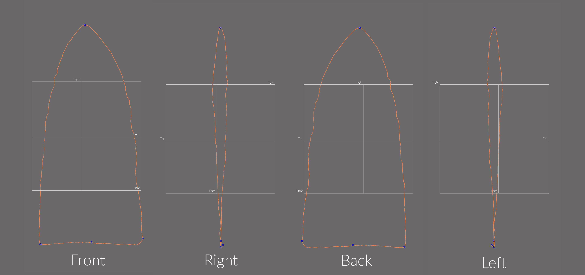

```{r setup, include=FALSE}
knitr::opts_chunk$set(echo = TRUE)
```

The landmarking protocol developed for this project bears some visual similarities with the configuration used in the previous study [@RN11783], as well as other two-dimensional geometric morphometric analyses [@RN1754;@RN1736;@RN11731]; however, it differs in some fundamental ways. The first and most obvious difference is that this is a three-dimensional study. The second is the method of landmark placement, where _Geomagic Design X (Build Version 2019.0.2 [Build Number: 78])_ was used to generate a spline around the periphery of each biface, and to populate the landmarks and equidistant semilandmarks in a replicable manner using mathematically-defined criteria.

```{r figbev}
knitr::include_graphics('images/figbev.png')
fig.cap="Gahagan biface 545 from the Gahagan Mound site, illustrating axial twisting. \\label{figbev}"
```

The goal of this effort was to increase both the precision and rigour of the study by including the z-dimension to capture those morphological characteristics associated with axial twisting introduced through the practice of bifacial beveling. It warrants mention that a subsequent iteration of this landmarking protocol is currently in development, and includes equidistant latitudinal cross-sections throughout the length of each biface.

This landmarking protocol represents an intermediate iteration between the previous 2D analysis [@RN11783], and the forthcoming protocol that includes cross-sections, where an ever-greater amount of mesh topology is included in each analysis. The evolution of this landmarking protocol represents a concerted effort to better comprehend the vagaries of morphological similarities and differences in Gahagan bifaces. While true that some landmarking protocols can be---and often are---recycled as new specimens are added, this particular research programme endeavours to achieve ever-greater accuracy and precision in each subsequent iteration.

### Generating the spline

Unlike the previous study, where the outline of each Gahagan biface was projected onto a 2D plane, this effort enlists a spline extracted from the surface geometry of the mesh using the `extract contour curves` command, which is used to detect and extract 3D contour curves from high-curvature areas of the mesh. In reverse-engineering, `extract contour curves` is regularly employed as the first step in building a `patch network` or `non-uniform rational B-spline` (NURBS) surface. The extracted feature curve is rendered as a spline, and follows the highest curvature contours around the periphery of the lateral and basal edges, following the highly variable sinuous edge morphology around the entirety of the bifacial edge. The remainder of the landmarking protocol is based upon this spline, which was subsequently split at four mathematically-defined locations.

```{r figspline}
knitr::include_graphics('images/extractspline.png')
fig.cap="Spline extracted along the highest contours of the projectile. \\label{figspline}"
```

### Splitting the spline

_A few definitions are warranted before proceeding. `Reference geometries` are used in the assistance of creating other features. These include basic geometric entities, such as `planes`, `vectors`, `coordinates`, `points`, and `polygons`. A `reference point` is a virtual point and is used to mark a specific position on a model or in 3D space. A `reference plane` is a virtual plane that has a normal direction and an infinite size. A `reference plane` is not a surface body, and is used to create other features._ 

The characteristic points and tangents developed for this landmarking protocol were inspired by the work of Birkhoff [-@RN11786]. The first landmark (LM1) is placed at the horizontal tangent on the tip of each Gahagan biface. The second and third splits (LM2 and LM3) occur at points of highest curvature, and LM2 is always split on the right side of the biface when oriented in 3D space following the alignment output of _auto3dgm_, illustrated in Figure 7a of the manuscript. To place the final landmark (LM4), a linear measurement was used to insert a reference point equidistant between LM2 and LM3. The location of that point was leveraged in placing the reference plane used to cut the spline at the location of LM4.

#### Spline split at location of LM1

The `horizontal tangent` is calculated by drawing a horizontal line above the tip of the biface using the tangent as a `common constraint`, and the horizontal as the `independent constraint`. To split the 3D spline at the location of the horizontal tangent, a `reference point` was inserted at the location of the `tangent` in the 2D sketch (light blue point; below, left), followed by a `reference plane` (in white; below, left and right) using the `pick point and normal axis` function where the `reference point` (h-tangent) was used as the `pick point`, and the `Right plane` as the `normal axis` (below, left). The 3D spline was then cut at the location where the `reference plane` intersected with the spline (below image, right).

```{r figlm1}
knitr::include_graphics('images/lm1.png')
fig.cap="Identify horizontal tangent, insert reference point and reference plane (left). Use reference plane to cut spline at the location of the horizontal tangent (right). \\label{figlm1}"
```

#### Spline split at locations of LM2 and LM3

The point of highest curvature on either side of the basal edge was calculated using the `curvature function` in the Accuracy Analyser. This function displays the curvature flow as a continuous colour plot across the area of the curve. In this instance, _curvature_ is defined as the amount by which a geometric shape deviates from being flat or straight in the case of a line. The curvature is displayed in different colours according to the local radius, and is calculated in only one direction (U or V) along the curve. Using this tool, the two points of highest curvature were located between the basal and lateral edges on either side of each biface where the local radius measure was largest. The alignment and orientation of each biface was dictated by the _auto3dgm_ output (see Figure 7a in the manuscript), and the landmarking protocol follows the mesh orientation in that figure, where LM2 was always placed on the right side of the basal edge, and LM3 on the left.

```{r figcurve}
knitr::include_graphics('images/splinesplit1.png')
fig.cap="Identify points of hightest curvature (light blue) at left/right intersection of lateral and basal edges. \\label{figsplinesplitlr}"
```

#### Spline split at location of LM4

One additional landmark (LM4) was placed at the centre of the base. The location of this landmark was identified by calculating the linear distance between LM2 and LM3, and projecting a `reference point` (ctrl-div; below) equidistant between the two. A `reference plane` was added using the ctrl-div as the pick point, and the `Right plane` as the `normal axis`. The spline was then split at the intersection of the `reference plane` and the basal spline.

```{r figlm4}
knitr::include_graphics('images/lm4.png')
fig.cap="Calculate linear distance between LM2 and LM3, insert reference plane coplanar to Right plane equidistant between LM2 and LM3, and use the reference plane to cut the spline.  \\label{figlm4}"
```

#### Final spline

Through the preceding protocol, the initial spline was split into four discrete splines. The splines articulate with components of bifacial morphology that can be compartmentalised in the subsequent analyses (i.e., left/right [directional] asymmetry, blade/base morphological integration, etc.). The primary analytical gain achieved through this exercise is the requisite foundation needed to carry out replicable analyses of Gahagan biface morphology in three dimensions, further increasing the precision of the geometric morphometric analysis.

```{r figsplinesplit-frbl}

fig.cap="Result of spline splits include four discrete splines, each articulating with a potential region of analytical interest. \\label{figsplinesplit-frbl}"
```

### Landmark and semilandmark placement

Landmarks 1-4 were placed at the location of each spline split (blue points, below). Equidistant semilandmarks were added to each of the four splines; 20 between LM1 and LM2, five between LM2 and LM4, five between LM4 and LM3, and 20 between LM3 and LM1.

```{r figlmslm-all}
knitr::include_graphics('images/lmslm-all.png')
fig.cap="3D spline with landmarks (blue) and equidistant semilandmarks (white) applied, with top, right, and front planes. Semilandmarks are renumbered in post.  \\label{figlmslm-all}"
```

Superficially, this constellation of landmarks and semilandmarks appears similar to those used in recent 2D studies. However, the rigourous protocol used in the application of landmarks and semilandmarks aids in capturing morphological variation that articulates with axial twisting introduced by knappers through the practice of beveling. Thus, this constellation of landmarks and semilandmarks provides for greater precision in the geometric morphometric analysis, marking a substantive advancement in the analytical protocols used to analyse Gahagan biface morphology.

```{r figbevlm}
knitr::include_graphics('images/figbevlm.png')
fig.cap="Mesh for Gahagan biface 545 from Gahagan Mound with landmarks and equidistant semilandmarks applied. \\label{figbevlm}"
```

### Acknowledgments

I extend my gratitude to Christian S. Hoggard and David K. Thulman for their thoughtful comments and constructive criticisms on an earlier draft of this landmarking protocol. The current iteration of the landmarking protocol was developed using the `digit3DLand` package in R (code available in this repository); however, the capacity to populate a replicable suite of reference geometry across the sample in _Geomagic Design X_ made it a better option for the dynamic design process. Definitions of reference geometries and _Design X_ features described in this protocol are paraphrased from the reference manual.

### References cited
