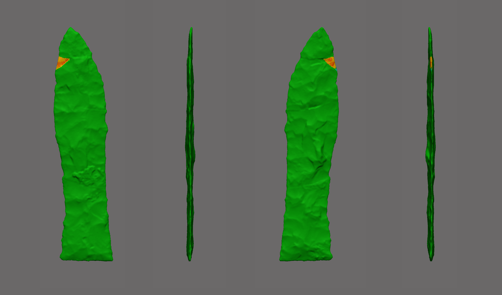
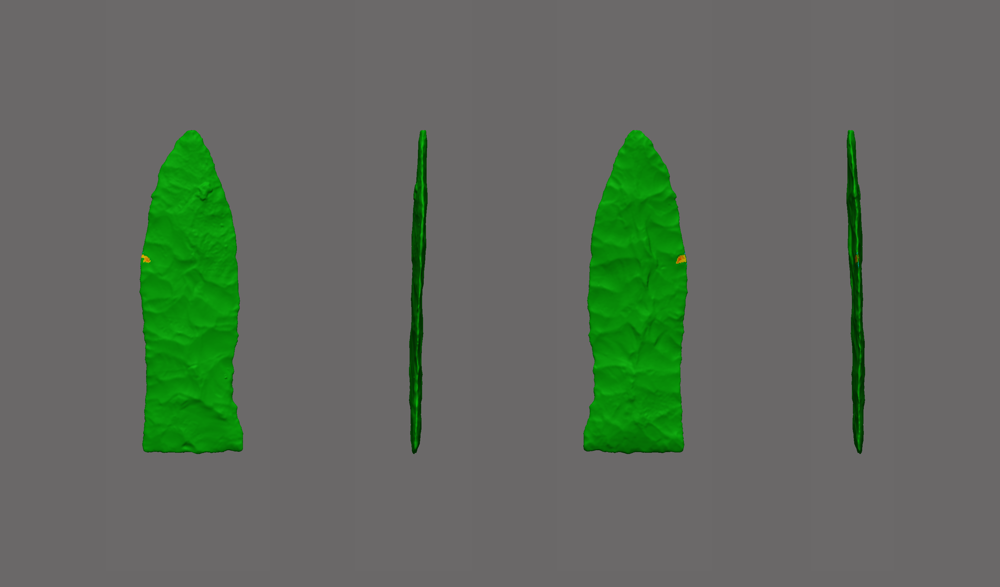

3D Modeling of Missing Geometry
================
Robert Z. Selden, Jr.
November 10, 2019

## Modeling Geometry

This document includes supplemental materials for the article, “Shape
difference or shape change? Inter-regional variation in Gahagan biface
morphology.” The study represents the first formal morphological
analysis to assess inter-regional variability in Gahagan biface shape.
In that study, two Gahagan bifaces, both from the George C. Davis site
(4078-8, and 4078-72), were found to be missing small sections of the
blade. This analysis limited the inclusion of specimens with missing
data to those where the area of missing data was smaller than a dime
(10-cent coin in the US).

Modeling was completed in *Geomagic Design X (Build Version 2019.0.2
\[Build Number: 78\])*. Due to the fact that each biface is unique, a
unique modeling protocol was enlisted to reconstruct each piece.

#### 4078-8

``` r

```

<!-- -->

``` r
fig.cap="Gahagan biface 4078-8 illustrating the area of missing data. \\label{fig4078-8}"
```

#### 4078-72

``` r

```

<!-- -->

``` r
fig.cap="Gahagan biface 4078-72 illustrating the area of missing data. \\label{fig4078-72}"
```
