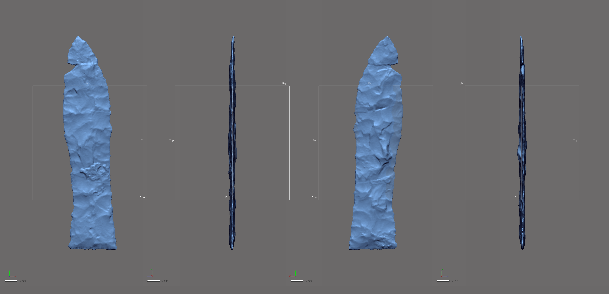
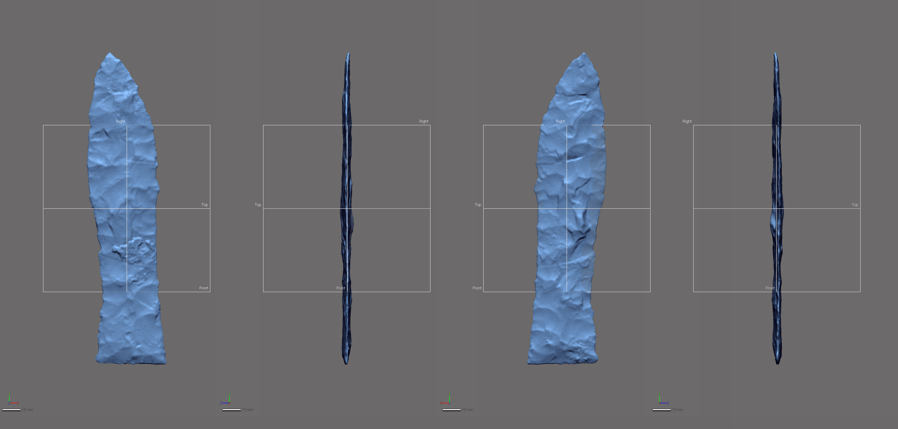
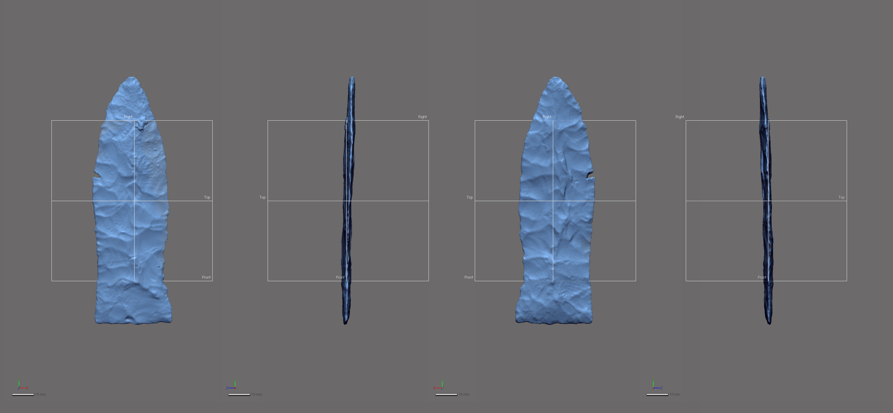
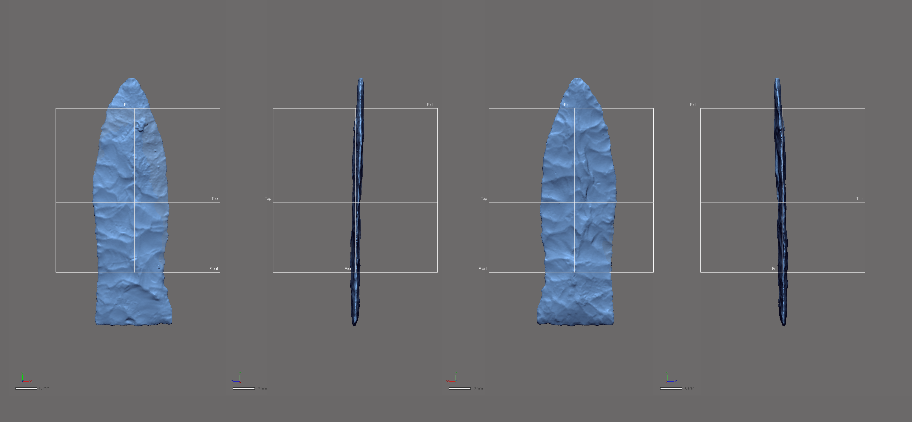

3D Modeling of Missing Geometry
================
Robert Z. Selden, Jr.
November 10, 2019

## Modeling Geometry

This document includes supplemental materials for the article, “Shape
difference or shape change? Inter-regional variation in Gahagan biface
morphology.” The study represents the first formal morphological
analysis to assess inter-regional variability in Gahagan biface shape.
Two Gahagan bifaces, both from the George C. Davis site (4078-8, and
4078-72), were missing small sections of the blade along the lateral
edge. This analysis limited the inclusion of specimens with missing data
to those where the area of missing data was smaller than a dime (10-cent
coin in the US), ensuring that modeling was kept to a minimum.

Modeling was completed in *Geomagic Design X (Build Version 2019.0.2
\[Build Number: 78\])*. Modeling occurred in advance of the `auto3dgm`
alignment. Following alignment, these two specimens were landmarked
following the same [landmarking protocol](landmarking-protocol.md) as
the unmodeled bifaces.

In both cases, the area of highest concern was that of the lateral edge.
To ensure that the fit followed the existing contour, the area was first
cut and cleaned, then bridges were constructed that enlisted variable
curvature, following with the existing curvature of the edge. Once
fitted with the bridge, the remaining holes on either side were filled
following those protocols set forth in (Selden Jr. 2017).

The images that follow include a before and after modeling image of each
biface, illustrating the area of the biface that was missing, and the
subsequent model that was used in the geometric morphometric analysis.
In the case of 4078-8, one semilandmark was included in the modeled
area. No semilandmarks were placed in the modeled area of 4078-72.

#### 4078-8

``` r

```

<!-- -->

``` r
fig.cap="Gahagan biface 4078-8, before modeling. \\label{fig4078-8-init}"
```

``` r

```

<!-- -->

``` r
fig.cap="Gahagan biface 4078-8, after modeling. \\label{fig4078-8-mod}"
```

#### 4078-72

``` r

```

<!-- -->

``` r
fig.cap="Gahagan biface 4078-72, before modeling. \\label{fig4078-72-init}"
```

``` r

```

<!-- -->

``` r
fig.cap="Gahagan biface 4078-72, after modeling. \\label{fig4078-72-mod}"
```

### References cited

<div id="refs" class="references">

<div id="ref-RN11521">

Selden Jr., Robert Z. 2017. “Asymmetry of Caddo Ceramics from the
Washington Square Mound Site: An Exploratory Analysis.” *Digital
Applications in Archaeology and Cultural Heritage* 5: 21–28.
<https://doi.org/10.1016/j.daach.2017.04.003>.

</div>

</div>
